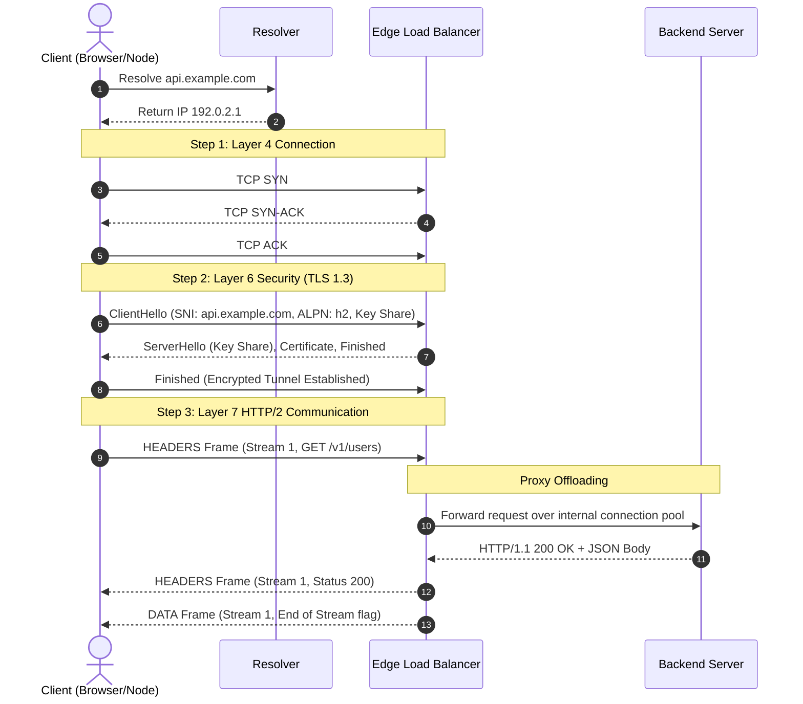

<!-- Generated by Gemini via GitHub Actions -->
<!-- Topic ID: T001 -->
<!-- Category: Core Backend Fundamentals -->
<!-- Generated at UTC: 2026-09-22T01:35:49.538501+00:00 -->

# HTTP/HTTPS deeply

## 1. What problem does this solve?

At the physical and network transport layers, raw TCP provides a reliable, ordered stream of unencrypted bytes between two IP addresses. However, TCP alone is insufficient for building scalable web applications for two reasons:

1. **Lack of Application Semantics and Framing:** Raw TCP streams have no built-in concept of "requests," "responses," "headers," "verbs," or content boundaries. Without an application-layer protocol, every system developer would need to invent custom binary or text framing formats to parse where a payload starts and ends over a continuous byte stream.
2. **Untrusted Networks and Eavesdropping:** Plain TCP transmits bytes in cleartext across intermediate switches, routers, and ISPs. It provides no confidentiality (encryption), integrity (tamper detection), or authenticity (verifying you are talking to `api.example.com` and not a malicious proxy).

HTTP (Hypertext Transfer Protocol) solves the **framing and semantic problem** by standardizing request-response structures, caching metadata, content negotiation, and status codes. 

HTTPS (HTTP over TLS) solves the **trust and security problem** by overlaying HTTP semantics onto a cryptographic tunnel (TLS - Transport Layer Security), guaranteeing:
* **Confidentiality:** Content cannot be read by passive network observers.
* **Integrity:** Payloads cannot be altered in transit without detection.
* **Authenticity:** Cryptographic proof that the endpoint holds a private key matching a verified public key certificate.

---

## 2. Mental model

### Analogy: The Armored Serialized Express Delivery
* **TCP:** A raw, open highway pipeline laid between two warehouses. Cargo flows sequentially, but anyone along the road can inspect, inject, or tamper with the boxes.
* **HTTP/1.1:** A delivery policy where Warehouse A loads a truck, sends it down the highway, and **must wait** for that exact truck to return before sending the next truck (unless opening new parallel highways).
* **TLS Layer:** An armored escort wrapper applied to each truck at the entrance of the highway. Before cargo moves, both warehouses exchange cryptographic locks (TLS Handshake) to ensure only they hold the keys.
* **HTTP/2:** A system where cargo is broken down into small, standardized, color-coded lockboxes (Frames) marked with a Stream ID. Thousands of lockboxes from different orders are packed into a single truck, driven across the highway simultaneously, and sorted instantaneously at the receiving warehouse (Multiplexing).
* **HTTP/3:** Replaces the rigid single highway (TCP) with a fleet of independent hover-drones (UDP/QUIC). If one drone crashes, only its specific package is delayed; all other packages continue arriving without stopping traffic.

### Engineering Model
HTTP/HTTPS sits at Layer 7 (Application Layer) of the OSI model, operating over Layer 6 (Presentation - TLS) and Layer 4 (Transport - TCP/UDP).

```
+-------------------------------------------------------------+
| Application Semantics (Verbs, Headers, Body, Status Codes) |  <- HTTP Layer
+-------------------------------------------------------------+
| Symmetric Encryption (AES-GCM/ChaCha20), Authentication    |  <- TLS Layer
+-------------------------------------------------------------+
| Ordered Byte-Stream (TCP) OR Multiplexed Datagrams (QUIC)   |  <- Transport Layer
+-------------------------------------------------------------+
| IP Routing & Packet Addressing                              |  <- Network Layer
+-------------------------------------------------------------+
```

---

## 3. Deep explanation

### Protocol Evolution: HTTP/1.1 to HTTP/2 to HTTP/3

#### 1. HTTP/1.1 (RFC 9112)
* **Framing:** Plaintext ASCII text formatting. Requests/responses are delineated by CRLF (`\r\n`) characters and `Content-Length` or `Transfer-Encoding: chunked`.
* **Connection Lifecycle:** Introduces `Connection: keep-alive` by default, allowing a single TCP connection to handle multiple sequential requests.
* **Head-of-Line (HoL) Blocking (Application Level):** A client can only process one request-response cycle per connection at a time. If Request 1 stalls on the server (e.g., slow database query), Request 2 queued behind it on the same socket cannot be fulfilled. Browsers work around this by opening up to 6 parallel TCP connections per domain, causing connection creation overhead and slow-start penalty bursts.

#### 2. HTTP/2 (RFC 9113)
* **Framing:** Replaces ASCII text with a binary framing layer. All data is split into binary frames (`HEADERS`, `DATA`, `SETTINGS`, `RST_STREAM`, `GOAWAY`).
* **Multiplexing:** Multiple logical streams run concurrently over a single TCP connection. Each frame contains a 31-bit Stream Identifier. Interleaved frames from distinct streams remove application-level HoL blocking.
* **HPACK (RFC 7541):** Compresses headers using static and dynamic lookup tables to eliminate repetitive metadata overhead (e.g., `User-Agent`, `Authorization`).
* **TCP-level HoL Blocking:** Because HTTP/2 still runs on a single TCP connection, if a single underlying TCP packet is dropped in transit, the OS kernel TCP stack holds back all subsequent bytes in the TCP receive buffer until the missing packet is retransmitted. This stalls **all** multiplexed HTTP/2 streams on that connection.

#### 3. HTTP/3 (RFC 9114)
* **Transport:** Replaces TCP with **QUIC** (a multiplexed transport protocol built on top of UDP).
* **Independent Stream Recovery:** QUIC implements packet loss handling per logical stream. Dropping a packet belonging to Stream A does **not** block the processing of Stream B.
* **QPACK:** Header compression adapted for out-of-order stream delivery (unlike HTTP/2's HPACK, which assumed strict in-order delivery from TCP).
* **Fast Connection Migration:** Connections are identified by a 64-bit Connection ID rather than the 4-tuple IP/Port combination. If a client switches from Wi-Fi to Cellular (changing client IP), the QUIC connection continues seamlessly without renegotiation.

```
+-----------------------------------------------------------------------------------+
| Feature               | HTTP/1.1             | HTTP/2               | HTTP/3      |
+-----------------------+----------------------+----------------------+-------------+
| Transport Protocol    | TCP                  | TCP                  | QUIC (UDP)  |
| Data Format           | Text (ASCII)         | Binary Frames        | Binary      |
| Multiplexing          | No (Sequential)      | Yes (Single TCP)     | Yes (QUIC)  |
| Application HoL Block | Yes                  | No                   | No          |
| Transport HoL Block   | Yes                  | Yes                  | No          |
| Header Compression    | None                 | HPACK                | QPACK       |
| TLS Integration       | Optional (Layered)   | Explicit (ALPN)      | Mandatory   |
+-----------------------------------------------------------------------------------+
```

---

### HTTPS and TLS 1.3 Architecture

HTTPS wraps HTTP inside a TLS connection. Modern infrastructure defaults to TLS 1.3 (RFC 8446), which optimized both security and performance over TLS 1.2.

```
TLS 1.3 Handshake Sequence (1-RTT)

Client                                                  Server
  |                                                       |
  |--- ClientHello -------------------------------------->|
  |    + Supported TLS Versions                           |
  |    + Key Share (Client Public Key / Ephemeral ECDH)   |
  |    + Cipher Suites Supported                          |
  |    + Server Name Indication (SNI)                     |
  |    + Application-Layer Protocol Negotiation (ALPN)    |
  |                                                       |
  |<-- ServerHello ---------------------------------------|
  |    + Chosen Cipher Suite                              |
  |    + Key Share (Server Public Key / Ephemeral ECDH)   |
  |    [Symmetric Key Derived Here via ECDHE]             |
  |                                                       |
  |<-- EncryptedExtensions, Certificate, CertificateVerify |
  |    + Signed Cert Chain & Digital Signature            |
  |<-- Finished ------------------------------------------|
  |                                                       |
  |--- Finished ----------------------------------------->|
  |                                                       |
  |=== Encrypted HTTP Data Flow (AES-GCM / ChaCha20) =====|
```

#### Key Mechanics of TLS 1.3:
1. **Reduced Latency (1-RTT vs 2-RTT):** Key exchange parameters are sent immediately inside `ClientHello`, allowing cryptographic keys to be derived in a single round-trip time.
2. **0-RTT Resumption (Early Data):** Returning clients can send encrypted HTTP request data alongside the `ClientHello`. *Trade-off:* 0-RTT data is susceptible to **replay attacks** if not protected by application-level anti-replay mechanisms (e.g., nonces, idempotency checks).
3. **SNI (Server Name Indication):** An extension in `ClientHello` specifying the exact hostname requested (e.g., `api.domain.com`). Enables a single IP address and load balancer to host distinct TLS certificates for thousands of virtual hosts.
4. **ALPN (Application-Layer Protocol Negotiation):** Allows the client and server to negotiate the application protocol (`h2`, `http/1.1`, `h3`) *during* the TLS handshake, eliminating an extra protocol discovery round-trip.

---

### Failure Modes and Critical Trade-Offs

#### 1. The Proxy Timeout Mismatch (The Infinite 502 Bad Gateway)
* **Problem:** In microservice topologies, an edge proxy (e.g., AWS ALB, NGINX) forwards requests to downstream application servers (Node.js/FastAPI). If the downstream app server's Keep-Alive timeout is **shorter** than the upstream proxy's idle connection timeout, a classic race condition occurs.
* **Failure Cascade:** The app server silently closes a persistent socket right as the proxy dispatches a new incoming HTTP request onto that socket. The proxy receives a TCP RST or socket closed signal, failing the client request with an `HTTP 502 Bad Gateway`.
* **Mitigation:** Ensure the downstream app server's `keepAliveTimeout` is **strictly higher** than the upstream proxy's idle timeout (e.g., ALB idle timeout = 60s, Node.js `keepAliveTimeout` = 65s).

#### 2. HTTP Request Smuggling (HTTP/1.1 Boundary Desynchronization)
* **Problem:** Occurs when front-end proxies and back-end origin servers parse request boundaries differently when handling HTTP/1.1 pipelines containing both `Content-Length` (CL) and `Transfer-Encoding: chunked` (TE) headers.
* **Impact:** An attacker sends a ambiguous payload (`TE.CL` or `CL.TE`). The proxy reads the body according to `Content-Length`, while the backend processes it using `Transfer-Encoding`. The unparsed tail of the attacker's request remains in the backend socket buffer and is prepended to the *next legitimate user's* request, causing session hijacking or cache poisoning.
* **Mitigation:** Enforce HTTP/2 or HTTP/3 at the edge; reject requests containing both `Content-Length` and `Transfer-Encoding` headers; use strict RFC-compliant HTTP parsers (like Node's `llhttp`).

#### 3. High CPU/Memory Overhead of HTTP/2 Multiplexing
* **Trade-off:** HTTP/2 minimizes socket count by multiplexing hundreds of streams over one connection. However, tracking frame allocation, stream state machines, and HPACK dynamic decompression tables consumes CPU and memory per connection.
* **Vulnerability (RST Stream Flood / CVE-2023-44487):** Attackers send thousands of HTTP/2 streams and immediately cancel them via `RST_STREAM` frames. The server is forced to allocate and deallocate memory structures rapidly, overwhelming the CPU while keeping the connection open.

---

## 4. How it works

### End-to-End Execution Sequence for an HTTPS Request



1. **DNS Resolution:** Client resolves domain to IP address.
2. **TCP 3-Way Handshake:** `SYN` -> `SYN-ACK` -> `ACK` establishes standard socket connectivity.
3. **TLS 1.3 Handshake:**
   * Client sends `ClientHello` containing supported Ciphers, SNI hostname, ALPN tokens (`h2`, `http/1.1`), and ephemeral Diffie-Hellman key exchange parameter.
   * Server validates identity, returns certificate chain, selects cipher suite, and exchanges its key share parameter.
   * Both sides execute Elliptic-Curve Diffie-Hellman (ECDHE) calculation to independently derive identical symmetric encryption keys (`AES-256-GCM`).
4. **HTTP/2 Frame Exchange:**
   * Client sends a `SETTINGS` frame specifying concurrent stream limits and window sizes.
   * Client constructs a `HEADERS` frame (stream ID `1`) containing HPACK-compressed HTTP metadata.
5. **Proxy & Backend Hand-off:**
   * The Edge Load Balancer terminates TLS, extracts HTTP headers, injects tracing context (`traceparent`), and proxies request to application code over an internal persistent HTTP/1.1 or HTTP/2 connection pool.
6. **Data Streaming:**
   * App processes request, streams payload to LB.
   * LB frames payload into `DATA` frames (stream ID `1`) and sends to client.
   * Final frame carries the `END_STREAM` bit flag set to `1`.

---

## 5. Practical implementation

Below is a production-grade native Node.js HTTP/2 and HTTPS server implementing ALPN negotiation, Keep-Alive management, proper header normalization, graceful shutdown, and stream lifecycle error handling without external abstractions.

```typescript
import http2 from 'node:http2';
import fs from 'node:fs';
import path from 'node:path';
import { Http2ServerResponse, ServerHttp2Stream } from 'node:http2';

// 1. Load TLS Certificates
const certPath = path.join(__dirname, 'certs');
const options: http2.SecureServerOptions = {
  key: fs.readFileSync(path.join(certPath, 'server.key')),
  cert: fs.readFileSync(path.join(certPath, 'server.crt')),
  // Standard protocol negotiation: preferring HTTP/2, fallback to HTTP/1.1
  ALPNProtocols: ['h2', 'http/1.1'],
  // Tuning stream safety limits against DoS attacks
  maxConcurrentStreams: 100,
  // Node.js HTTP/2 Session settings tuning
  settings: {
    maxConcurrentStreams: 100,
    initialWindowSize: 1048576, // 1MB Window size for high-throughput streaming
  },
};

// 2. Instantiate Secure HTTP/2 Server
const server = http2.createSecureServer(options);

// Robust Idle Timeout tuning to align with edge reverse proxies
// Ensure keepAliveTimeout is higher than upstream proxy timeout (e.g. AWS ALB = 60s)
server.setTimeout(65000, (socket) => {
  // Gracefully end idle connections
  socket.end();
});

// Stream error handler to prevent unhandled stream crashes
function handleStreamError(err: Error, stream: ServerHttp2Stream) {
  if (err.code === 'ERR_HTTP2_STREAM_CANCEL' || err.code === 'ECONNRESET') {
    // Client aborted or cancelled stream mid-flight; low severity log
    console.warn(`[HTTP2] Client closed stream prematurely: ${err.message}`);
    return;
  }
  console.error('[HTTP2] Stream execution error:', err);
  if (!stream.headersSent) {
    stream.respond({
      [http2.constants.HTTP2_HEADER_STATUS]: 500,
      [http2.constants.HTTP2_HEADER_CONTENT_TYPE]: 'application/json',
    });
    stream.end(JSON.stringify({ error: 'Internal Server Error' }));
  }
}

// 3. Main Stream Request Event Listener
server.on('stream', (stream: ServerHttp2Stream, headers: http2.IncomingHttpHeaders) => {
  stream.on('error', (err) => handleStreamError(err, stream));

  const method = headers[http2.constants.HTTP2_HEADER_METHOD] as string;
  const path = headers[http2.constants.HTTP2_HEADER_PATH] as string;
  const traceParent = headers['traceparent'] || 'none';

  console.log(`[REQ] ${method} ${path} - Trace ID: ${traceParent}`);

  // Route Handling
  if (path === '/api/v1/health' && method === 'GET') {
    stream.respond({
      [http2.constants.HTTP2_HEADER_STATUS]: 200,
      [http2.constants.HTTP2_HEADER_CONTENT_TYPE]: 'application/json; charset=utf-8',
      'cache-control': 'no-store',
    });

    stream.end(
      JSON.stringify({
        status: 'UP',
        timestamp: new Date().toISOString(),
        protocol: headers[':scheme'] || 'https',
      })
    );
    return;
  }

  if (path === '/api/v1/stream-data' && method === 'GET') {
    // Zero-copy chunked streaming response using HTTP/2 frames
    stream.respond({
      [http2.constants.HTTP2_HEADER_STATUS]: 200,
      [http2.constants.HTTP2_HEADER_CONTENT_TYPE]: 'text/plain; charset=utf-8',
    });

    let counter = 0;
    const interval = setInterval(() => {
      if (stream.destroyed || stream.closed) {
        clearInterval(interval);
        return;
      }

      counter++;
      stream.write(`Data Chunk #${counter}\n`);

      if (counter >= 5) {
        clearInterval(interval);
        stream.end('Stream Processing Completed.\n');
      }
    }, 200);

    return;
  }

  // 404 Not Found Fallback
  stream.respond({
    [http2.constants.HTTP2_HEADER_STATUS]: 404,
    [http2.constants.HTTP2_HEADER_CONTENT_TYPE]: 'application/json',
  });
  stream.end(JSON.stringify({ error: 'Resource Not Found' }));
});

// 4. Graceful Shutdown Implementation
const PORT = process.env.PORT || 8443;
server.listen(PORT, () => {
  console.log(`[SERVER] TLS Application listening securely on port ${PORT}`);
});

function shutdown() {
  console.log('[SERVER] Initiating graceful shutdown protocol...');

  // Block incoming new sessions
  server.close(() => {
    console.log('[SERVER] Active HTTP/2 connections closed gracefully.');
    process.exit(0);
  });

  // Forcefully drain lingering sessions after 10 seconds
  setTimeout(() => {
    console.error('[SERVER] Forced shutdown deadline reached. Terminating process.');
    process.exit(1);
  }, 10000).unref();
}

process.on('SIGTERM', shutdown);
process.on('SIGINT', shutdown);
```

---

## 6. Production considerations

### Scalability and Connection Pooling
* **TLS Termination Strategy:** Do not process TLS handshakes inside Node.js or Python application workers at scale. Cryptographic handshake processing consumes CPU cycles that block single-threaded event loops. Terminate TLS at the Edge / Ingress Layer (e.g., Cloudflare, Envoy, NGINX, AWS ALB) and route cleartext or internal mTLS to application pods.
* **Keep-Alive Configuration:** Maintain dynamic downstream keep-alive pools. Re-using established TCP/TLS connections avoids the latency penalty (~1-2 RTTs) of initiating a handshake per request.

### Reliability and Timeouts
Configure explicit timeouts at every layer to prevent resource starvation (hung sockets):
1. **Headers Timeout (`headersTimeout`):** Limit time allowed for receiving full request headers (protects against Slowloris DoS attacks). Node default: 60s.
2. **Keep-Alive Timeout (`keepAliveTimeout`):** Idle time to retain open sockets. Must be **greater** than proxy idle timeouts.
3. **Request Timeout:** Enforce absolute execution boundaries using `AbortController` in client/proxy calls.

```
+----------------------------------------------------------------
