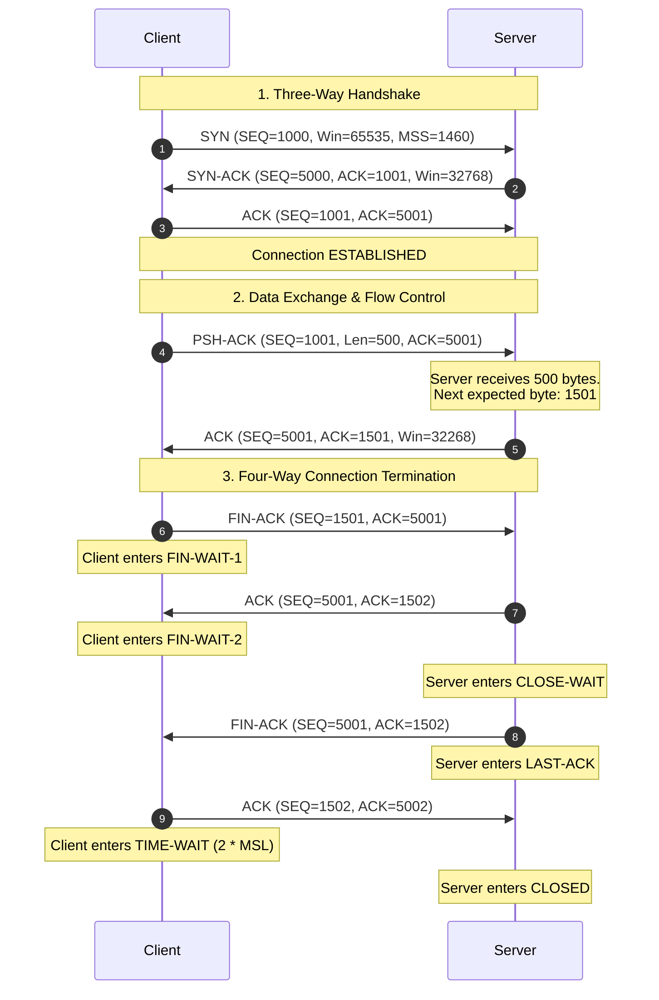

<!-- Generated by Gemini via GitHub Actions -->
<!-- Topic ID: T002 -->
<!-- Category: Core Backend Fundamentals -->
<!-- Generated at UTC: 2026-09-22T01:35:49.538501+00:00 -->

# TCP/IP basics

## 1. What problem does this solve?

At the lowest physical layer, computer networks transport raw pulses of light, electricity, or radio waves. Internet Protocol (IP) operates above this layer to handle logical addressable packet routing across interconnected networks. 

However, IP is inherently **stateless**, **unreliable**, and **best-effort**. IP packets (datagrams):
- Can be lost entirely due to network congestion or link failures.
- Can arrive out of order because different packets take different physical network paths.
- Can be duplicated by intermediate routers.
- Can be corrupted by hardware noise or signal degradation.
- Have maximum transmission unit (MTU) size limits (typically 1500 bytes on Ethernet), meaning arbitrary application payloads must be split into multiple packets.

If backends communicated using raw IP, every backend application would need to re-implement packet ordering, dropped packet detection, retransmission, corruption checks, byte stream assembly, and bandwidth regulation.

**Transmission Control Protocol (TCP)** solves this by abstracting the chaotic, unreliable packet-switched network layer into an **ordered, reliable, full-duplex, flow-controlled, and congestion-controlled byte stream** between two endpoints.

---

## 2. Mental model

### The Analogy
Imagine sending a 1,000-page manuscript from New York to London using individual, unnumbered post cards (IP packets). 

- **IP Layer:** Postmen deliver cards independently. Some cards take fast planes; others take slow boats. A few fall into the ocean. Some get delivered twice.
- **TCP Layer:** Before sending the book, the sender calls the receiver to ensure they are ready to accept pages (Handshake). Each page is assigned a precise sequential number. The receiver sends back a confirmation note ("I received up to page 45"). If page 46 does not arrive after a timeout, the sender re-sends page 46. If the receiver's desk is overflowing with unread pages, they ask the sender to stop mailing pages temporarily (Flow Control). Once finished, both parties explicitly say goodbye (Teardown).

### The Engineering Model
TCP provides a **virtual circuit** over connectionless packet switching. It transforms discrete packets into an uninterrupted byte stream managed by an Operating System Kernel state machine.

```
+-----------------------------------------------------------------------+
|                         Application Layer                             |
|              (HTTP/1.1, HTTP/2, Postgres Protocol, Redis)             |
+-----------------------------------------------------------------------+
     |                                                      ^
     | Continuous Stream of Bytes                           | Continuous Stream
     v                                                      | of Bytes
+-----------------------------------------------------------------------+
|                         Kernel Space (TCP)                            |
|  - Manages SEQ/ACK numbers                                            |
|  - Send & Receive Socket Buffers                                      |
|  - Retransmission Timers & Sliding Window                             |
+-----------------------------------------------------------------------+
     |                                                      ^
     | Segmented into TCP Segments                          | TCP Segments
     v                                                      |
+-----------------------------------------------------------------------+
|                             IP Layer                                  |
|  - Encapsulates Segments into IP Datagrams                            |
|  - Handles Hop-by-Hop Logical Routing                                 |
+-----------------------------------------------------------------------+
```

---

## 3. Deep explanation

### TCP Segment Structure
A TCP segment consists of a header (20 to 60 bytes) followed by payload data:

```
 0                   1                   2                   3
 0 1 2 3 4 5 6 7 8 9 0 1 2 3 4 5 6 7 8 9 0 1 2 3 4 5 6 7 8 9 0 1
+-+-+-+-+-+-+-+-+-+-+-+-+-+-+-+-+-+-+-+-+-+-+-+-+-+-+-+-+-+-+-+-+
|          Source Port          |       Destination Port        |
+-+-+-+-+-+-+-+-+-+-+-+-+-+-+-+-+-+-+-+-+-+-+-+-+-+-+-+-+-+-+-+-+
|                        Sequence Number                        |
+-+-+-+-+-+-+-+-+-+-+-+-+-+-+-+-+-+-+-+-+-+-+-+-+-+-+-+-+-+-+-+-+
|                     Acknowledgment Number                     |
+-+-+-+-+-+-+-+-+-+-+-+-+-+-+-+-+-+-+-+-+-+-+-+-+-+-+-+-+-+-+-+-+
|  Data | Reserved |F|S|R|P|A|U|            Window              |
| Offset|          |I|Y|S|S|C|R|            Size                |
|       |          |N|N|T|H|K|G|                                |
+-+-+-+-+-+-+-+-+-+-+-+-+-+-+-+-+-+-+-+-+-+-+-+-+-+-+-+-+-+-+-+-+
|           Checksum            |         Urgent Pointer        |
+-+-+-+-+-+-+-+-+-+-+-+-+-+-+-+-+-+-+-+-+-+-+-+-+-+-+-+-+-+-+-+-+
|                    Options (if Data Offset > 5)               |
+-+-+-+-+-+-+-+-+-+-+-+-+-+-+-+-+-+-+-+-+-+-+-+-+-+-+-+-+-+-+-+-+
|                             Data                              |
+-+-+-+-+-+-+-+-+-+-+-+-+-+-+-+-+-+-+-+-+-+-+-+-+-+-+-+-+-+-+-+-+
```

Key Header Fields:
- **Sequence Number (SEQ):** Specifies the byte position of the first data byte in this segment relative to the Initial Sequence Number (ISN).
- **Acknowledgment Number (ACK):** The sequence number of the *next expected byte* from the remote endpoint.
- **Flags:** Controls the connection state machine.
  - `SYN`: Synchronize sequence numbers (connection initiation).
  - `ACK`: Indicates the Acknowledgment Number field is valid.
  - `FIN`: Sender has finished transmitting data.
  - `RST`: Abort connection immediately due to unrecoverable error.
  - `PSH`: Push buffer data to application immediately.
- **Window Size (`rwnd`):** Advertised receive buffer capacity available on the local node (Flow Control).

---

### Core Mechanics & Internal Algorithms

#### 1. Reliability & Retransmission
TCP uses **Cumulative Acknowledggments**. An `ACK 1001` means "I have received all bytes up to 1000, send me byte 1001 next."

- **Round-Trip Time (RTT) Estimation:** TCP dynamically calculates Round-Trip Time and Variance to adjust the Retransmission Timeout (RTO).
- **Fast Retransmit:** If a sender receives 3 duplicate ACKs for the same byte sequence, it assumes the packet immediately following that sequence was dropped and retransmits it immediately, without waiting for the RTO timer to expire.

#### 2. Flow Control (Sliding Window)
Flow control prevents a fast sender from overwhelming a slow receiver's kernel buffer.
- The receiver advertises its available kernel receive buffer size via the `Window Size` field in every ACK frame.
- The sender is restricted: `Bytes_In_Flight <= Advertised_Window_Size`.
- If the receiver buffer fills up, it advertises a window size of `0` (Zero Window), causing the sender to pause data transmission and send periodic "Window Probes".

#### 3. Congestion Control
Congestion control prevents a sender from overwhelming intermediate network infrastructure (routers/switches). The sender maintains a **Congestion Window (`cwnd`)**. The actual maximum allowed data in flight is defined as:

$$\text{Effective Window} = \min(\text{Congestion Window } [cwnd], \text{Receiver Window } [rwnd])$$

Key Algorithms:
- **Slow Start:** Exponential growth of `cwnd` starting from a small base (e.g., 10 MSS) per RTT until `ssthresh` (Slow Start Threshold) is reached.
- **Congestion Avoidance:** Linear growth of `cwnd` per RTT once past `ssthresh`.
- **Congestion Control Algorithms:**
  - **Loss-based (e.g., CUBIC):** Reduces `cwnd` dramatically when packet loss is detected.
  - **Delay/Bandwidth-based (e.g., Google BBR):** Estimates true bottleneck bandwidth and RTT, avoiding bufferbloat and reducing tail latencies.

---

### TCP Socket State Machine

```
                              +-------------+
                              |   CLOSED    |
                              +-------------+
                                     |
                                LISTEN (Server)
                                     |
         +---------------------------+---------------------------+
         |                                                       |
  (Receive SYN)                                            (Send SYN)
         v                                                       v
  +--------------+                                        +--------------+
  | SYN-RECEIVED |                                        |   SYN-SENT   |
  +--------------+                                        +--------------+
         |                                                       |
  (Receive ACK)                                           (Receive SYN+ACK)
         |                                                       |
         +---------------------------+---------------------------+
                                     |
                                     v
                              +-------------+
                              | ESTABLISHED |
                              +-------------+
                                     |
        +----------------------------+----------------------------+
        | Close (Active)                                          | Close (Passive)
        v                                                         v
 +--------------+                                          +--------------+
 |  FIN-WAIT-1  |                                          |  CLOSE-WAIT  |
 +--------------+                                          +--------------+
        | (Receive ACK)                                           | (Send FIN)
        v                                                         v
 +--------------+                                          +--------------+
 |  FIN-WAIT-2  |                                          |   LAST-ACK   |
 +--------------+                                          +--------------+
        | (Receive FIN)                                           | (Receive ACK)
        v                                                         v
 +--------------+                                          +--------------+
 |  TIME-WAIT   |                                          |    CLOSED    |
 +--------------+                                          +--------------+
        | Wait 2 * MSL
        v
 +--------------+
 |    CLOSED    |
 +--------------+
```

---

### Key Failure Modes & Pitfalls

1. **Head-of-Line (HOL) Blocking:** Because TCP promises ordered delivery, if Packet #2 is dropped while Packets #3, #4, and #5 arrive safely, the kernel holds #3, #4, and #5 in its buffer. The application cannot read any data past #1 until #2 is successfully retransmitted and acknowledged.
2. **TIME-WAIT Socket Exhaustion:** Active teardowns leave the local socket in the `TIME-WAIT` state for 2 * Maximum Segment Lifetime (typically 60s) to absorb delayed in-flight packets. Under high throughput with short-lived connections, thousands of ephemeral ports can get stuck in `TIME-WAIT`, starving outbound connections.
3. **Half-Open Connections / Silent Drops:** If a network path snaps, or a client loses power without sending a `FIN` or `RST`, the server considers the socket `ESTABLISHED` indefinitely unless TCP Keepalives or Application Level Keepalives actively probe the wire.

---

## 4. How it works

### End-to-End Flow: Handshake, Data Transfer, and Teardown



---

## 5. Practical implementation

Because TCP is a **stream-oriented protocol** (and NOT message-oriented), individual `data` events emitted by a TCP socket can contain partial frames, exact frames, or multiple combined frames. Application developers must build explicit **Framing Protocols** (such as length-prefix framing or delimiter-based framing) on top of raw TCP streams.

Below is a production-grade TypeScript implementation using Node.js `net` module that implements a custom **Length-Prefixed Binary Protocol** over TCP.

### Frame Format
`[ 4 bytes uint32 Big Endian: Payload Length (N) ] [ N bytes: Payload Data ]`

### TCP Server & Protocol Parser (`server.ts`)

```typescript
import * as net from 'net';

/**
 * Parses raw TCP stream data into complete application messages based on 
 * Length-Prefixed framing ([4-byte length][payload]).
 */
class LengthPrefixedParser {
  private buffer: Buffer = Buffer.alloc(0);

  /**
   * Appends incoming TCP stream chunks to an internal buffer and extracts full payloads.
   */
  public push(chunk: Buffer): Buffer[] {
    this.buffer = Buffer.concat([this.buffer, chunk]);
    const messages: Buffer[] = [];

    while (this.buffer.length >= 4) {
      // Read the 32-bit unsigned integer length header (Big Endian)
      const payloadLength = this.buffer.readUInt32BE(0);
      const totalFrameLength = 4 + payloadLength;

      // If we don't have the full payload in the buffer yet, wait for more TCP chunks
      if (this.buffer.length < totalFrameLength) {
        break;
      }

      // Slice out the full message payload
      const payload = this.buffer.subarray(4, totalFrameLength);
      messages.push(payload);

      // Advance internal buffer past the processed frame
      this.buffer = this.buffer.subarray(totalFrameLength);
    }

    return messages;
  }
}

const PORT = 9090;

const server = net.createServer((socket: net.Socket) => {
  const clientAddr = `${socket.remoteAddress}:${socket.remotePort}`;
  console.log(`[TCP Server] Client connected: ${clientAddr}`);

  const parser = new LengthPrefixedParser();

  // Enable OS TCP Keepalive to clean up dead peer connections
  socket.setKeepAlive(true, 30000); // Send keepalive probes after 30s of inactivity

  // Disable Nagle's algorithm to write data immediately to the wire without queuing small chunks
  socket.setNoDelay(true);

  socket.on('data', (chunk: Buffer) => {
    // TCP does NOT preserve frame boundaries! Parse stream explicitly.
    const messages = parser.push(chunk);

    for (const msg of messages) {
      const payloadStr = msg.toString('utf-8');
      console.log(`[TCP Server] Received frame from ${clientAddr}: ${payloadStr}`);

      // Response: Echo back with same framing protocol
      const responsePayload = Buffer.from(`ACK: ${payloadStr}`);
      const header = Buffer.alloc(4);
      header.writeUInt32BE(responsePayload.length, 0);

      socket.write(Buffer.concat([header, responsePayload]));
    }
  });

  socket.on('error', (err: Error) => {
    console.error(`[TCP Server] Socket error (${clientAddr}):`, err.message);
  });

  socket.on('close', (hadError: boolean) => {
    console.log(`[TCP Server] Client disconnected (${clientAddr}). Had error: ${hadError}`);
  });
});

server.listen(PORT, () => {
  console.log(`[TCP Server] Listening on 0.0.0.0:${PORT}`);
});
```

### Client Test (`client.ts`)

```typescript
import * as net from 'net';

const socket = net.createConnection({ host: '127.0.0.1', port: 9090 }, () => {
  console.log('[TCP Client] Connected to server.');

  // Create two distinct messages
  const msg1 = Buffer.from('Hello, TCP First Principles!');
  const msg2 = Buffer.from('Second frame in rapid succession.');

  // Frame message 1
  const frame1 = Buffer.alloc(4 + msg1.length);
  frame1.writeUInt32BE(msg1.length, 0);
  msg1.copy(frame1, 4);

  // Frame message 2
  const frame2 = Buffer.alloc(4 + msg2.length);
  frame2.writeUInt32BE(msg2.length, 0);
  msg2.copy(frame2, 4);

  // INTENTIONAL TCP DEMONSTRATION: Send both frames merged into a single write byte stream
  // Demonstrates that server framing logic handles merged socket reads seamlessly
  const combinedStream = Buffer.concat([frame1, frame2]);
  socket.write(combinedStream);
});

socket.on('data', (data: Buffer) => {
  const len = data.readUInt32BE(0);
  const body = data.subarray(4, 4 + len).toString('utf-8');
  console.log('[TCP Client] Server Response:', body);
  socket.destroy(); // Clean close
});
```

---

## 6. Production considerations

### Scalability and Kernel Limits
High-concurrency TCP services (e.g., Load Balancers, API Gateways, Websocket Servers) face physical and Linux kernel boundaries:

1. **File Descriptor Limits:** Every open TCP connection consumes one file descriptor (FD).
   - Increase limits via `/etc/security/limits.conf` (`nofile 1048576`) or systemd settings.
2. **Listen Queue (Backlog):** The `listen(fd, backlog)` queue stores completed TCP 3-way handshakes waiting for `accept()` to consume them.
   - Adjust sysctl: `net.core.somaxconn = 65535`
   - Adjust node server initialization: `server.listen({ port: 8080, backlog: 65535 })`
3. **Ephemeral Port Exhaustion:** When acting as a client or reverse proxy (e.g., Next.js calling internal Microservices), outbound TCP connections use ephemeral source ports (range 32768–60999 by default).
   - Expand local port range: `sysctl -w net.ipv4.ip_local_port_range="1024 65535"`
   - Enable TIME-WAIT socket reuse for outgoing connections: `sysctl -w net.ipv4.tcp_tw_reuse=1`

### Security Threats

1. **SYN Flood Attack:** Attacker sends massive bursts of `SYN` packets with spoofed IP addresses. The server allocates half-open connection buffers until kernel memory exhausts.
   - **Mitigation:** Enable TCP SYN Cookies (`sysctl -w net.ipv4.tcp_syncookies=1`). The kernel encodes connection state into the Initial Sequence Number (ISN) without allocating memory until the client returns the final `ACK`.
2. **Slowloris Attack:** Attacker establishes full TCP connections but sends byte streams extremely slowly, holding open connection slots indefinitely.
   - **Mitigation:** Enforce aggressive application-level read timeouts and body header arrival limits.

### Observability Diagnostic Tools
- **`ss -tulpn`:** Inspect open sockets, rx/tx queue depths, and process assignments.
- **`sysctl -a | grep tcp`:** Inspect host-level kernel TCP parameters.
- **`tcpdump -i eth0 port 8080 -w dump.pcap`:** Capture raw packet streams for offline inspection in Wireshark.
- **eBPF / `tcptop`:** Monitor live connection dynamics, retransmissions, and RTT anomalies in real-time with negligible CPU overhead.

---

## 7. Common mistakes

1. **Treating TCP like a Packet Protocol:** Assuming that 1 `socket.write()` call on the sender matches 1 `data` event on the receiver. Network switches, TCP segmentation, and MTU limits split or merge writes freely.
2. **Relying Solely on OS TCP Keepalives for Idle Dead Socket Cleanup:** OS TCP keepalives default to 2 hours of idle threshold on Linux. Middleboxes (firewalls, NAT routers, AWS ALBs) frequently terminate idle connections silently after 60–350 seconds.
   - *Fix:* Use application-level heartbeats (e.g., Websocket Ping/Pong, Redis `PING`, HTTP/2 `PING` frames).
3. **Neglecting Socket Error Listeners in Node.js:** Unhandled TCP `error` events crash the Node.js event loop completely.
4. **Ignoring `setNoDelay(true)` on Interactive Microservices:** By default, TCP uses **Nagle's Algorithm**, which delays small packet emissions (up to 200ms) to combine them into single MTU-sized segments. For microservice RPC calls where low-latency payloads matter, failure to set `socket.setNoDelay(true)` adds artificial p99 tail latency.
5. **Failing to Pool Short-Lived Connections:** Opening and closing a fresh TCP connection for every database query or API fetch adds 1.5 RTT of handshake latency + TLS negotiation penalty + socket allocation overhead.

---

## 8. Senior engineer perspective

### Architecture Decisions
As a senior backend engineer, you operate under the assumption that network connections are **unreliable and expensive**.

1. **TCP Connection Pooling:** Keep connections warm using persistent pools (e.g., PostgreSQL connection pools, HTTP Keep-Alive, PgBouncer). Reusing existing TCP streams drops handshake and TLS overhead from ~100ms down to near 0ms execution delay.
2. **Protocol
