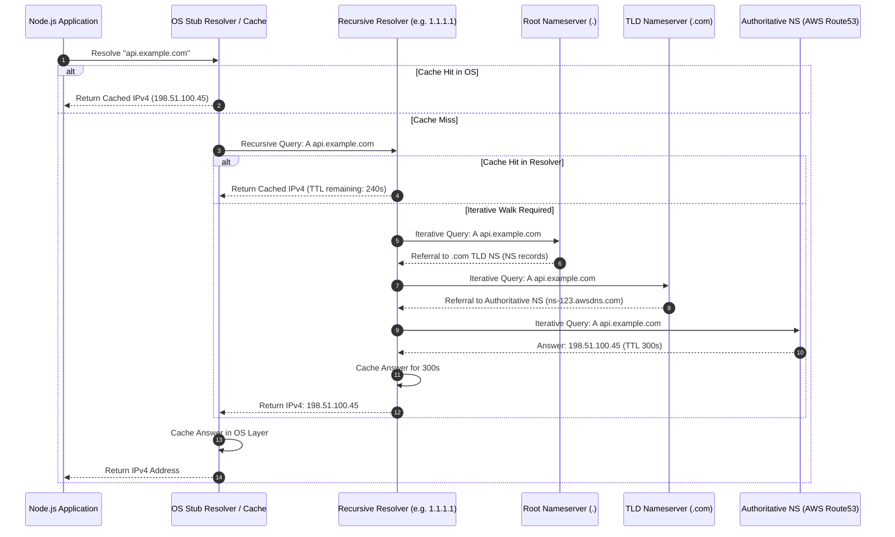

<!-- Generated by Gemini via GitHub Actions -->
<!-- Topic ID: T003 -->
<!-- Category: Core Backend Fundamentals -->
<!-- Generated at UTC: 2026-09-22T06:27:08.345029+00:00 -->

# DNS

## 1. What problem does this solve?

Networks route IP packets using physical and logical addresses (IPv4 32-bit integers like `192.0.2.1` or IPv6 128-bit integers like `2001:db8::1`). However, building software systems that rely on hardcoded IP addresses creates three major engineering problems:

1. **Human Usability**: Humans cannot memorize or reliably manage thousands of raw numerical IP addresses across environments.
2. **Indirection and Decoupling**: Software requires an abstraction layer between identity (e.g., `api.payment.com`) and location (`192.0.2.1`). An infrastructure migration, autoscaling event, failover, or network renumbering changes IP addresses. Without indirection, every client application globally would need to update its hardcoded configuration instantly whenever an IP changes.
3. **Global Service Routing**: A single global service needs to route requests to different IP addresses based on the client's geographic location, network conditions, system health, or load distribution.

The Domain Name System (DNS) solves these problems by providing a globally distributed, hierarchical, eventually-consistent lookup mechanism that translates human-readable domain names into IP addresses, routing instructions, cryptographic signatures, and arbitary metadata.

---

## 2. Mental model

### The Simple Analogy
Think of DNS as a multi-tiered, globally distributed phone directory or postal lookup service:
* **Root Level**: The main switchboard that knows which phonebook covers which country code (`.com`, `.org`, `.io`).
* **Top-Level Domain (TLD) Level**: The regional registry office that maintains a directory of registered businesses within that jurisdiction (e.g., `.com` registry knows who manages `example.com`).
* **Authoritative Level**: The company's internal operator directory that holds the exact extension for every department (`api.example.com` $\rightarrow$ Extension 101).

### The Precise Engineering Model
Engineers should model DNS as a **globally distributed, hierarchical, read-heavy, eventually-consistent Key-Value database** with:
* **Keys**: Fully Qualified Domain Names (FQDNs), structured as dot-separated hierarchical node trees (e.g., `api.v1.payment.example.com.`).
* **Values**: Sets of Resource Records (RRs) tagged with a specific record type (`A`, `AAAA`, `CNAME`, `MX`, `TXT`, etc.).
* **Caching Strategy**: TTL-based (Time-To-Live) write-through/read-aside caching at every tier (Kernel, OS, Local Resolver, ISP, Edge CDN).
* **Partitioning Strategy**: Horizontal domain delegating boundaries called **Zones**.

```
                         [ . ] (Root Zone)
                        /     \
                [ com. ]       [ io. ] (TLDs)
               /
      [ example.com. ] (Authoritative Zone)
      /              \
[ api.example.com. ]  [ db.example.com. ]
```

---

## 3. Deep explanation

### DNS Record Types Every Backend Engineer Must Know

| Record Type | Purpose | Production Use Case |
| :--- | :--- | :--- |
| **A** | Maps hostname to an IPv4 address (`32-bit`). | Direct routing to an IPv4 load balancer or server. |
| **AAAA** | Maps hostname to an IPv6 address (`128-bit`). | Dual-stack network endpoints. |
| **CNAME** | Maps hostname to another hostname (Canonical Name alias). | Pointing a subdomain (`app.example.com`) to a CloudFront or AWS ALB hostname. |
| **ALIAS / ANAME** | Non-standard virtual record mapped to hostnames at the zone apex (`example.com`). | Bypasses CNAME zone apex limitations by returning resolved `A`/`AAAA` records at query time. |
| **MX** | Mail Exchanger. Maps domain to mail handling servers with preference weights. | Routing corporate email services (e.g., Google Workspace). |
| **TXT** | Arbitrary text data (up to 255 bytes per string, multiple allowed). | Domain ownership verification, SPF, DKIM, DMARC security policies. |
| **NS** | Nameserver record. Delegates a DNS zone to an authoritative server cluster. | Delegating subdomains to external managed services (e.g., AWS Route 53, Cloudflare). |
| **SOA** | Start of Authority. Zone administrative metadata (serial number, refresh timeouts, primary NS). | Zone sync synchronization between primary and secondary DNS servers. |
| **SRV** | Service record specifying port and hostname for services. | Service discovery protocols (Consul, Active Directory, SIP). |
| **PTR** | Pointer record for reverse DNS lookups (IP to Hostname). | Anti-spam validations, security audit logging. |

### The Recursive vs. Iterative Query Resolution Engine

DNS resolution relies on two operational modes:

1. **Recursive Query**: "Find the final IP for me; do not return until you have the answer or an error." Client machines and application servers send recursive queries to **Recursive Resolvers** (e.g., Cloudflare `1.1.1.1`, Google `8.8.8.8`, or AWS VPC DNS `169.254.169.253`).
2. **Iterative Query**: "Give me the answer, or give me the address of the next server I should ask." The Recursive Resolver executes iterative queries down the hierarchy:
   * Asks **Root Server (`.`)** $\rightarrow$ Returns TLD Server NS for `.com`.
   * Asks **TLD Server (`.com.`)** $\rightarrow$ Returns Authoritative NS for `example.com.`.
   * Asks **Authoritative Server (`ns1.p20.dynect.net`)** $\rightarrow$ Returns `A` record `93.184.216.34`.

```
Application  ---> Recursive Resolver ---> Root Server (.)
                                     ---> TLD Server (.com)
                                     ---> Authoritative Server (example.com)
```

### Protocol Transports: UDP, TCP, DoT, DoH

* **UDP Port 53**: Primary protocol for standard queries. Low latency, zero-connection overhead. Historically limited to 512 bytes payload size.
* **EDNS0 (Extension Mechanisms for DNS)**: Extends UDP payload buffer size up to 4096 bytes to allow DNSSEC signatures without forced TCP fallback.
* **TCP Port 53**: Used when DNS response payload exceeds UDP buffer limits, or for **Zone Transfers (AXFR/IXFR)** between primary and secondary nameservers.
* **DNS over TLS (DoT - Port 853)**: Encrypts DNS queries inside TLS. Operates at the transport layer.
* **DNS over HTTPS (DoH - Port 443)**: Encrypts DNS queries using standard HTTP/2 or HTTP/3 frames. Prevents middlebox tampering, ISP sniffing, and DNS hijacking.

### The Dynamics of TTL and Cache Propagation

Every DNS record contains a **TTL (Time-To-Live)** field in seconds. 
* Resolvers hold records in cache for $T_{\text{cached}} = \min(\text{Record TTL}, \text{Resolver Max TTL Config})$.
* **Negative Caching**: When a domain does not exist (`NXDOMAIN`), resolvers cache the failure according to the TTL specified in the zone's **SOA record** (`SOA Minimum TTL` or `SOA TTL`).
* **Cache Invalidation Does Not Exist in DNS**: There is no global "cache purge" protocol across recursive DNS servers worldwide. If you publish a record with a TTL of 86400 (24 hours), downstream clients and ISPs *will* serve stale data for up to 24 hours after you change it.

### Node.js Platform Specifics: `dns.lookup()` vs. `dns.resolve()`

In Node.js, backend developers routinely introduce fatal performance bottlenecks by confusing the two native DNS resolution paths:

```
                          +-----------------------------------+
                          | Node.js Network Call (fetch/axios)|
                          +-----------------------------------+
                                            |
                                            v
                        +---------------------------------------+
                        |       dns.lookup(hostname)            |
                        +---------------------------------------+
                                            |
                                            v
                        +---------------------------------------+
                        | libuv Threadpool (Synchronous System) |
                        | Call to OS glibc getaddrinfo()        |
                        +---------------------------------------+
                        /                   |                   \
                       v                    v                    v
                 Reads /etc/hosts    System DNS Cache    OS Network Resolver
```

1. **`dns.lookup()`**:
   * Uses the underlying operating system's `getaddrinfo(3)` C-library function.
   * **Synchronous and Threadpool Bound**: Executed on the `libuv` worker threadpool (default size = 4). High volume DNS queries using `dns.lookup()` will exhaust threadpool threads, causing severe event-loop stalls for async file system calls, crypto, and other system IO operations.
   * **Respects Operating System Rules**: Reads `/etc/hosts`, respects system search domains, and uses OS level configuration (`nsswitch.conf`).
   * **Default for `http.request`, `fetch`, `axios`, `pg`, `redis`, and `mongoose`**.

2. **`dns.resolve()` / `dns.resolve4()` / `dns.promises`**:
   * Uses **`c-ares`**, a dedicated C library for asynchronous DNS requests.
   * **Completely Non-blocking**: Does *not* use the `libuv` threadpool. Makes direct UDP/TCP network socket calls to configured DNS servers.
   * **Bypasses OS Configurations**: Ignores `/etc/hosts` completely. Resolves strictly via network query to upstream nameservers.

---

## 4. How it works

### End-to-End DNS Resolution Flow



### Step-by-Step Execution Sequence

1. **Application Call**: The Node.js HTTP runtime parses the URL `https://api.example.com/v1/orders`.
2. **OS Stub Lookup**: Node.js delegates to the resolver interface. The OS checks its internal cache and system `/etc/hosts` file.
3. **Recursive Dispatch**: On cache miss, the OS sends a UDP datagram to the configured Recursive Resolver IP (e.g., `169.254.169.253` in AWS EC2).
4. **Recursive Cache Check**: The Recursive Resolver inspects its local memory cache.
5. **Root Delegation**: If missing, it queries a Root Nameserver (`.`) for `api.example.com`. The Root returns the IP pointers for the `.com` TLD servers.
6. **TLD Delegation**: The Recursive Resolver queries the `.com` TLD nameserver. The TLD server responds with the `NS` records of the domain (`ns1.example.com`).
7. **Authoritative Query**: The Recursive Resolver queries `ns1.example.com` for the `A` record of `api.example.com`.
8. **Authoritative Response**: Authoritative server returns record `198.51.100.45` along with TTL metadata (`300` seconds).
9. **Caching & Return**: The Recursive Resolver caches the record for up to 300 seconds, returns the payload to the client OS, which passes it to Node.js.
10. **Socket Connection**: The application runtime opens a TCP handshake (`SYN`) to `198.51.100.45:443`.

---

## 5. Practical implementation

### Production-Grade Custom Asynchronous Caching Resolver

This production pattern solves the **`libuv` threadpool starvation issue** caused by default `dns.lookup` calls under high concurrent egress load. It utilizes non-blocking `c-ares` (`dns.resolve4`), caches host IPs in memory with strict adherence to DNS TTLs, and hooks natively into HTTP agents or `undici`.

```typescript
import dns from 'node:dns/promises';
import http from 'node:http';
import https from 'node:https';
import { Resolver } from 'node:dns/promises';

interface CacheEntry {
  address: string;
  family: number;
  expiresAt: number;
}

/**
 * High-performance, non-blocking, TTL-aware DNS Resolver for Node.js microservices.
 * Bypasses OS threadpool blocking and maintains in-memory lookup cache.
 */
export class AsyncCachingDnsResolver {
  private cache = new Map<string, CacheEntry>();
  private resolver: Resolver;

  constructor(customNameservers?: string[]) {
    this.resolver = new Resolver();
    if (customNameservers && customNameservers.length > 0) {
      this.resolver.setServers(customNameservers);
    }
  }

  /**
   * Signature matches node:net lookup function for direct injection into http.Agent
   */
  public lookup = async (
    hostname: string,
    options: any,
    callback: (err: NodeJS.ErrnoException | null, address: string, family: number) => void
  ): Promise<void> => {
    try {
      const result = await this.resolveHost(hostname);
      callback(null, result.address, result.family);
    } catch (err) {
      callback(err as NodeJS.ErrnoException, '', 4);
    }
  };

  /**
   * Resolves IPv4 record with in-memory TTL caching via c-ares
   */
  public async resolveHost(hostname: string): Promise<{ address: string; family: number }> {
    const now = Date.now();
    const cached = this.cache.get(hostname);

    if (cached && cached.expiresAt > now) {
      return { address: cached.address, family: cached.family };
    }

    try {
      // Non-blocking UDP/TCP query via c-ares, retrieving TTL explicitly
      const records = await this.resolver.resolve4(hostname, { ttl: true });
      
      if (!records || records.length === 0) {
        throw new Error(`ENODATA: No A records found for domain ${hostname}`);
      }

      // Pick a random record for basic client-side round-robin load distribution
      const selected = records[Math.floor(Math.random() * records.length)];
      
      // Calculate absolute expiry epoch (TTL is in seconds)
      const ttlMs = Math.max(selected.ttl, 5) * 1000; // Enforce min 5s safety TTL
      const expiresAt = now + ttlMs;

      const entry: CacheEntry = {
        address: selected.address,
        family: 4,
        expiresAt,
      };

      this.cache.set(hostname, entry);
      return { address: entry.address, family: entry.family };
    } catch (error) {
      // If resolution fails, but we have an expired entry, fall back to stale cache (Graceful Degradation)
      if (cached) {
        console.warn(`[DNS Warning] Lookup failed for ${hostname}. Serving stale cache entry.`);
        return { address: cached.address, family: cached.family };
      }
      throw error;
    }
  }

  /**
   * Purge expired cache entries periodically to avoid memory leaks
   */
  public purgeExpired(): void {
    const now = Date.now();
    for (const [key, entry] of this.cache.entries()) {
      if (entry.expiresAt <= now) {
        this.cache.delete(key);
      }
    }
  }
}

// ============================================================================
// Integration Example with Node.js HTTPS Global Agent
// ============================================================================

const customResolver = new AsyncCachingDnsResolver(['1.1.1.1', '8.8.8.8']);

// Clean up memory cache every 60 seconds
setInterval(() => customResolver.purgeExpired(), 60_000).unref();

// Custom HTTPS agent injecting non-blocking lookup engine
export const highThroughputHttpsAgent = new https.Agent({
  keepAlive: true,
  maxSockets: 100,
  maxFreeSockets: 10,
  timeout: 5000,
  lookup: customResolver.lookup as any, // Custom lookup hook
});

// Demonstrating usage with standard HTTP request module
function makeRequest(urlStr: string) {
  const url = new URL(urlStr);
  
  const req = https.request(
    url,
    {
      agent: highThroughputHttpsAgent,
      method: 'GET',
    },
    (res) => {
      console.log(`[HTTP Response] Status Code: ${res.statusCode} for ${url.hostname}`);
      res.resume(); // Consume stream to free memory
    }
  );

  req.on('error', (err) => {
    console.error(`[HTTP Error] Request failed:`, err.message);
  });

  req.end();
}

// Example Invocation
makeRequest('https://aws.amazon.com');
```

---

## 6. Production considerations

### Scalability and Global Traffic Routing

1. **Latency-Based Routing**: DNS services (Route 53, Cloudflare) measure latency from global vantage points and route users to the region providing the lowest network round-trip time (RTT).
2. **Geo-DNS Routing**: Resolves traffic based on the client's geographic continent, country, or state (useful for compliance, data sovereignty, and localized content delivery).
3. **Weighted Round Robin (WRR)**: Distributes inbound traffic across multiple endpoint targets (e.g., 90% to primary region, 10% to canary region).

### Reliability & Resilience

* **Multi-Provider DNS Architecture**: Never rely on a single DNS vendor for high-availability production applications. If AWS Route 53 or Cloudflare suffers a global control plane outage, your service disappears. Run primary-secondary or dual-authoritative providers (e.g., Route 53 + NS1) with identical zone records.
* **Emergency Migration Pre-warming**: Before doing a cloud migration or datacenter switch, **reduce your record TTL to 60 seconds at least 24-48 hours prior**. This allows rapid cutback if the new target fails. Once stable, raise the TTL back to `300` or `3600` seconds to reduce upstream query costs and downstream exposure to DNS outage events.

### Security Defenses

* **DNSSEC (DNS Security Extensions)**: Adds cryptographic RSA/ECDSA signatures to DNS records. Protects against **DNS Cache Poisoning** and **Man-in-the-Middle (MitM) Spoofing** by validating chain-of-trust signatures from Root down to the Authoritative zone.
* **CAA Records (Certification Authority Authorization)**: TXT-like record that specifies which Certificate Authorities (e.g., Let's Encrypt, DigiCert) are allowed to issue TLS certificates for your domain name. Prevents rogue SSL cert issuance.
* **DNS Amplification Mitigation**: Standard UDP DNS requests can yield large responses from tiny queries. Attackers spoof victim IP addresses to generate massive DDoS traffic. Mitigated via **Response Rate Limiting (RRL)** and disabling open recursion on DNS servers.

### Observability Metrics

Monitor DNS in backend environments via these key RED/USE metrics:
*
