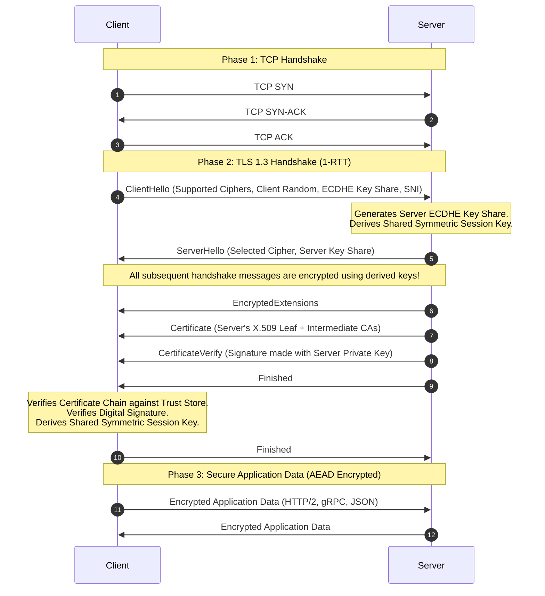

<!-- Generated by Gemini via GitHub Actions -->
<!-- Topic ID: T004 -->
<!-- Category: Core Backend Fundamentals -->
<!-- Generated at UTC: 2026-09-22T06:27:08.345029+00:00 -->

# TLS/SSL

## 1. What problem does this solve?

When two machines communicate across a public network (such as the Internet), their raw IP packets pass through multiple intermediate hops—routers, switches, internet service providers (ISPs), and potentially malicious middleboxes. 

Without protection, an attacker positioned along this path can:
1. **Eavesdrop (Lack of Confidentiality):** Read plain-text application payloads, such as HTTP requests containing passwords, API tokens, or personal user data.
2. **Tamper (Lack of Integrity):** Modify packets in transit, altering payload contents, injecting malicious scripts, or changing financial transactions without either party detecting the alteration.
3. **Impersonate (Lack of Authentication):** Pretend to be the destination server (e.g., via DNS spoofing or BGP hijacking) and trick the client into sending sensitive credentials to a rogue server.

**Transport Layer Security (TLS)**—and its deprecated predecessor, **Secure Sockets Layer (SSL)**—solves these three core security problems at the transport abstraction layer. By wrapping TCP connections in a cryptographic shell, TLS converts an untrusted, public communication channel into a secure, authenticated, and tamper-proof point-to-point pipe. Application protocols like HTTP, WebSocket, SMTP, gRPC, and database wire protocols (Postgres, MongoDB, Redis) can run directly on top of TLS without redesigning their own protocol-level cryptography.

---

## 2. Mental model

### Simple Analogy
Imagine sending a physical document through an untrusted postal network where every postal worker is potentially corrupt:
- **Unencrypted TCP:** You write your message on a postcard. Anyone handling it can read it (eavesdropping) or erase/change text with a pencil (tampering).
- **TLS Encryption:** You place the document inside a lockbox. Only you and the intended recipient possess the matching key to open it.
- **TLS Certificates (Authentication):** Before unlocking the box, you demand that the recipient present a government-issued ID verified by a trusted notary stamp (Certificate Authority). This proves the box actually reached the correct recipient, not an imposter.

### Precise Engineering Model
TLS acts as an intermediate protocol layer positioned between TCP (Transport Layer, Layer 4) and Application protocols (Layer 7).

```
+-------------------------------------------------------+
| Application Layer (HTTP/1.1, HTTP/2, gRPC, Postgres) |
+-------------------------------------------------------+
| TLS Protocol Layer (Handshake, Record Protocol)      |  <-- Cryptographic Layer
+-------------------------------------------------------+
| TCP (Transmission Control Protocol)                   |  <-- Layer 4 Stream
+-------------------------------------------------------+
| IP (Internet Protocol)                                |  <-- Layer 3 Routing
+-------------------------------------------------------+
```

1. **Session Setup (Handshake Protocol):** The client and server complete a TCP 3-way handshake first. Then, they conduct a TLS Handshake using **Asymmetric Cryptography** (e.g., ECDSA, RSA, ECDHE). They verify the server's identity via X.509 Digital Certificates and negotiate a ephemeral, shared secret key without sending that key across the wire.
2. **Data Streaming (Record Protocol):** Once the handshake completes, asymmetric cryptography is discarded for payload transmission due to its high CPU overhead. The application data is split into chunks, compressed (optional/deprecated), encrypted using **Symmetric Cryptography** (e.g., AES-256-GCM, ChaCha20-Poly1305), tagged with an Authentication Tag (AEAD), and transmitted over the raw TCP socket.

---

## 3. Deep explanation

### TLS 1.2 vs. TLS 1.3
Modern backend systems must prefer **TLS 1.3** (defined in RFC 8446) over TLS 1.2 (RFC 5246). TLS 1.3 redesigns the handshake for performance and security:

| Feature | TLS 1.2 | TLS 1.3 |
| :--- | :--- | :--- |
| **Handshake Latency** | 2 RTTs (Round Trip Times) | 1 RTT (0-RTT resumption available) |
| **Key Exchange Mechanics** | Static RSA, DH, or ECDHE | **Strictly Ephemeral Elliptic Curve Diffie-Hellman (ECDHE)** |
| **Perfect Forward Secrecy** | Optional (depends on cipher suite selection) | **Mandatory** |
| **Cipher Suites Supported** | ~37+ (includes weak/broken ciphers like CBC, RC4) | 5 streamlined, ultra-secure AEAD cipher suites |
| **Encrypted Handshake** | Handshake certificates sent in plaintext | Certificates encrypted after initial key exchange |

### Public Key Infrastructure (PKI) & X.509 Certificates
Authentication relies on a hierarchy of trust:
- **Root Certificate Authorities (CAs):** Cryptographic identity roots embedded directly into operating systems and runtime trust stores (e.g., Linux `/etc/ssl/certs`, Node.js built-in Mozilla CA bundle).
- **Intermediate CAs:** Root CAs delegate signing authority to Intermediate CAs to keep the Root offline and protected in cold storage.
- **Leaf (End-Entity) Certificates:** Issued to domain names (e.g., `api.example.com`). The leaf certificate contains the public key, domain identity (**Subject Alternative Name / SAN**), issuer signature, and validity dates.
- **Chain of Trust Verification:** When a client connects, the server sends its Leaf Certificate alongside the Intermediate Certificates. The client traces the signatures up the chain until it reaches a trusted Root CA in its local trust store.

```
[ Root CA Certificate ] (Self-signed, hardcoded in OS/Node.js Trust Store)
       │
       ▼ (Signs)
[ Intermediate CA Certificate ] (Sent by server)
       │
       ▼ (Signs)
[ Leaf/Server Certificate ] (api.example.com - Sent by server)
```

### Perfect Forward Secrecy (PFS)
PFS is a cryptographic property ensuring that if a server's long-term private key is stolen in the future, past recorded encrypted traffic **cannot** be decrypted.
- **Legacy RSA Key Exchange (No PFS):** The client encrypts a session key using the server’s public key. If an attacker logs all network traffic today and steals the server's private key 3 years later, they can decrypt all historic traffic.
- **ECDHE (Ephemeral Elliptic Curve Diffie-Hellman - PFS Enabled):** Both parties generate temporary, disposable key pairs per connection. They compute a shared secret over the wire using Diffie-Hellman math. Even if the server's private identity key is later compromised, historical ephemeral keys are gone from memory, leaving past traffic indecipherable.

### Authenticated Encryption with Associated Data (AEAD)
TLS 1.3 requires AEAD ciphers (e.g., `TLS_AES_256_GCM_SHA384` or `TLS_CHACHA20_POLY1305_SHA256`). AEAD eliminates legacy vulnerabilities (such as Padding Oracle attacks seen in CBC mode) by simultaneously guaranteeing:
1. **Confidentiality:** Data payload is encrypted.
2. **Integrity & Authenticity:** A cryptographic MAC tag is calculated over the ciphertext and unencrypted header metadata. If a single bit is tampered with in transit, decryption fails instantly before the application reads the buffer.

### Stack Placement & Architectural Trade-offs

```
      [ Internet Client ]
               │ TLS 1.3 / HTTPS
               ▼
   [ Cloudflare / Edge CDN ] (Edge TLS Termination)
               │ TLS 1.3 (Public or Cross-VPC)
               ▼
    [ ALB / NGINX / Envoy ] (Ingress TLS Termination)
               │
      ┌────────┴────────┐
      │ Internal Mesh   │ mTLS (SPIFFE/mTLS via Envoy/Linkerd)
      ▼                 ▼
[ Node.js API ] ──► [ PostgreSQL ] (TLS encrypted wire transport)
```

1. **Edge/Ingress TLS Termination:** Terminating TLS at the load balancer or ingress controller offloads CPU-intensive asymmetric handshake math from application pods.
2. **End-to-End TLS / mTLS:** In Zero-Trust architectures or regulated environments (PCI-DSS, HIPAA), TLS must extend into the internal network, terminating directly inside application microservices or database engines.

---

## 4. How it works

### The TLS 1.3 1-RTT Handshake Flow

1. **TCP Connection:** Client and Server perform standard TCP 3-Way Handshake (`SYN` -> `SYN-ACK` -> `ACK`).
2. **ClientHello:** Client sends supported TLS versions, supported AEAD cipher suites, a random nonce, and an **ECDHE Key Share** (its public Diffie-Hellman key parameter) alongside the **SNI (Server Name Indication)** host request.
3. **ServerHello:** Server selects the cipher suite, generates its own **ECDHE Key Share**, and computes the shared symmetric encryption key.
4. **Encrypted Extensions & Certificate:** Server switches to encrypted communication immediately. It sends its encrypted Certificate, `CertificateVerify` (digital signature proving ownership of the private key), and a `Finished` message.
5. **Client Verification & Finished:** Client verifies the server's certificate chain and digital signature using its trusted CA bundle. It then computes the same shared symmetric key and sends its own `Finished` message.
6. **Encrypted Application Data:** Symmetric data exchange begins over the secure socket.



---

## 5. Practical implementation

### 1. Production Node.js/TypeScript Native TLS Server & Client

The following TypeScript code demonstrates setting up a production-ready Node.js TLS server requiring strict cipher suites, TLS 1.3, and proper certificate configuration.

```typescript
// server.ts
import tls from 'node:tls';
import fs from 'node:fs';
import path from 'node:path';

const options: tls.TlsOptions = {
  // Server identity: Private Key and Certificate Chain (Leaf + Intermediate)
  key: fs.readFileSync(path.join(__dirname, 'certs/server-key.pem')),
  cert: fs.readFileSync(path.join(__dirname, 'certs/server-cert.pem')),
  
  // Enforce modern TLS versions exclusively
  minVersion: 'TLSv1.3',
  maxVersion: 'TLSv1.3',
  
  // Handshake timeout to mitigate Slowloris / stalled TLS handshake attacks
  handshakeTimeout: 5000,
  
  // Request client certificate for Mutual TLS (mTLS) optional/required flag
  requestCert: false,
  rejectUnauthorized: true,
};

const server = tls.createServer(options, (socket: tls.TLSSocket) => {
  console.log(`[TLS] Client connected. Cipher: ${socket.getCipher().name}, Protocol: ${socket.getProtocol()}`);
  
  socket.write('Hello from secure Node.js TLS Server!\n');

  socket.on('data', (data: Buffer) => {
    console.log(`[Received]: ${data.toString('utf-8').trim()}`);
  });

  socket.on('error', (err: Error) => {
    console.error(`[Socket Error]: ${err.message}`);
  });
});

server.listen(8443, () => {
  console.log('TLS Server listening on port 8443');
});
```

### 2. Node.js Client with Strict Verification (Connecting to PostgreSQL / Redis)

Connecting safely from Node.js to database instances (Postgres, Redis, MongoDB) requiring verified TLS termination:

```typescript
// db-client.ts
import { Client } from 'pg';
import fs from 'node:fs';
import path from 'node:path';

// Secure PostgreSQL Connection configuration with TLS verification
const pgClient = new Client({
  host: 'db.internal.example.com',
  port: 5432,
  user: 'backend_app',
  password: process.env.DB_PASSWORD,
  database: 'production_db',
  ssl: {
    // CRITICAL: Force verification of the server certificate chain
    rejectUnauthorized: true,
    
    // Explicitly supply custom internal Root/Intermediate CA bundle
    ca: fs.readFileSync(path.join(__dirname, 'certs/internal-ca.pem')).toString(),
    
    // Optional: SNI server name override if connecting across custom hostnames
    servername: 'db.internal.example.com',
  },
});

async function connectDatabase() {
  try {
    await pgClient.connect();
    console.log('Successfully connected to Postgres via verified TLS.');
    
    const res = await pgClient.query('SELECT ssl_is_used();');
    console.log(`SSL Active: ${res.rows[0].ssl_is_used}`);
  } catch (error) {
    console.error('Failed to establish secure DB connection:', error);
    process.exit(1);
  }
}

connectDatabase();
```

---

## 6. Production considerations

### Scalability & Performance
1. **Asymmetric Crypto CPU Overhead:** Initial handshakes perform heavy elliptic curve math. Minimize raw handshakes by leveraging **HTTP/2 multiplexing**, **Keep-Alive persistent connection pooling**, and **TLS Session Resumption** (Session Tickets / RFC 5077).
2. **Session Tickets & STEK Rotation:** TLS 1.3 allows servers to issue encrypted Session Tickets to clients. When resuming connections, clients present this ticket. To support multi-instance horizontal scaling, all backend load balancer instances must share and periodically rotate the **Session Ticket Encryption Key (STEK)**.

### Security Hardening
1. **Never Disable `rejectUnauthorized`:** Setting `rejectUnauthorized: false` in Node.js or `NODE_TLS_REJECT_UNAUTHORIZED=0` turns off certificate verification completely. This leaves your system vulnerable to Man-In-The-Middle (MITM) attacks in production.
2. **HSTS (HTTP Strict Transport Security):** Enforce `Strict-Transport-Security: max-age=31536000; includeSubDomains; preload` headers on all web responses to force browsers to interact strictly over HTTPS, preventing HTTP downgrade attacks.
3. **Automated Renewal via ACME:** Human errors are the leading cause of outage-inducing certificate expirations. Automate certificate lifecycle management using tools like **Cert-Manager** (Kubernetes), **Let's Encrypt / ACME**, or **AWS ACM**.

### Observability & Metrics
Track key TLS telemetry at your Ingress/Proxy layer:
- `tls_handshake_duration_seconds` (Histogram): Spike indicates CPU starvation or latency issues.
- `tls_handshake_failures_total` (Counter, tagged by reason: `cert_expired`, `bad_cipher`, `hostname_mismatch`).
- `certificate_expiration_timestamp_seconds` (Gauge): Metric for setting up alerts (e.g., alert if expiration < 14 days).

---

## 7. Common mistakes

1. **Missing Intermediate Certificates in Chain:** Serving only the leaf certificate works in some browsers (which cache intermediates via AIA fetching) but fails in backend Node.js, Go, or Python microservices with errors like `UNABLE_TO_VERIFY_LEAF_SIGNATURE`.
2. **Disabling TLS Verification in Staging and Leaking to Production:** Setting `rejectUnauthorized: false` to bypass local self-signed certificate errors during development, then accidentally shipping that flag to production.
3. **PostgreSQL/MongoDB Connection String Lax Settings:** Configuring connection strings with `sslmode=require` instead of `sslmode=verify-full`. `require` encrypts traffic but skips host validation, making the application vulnerable to MITM attacks via DNS spoofing.
4. **Hardcoding Certificates in Container Images:** Baking `.crt` and `.key` files into Docker images rather than injecting them at runtime via secret managers (HashiCorp Vault, AWS Secrets Manager, Kubernetes Secrets).
5. **Ignoring Hardware Acceleration Support:** Running custom Node.js/Python microservice containers on systems without `AES-NI` crypto instructions compiled into runtime binary extensions, leading to high CPU usage during spikes in TLS traffic.

---

## 8. Senior engineer perspective

### Strategic Decisions
- **Termination Topology Choice:** As a Senior Engineer, evaluate the trade-off between **Edge Termination** vs. **End-to-End Encryption**. Edge termination reduces network hop latencies and offloads CPU work. However, strict zero-trust standards require terminating TLS at the ingress pod, followed by internal **mTLS** (e.g., via Envoy, Istio, or Linkerd) between microservices.
- **Mutual TLS (mTLS) for Machine-to-Machine & AI Backends:** Traditional API keys can leak via logs or source code. Microservices and high-throughput AI worker nodes should authenticate via mTLS. In mTLS, both the client and server validate each other's X.509 certificates, establishing identity at Layer 4 before application logic executes.

### Real-World System Trade-offs
- **Connection Pools & Database Handshakes:** Opening a new database connection requiring a TLS handshake costs ~15–50ms depending on geographical distance. Always combine DB TLS with a persistent connection pooler (e.g., **PgBouncer** or **Prisma Data Proxy**) configured to maintain warm, encrypted connections to the database instance.

---

## 9. Interview questions

### Beginner/Intermediate

#### 1. What is the key difference between asymmetric and symmetric encryption, and how does TLS use both?
**Answer Points:**
- **Asymmetric Encryption** (Public/Private key pair) is computationally expensive. TLS uses it exclusively during the **Handshake Phase** to verify server identity and securely agree upon a shared session key.
- **Symmetric Encryption** (Single shared key, e.g., AES) is fast and hardware-accelerated. TLS uses it during the **Data Transfer Phase** to encrypt and decrypt application payloads.

#### 2. Why is TLS 1.3 faster than TLS 1.2?
**Answer Points:**
- TLS 1.2 requires **2 Round Trips (2-RTT)** to complete the cryptographic handshake before sending application data.
- TLS 1.3 reduces this to **1 Round Trip (1-RTT)** by combining key exchange parameters inside the initial `ClientHello`. It also supports **0-RTT** connection resumption for returning clients.

---

### Senior-Level

#### 3. Explain Perfect Forward Secrecy (PFS). Why was RSA key exchange deprecated in TLS 1.3 in favor of ECDHE?
**Answer Points:**
- **PFS** guarantees that compromise of a server's long-term private key does not expose historical traffic captured by an attacker.
- In **RSA Key Exchange**, the client encrypts the premaster secret using the server's public key. If the server's private key is leaked later, all historic recorded sessions decrypted with that key are exposed.
- **ECDHE** generates temporary, single-session ephemeral key pairs for each connection. The session keys are calculated dynamically using Diffie-Hellman math and discarded from memory immediately after, ensuring past traffic remains secure even if long-term credentials are stolen.

#### 4. How does Server Name Indication (SNI) solve the multi-tenant hosting problem, and what security vulnerability did classical SNI introduce?
**Answer Points:**
- **SNI Problem:** Multiple domains hosted on a single IP address require different TLS certificates. However, the TLS handshake occurs before the application sends the HTTP `Host` header.
- **SNI Solution:** SNI includes the target hostname in cleartext inside the initial `ClientHello` packet, allowing the proxy/server to select and return the correct certificate.
- **Vulnerability & ESNI/ECH:** Legacy SNI sends the target hostname in plain text, exposing user browsing activity to middleboxes and ISPs. Modern standards address this via **Encrypted Client Hello (ECH)**, which encrypts the SNI payload using the server's published public key.

---

### Scenario / Debugging

#### 5. Scenario: Your Node.js microservice fails to call an internal enterprise API with the error `FetchError: cause: Error: unable to verify the first certificate`. The same API works in Chrome. How do you diagnose and permanently resolve this in production?
**Answer Points:**
- **Root Cause:** The target server is only returning its leaf certificate, omitting the intermediate CA certificate. Desktop browsers automatically retrieve missing intermediate CAs using **AIA (Authority Information Access) Fetching**, while strict runtimes like Node.js do not.
- **Diagnosis:** Run `openssl s_client -connect api.internal.example.com:443 -showcerts` to verify if intermediate certificates are sent in the server chain.
- **Production Fix:** 
  1. Fix the origin API proxy configuration to bundle and return the full certificate chain (`Leaf + Intermediate CAs`).
  2. If the internal API uses a custom internal private CA, supply the private Root/Intermediate CA bundle explicitly to the Node.js agent using the `ca` option in the HTTPS client configuration, or set the `NODE_EXTRA_CA_CERTS` environment variable. Never set `rejectUnauthorized: false`.

---

## 10. Hands-on task

### Build an mTLS Verified Local Server and Client

Create a local environment using OpenSSL to generate a custom Root CA, a Server Certificate, and a Client Certificate. Then create a TypeScript script that verifies Mutual TLS (mTLS).

#### Step 1: OpenSSL
