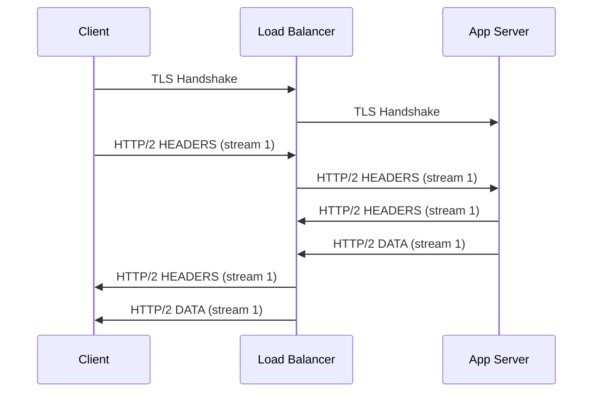
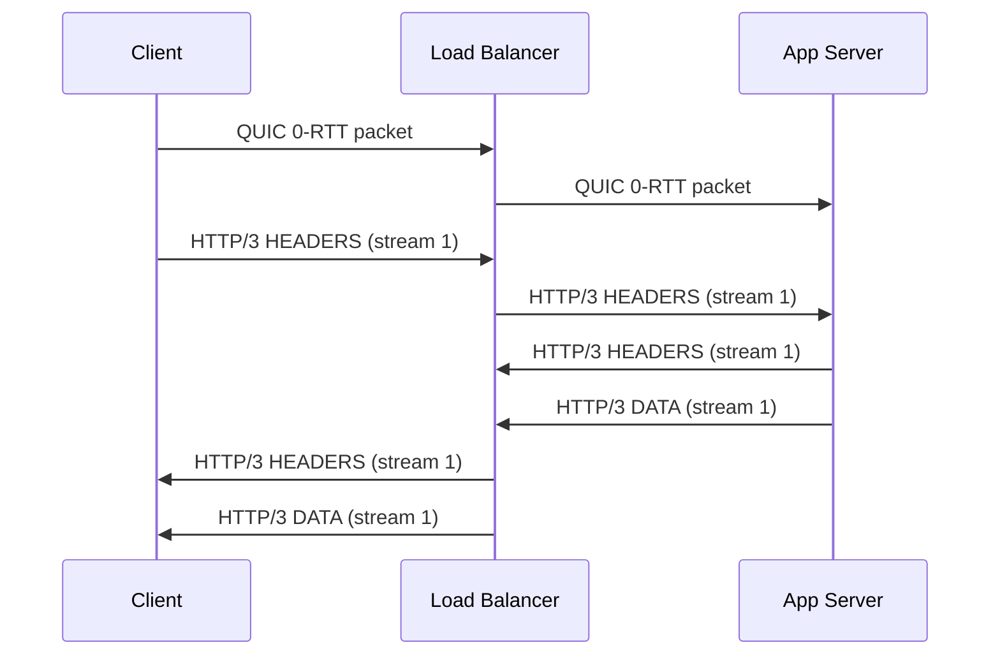

<!-- Generated by Groq via GitHub Actions -->
<!-- Topic ID: T005 -->
<!-- Category: Core Backend Fundamentals -->
<!-- Generated at UTC: 2026-09-24T15:15:22.300841+00:00 -->

# HTTP/1.1 vs HTTP/2 vs HTTP/3

## 1. What problem does this solve?

| Problem | Why it matters | Consequence of ignoring it | Where it shows up in real back‑ends |
|---------|----------------|----------------------------|-------------------------------------|
| **Head‑of‑line (HoL) blocking** | A single slow request can stall all others on the same TCP connection. | Increased latency, poor user experience, wasted bandwidth. | High‑traffic APIs, CDN edge servers, micro‑service gateways. |
| **Inefficient use of network resources** | HTTP/1.1 uses one request per connection (or limited pipelining) → many TCP handshakes, high RTT overhead. | More sockets, higher CPU, higher memory per connection. | Load‑balanced web servers, reverse proxies, API gateways. |
| **Security & modern transport** | HTTP/2 requires TLS, but HTTP/3 moves to QUIC (UDP + TLS 1.3) → better congestion control, 0‑RTT, multiplexing. | Vulnerable to downgrade attacks, higher latency on mobile networks. | Edge services, mobile back‑ends, AI inference endpoints. |
| **Scalability under load** | Each connection consumes a thread or event loop slot; HoL limits throughput. | Bottlenecks at 1k‑10k concurrent users. | Cloud‑native services, serverless functions, real‑time analytics. |

If a backend continues to use only HTTP/1.1, it will suffer from:

- **High latency** on slow links (mobile, satellite).
- **Limited concurrency** per connection → more sockets → higher OS limits.
- **Increased TLS handshake overhead** (especially if TLS is mandatory).

In production, you’ll see these symptoms as slow page loads, high error rates, and resource exhaustion on the load balancer or application server.

---

## 2. Mental model

### Analogy: The Highway

| Layer | Analogy | Real‑world counterpart |
|-------|---------|------------------------|
| **HTTP/1.1** | A single‑lane road where cars (requests) must wait their turn. | Classic TCP + HTTP/1.1. |
| **HTTP/2** | A multi‑lane highway with traffic lights that allow cars to overtake each other (multiplexing). | TCP + HTTP/2, streams share the same connection. |
| **HTTP/3** | A hyperloop tube that runs on a different track (UDP) and can send cars in separate pods that don’t block each other, even if one pod stalls. | QUIC + HTTP/3, built on UDP + TLS 1.3. |

**Key takeaway:**  
- **Multiplexing** lets many logical streams share one physical connection.  
- **QUIC** removes the TCP handshake, adds 0‑RTT, and improves congestion control.

---

## 3. Deep explanation

### Internals

| Protocol | Transport | TLS | Multiplexing | Flow control | Header compression | Connection establishment |
|----------|-----------|-----|--------------|--------------|--------------------|---------------------------|
| **HTTP/1.1** | TCP | Optional (but required for most public APIs) | None (pipelining is rarely used) | Per‑connection | None | TCP 3‑way handshake + TLS handshake |
| **HTTP/2** | TCP | Mandatory (RFC 7540) | Yes (streams) | Per‑connection & per‑stream | HPACK | Same as HTTP/1.1 but with SETTINGS exchange |
| **HTTP/3** | UDP (QUIC) | Mandatory (TLS 1.3) | Yes (streams) | Per‑connection & per‑stream | QPACK | QUIC handshake (0‑RTT, 1‑RTT) |

#### Important terminology

- **Stream** – logical channel inside a connection.
- **Frame** – smallest unit of data in HTTP/2/3 (e.g., HEADERS, DATA).
- **Settings** – control parameters negotiated at connection start.
- **QPACK** – header compression for HTTP/3 (similar to HPACK but designed for QUIC).
- **Connection migration** – QUIC can keep the same session across IP changes (mobile handover).

#### Trade‑offs

| Feature | HTTP/1.1 | HTTP/2 | HTTP/3 |
|---------|----------|--------|--------|
| **Latency** | High (TCP + TLS per request) | Lower (multiplexing, single TLS) | Lowest (0‑RTT, faster congestion control) |
| **Complexity** | Simple | Medium (streaming, flow control) | High (QUIC, UDP, 0‑RTT) |
| **Browser support** | Universal | Universal | Modern browsers only (Chrome 67+, Firefox 61+, Safari 14+) |
| **Server support** | Universal | Universal | Node 16+, Nginx 1.19+, Envoy 1.18+ |
| **Firewall friendliness** | TCP 80/443 | TCP 80/443 | UDP 443 (may be blocked) |

#### Failure modes & limitations

- **HTTP/1.1**: HoL blocking, many connections → OS limits, TLS handshake overhead.
- **HTTP/2**: Requires TLS; if a stream stalls, it can block others if flow control limits are hit. QUIC’s 0‑RTT can fail if the server does not support it.
- **HTTP/3**: UDP may be blocked by strict firewalls; QUIC requires more CPU for packet encryption/decryption; header compression can be vulnerable to CRIME‑like attacks if not mitigated.

#### Where it fits in a backend architecture

```
┌───────────────────────┐
│   Client (Browser)    │
└───────┬───────────────┘
        │ HTTP/1.1/2/3
        ▼
┌───────────────────────┐
│   Load Balancer / CDN │
└───────┬───────────────┘
        │ TLS termination
        ▼
┌───────────────────────┐
│   Application Server  │
│   (Node.js / FastAPI) │
└───────┬───────────────┘
        │
        ▼
┌───────────────────────┐
│   Database / Cache    │
└───────────────────────┘
```

The load balancer often terminates TLS and may upgrade to HTTP/2 or HTTP/3 before forwarding to the app server. The app server must support the same protocol to avoid protocol downgrade.

---

## 4. How it works

### Step‑by‑step flow for a typical request

1. **Client** resolves DNS → gets IP.
2. **Client** initiates TLS handshake (or QUIC handshake for HTTP/3).
3. **Client** sends an HTTP request frame (HEADERS + optional DATA).
4. **Server** parses frames, processes request, writes response frames.
5. **Server** sends response frames back over the same connection.
6. **Client** reuses the connection for subsequent requests (multiplexing).

#### Mermaid diagram (HTTP/2 request flow)



#### Mermaid diagram (HTTP/3 QUIC flow)



---

## 5. Practical implementation

### Node.js HTTP/1.1 (classic)

```ts
// http1.ts
import http from 'http';

const server = http.createServer((req, res) => {
  res.writeHead(200, { 'Content-Type': 'text/plain' });
  res.end('Hello HTTP/1.1\n');
});

server.listen(8080, () => console.log('HTTP/1.1 server listening on 8080'));
```

### Node.js HTTP/2

```ts
// http2.ts
import http2 from 'http2';
import fs from 'fs';

const server = http2.createSecureServer({
  key: fs.readFileSync('./certs/key.pem'),
  cert: fs.readFileSync('./certs/cert.pem')
});

server.on('stream', (stream, headers) => {
  stream.respond({
    'content-type': 'text/plain',
    ':status': 200
  });
  stream.end('Hello HTTP/2\n');
});

server.listen(8443, () => console.log('HTTP/2 server listening on 8443'));
```

### Node.js HTTP/3 (QUIC) – using `@quic/server` (experimental)

```ts
// http3.ts
import { createServer } from '@quic/server';
import fs from 'fs';

const server = createServer({
  key: fs.readFileSync('./certs/key.pem'),
  cert: fs.readFileSync('./certs/cert.pem')
});

server.on('stream', (stream, headers) => {
  stream.respond({
    'content-type': 'text/plain',
    ':status': 200
  });
  stream.end('Hello HTTP/3\n');
});

server.listen(8444, () => console.log('HTTP/3 server listening on 8444'));
```

> **Tip:** Use `node --experimental-quic` flag to enable QUIC in Node 16+.

### Using Next.js with HTTP/2

```ts
// next.config.js
module.exports = {
  // Next.js automatically serves HTTP/2 when using `next start` behind a
  // reverse proxy that terminates TLS (e.g., Nginx, Cloudflare).
  // No code changes needed.
};
```

### Dockerfile for HTTP/2

```dockerfile
# Dockerfile
FROM node:20-alpine
WORKDIR /app
COPY package*.json ./
RUN npm ci
COPY . .
EXPOSE 8443
CMD ["node", "http2.js"]
```

---

## 6. Production considerations

| Concern | HTTP/1.1 | HTTP/2 | HTTP/3 |
|---------|----------|--------|--------|
| **Scalability** | Limited by one request per connection → many sockets. | Many streams per connection → fewer sockets, lower OS limits. | Same as HTTP/2 but with better congestion control. |
| **Reliability** | HoL blocking can cause cascading delays. | Stream flow control mitigates but still susceptible to slow streams. | QUIC’s connection migration and 0‑RTT improve resilience on mobile. |
| **Security** | TLS required for public APIs; vulnerable to downgrade. | Mandatory TLS, better header compression (HPACK) mitigated by HPACK. | TLS 1.3 + QPACK; 0‑RTT requires careful replay protection. |
| **Observability** | Limited metrics (per‑connection). | Stream‑level metrics (latency, bytes per stream). | Same as HTTP/2 + QUIC metrics (packet loss, RTT). |
| **Performance** | High RTT, many handshakes. | Reduced RTT, multiplexing. | Lowest RTT, 0‑RTT, faster congestion control. |
| **Error handling** | Connection reset on any error. | Stream reset without tearing connection. | Same as HTTP/2 but with QUIC packet loss handling. |
| **Resource usage** | High CPU for TLS per request. | Shared TLS session, lower CPU. | QUIC uses UDP, may increase CPU for packet encryption. |
| **Operational concerns** | Simple to deploy. | Need TLS certs, support for HTTP/2 in proxies. | Need QUIC support in proxies, firewalls may block UDP 443. |
| **Failure recovery** | Reconnect per request. | Reuse connection, but stream reset may require retry. | QUIC can recover from packet loss without full handshake. |
| **Deployment** | `http` or `https` servers. | `http2.createSecureServer`. | `@quic/server` or `node --experimental-quic`. |

**Firewall note:** Some corporate firewalls block UDP 443. In such environments, HTTP/3 may be unavailable.

---

## 7. Common mistakes

| Mistake | Why it’s problematic |
|---------|----------------------|
| **Using HTTP/1.1 for high‑latency mobile traffic** | HoL blocking amplifies latency, leading to slow page loads. |
| **Ignoring TLS on HTTP/2** | HTTP/2 requires TLS; without it, browsers downgrade to HTTP/1.1. |
| **Over‑using HTTP/2 streams without flow control** | A single slow stream can block others if the server’s flow‑control window is exhausted. |
| **Assuming HTTP/3 works on all proxies** | Many proxies still terminate at HTTP/1.1; QUIC may be dropped. |
| **Not handling 0‑RTT replay attacks** | 0‑RTT data can be replayed; servers must validate session tickets. |
| **Using `http2` module without setting `maxConcurrentStreams`** | Default is 100; if you need more, adjust to avoid stream limits. |
| **Neglecting header compression attacks** | HPACK/ QPACK can be vulnerable to CRIME‑like attacks if not mitigated. |

---

## 8. Senior engineer perspective

### Architecture decisions

- **Protocol choice per service**: Use HTTP/3 for public APIs that serve mobile clients; keep HTTP/2 for internal micro‑services where UDP may be blocked.
- **TLS termination strategy**: Terminate TLS at the load balancer to offload CPU from app servers; ensure the balancer supports HTTP/3.
- **Connection pooling**: For high‑throughput services, maintain a pool of HTTP/2 connections to downstream services to avoid per‑request handshakes.

### Trade‑offs

- **CPU vs. latency**: QUIC uses more CPU for encryption but reduces RTT; evaluate on CPU‑constrained environments (e.g., serverless).
- **Firewall friendliness**: HTTP/3 may be blocked; fallback to HTTP/2 is essential.
- **Observability complexity**: Need to instrument QUIC metrics (packet loss, RTT) in addition to HTTP metrics.

### Bottlenecks

- **Flow‑control windows**: In HTTP/2, the server’s `WINDOW_UPDATE` frames can become a bottleneck if not tuned.
- **QUIC packet loss**: High loss environments (satellite) can cause retransmissions; tune `max_ack_delay`.

### Failure scenarios

- **TLS downgrade**: Ensure HSTS + TLS 1.3 to prevent downgrade to HTTP/1.1.
- **QUIC blocked**: Detect UDP 443 blockage and fallback to HTTP/2 automatically.

### Monitoring

- **HTTP/2**: Stream latency, bytes per stream, flow‑control window usage.
- **HTTP/3**: QUIC RTT, packet loss, 0‑RTT success rate.

### Cost/performance

- **CPU cost**: QUIC may increase CPU usage by ~10–20% on high‑traffic nodes; weigh against latency savings.
- **Network cost**: Multiplexing reduces total bytes sent (no duplicate headers).

### When NOT to use

- **Legacy clients**: If your user base includes older browsers (IE11), stick to HTTP/1.1.
- **Strict firewall environments**: If UDP 443 is blocked, avoid HTTP/3.
- **Low‑traffic services**: The overhead of QUIC may not justify the benefit.

---

## 9. Interview questions

| Level | Question | Answer points |
|-------|----------|---------------|
| **Beginner** | What is head‑of‑line blocking and why does it matter? | HoL: one slow request stalls others on same TCP connection → increased latency, poor concurrency. |
| | How does HTTP/2 solve the head‑of‑line problem? | Multiplexing streams over one connection; each stream has its own flow control. |
| **Senior** | Explain the differences between HPACK and QPACK. | HPACK: header compression for HTTP/2; QPACK: designed for QUIC, allows parallel decoding, mitigates head‑of‑line. |
| | What are the main security considerations when using HTTP/3? | TLS 1.3 mandatory, 0‑RTT replay protection, QUIC’s connection migration, header compression attacks. |
| **Scenario** | A client reports high latency on a mobile network. You suspect HTTP/1.1 is the culprit. How would you diagnose and fix the issue? | 1. Capture traffic (Wireshark) → see many TCP handshakes. 2. Enable HTTP/2 on load balancer. 3. Verify TLS termination. 4. Test with QUIC if mobile supports. 5. Monitor stream latency. |

---

## 10. Hands‑on task

**Build a simple Node.js micro‑service that exposes two endpoints:**

1. `/fast` – returns a static string quickly.
2. `/slow` – sleeps for 5 s before responding.

**Experiment:**

- Run the service with HTTP/1.1, HTTP/2, and HTTP/3.
- Use `wrk` or `ab` to send 100 concurrent requests to both endpoints.
- Measure total time, per‑request latency, and CPU usage.
- Observe how HTTP/2 and HTTP/3 mitigate the slow endpoint’s impact on the fast one.

**Deliverables:**

- `http1.ts`, `http2.ts`, `http3.ts` files.
- A `README.md` explaining how to run each server and the benchmarking commands.
- A short report (max 200 words) summarizing your findings.

---

## 11. Quick revision

- **HTTP/1.1** – single request per connection, HoL blocking, TLS optional.
- **HTTP/2** – multiplexed streams, mandatory TLS, HPACK, flow control.
- **HTTP/3** – QUIC (UDP + TLS 1.3), 0‑RTT, QPACK, connection migration.
- **Multiplexing** eliminates HoL but introduces stream flow control.
- **TLS** is mandatory for HTTP/2/3; HTTP/1.1 can be plain but insecure.
- **QUIC** improves latency on mobile, but may be blocked by firewalls.
- **Header compression**: HPACK (HTTP/2) vs QPACK (HTTP/3).
- **Server‑side**: Node `http2` module; HTTP/3 via `@quic/server` (experimental).
- **Observability**: track stream latency, flow‑control windows, QUIC RTT/loss.
- **Common pitfalls**: ignoring flow‑control, using HTTP/1.1 on mobile, not handling 0‑RTT replay.

---

## 12. References

- [RFC 7230 – HTTP/1.1](https://datatracker.ietf.org/doc/html/rfc7230)
- [RFC 7540 – HTTP/2](https://datatracker.ietf.org/doc/html/rfc7540)
- [RFC 9000 – QUIC](https://datatracker.ietf.org/doc/html/rfc9000)
- [Node.js HTTP/2 documentation](https://nodejs.org/api/http2.html)
- [Node.js QUIC experimental](https://nodejs.org/api/quic.html)
- [Next.js HTTP/2 support](https://nextjs.org/docs/advanced-features/http2)
- [Mozilla HTTP/2 guide](https://developer.mozilla.org/en-US/docs/Web/HTTP/HTTP_2)
- [Google QUIC implementation](https://quic-go.golang.org/)
- [Cloudflare QUIC blog](https://blog.cloudflare.com/quic-what-is-it-and-why-does-it-matter/)
