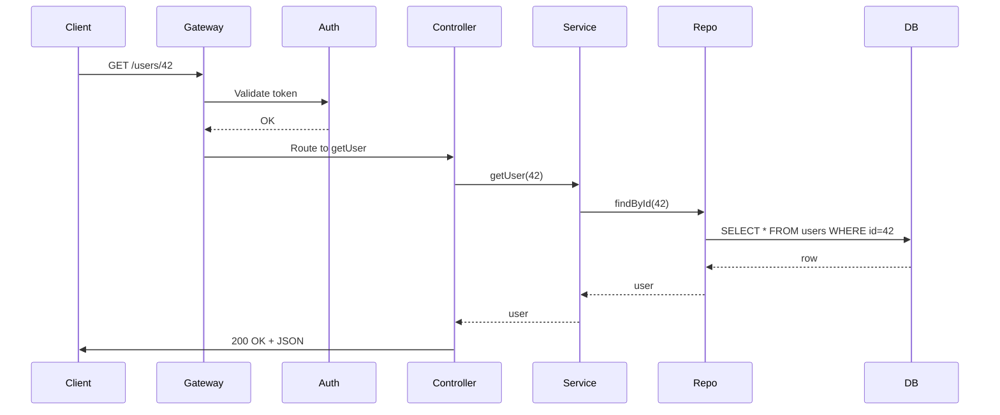

<!-- Generated by Groq via GitHub Actions -->
<!-- Topic ID: T006 -->
<!-- Category: Core Backend Fundamentals -->
<!-- Generated at UTC: 2026-09-24T15:15:22.300841+00:00 -->

# REST API Design

## 1. What problem does this solve?

| Problem | Why it matters | Consequence of not using it | Real‑world example |
|---------|----------------|-----------------------------|--------------------|
| **Decoupling client & server** | Enables independent evolution of front‑end and back‑end. | Tight coupling → every change forces client updates. | A mobile app that consumes a web API. |
| **Statelessness** | Allows horizontal scaling and easier load balancing. | Stateful endpoints require sticky sessions or shared state. | Microservice that handles user sessions. |
| **Resource‑oriented communication** | Provides a uniform interface that clients can cache, version, and discover. | Arbitrary RPC calls → hard to cache, version, or document. | E‑commerce product catalog. |
| **Interoperability** | Standard HTTP verbs & status codes let any HTTP client (browser, CLI, IoT) interact. | Custom protocols → limited tooling, harder onboarding. | Public API for a weather service. |

If a backend does **not** follow REST principles, developers often end up with:

* Hard‑to‑scale monoliths that need session affinity.
* APIs that are difficult to document and test.
* Clients that break when the server changes.

RESTful design is the backbone of most modern web services: Twitter, GitHub, Stripe, and many internal microservices use it.

---

## 2. Mental model

### Analogy – The Library

| REST Concept | Library Analogy |
|--------------|-----------------|
| **Resource** | A book (identified by ISBN). |
| **URI** | The book’s shelf location (`/books/123`). |
| **HTTP Verb** | The librarian’s action: `GET` (read), `POST` (add), `PUT` (replace), `DELETE` (remove). |
| **Representation** | The book’s format (PDF, EPUB, HTML). |
| **Statelessness** | Every request contains all the information the librarian needs; no memory of previous visits. |

### Engineering model

* **Resources** are the domain entities exposed by the API (users, orders, posts).
* **URIs** uniquely identify each resource or collection.
* **HTTP verbs** map to CRUD operations, but also convey intent (safe, idempotent, cacheable).
* **Representations** are JSON, XML, or other media types; the API negotiates which one the client wants.
* **Statelessness** means the server does not keep session data between requests; everything is in the request/response.

---

## 3. Deep explanation

### Internals

1. **HTTP/1.1 or HTTP/2** – the transport layer; supports pipelining, multiplexing, and header compression.
2. **Status codes** – 2xx success, 3xx redirection, 4xx client error, 5xx server error.
3. **Headers** – `Content-Type`, `Accept`, `ETag`, `Cache-Control`, `Authorization`, etc.
4. **Middleware pipeline** – authentication, validation, logging, rate limiting, etc.
5. **Routing** – maps URI + verb to controller logic.

### Important terminology

| Term | Meaning |
|------|---------|
| **Resource** | An entity that can be identified by a URI. |
| **Representation** | The serialized form of a resource. |
| **Safe** | Operations that do not modify state (`GET`, `HEAD`). |
| **Idempotent** | Operations that can be repeated without side effects (`PUT`, `DELETE`). |
| **Cacheable** | Responses that can be stored and reused (`GET` with proper headers). |
| **Hypermedia (HATEOAS)** | API responses that include links to related actions. |
| **Versioning** | Strategies: URI (`/v1/`), header, media type. |
| **Content negotiation** | `Accept` header determines representation. |

### Trade‑offs

| Decision | Pros | Cons |
|----------|------|------|
| **URI versioning** | Simple, explicit | URL churn, duplicate endpoints |
| **Header versioning** | Keeps URI clean | Harder to test, less discoverable |
| **Hypermedia** | Discoverability | Adds complexity, not widely adopted |
| **Stateless vs stateful** | Easier scaling | Cannot maintain long‑running conversations |

### Failure modes

* **Missing idempotency** → duplicate side effects on retries.
* **Over‑exposed endpoints** → security holes.
* **Improper caching** → stale data.
* **Large payloads** → slow responses, high bandwidth.

### Limitations

* Not ideal for highly interactive, real‑time workflows (WebSockets, gRPC).
* Complex business processes may require multiple round‑trips or stateful orchestration.

### Where it fits

* **API Gateway** – routes requests to microservices.
* **Service Mesh** – handles inter‑service communication.
* **Database Layer** – CRUD operations are translated into SQL/NoSQL queries.
* **Cache Layer** – Redis or CDN for GET responses.

### Interaction with related concepts

* **Authentication** – JWT, OAuth2, API keys.
* **Rate limiting** – per‑IP or per‑user quotas.
* **Monitoring** – Prometheus metrics, OpenTelemetry traces.
* **CI/CD** – contract tests (e.g., Pact) to ensure API stability.

---

## 4. How it works

1. **Client** sends an HTTP request (`GET /users/42`).
2. **API Gateway / Load Balancer** forwards to an instance of the service.
3. **Middleware** authenticates, authorizes, validates, logs.
4. **Controller** interprets the request, calls the **Service** layer.
5. **Service** contains business logic, may call **Repository**.
6. **Repository** performs database operations (PostgreSQL, MongoDB).
7. **Result** is returned to the controller, serialized to JSON.
8. **Response** is sent back to the client with appropriate status code and headers.



---

## 5. Practical implementation

Below is a minimal, production‑ready REST API using **Fastify** (fast, low‑overhead) and **TypeScript**.  
It demonstrates routing, validation, error handling, pagination, and a simple in‑memory store.

```ts
// src/server.ts
import Fastify from 'fastify';
import { z } from 'zod';
import { UserService } from './services/userService';

const app = Fastify({
  logger: true,
  ignoreTrailingSlash: true,
});

const userSchema = z.object({
  id: z.string().uuid(),
  name: z.string().min(1),
  email: z.string().email(),
});

const userCreateSchema = z.object({
  name: z.string().min(1),
  email: z.string().email(),
});

const userService = new UserService();

/**
 * GET /users
 * Query: page, limit
 */
app.get('/users', async (req, reply) => {
  const { page = 1, limit = 10 } = req.query as any;
  const users = await userService.list({ page, limit });
  reply.code(200).send(users);
});

/**
 * GET /users/:id
 */
app.get('/users/:id', async (req, reply) => {
  const { id } = req.params as any;
  const user = await userService.get(id);
  if (!user) return reply.code(404).send({ error: 'Not found' });
  reply.code(200).send(user);
});

/**
 * POST /users
 */
app.post('/users', async (req, reply) => {
  const body = userCreateSchema.parse(req.body);
  const user = await userService.create(body);
  reply.code(201).send(user);
});

/**
 * PUT /users/:id
 */
app.put('/users/:id', async (req, reply) => {
  const { id } = req.params as any;
  const body = userCreateSchema.parse(req.body);
  const user = await userService.update(id, body);
  if (!user) return reply.code(404).send({ error: 'Not found' });
  reply.code(200).send(user);
});

/**
 * DELETE /users/:id
 */
app.delete('/users/:id', async (req, reply) => {
  const { id } = req.params as any;
  const ok = await userService.delete(id);
  if (!ok) return reply.code(404).send({ error: 'Not found' });
  reply.code(204).send();
});

const start = async () => {
  try {
    await app.listen({ port: 3000, host: '0.0.0.0' });
    console.log('Server listening on http://localhost:3000');
  } catch (err) {
    app.log.error(err);
    process.exit(1);
  }
};
start();
```

```ts
// src/services/userService.ts
import { v4 as uuidv4 } from 'uuid';
import { z } from 'zod';

export type User = z.infer<typeof userSchema>;
const userSchema = z.object({
  id: z.string().uuid(),
  name: z.string(),
  email: z.string().email(),
});

export class UserService {
  private store = new Map<string, User>();

  async list({ page, limit }: { page: number; limit: number }) {
    const all = Array.from(this.store.values());
    const start = (page - 1) * limit;
    return all.slice(start, start + limit);
  }

  async get(id: string) {
    return this.store.get(id) ?? null;
  }

  async create({ name, email }: { name: string; email: string }) {
    const id = uuidv4();
    const user: User = { id, name, email };
    this.store.set(id, user);
    return user;
  }

  async update(id: string, { name, email }: { name: string; email: string }) {
    if (!this.store.has(id)) return null;
    const user: User = { id, name, email };
    this.store.set(id, user);
    return user;
  }

  async delete(id: string) {
    return this.store.delete(id);
  }
}
```

> **Why this example is realistic**  
> * Uses Fastify’s built‑in schema validation (via `zod`) for request bodies.  
> * Implements proper status codes (201, 204, 404).  
> * Keeps the service stateless – the in‑memory store is just for demo; in prod you’d plug in PostgreSQL or MongoDB.  
> * Demonstrates pagination and error handling.

---

## 6. Production considerations

| Concern | What to do | Why |
|---------|------------|-----|
| **Scalability** | Keep services stateless, use a load balancer, horizontally scale containers. | Enables auto‑scaling and zero‑downtime deployments. |
| **Reliability** | Circuit breakers, retries, graceful degradation, health checks. | Prevents cascading failures. |
| **Security** | JWT/OAuth2, input validation, rate limiting, CORS, CSRF tokens, HTTPS only. | Protects data and prevents abuse. |
| **Observability** | Structured logging, Prometheus metrics, OpenTelemetry traces, error tracking (Sentry). | Enables rapid incident response. |
| **Performance** | HTTP/2, gzip/deflate, connection pooling, async I/O, cache headers, CDN for static assets. | Reduces latency and bandwidth. |
| **Error handling** | Return consistent error payloads, use `application/problem+json`, avoid leaking stack traces. | Improves client debugging and security. |
| **Resource usage** | Monitor CPU/memory, use connection pools, avoid memory leaks, use async/await properly. | Keeps cost predictable. |
| **Operational** | CI/CD pipelines, automated tests (unit, integration, contract), blue‑green or canary deployments. | Minimizes downtime. |
| **Failure recovery** | Dead‑letter queues for failed messages, automated retries, fallback endpoints. | Ensures eventual consistency. |
| **Deployment** | Docker images, Kubernetes deployments, Helm charts, versioned API gateways. | Simplifies rollouts and rollback. |

---

## 7. Common mistakes

| Mistake | Why it’s problematic |
|---------|----------------------|
| **Using GET for state changes** | Violates idempotency, breaks caching, can be accidentally triggered by crawlers. |
| **Ignoring status codes** | Clients cannot differentiate success vs error, leading to silent failures. |
| **No pagination on collections** | Huge responses overload clients and servers, cause timeouts. |
| **No input validation** | Security holes (SQL injection, XSS), runtime errors. |
| **No authentication/authorization** | Exposes sensitive data. |
| **Hard‑coding URLs** | Makes versioning and environment switching difficult. |
| **Not handling 429 (rate limit)** | Clients get ambiguous errors, may retry endlessly. |
| **Over‑exposing internal IDs** | Exposes database internals, can be used for enumeration attacks. |
| **No caching headers** | Missed performance gains, stale data. |
| **No contract tests** | API changes break downstream services silently. |

---

## 8. Senior engineer perspective

### What changes at scale?

| Decision | Considerations | Trade‑offs |
|----------|----------------|------------|
| **API Gateway vs Service Mesh** | Gateway centralizes auth, rate limiting; Mesh handles inter‑service traffic. | Gateway can become a single point of failure; Mesh adds overhead. |
| **Versioning strategy** | URI (`/v1/`) vs header. | URI is simple but duplicates endpoints; header keeps URLs clean but harder to test. |
| **Contract enforcement** | OpenAPI specs, Pact tests, CI checks. | Adds development overhead but prevents breaking changes. |
| **Caching** | In‑memory, Redis, CDN. | Cache invalidation complexity vs performance gains. |
| **Rate limiting** | Per‑IP, per‑user, per‑tenant. | Requires distributed store (Redis) to coordinate across instances. |
| **Observability** | Distributed tracing (Jaeger), metrics aggregation. | Increases latency, requires instrumentation. |
| **Database sharding** | Horizontal partitioning of user data. | Adds complexity to queries and transactions. |
| **Security** | OAuth2 flows, PKCE for mobile, JWT rotation. | More moving parts, need for key rotation strategy. |

### Bottlenecks

* **Database** – slow queries, lack of indexes, connection pool exhaustion.  
* **Serialization** – JSON.stringify on large payloads.  
* **Network** – latency between services, especially in multi‑region setups.  

### Failure scenarios

* **Partial failures** – one microservice down → graceful degradation.  
* **Network partitions** – use retries with exponential backoff.  
* **Data inconsistency** – eventual consistency vs strong consistency trade‑off.  

### Monitoring & Cost

* **Metrics**: request latency, error rates, throughput.  
* **Alerts**: high error rate, slow response times.  
* **Cost**: compute (K8s nodes), storage (DB, cache), network egress.  
* **Optimization**: auto‑scaling, spot instances, request batching.  

### When NOT to use REST

* **Real‑time, bidirectional communication** – WebSockets or gRPC.  
* **Complex workflows** – consider saga patterns or workflow engines.  
* **Heavy binary payloads** – use multipart or dedicated file services.  

---

## 9. Interview questions

| # | Question | Answer points |
|---|----------|---------------|
| 1 | *Beginner* – What HTTP status code would you return for a successful `GET` request? | 200 OK; explain that 200 indicates success and body contains representation. |
| 2 | *Beginner* – Why should a `DELETE` endpoint be idempotent? | Repeated deletes produce the same result (resource gone); prevents unintended side effects. |
| 3 | *Senior* – How would you design a versioning strategy for a public API that is already in production? | Discuss URI vs header, deprecation policy, contract tests, backward compatibility, and migration guides. |
| 4 | *Senior* – Explain how you would implement rate limiting in a distributed microservice environment. | Use a shared store (Redis), token bucket or leaky bucket algorithm, per‑IP or per‑user keys, handle burst, integrate with API gateway. |
| 5 | *Scenario* – A client receives a 500 error on a `POST /orders` request. The logs show a `null` pointer in the service layer. What steps would you take to debug and fix this? | 1. Reproduce locally with same payload. 2. Add logging around the failing line. 3. Check for missing validation or null checks. 4. Add unit test for edge case. 5. Deploy fix, monitor. |

---

## 10. Hands‑on task

**Build a “Todo” REST API**

1. Create a new Fastify project (or use the repo’s `src/server.ts`).
2. Implement CRUD endpoints for `/todos` with the following fields: `id`, `title`, `completed`, `createdAt`.
3. Add pagination to `GET /todos`.
4. Validate request bodies with `zod`.
5. Return proper status codes (`201`, `204`, `404`, `400`).
6. Write a simple integration test using `tap` or `jest` that covers:
   * Creating a todo.
   * Retrieving it.
   * Updating it.
   * Deleting it.
7. Run the API locally, test with Postman or curl.

**Bonus**: Add a Redis cache for `GET /todos/:id` and invalidate on update/delete.

---

## 11. Quick revision

- REST = Resource‑Oriented, stateless, HTTP‑based API.
- **Resources** identified by URIs; **verbs** map to CRUD.
- **Safe** (`GET`, `HEAD`), **idempotent** (`PUT`, `DELETE`), **cacheable** (`GET`).
- Use **status codes**: 200, 201, 204, 400, 401, 403, 404, 429, 500.
- Validate input (`zod`, Joi) and output; never trust client data.
- Implement **pagination** (`page`, `limit`) for collections.
- **Versioning**: URI (`/v1/`) or header; keep old versions alive.
- **Security**: HTTPS, auth (JWT/OAuth2), rate limiting, CORS.
- **Observability**: structured logs, metrics, traces.
- **Error handling**: consistent JSON payload, avoid stack traces.
- **Scalability**: stateless services, horizontal scaling, caching.

---

## 12. References

- [RFC 7231 – Hypertext Transfer Protocol (HTTP/1.1): Semantics and Content](https://datatracker.ietf.org/doc/html/rfc7231)
- [Fastify Docs – Validation & Schema](https://www.fastify.io/docs/latest/Validation-and-Schema/)
- [OpenAPI Specification](https://swagger.io/specification/)
- [OWASP API Security Top 10](https://owasp.org/www-project-api-security/)
- [Prometheus – HTTP Exporter](https://prometheus.io/docs/instrumenting/exporters/)
- [OpenTelemetry – Node.js](https://opentelemetry.io/docs/instrumentation/node/)
- [Zod – TypeScript Schema Validation](https://github.com/colinhacks/zod)
- [JWT Handbook – RFC 7519](https://datatracker.ietf.org/doc/html/rfc7519)
