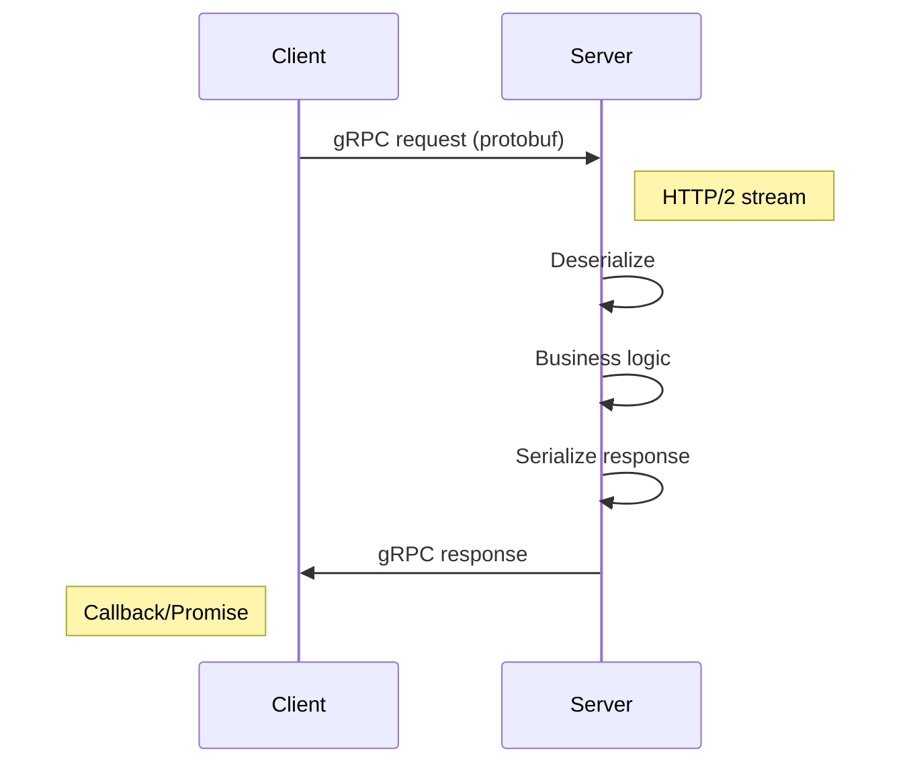

<!-- Generated by Groq via GitHub Actions -->
<!-- Topic ID: T007 -->
<!-- Category: Core Backend Fundamentals -->
<!-- Generated at UTC: 2026-09-24T15:16:48.419228+00:00 -->

# RPC / gRPC

## 1. What problem does this solve?

| Problem | Why it matters | Consequence if ignored | Real‑world appearance |
|---------|----------------|------------------------|-----------------------|
| **Inefficient inter‑service communication** | Microservices often call each other thousands of times per second. Text‑based HTTP/REST adds JSON parsing overhead and larger payloads. | Higher latency, more CPU, higher bandwidth costs. | High‑traffic e‑commerce sites, real‑time analytics pipelines. |
| **Lack of a strict contract** | Without a formal schema, services evolve independently, leading to breaking changes. | Clients crash, data corruption, hard‑to‑debug bugs. | Payment gateways, inventory systems. |
| **Difficulty with streaming** | Many workloads (chat, telemetry, AI inference) need continuous data flow. | Re‑implement custom websockets or long‑polling, more code. | Live video analytics, AI model inference pipelines. |
| **Hard to enforce security & observability** | HTTP/REST can be wrapped in TLS, but gRPC provides built‑in mTLS and interceptors for tracing. | Inconsistent security, missing metrics. | Cloud‑native services in Kubernetes. |

gRPC (Google Remote Procedure Call) addresses all of the above by providing a **binary, type‑safe, streaming RPC framework** that runs over HTTP/2, with automatic code generation and built‑in observability hooks.

---

## 2. Mental model

### Analogy  
Imagine you’re ordering a custom pizza.  
* **REST**: You write a long email describing every topping, size, and crust. The kitchen has to parse the email, guess your intent, and may misinterpret a typo.  
* **gRPC**: You hand the kitchen a pre‑printed form (the protobuf schema). The form is concise, typed, and the kitchen can instantly validate it. If you change the form later, the kitchen knows exactly which fields changed.

### Engineering model  
1. **Service definition** – a `.proto` file describes services, methods, and message types.  
2. **Code generation** – tooling turns the proto into language‑specific stubs.  
3. **Client ↔ Server** – the client calls a method; the server implements it.  
4. **Transport** – HTTP/2 multiplexes many calls over a single TCP connection.  
5. **Serialization** – Protocol Buffers (protobuf) encode messages in a compact binary format.  
6. **Streaming** – unary, server‑streaming, client‑streaming, or bidirectional streaming are all first‑class citizens.

---

## 3. Deep explanation

### Internals
- **HTTP/2**: multiplexed streams, header compression, server push.  
- **Protobuf**: schema‑driven binary serialization, forward/backward compatibility.  
- **gRPC Core**: handles connection pooling, keepalive, retries, and status codes.  
- **Interceptors**: middleware for logging, auth, metrics, tracing.  

### Important terminology
| Term | Meaning |
|------|---------|
| **Service** | Collection of RPC methods. |
| **Method** | Single RPC operation (unary or streaming). |
| **Message** | Protobuf data structure. |
| **Client** | Code that initiates RPC calls. |
| **Server** | Code that implements RPC methods. |
| **Channel** | Underlying connection (HTTP/2). |
| **Codec** | Serializer/deserializer (protobuf). |
| **Status** | gRPC error codes (e.g., `UNAVAILABLE`, `INVALID_ARGUMENT`). |

### Trade‑offs
| Aspect | gRPC | REST/HTTP |
|--------|------|-----------|
| **Payload size** | Small (binary) | Larger (JSON) |
| **Latency** | Low (HTTP/2 multiplexing) | Higher (TCP handshake per request) |
| **Streaming** | Native | Requires websockets or SSE |
| **Language support** | 10+ languages, codegen | Any language |
| **Human readability** | Low | High |
| **Browser support** | Limited (requires gRPC‑Web) | Native |

### Failure modes
- **Network partitions** → `UNAVAILABLE` errors.  
- **Version mismatch** → `UNIMPLEMENTED` or `INVALID_ARGUMENT`.  
- **Backpressure** → client or server stalls if not handled.  
- **Keepalive misconfiguration** → idle connections dropped.

### Limitations
- **Not ideal for public APIs** – browsers need gRPC‑Web or fallback to REST.  
- **Requires codegen** – adds a build step.  
- **Binary protocol** – harder to debug without tooling.  

### Where it fits
- **Microservices**: internal service‑to‑service calls.  
- **Event‑driven pipelines**: streaming logs, telemetry.  
- **AI inference**: low‑latency model serving.  
- **Real‑time data**: chat, gaming, IoT.

### Interaction with related concepts
- **Service discovery**: gRPC can use DNS, Consul, or Kubernetes endpoints.  
- **Load balancing**: client‑side round‑robin or server‑side load balancers.  
- **Circuit breakers**: implemented via interceptors or service mesh.  
- **Observability**: OpenTelemetry interceptors for tracing/metrics.  
- **Security**: TLS/mTLS, JWT in metadata, IAM policies.

---

## 4. How it works

1. **Define** a `.proto` file with services and messages.  
2. **Generate** client and server stubs (`protoc --plugin=protoc-gen-ts`).  
3. **Implement** server methods in Node.js.  
4. **Create** a gRPC channel (`grpc.createChannel`).  
5. **Make** a client call (`client.getUser(request, callback)`).  
6. **Transport**: HTTP/2 multiplexes the call over the channel.  
7. **Serialize** request to protobuf binary.  
8. **Server** deserializes, processes, serializes response.  
9. **Client** receives, deserializes, returns to caller.  



---

## 5. Practical implementation

### 1️⃣ `user.proto`

```proto
syntax = "proto3";

package user;

service UserService {
  rpc GetUser (GetUserRequest) returns (User) {}
  rpc CreateUser (CreateUserRequest) returns (User) {}
  rpc ListUsers (ListUsersRequest) returns (stream User) {}
}

message GetUserRequest { string id = 1; }
message CreateUserRequest { string name = 1; string email = 2; }
message ListUsersRequest {}

message User {
  string id = 1;
  string name = 2;
  string email = 3;
  int64 created_at = 4;
}
```

### 2️⃣ Generate TypeScript stubs

```bash
# Install protoc and plugins
npm i -D grpc-tools ts-proto
# Generate
npx grpc_tools_node_protoc \
  --js_out=import_style=commonjs,binary:./src/generated \
  --grpc_out=grpc_js:./src/generated \
  --proto_path=./proto \
  ./proto/user.proto
```

### 3️⃣ Server (`src/server.ts`)

```ts
import * as grpc from '@grpc/grpc-js';
import { UserServiceService, IUserServiceServer } from './generated/user_grpc_pb';
import { User, GetUserRequest, CreateUserRequest } from './generated/user_pb';
import { v4 as uuidv4 } from 'uuid';
import Redis from 'ioredis';

const redis = new Redis(); // default localhost:6379

const users: Record<string, User.AsObject> = {}; // in‑memory fallback

const serverImpl: IUserServiceServer = {
  getUser: (call, callback) => {
    const { id } = call.request.toObject();
    const data = users[id];
    if (!data) {
      return callback({
        code: grpc.status.NOT_FOUND,
        message: 'User not found',
      });
    }
    callback(null, User.fromObject(data));
  },

  createUser: (call, callback) => {
    const { name, email } = call.request.toObject();
    const id = uuidv4();
    const user = new User();
    user.setId(id);
    user.setName(name);
    user.setEmail(email);
    user.setCreatedAt(Date.now());
    users[id] = user.toObject();
    callback(null, user);
  },

  listUsers: (call) => {
    Object.values(users).forEach((u) => {
      call.write(User.fromObject(u));
    });
    call.end();
  },
};

const server = new grpc.Server();
server.addService(UserServiceService, serverImpl);
server.bindAsync('0.0.0.0:50051', grpc.ServerCredentials.createInsecure(), () => {
  console.log('gRPC server listening on 50051');
  server.start();
});
```

> **Key lines**  
> `server.addService` registers the service implementation.  
> `call.write` streams multiple responses.  
> `grpc.status.NOT_FOUND` uses gRPC error codes.

### 4️⃣ Client (`src/client.ts`)

```ts
import * as grpc from '@grpc/grpc-js';
import { UserServiceClient } from './generated/user_grpc_pb';
import { CreateUserRequest, GetUserRequest } from './generated/user_pb';

const client = new UserServiceClient(
  'localhost:50051',
  grpc.credentials.createInsecure()
);

// Unary call
const req = new CreateUserRequest();
req.setName('Alice');
req.setEmail('alice@example.com');

client.createUser(req, (err, user) => {
  if (err) return console.error(err);
  console.log('Created:', user.toObject());

  // Follow‑up unary call
  const getReq = new GetUserRequest();
  getReq.setId(user.getId()!);
  client.getUser(getReq, (err, fetched) => {
    if (err) return console.error(err);
    console.log('Fetched:', fetched.toObject());
  });
});
```

> **Running**  
> ```bash
> ts-node src/server.ts
> ts-node src/client.ts
> ```

---

## 6. Production considerations

| Concern | gRPC‑specific tips |
|---------|--------------------|
| **Scalability** | HTTP/2 multiplexing → fewer TCP connections. Use connection pooling (`grpc.Channel`) and keepalive pings. |
| **Reliability** | Implement retries with exponential backoff. Use `grpc.retry` or interceptors. Health checks (`grpc.health.v1.Health`). |
| **Security** | TLS everywhere. Prefer mTLS with service mesh (Istio, Linkerd). Use JWT or OAuth tokens in metadata. |
| **Observability** | OpenTelemetry interceptors for tracing. Export metrics (latency, error rates). Log request/response headers. |
| **Performance** | Enable gzip compression (`grpc.default_compression_algorithm`). Use server‑side streaming for large datasets. |
| **Error handling** | Map business errors to gRPC status codes. Avoid generic `UNKNOWN`. |
| **Resource usage** | Monitor keepalive timeouts to avoid idle connections. Use `grpc.max_send_message_length` if large payloads. |
| **Operational** | Deploy with Docker/Kubernetes. Use sidecar for TLS termination if needed. Keep proto files versioned in a shared repo. |
| **Failure recovery** | Graceful shutdown (`server.tryShutdown`). Circuit breakers at client side. |
| **Deployment** | Use `grpc-gateway` for REST fallback if external clients need HTTP. |

---

## 7. Common mistakes

| Mistake | Why it hurts |
|---------|--------------|
| **Using gRPC for public browser APIs** | Browsers lack native gRPC support; need gRPC‑Web or REST fallback. |
| **Ignoring streaming semantics** | Treating a stream as a single message leads to buffer overflows or deadlocks. |
| **Hard‑coding proto paths** | Breaks when proto files move; use a shared package. |
| **Not handling `UNAVAILABLE`** | Causes silent failures; implement retries. |
| **Using blocking Node.js calls** | Blocks event loop; use async callbacks/promises. |
| **Over‑serializing data** | Sending unnecessary fields inflates payload; use `optional` fields. |
| **Skipping TLS** | Exposes data in transit; gRPC defaults to insecure in dev only. |

---

## 8. Senior engineer perspective

### Design decisions at scale
- **Service boundaries**: Keep services small, single responsibility.  
- **Versioning strategy**: Prefer additive changes; avoid breaking fields.  
- **Load balancing**: Client‑side round‑robin vs. server‑side LB (Kubernetes Ingress).  
- **Service mesh**: Leverage Istio for mTLS, traffic shaping, retries.  
- **Observability stack**: OpenTelemetry + Jaeger + Prometheus.  
- **Deployment**: Use Helm charts, CI/CD pipelines, canary releases.

### Trade‑offs
- **Complexity vs. performance**: gRPC adds a codegen step but yields lower latency.  
- **Connection limits**: HTTP/2 has a max of 1000 concurrent streams per connection; tune `grpc.max_concurrent_streams`.  
- **Backpressure**: Streaming APIs can overwhelm consumers; use flow control or buffer limits.

### Bottlenecks
- **CPU for serialization**: Protobuf is fast but still CPU‑bound for huge messages.  
- **Memory for keepalive**: Idle connections consume memory; tune keepalive timeouts.  
- **Network egress**: In multi‑region deployments, gRPC traffic can be costly.

### Failure scenarios
- **Partial failures**: One method fails while others succeed; design idempotency.  
- **Deadlocks**: Bidirectional streaming can deadlock if both sides wait; use timeouts.  

### When NOT to use gRPC
- **Browser‑only APIs**: Prefer REST/GraphQL.  
- **Very simple CRUD**: REST may be simpler to expose to third parties.  
- **Legacy systems**: If existing services use SOAP or raw sockets, migration cost may outweigh benefits.

---

## 9. Interview questions

1. **Beginner** – *What is gRPC and how does it differ from REST?*  
   *Answer points:* binary protocol, HTTP/2, streaming, codegen, strict schema, lower latency.

2. **Beginner** – *Explain what a protobuf message is.*  
   *Answer points:* schema‑defined data structure, binary serialization, forward/backward compatibility.

3. **Senior** – *How would you handle backward compatibility in gRPC services?*  
   *Answer points:* add new optional fields, avoid removing fields, use `reserved`, maintain old method signatures, deprecate gracefully.

4. **Senior** – *Describe how you would implement load balancing for gRPC services in Kubernetes.*  
   *Answer points:* client‑side round‑robin with `grpc.lb_policy_name`, server‑side LB via Envoy/ISTIO, DNS SRV records, service mesh sidecar.

5. **Scenario** – *A gRPC service is returning `UNAVAILABLE` errors intermittently. What steps would you take to debug?*  
   *Answer points:* check network connectivity, inspect keepalive pings, look at server health checks, verify TLS certs, enable verbose logging, check resource limits, analyze load balancer health.

---

## 10. Hands‑on task

**Goal:** Build a small “User” gRPC service that stores users in Redis and supports server‑streaming of all users.

1. **Create** `proto/user.proto` (as shown above).  
2. **Generate** TypeScript stubs with `ts-proto`.  
3. **Implement** server in Node.js that:
   - Stores users in Redis (`SET`, `GET`, `SCAN`).  
   - Implements `CreateUser`, `GetUser`, and `ListUsers` (stream).  
   - Adds a unary interceptor that logs request metadata.  
4. **Write** a client that:
   - Creates 5 users.  
   - Streams all users and prints them.  
5. **Dockerise** the service and client.  
6. **Run** with Docker Compose:  
   ```yaml
   services:
     redis: { image: redis:7 }
     server: { build: . , depends_on: [redis] }
     client: { build: . , depends_on: [server] }
   ```
7. **Verify** that the client receives all users and that logs show the interceptor.

---

## 11. Quick revision

- **RPC**: Remote Procedure Call – client invokes server method.  
- **gRPC**: Google’s high‑performance RPC framework.  
- **Protobuf**: Binary schema language, forward/backward compatible.  
- **Unary**: Single request → single response.  
- **Streaming**: Server‑stream, client‑stream, bidi‑stream.  
- **HTTP/2**: Multiplexed, header compression, flow control.  
- **Codegen**: `protoc` → language stubs.  
- **Status codes**: `OK`, `NOT_FOUND`, `UNAVAILABLE`, etc.  
- **TLS/mTLS**: Secure transport, identity verification.  
- **Interceptors**: Middleware for auth, logging, metrics.  
- **Keepalive**: Ping/pong to keep idle connections alive.  
- **Load balancing**: Client‑side round‑robin or server‑side via mesh.  
- **Observability**: OpenTelemetry, tracing, metrics, logs.  
- **Backward compatibility**: Add optional fields, use `reserved`.  

---

## 12. References

- [gRPC Official Documentation](https://grpc.io/docs/)  
- [Protocol Buffers Language Guide](https://protobuf.dev/programming-guides/proto3/)  
- [grpc-js Quickstart](https://grpc.io/docs/languages/node/quickstart/)  
- [OpenTelemetry for gRPC](https://opentelemetry.io/docs/instrumentation/grpc/)  
- [Istio gRPC Load Balancing](https://istio.io/latest/docs/tasks/traffic-management/load-balancing/)  
- [gRPC‑Web](https://github.com/grpc/grpc-web)  

---
