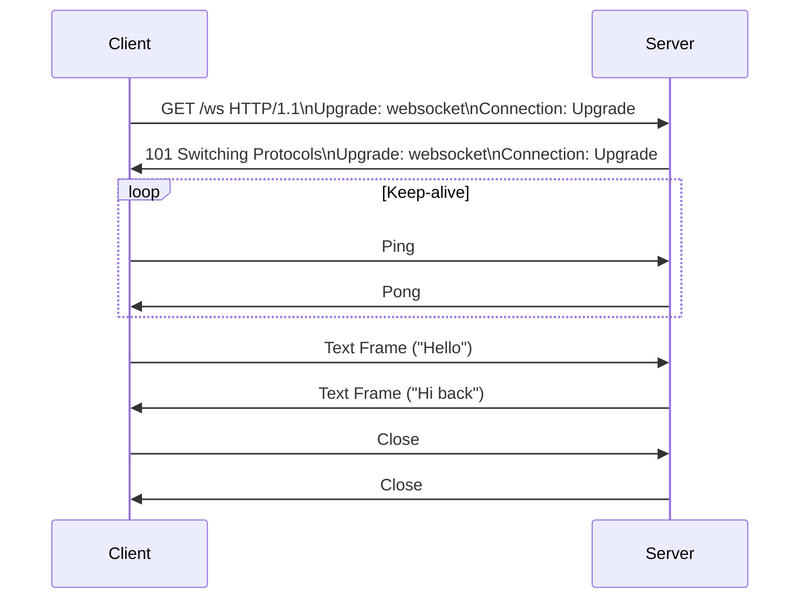

<!-- Generated by Groq via GitHub Actions -->
<!-- Topic ID: T008 -->
<!-- Category: Core Backend Fundamentals -->
<!-- Generated at UTC: 2026-09-24T15:16:48.419228+00:00 -->

# WebSockets

## 1. What problem does this solve?

| Problem | Why it matters | Consequence of not using it | Real‑world use cases |
|---------|----------------|-----------------------------|----------------------|
| **Real‑time, bidirectional communication** | Traditional HTTP is request/response; the client must poll for updates, adding latency and load. | Higher latency, wasted bandwidth, poor UX for live features. | Live chat, multiplayer games, collaborative editors, real‑time dashboards, IoT telemetry. |
| **Efficient connection reuse** | Opening a new HTTP connection for every update is expensive (TCP handshake, TLS negotiation). | Increased CPU, memory, and network overhead on both client and server. | High‑frequency trading feeds, live sports scores, stock tickers. |
| **Stateful, low‑latency messaging** | Many apps need to push data instantly (e.g., notifications, alerts). | Users see stale data; business logic may fail (e.g., missed order). | Push notifications, fraud alerts, real‑time analytics. |

If you ignore WebSockets and rely on long polling or server‑sent events, you’ll face:

- **Higher latency** (client must wait for the next poll).
- **More server resources** (many open connections, more CPU for handling each poll).
- **Complex client logic** (re‑establishing connections, handling timeouts).

WebSockets are the de‑facto standard for any backend that needs to push data to clients instantly and maintain a persistent, low‑overhead channel.

---

## 2. Mental model

### Analogy: **Two‑way walkie‑talk**

Imagine two people each holding a walkie‑talk. They can talk to each other instantly, and both can listen and speak at the same time. No one has to repeatedly ask “Are you there?” – the channel stays open.

### Engineering model

- **Client ↔ Server**: A single TCP connection is established and kept alive.
- **Full‑duplex**: Both sides can send frames independently.
- **Message framing**: Data is sent in discrete frames (text or binary).
- **Protocol upgrade**: HTTP/1.1 or HTTP/2 handshake upgrades the connection to WebSocket.

---

## 3. Deep explanation

### Internals

1. **Handshake**  
   - Client sends `Upgrade: websocket` header.  
   - Server responds with `101 Switching Protocols`.  
   - Both sides agree on subprotocols, extensions, and security keys.

2. **Frame structure**  
   - **FIN** bit, **opcode** (text, binary, close, ping, pong).  
   - **Mask** (client → server frames are masked).  
   - **Payload length** (7/16/63 bits).  
   - **Masking key** (if masked).  
   - **Payload data**.

3. **Ping/Pong**  
   - Keep‑alive and connection health checks.

4. **Close handshake**  
   - Either side sends a close frame; the other acknowledges.

### Important terminology

- **Subprotocol** – application‑level protocol layered on top of WebSocket (e.g., `graphql-ws`).  
- **Extension** – optional features like permessage-deflate.  
- **Masking** – required for client‑to‑server frames to prevent caching proxies from mis‑interpreting data.  
- **Backpressure** – flow control when the receiver is slower than the sender.

### Trade‑offs

| Aspect | WebSocket | Alternatives |
|--------|-----------|--------------|
| Latency | Very low | HTTP polling higher |
| Overhead | Minimal after handshake | HTTP headers per request |
| Complexity | Requires stateful server logic | Stateless HTTP |
| Browser support | Native | SSE, long polling |
| Server scaling | Needs sticky sessions or message broker | Stateless scaling easier |

### Failure modes

- **Connection drop** – network hiccup, server restart.  
- **Backpressure** – client cannot process incoming frames fast enough.  
- **Resource exhaustion** – too many open sockets.  
- **Security** – missing origin checks, lack of TLS.

### Limitations

- **No built‑in message ordering guarantees** beyond TCP.  
- **No automatic reconnection** – client must handle it.  
- **Browser limits** – some browsers cap the number of concurrent sockets per domain.  
- **Firewall traversal** – may be blocked on corporate networks.

### Where it fits

- **Microservice**: A WebSocket gateway (e.g., `socket.io`, `ws`) that forwards messages to a message broker (Kafka, Redis Pub/Sub).  
- **Monolith**: Direct WebSocket server handling client connections.  
- **Hybrid**: HTTP for CRUD, WebSocket for real‑time events.

### Interaction with related concepts

- **HTTP/2**: Can multiplex streams but still requires upgrade for WebSocket.  
- **Redis Pub/Sub**: Used to broadcast messages across server instances.  
- **Load balancers**: Need sticky sessions or WebSocket‑aware routing.  
- **TLS**: WebSocket over TLS (`wss://`) for encryption.  
- **JWT / OAuth**: Authentication during handshake.

---

## 4. How it works

### Step‑by‑step flow

1. **Client** opens an HTTP request with `Upgrade: websocket`.  
2. **Server** validates headers, performs origin check, and responds `101 Switching Protocols`.  
3. **TCP connection** stays open; both sides now send frames.  
4. **Client** sends a **ping** every N seconds; **server** replies with **pong**.  
5. **Application** sends data frames (text/binary).  
6. **Client** processes frames; may send back responses.  
7. **Either side** can send a **close** frame to terminate.



---

## 5. Practical implementation

Below is a minimal, production‑ready WebSocket server using Node.js and the `ws` library, plus a simple Next.js API route that upgrades the connection.

### 5.1 Server (`src/wsServer.ts`)

```ts
import { WebSocketServer, WebSocket } from 'ws';
import http from 'http';
import { createServer } from 'http';
import { parse } from 'url';

// Simple in‑memory store for demo
const clients = new Set<WebSocket>();

export function startWebSocketServer(port: number) {
  const server = http.createServer(); // no HTTP handling needed
  const wss = new WebSocketServer({ server });

  wss.on('connection', (ws, req) => {
    // Basic origin check
    const origin = req.headers.origin;
    if (!origin || !origin.startsWith('https://example.com')) {
      ws.close(1008, 'Origin not allowed');
      return;
    }

    clients.add(ws);
    console.log(`Client connected: ${req.socket.remoteAddress}`);

    ws.on('message', (data) => {
      // Echo back
      ws.send(`Echo: ${data}`);
    });

    ws.on('close', () => {
      clients.delete(ws);
      console.log('Client disconnected');
    });

    ws.on('error', (err) => {
      console.error('WS error', err);
    });
  });

  server.listen(port, () => {
    console.log(`WebSocket server listening on ws://localhost:${port}`);
  });
}
```

### 5.2 Next.js API route (`pages/api/ws.ts`)

```ts
import type { NextApiRequest, NextApiResponse } from 'next';
import { Server as HTTPServer } from 'http';
import { WebSocketServer } from 'ws';

export const config = {
  api: {
    bodyParser: false, // required for raw socket upgrade
  },
};

export default function handler(req: NextApiRequest, res: NextApiResponse) {
  if (req.method !== 'GET') {
    res.status(405).end();
    return;
  }

  const upgradeHeader = req.headers.upgrade;
  if (!upgradeHeader || upgradeHeader !== 'websocket') {
    res.status(426).end(); // Upgrade Required
    return;
  }

  // The underlying server is available via res.socket.server
  const server = res.socket.server as HTTPServer;

  // Create a temporary WebSocket server for this upgrade
  const wss = new WebSocketServer({ noServer: true });

  wss.handleUpgrade(req, req.socket, Buffer.alloc(0), (ws) => {
    wss.emit('connection', ws, req);
  });

  // Close the temporary server after upgrade
  wss.on('connection', (ws) => {
    ws.on('message', (msg) => {
      ws.send(`Server says: ${msg}`);
    });
  });
}
```

**Run the server**

```bash
ts-node src/wsServer.ts --port 8080
```

**Client (browser)**

```ts
const socket = new WebSocket('ws://localhost:8080');
socket.addEventListener('open', () => socket.send('Hello server!'));
socket.addEventListener('message', (e) => console.log(e.data));
```

---

## 6. Production considerations

| Concern | What to do | Why |
|---------|------------|-----|
| **Scalability** | Use a message broker (Redis Pub/Sub, Kafka) to broadcast events across instances. | Keeps each instance stateless regarding message distribution. |
| **Reliability** | Implement heartbeat (ping/pong) and auto‑reconnect logic on client. | Detects broken connections early. |
| **Security** | Enforce TLS (`wss://`), validate `Origin`, use JWT in query or header during handshake. | Prevents MITM and unauthorized access. |
| **Observability** | Log connection counts, message rates, latency. Expose metrics via Prometheus. | Detects bottlenecks and abnormal traffic. |
| **Performance** | Batch small messages, use binary frames, compress with permessage-deflate. | Reduces bandwidth and CPU. |
| **Error handling** | Graceful close codes, retry logic, backpressure handling (`drain` event). | Avoids resource leaks. |
| **Resource usage** | Limit max concurrent sockets per worker, use `worker_threads` or cluster. | Prevents memory exhaustion. |
| **Operational concerns** | Use sticky sessions or a load balancer that supports WebSocket (NGINX, HAProxy). | Ensures client stays on same instance. |
| **Failure recovery** | Restart workers, use health checks, graceful shutdown (`SIGTERM`). | Keeps service available. |
| **Deployment** | Containerize with Docker, expose only `wss://` port, use HTTPS termination at LB. | Simplifies scaling and security. |

---

## 7. Common mistakes

| Mistake | Why it’s bad |
|---------|--------------|
| **Not handling ping/pong** | Connections may stay open forever, wasting resources. |
| **Ignoring backpressure** | Sending too fast can overflow buffers, leading to `ERR_STREAM_WRITE_AFTER_END`. |
| **Using plain HTTP for upgrade** | Missing TLS exposes data to sniffing. |
| **No origin validation** | Allows cross‑site WebSocket hijacking. |
| **Hard‑coding port numbers** | Breaks in containerized or cloud environments. |
| **Not scaling the broker** | Redis Pub/Sub can become a bottleneck under heavy load. |
| **Using `ws` without `noServer: true`** | Creates a separate HTTP server, causing port conflicts. |
| **Sending large frames without compression** | Increases latency and bandwidth usage. |
| **Not closing sockets on error** | Memory leaks, exhausted file descriptors. |

---

## 8. Senior engineer perspective

### What changes at scale?

- **Statelessness**: Each worker should not keep per‑client state; use a shared store or broker.  
- **Horizontal scaling**: Load balancer must route to the same instance or use a shared message bus.  
- **Backpressure management**: Implement flow control across services; avoid flooding clients.  
- **Observability**: Centralized metrics, tracing (e.g., OpenTelemetry) to see end‑to‑end latency.  
- **Security hardening**: Strict CORS, rate limiting, and WAF rules.  
- **Cost**: Running many long‑lived sockets can increase VM memory usage; consider serverless WebSocket solutions (e.g., AWS API Gateway + Lambda) for bursty traffic.

### Design decisions

| Decision | Trade‑off | When to choose |
|----------|-----------|----------------|
| **Dedicated WebSocket gateway vs. embedded** | Gateway adds latency but isolates concerns. | High‑traffic real‑time apps. |
| **Redis Pub/Sub vs. Kafka** | Redis is simpler but less durable; Kafka offers replay. | Need message persistence → Kafka. |
| **Sticky sessions vs. message bus** | Sticky sessions are easier but hard to scale; bus is more complex. | Very low latency required → sticky. |
| **Per‑message compression** | Adds CPU cost but saves bandwidth. | Bandwidth‑constrained clients. |
| **Serverless WebSockets** | Pay per connection; easier scaling. | Sporadic traffic, low baseline load. |

### When NOT to use WebSockets

- **Low‑frequency updates**: Polling or SSE may be simpler.  
- **Stateless, one‑off requests**: HTTP is sufficient.  
- **Highly restricted environments**: Some corporate firewalls block WebSocket ports.  
- **Large file transfers**: Use HTTP/2 or S3 presigned URLs.

---

## 9. Interview questions

1. **Beginner** – *What is the purpose of the `Upgrade` header in a WebSocket handshake?*  
   *Answer:* It tells the server to switch the protocol from HTTP to WebSocket, establishing a persistent, full‑duplex connection.

2. **Beginner** – *Explain the difference between a WebSocket close frame and a TCP close.*  
   *Answer:* A WebSocket close frame (`opcode 0x8`) initiates an orderly shutdown with a status code; the underlying TCP connection remains until both sides acknowledge and close.

3. **Senior** – *How would you scale a WebSocket service across multiple instances behind a load balancer?*  
   *Answer:* Use a shared message broker (Redis Pub/Sub, Kafka) to broadcast events; ensure the load balancer supports sticky sessions or use a WebSocket‑aware LB (NGINX with `proxy_http_version 1.1` and `proxy_set_header Upgrade $http_upgrade`). Also handle backpressure and graceful shutdown.

4. **Senior** – *Describe a scenario where per‑message compression could actually hurt performance.*  
   *Answer:* When messages are already compressed (e.g., binary blobs) or very small, the CPU cost of compressing/decompressing outweighs bandwidth savings, increasing latency.

5. **Scenario/Debugging** – *A client receives a `1008 Policy Violation` close code after a few minutes of activity. What could be the cause and how would you investigate?*  
   *Answer:* Likely an origin or subprotocol mismatch, or a server‑side policy (e.g., rate limit). Check server logs for the close reason, verify `Origin` header, inspect any middleware that enforces policies, and review client request headers.

---

## 10. Hands‑on task

**Build a real‑time collaborative counter**

1. Create a Node.js server with `ws` that keeps a shared counter.  
2. Clients can send `{"action":"increment"}` or `{"action":"decrement"}`.  
3. Server updates the counter and broadcasts the new value to all connected clients.  
4. Add a simple HTML page that connects via WebSocket, displays the counter, and has two buttons.  
5. Deploy locally and test multiple browser tabs updating the counter in real time.

*Hints:* Use `JSON.stringify`/`JSON.parse` for messages, handle `close` events, and log connection counts.

---

## 11. Quick revision

- WebSocket is a full‑duplex, low‑latency protocol built on top of TCP.  
- Handshake upgrades HTTP to WebSocket via `Upgrade: websocket`.  
- Frames have FIN, opcode, mask, length, and payload.  
- Ping/Pong keep the connection alive; close frames terminate gracefully.  
- Use a message broker (Redis, Kafka) for scaling across instances.  
- Enforce TLS, origin checks, and JWT for security.  
- Monitor connection counts, message rates, and latency with Prometheus.  
- Handle backpressure (`drain`) and graceful shutdown.  
- Avoid keeping heavy state per socket; use shared storage.  
- Common pitfalls: missing ping/pong, no backpressure, hard‑coded ports.

---

## 12. References

- [RFC 6455 – The WebSocket Protocol](https://datatracker.ietf.org/doc/html/rfc6455)  
- [Node.js `ws` library](https://github.com/websockets/ws)  
- [WebSocket API – MDN](https://developer.mozilla.org/en-US/docs/Web/API/WebSocket)  
- [Next.js API Routes](https://nextjs.org/docs/api-routes/introduction)  
- [Redis Pub/Sub](https://redis.io/docs/manual/pubsub/)  
- [Kafka – Confluent Docs](https://docs.confluent.io/platform/current/overview.html)  
- [OpenTelemetry – WebSocket instrumentation](https://opentelemetry.io/docs/instrumentation/js/)  
- [NGINX WebSocket proxy](https://www.nginx.com/blog/websocket-nginx/)
