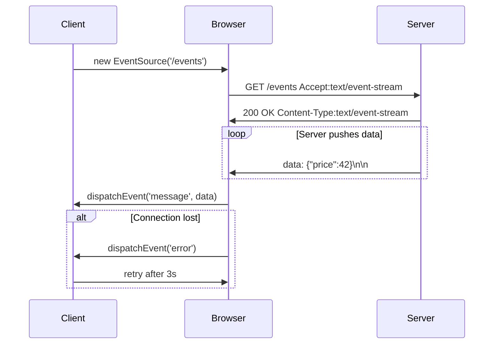

<!-- Generated by Groq via GitHub Actions -->
<!-- Topic ID: T009 -->
<!-- Category: Core Backend Fundamentals -->
<!-- Generated at UTC: 2026-09-24T17:54:36.316475+00:00 -->

# Server‑Sent Events (SSE)

## 1. What problem does this solve?

- **Real‑time data from server to client**  
  Many web apps need to push updates to the browser (chat, live scores, dashboards) without the client constantly polling the server.

- **Simplicity over WebSockets**  
  WebSockets require a full duplex protocol, handshake, and often a separate library. SSE is a single‑direction, HTTP‑based stream that works out of the box in browsers.

- **Why it matters**  
  Polling wastes bandwidth, increases latency, and can overload the server with repeated requests. SSE keeps a single open connection, delivering events as soon as they’re ready.

- **Consequences of not using SSE**  
  - Higher server load (many short requests).  
  - Increased latency (client must wait for next poll).  
  - More complex client logic (re‑establishing connections, handling timeouts).

- **Real‑world use cases**  
  - Stock tickers, crypto price feeds.  
  - Live sports scores.  
  - Server‑side logs streaming to a dashboard.  
  - AI inference results pushed to a UI as they’re produced.

## 2. Mental model

**Analogy – A news ticker**  
Imagine a TV news ticker that scrolls headlines continuously. The TV channel (server) pushes new headlines to the screen (client) as they arrive. The viewer never has to press “refresh”; the stream is always on.

**Engineering model**  
- The client opens a single HTTP GET request and keeps it open.  
- The server writes a continuous stream of text lines, each prefixed with `data:`.  
- The browser parses the stream and emits `message` events to JavaScript.  
- If the connection drops, the client can reconnect with an `Last-Event-ID` header to resume.

## 3. Deep explanation

| Topic | Details |
|-------|---------|
| **Internals** | SSE uses the `text/event-stream` MIME type. The server writes lines like `id: 123\nretry: 5000\ndata: {"price": 42}\n\n`. The browser buffers until a double newline, then fires a `message` event. |
| **Terminology** | `EventSource` (browser API), `retry` (reconnect interval), `id` (last‑event‑id), `event` (named event type). |
| **Trade‑offs** | <ul><li>Unidirectional: no server‑to‑client *and* client‑to‑server in same stream.</li><li>No binary payloads (though you can base64‑encode).</li><li>Limited to HTTP/1.1 (HTTP/2 multiplexing can help).</li></ul> |
| **Failure modes** | Connection loss, server crash, network partition. Clients must handle `onerror` and implement exponential backoff. |
| **Limitations** | <ul><li>Not suitable for high‑frequency, low‑latency data (WebSocket preferred).</li><li>Browser support: IE < 10, Safari < 12.1, but most modern browsers support it.</li><li>Cannot send data from client to server over the same channel.</li></ul> |
| **Architecture fit** | Often sits behind a reverse proxy (NGINX, CloudFront). Can be served by a Node.js Express route, FastAPI endpoint, or any HTTP server. |
| **Related concepts** | WebSockets (full duplex), HTTP long polling, Server‑Side Rendering, GraphQL subscriptions. SSE is the simplest of these for one‑way streaming. |

## 4. How it works

1. **Client** creates `new EventSource('/events')`.  
2. **Browser** sends an HTTP GET with `Accept: text/event-stream`.  
3. **Server** responds with `Content-Type: text/event-stream` and keeps the connection open.  
4. **Server** writes events as text lines, ending each event with a double newline.  
5. **Browser** parses the stream, emits `message` events to JavaScript.  
6. **If disconnected**, browser automatically retries after `retry` milliseconds (default 3000).  
7. **Client** can send `Last-Event-ID` header on reconnect to resume.



## 5. Practical implementation

### Node.js / Express example

```ts
// src/server.ts
import express from 'express';
import { Server } from 'http';

const app = express();
const PORT = 3000;

// SSE endpoint
app.get('/events', (req, res) => {
  // Set headers for SSE
  res.setHeader('Content-Type', 'text/event-stream');
  res.setHeader('Cache-Control', 'no-cache');
  res.setHeader('Connection', 'keep-alive');

  // Send a comment to keep the connection alive in some proxies
  res.write(': keep-alive\n\n');

  // Helper to send an event
  const sendEvent = (data: any, id?: number, event?: string) => {
    const payload = [
      id !== undefined ? `id: ${id}` : '',
      event ? `event: ${event}` : '',
      `data: ${JSON.stringify(data)}`,
      '',
    ].join('\n');
    res.write(payload);
  };

  let counter = 0;
  const interval = setInterval(() => {
    sendEvent({ counter, time: new Date().toISOString() }, counter);
    counter++;
  }, 2000);

  // Clean up on client disconnect
  req.on('close', () => {
    clearInterval(interval);
    res.end();
  });
});

const server: Server = app.listen(PORT, () => {
  console.log(`SSE server listening on http://localhost:${PORT}`);
});
```

#### Client (React)

```tsx
// src/App.tsx
import { useEffect, useState } from 'react';

function App() {
  const [events, setEvents] = useState<string[]>([]);

  useEffect(() => {
    const es = new EventSource('http://localhost:3000/events');

    es.onmessage = (e) => {
      setEvents((prev) => [...prev, e.data]);
    };

    es.onerror = (err) => {
      console.error('SSE error', err);
      es.close();
    };

    return () => es.close();
  }, []);

  return (
    <div>
      <h1>Server‑Sent Events Demo</h1>
      <ul>
        {events.map((e, i) => (
          <li key={i}>{e}</li>
        ))}
      </ul>
    </div>
  );
}

export default App;
```

> **Why this works**  
> - `EventSource` automatically handles reconnection and `Last-Event-ID`.  
> - The server writes plain text; no extra libraries needed.  
> - The `setInterval` simulates a real data source (e.g., stock price updates).

### Optional: Redis Pub/Sub integration

```ts
import { createClient } from 'redis';
const redis = createClient();
await redis.connect();

app.get('/events', async (req, res) => {
  // ... headers as above

  const subscriber = redis.duplicate();
  await subscriber.connect();
  await subscriber.subscribe('updates', (message) => {
    res.write(`data: ${message}\n\n`);
  });

  req.on('close', async () => {
    await subscriber.quit();
    res.end();
  });
});
```

## 6. Production considerations

| Concern | Recommendation |
|---------|----------------|
| **Scalability** | Use a reverse proxy (NGINX, Envoy) to handle many open connections. HTTP/2 multiplexing can reduce per‑connection overhead. |
| **Reliability** | Implement `retry` header, exponential backoff, and `Last-Event-ID` to resume missed events. |
| **Security** | Authenticate via cookies or JWT in the initial GET. Use HTTPS to prevent MITM. |
| **Observability** | Log connection opens/closes, event counts, and error rates. Expose metrics via Prometheus (`sse_connections_total`, `sse_events_sent`). |
| **Performance** | Keep payloads small; compress with gzip/deflate. Avoid large JSON strings. |
| **Error handling** | Send `retry:` header to adjust client retry interval. Use `id:` to allow idempotent re‑processing. |
| **Resource usage** | Each open connection consumes a thread/event loop slot. Use clustering or worker threads if needed. |
| **Operational concerns** | Monitor proxy timeouts; set `proxy_read_timeout` high enough. |
| **Failure recovery** | If the server restarts, clients will reconnect automatically. Ensure idempotent event handling. |
| **Deployment** | Containerize with Docker, expose only the SSE port. Use health checks that hit a lightweight `/health` endpoint. |

## 7. Common mistakes

| Mistake | Why it’s bad |
|---------|--------------|
| **Using SSE for two‑way communication** | SSE is unidirectional; attempts to send data back will fail. Use WebSocket or HTTP POST instead. |
| **Not setting `Cache-Control: no-cache`** | Proxies may cache the stream, breaking real‑time behavior. |
| **Sending large binary blobs** | Browsers may choke; base64 adds overhead. Prefer WebSocket or separate download. |
| **Ignoring `Last-Event-ID`** | Clients will miss events after a reconnect. |
| **Using long intervals (e.g., 30s)** | Increases latency; consider WebSocket for high‑frequency updates. |
| **Not handling `close` event** | Resources leak; open connections stay alive indefinitely. |
| **Overloading the server with many SSE endpoints** | Each endpoint may spawn a separate interval; use a shared pub/sub channel instead. |

## 8. Senior engineer perspective

### When used at scale

- **Architecture decisions**  
  - Place SSE behind a CDN or edge cache that supports HTTP/2.  
  - Use a message broker (Kafka, Redis) to decouple event production from delivery.  
  - Consider a dedicated “streaming” service to avoid overloading the main API.

- **Trade‑offs**  
  - SSE is simpler but limited to text and one‑way.  
  - WebSocket offers full duplex but requires more infrastructure (e.g., sticky sessions, load balancer support).  
  - HTTP/2 multiplexing can mitigate connection limits but not all proxies support it.

- **Bottlenecks**  
  - Open connections consume memory; monitor per‑process limits.  
  - Backpressure: if the client is slow, the server’s write buffer may fill. Use `res.write()` return value or `res.flush()`.

- **Failure scenarios**  
  - Proxy timeouts: set `proxy_read_timeout` > expected idle time.  
  - Network partitions: clients will reconnect automatically; ensure idempotent event handling.

- **Monitoring**  
  - Track `sse_connections_active`, `sse_events_sent`, `sse_reconnects`.  
  - Alert on high reconnection rates (possible network issues).  

- **Cost/performance**  
  - Each open connection consumes a TCP port; on cloud platforms, high concurrency may increase network egress costs.  
  - Use HTTP/2 to reduce per‑connection overhead.

- **When NOT to use**  
  - If you need client‑to‑server streaming (e.g., file uploads).  
  - If you require binary data or very low latency (< 50 ms).  
  - If you need to support legacy browsers that lack SSE support.

## 9. Interview questions

1. **Beginner** – *What MIME type must an SSE response use?*  
   **Answer:** `Content-Type: text/event-stream`.

2. **Beginner** – *How does the browser know when an event ends?*  
   **Answer:** An event ends at a double newline (`\n\n`).

3. **Senior** – *Explain how you would scale an SSE service behind a load balancer.*  
   **Answer points:**  
   - Use sticky sessions or a shared pub/sub (Redis, Kafka).  
   - Ensure the load balancer supports HTTP/2 or keep‑alive.  
   - Avoid per‑connection state in the server; store state in a shared store.

4. **Senior** – *Compare SSE and WebSocket in terms of protocol overhead and use cases.*  
   **Answer points:**  
   - SSE: HTTP/1.1, text only, unidirectional, simpler, works through proxies.  
   - WebSocket: full duplex, binary support, requires handshake, more complex but lower latency.

5. **Scenario/Debugging** – *Your SSE endpoint works locally but clients behind a corporate proxy never receive events. What could be wrong and how would you diagnose it?*  
   **Answer points:**  
   - Proxy may close idle connections; check `proxy_read_timeout`.  
   - Proxy may strip `Content-Type: text/event-stream`; verify headers with `curl -v`.  
   - Use `curl -N` to see raw stream.  
   - Add `Cache-Control: no-cache` and `Connection: keep-alive`.  
   - Log client IPs and connection durations on the server.

## 10. Hands‑on task

**Task:**  
Add a “price ticker” SSE endpoint to an existing Express app that publishes random stock prices every second.  
- Use Redis Pub/Sub to decouple price generation from the SSE route.  
- Implement client reconnection logic that resumes from the last received event ID.  
- Expose a `/health` endpoint for load balancer checks.  
- Write a small React component that displays the latest price and logs reconnection attempts.

**Goal:**  
Demonstrate understanding of SSE, Redis integration, and client reconnection handling.

## 11. Quick revision

- SSE is a single‑direction, HTTP‑based stream (`text/event-stream`).  
- Browser uses `EventSource`; server writes `data: ...\n\n`.  
- `id:` and `retry:` headers control reconnection and event ordering.  
- SSE is ideal for low‑frequency, text‑only updates; WebSocket for high‑frequency or binary.  
- Keep connections alive with comments (`: keep‑alive`).  
- Handle `close` event to free resources.  
- Use `Last-Event-ID` to resume missed events.  
- Scale with reverse proxy, HTTP/2, and a shared pub/sub system.  
- Monitor active connections, events sent, and reconnection rates.  
- Avoid SSE for two‑way communication or binary payloads.

## 12. References

- [MDN Web Docs – Server-sent events](https://developer.mozilla.org/en-US/docs/Web/API/Server-sent_events)  
- [RFC 6455 – The WebSocket Protocol](https://datatracker.ietf.org/doc/html/rfc6455)  
- [Express.js – HTTP headers](https://expressjs.com/en/4x/api.html#res.set)  
- [Redis Pub/Sub](https://redis.io/docs/manual/pubsub/)  
- [NGINX – HTTP/2 and SSE](https://www.nginx.com/blog/nginx-1-9-0-released/)  
- [FastAPI – Streaming responses](https://fastapi.tiangolo.com/tutorial/streaming/)  

---
