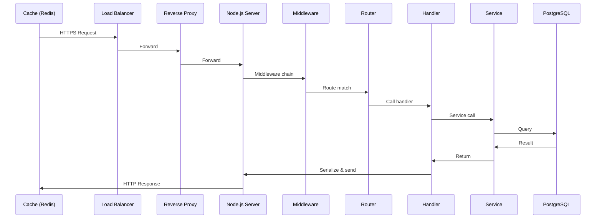

<!-- Generated by Groq via GitHub Actions -->
<!-- Topic ID: T010 -->
<!-- Category: Core Backend Fundamentals -->
<!-- Generated at UTC: 2026-09-24T17:54:36.316475+00:00 -->

# Request/response lifecycle

## 1. What problem does this solve?

When a client (browser, mobile app, or another service) wants data or an action, it sends an **HTTP request**. The backend must:

1. **Receive** the request reliably over the network.  
2. **Interpret** the URL, headers, body, and query parameters.  
3. **Route** it to the correct business logic.  
4. **Execute** that logic (DB queries, external calls, computations).  
5. **Return** a well‑structured HTTP response (status code, headers, body).

### Why it matters

- **Consistency**: Clients expect a predictable status code and JSON shape.  
- **Performance**: Each hop adds latency; unnecessary processing hurts response time.  
- **Security**: Validation and sanitization happen early to avoid injection or DoS.  
- **Observability**: Tracing the lifecycle is essential for debugging and SLA compliance.

### Consequences of ignoring the lifecycle

- **Unpredictable errors**: Clients receive 500s or malformed data.  
- **Security holes**: Unvalidated input reaches the database.  
- **Resource leaks**: Open connections or unclosed streams consume memory.  
- **Poor scaling**: Without a clear flow, adding load balancers or caching becomes hard.

### Where it appears in real systems

- **REST APIs** in microservices (Node.js/Express, FastAPI).  
- **GraphQL resolvers** that internally follow the same pattern.  
- **Serverless functions** (AWS Lambda, Cloudflare Workers).  
- **gRPC services** that map to HTTP/2 request/response pairs.

---

## 2. Mental model

### Analogy: A Post Office

| Backend component | Post office counterpart |
|-------------------|------------------------|
| **Client** | Sender |
| **Load balancer** | Mail sorting center |
| **Reverse proxy / API gateway** | Post office front desk |
| **Router** | Mail sorter |
| **Middleware** | Address verification, postage check |
| **Controller / handler** | Clerk who opens the envelope |
| **Service** | Worker who processes the request |
| **Repository / DB** | File cabinet |
| **Cache** | Express delivery system |
| **Response** | Mail returned to sender |

Just as a letter travels from sender → sorting → clerk → processing → return, an HTTP request travels through a series of deterministic steps before a response is sent back.

### Precise engineering model

1. **Transport layer** (TCP/UDP, TLS) receives bytes.  
2. **HTTP parser** builds a request object.  
3. **Middleware stack** runs (auth, logging, body‑parsing).  
4. **Router** selects a handler based on method & path.  
5. **Handler** invokes services, repositories, external APIs.  
6. **Response builder** serializes data, sets headers, status.  
7. **HTTP writer** sends bytes back over the socket.  
8. **Client** parses the response.

---

## 3. Deep explanation

### Internals

- **HTTP/1.1 vs HTTP/2**: HTTP/2 multiplexes streams, reducing head‑of‑line blocking.  
- **Event loop**: Node.js handles I/O asynchronously; blocking code stalls the loop.  
- **Middleware order**: Order matters; e.g., body parsing must precede route handling.  
- **Connection pooling**: DB drivers maintain pools; mis‑management leads to exhaustion.  

### Important terminology

| Term | Meaning |
|------|---------|
| **Endpoint** | A unique URL + HTTP method. |
| **Route** | Mapping from endpoint to handler. |
| **Middleware** | Function that receives `req`, `res`, `next`. |
| **Handler** | Final function that sends a response. |
| **Service** | Business logic layer, independent of HTTP. |
| **Repository** | Data access layer, abstracts DB. |
| **Serialization** | Converting objects to JSON, XML, etc. |
| **Status code** | 2xx success, 4xx client error, 5xx server error. |

### Trade‑offs

| Decision | Pros | Cons |
|----------|------|------|
| **Synchronous vs asynchronous DB calls** | Simpler code | Blocks event loop |
| **In‑memory cache vs external cache** | Low latency | Inconsistent state |
| **Monolithic routing vs micro‑service routing** | Easier to debug | Harder to scale |

### Failure modes

- **Uncaught exceptions** → 500 responses, leaked stack traces.  
- **Timeouts** → Client hangs, resource leaks.  
- **Backpressure** → Slow consumers overwhelm producers.  
- **Race conditions** in shared state (e.g., counters).  

### Limitations

- **Statelessness**: HTTP is stateless; session data must be stored externally.  
- **Limited streaming**: HTTP/1.1 streams are less efficient than HTTP/2 or gRPC.  
- **Large payloads**: Binary data requires multipart or base64, increasing size.

### Where it fits in a backend architecture

- **API Gateway** → Load balancer → Service → DB/Cache → External APIs.  
- **Observability** layers (tracing, metrics) wrap around the lifecycle.  
- **Security** layers (JWT validation, rate limiting) are early middleware.

### Interaction with related concepts

- **Caching**: Middleware can short‑circuit the handler.  
- **Rate limiting**: Applied before routing.  
- **Circuit breaking**: Wraps external calls inside handlers.  
- **Retry logic**: Often part of services, not middleware.  

---

## 4. How it works

### Step‑by‑step flow

1. **Client** sends an HTTP request over TLS.  
2. **Load balancer** forwards to an instance.  
3. **Reverse proxy** (e.g., Nginx) forwards to Node.js.  
4. **Node.js** receives the socket, parses HTTP.  
5. **Middleware stack** runs:  
   - `helmet` → security headers  
   - `cors` → cross‑origin policy  
   - `bodyParser.json()` → parse JSON body  
   - `authMiddleware` → validate JWT  
6. **Router** matches `/users/:id` → `getUserHandler`.  
7. **Handler** calls `UserService.getById(id)`.  
8. **Service** calls `UserRepository.findById(id)` → PostgreSQL.  
9. **Repository** returns a user object.  
10. **Service** may enrich data (e.g., fetch avatar from S3).  
11. **Handler** serializes to JSON, sets `Content-Type`.  
12. **Node.js** writes the response back over the socket.  
13. **Client** receives, parses, and renders.

### Mermaid diagram



---

## 5. Practical implementation

Below is a minimal Express‑style Node.js API that demonstrates the lifecycle, including middleware, routing, service, repository, and caching.

```ts
// src/server.ts
import express, { Request, Response, NextFunction } from 'express';
import helmet from 'helmet';
import cors from 'cors';
import bodyParser from 'body-parser';
import { getUserById } from './services/userService';
import { createRedisClient } from './utils/redis';
import { createPool } from 'pg';

const app = express();
const redis = createRedisClient();
const pgPool = createPool({
  connectionString: process.env.DATABASE_URL,
});

// ---------- Middleware ----------
app.use(helmet()); // security headers
app.use(cors());   // CORS
app.use(bodyParser.json()); // parse JSON

// Simple auth middleware
app.use((req: Request, res: Response, next: NextFunction) => {
  const auth = req.headers.authorization;
  if (!auth || !auth.startsWith('Bearer ')) {
    return res.status(401).json({ error: 'Missing token' });
  }
  // In real life, verify JWT here
  next();
});

// ---------- Routes ----------
app.get('/users/:id', async (req: Request, res: Response) => {
  const id = req.params.id;

  // 1️⃣ Try cache first
  const cacheKey = `user:${id}`;
  const cached = await redis.get(cacheKey);
  if (cached) {
    return res.json(JSON.parse(cached));
  }

  // 2️⃣ Fetch from DB via service
  try {
    const user = await getUserById(id, pgPool);
    if (!user) return res.status(404).json({ error: 'Not found' });

    // 3️⃣ Cache result
    await redis.set(cacheKey, JSON.stringify(user), 'EX', 60); // 1 min

    res.json(user);
  } catch (err) {
    console.error(err);
    res.status(500).json({ error: 'Internal server error' });
  }
});

// ---------- Start ----------
const PORT = process.env.PORT ?? 3000;
app.listen(PORT, () => console.log(`🚀 Server listening on ${PORT}`));
```

```ts
// src/services/userService.ts
import { Pool } from 'pg';
import { User } from '../models/user';

export async function getUserById(id: string, pool: Pool): Promise<User | null> {
  const { rows } = await pool.query(
    'SELECT id, name, email, created_at FROM users WHERE id = $1',
    [id]
  );
  return rows[0] ?? null;
}
```

```ts
// src/utils/redis.ts
import { createClient } from 'redis';

export function createRedisClient() {
  const client = createClient({ url: process.env.REDIS_URL });
  client.on('error', err => console.error('Redis error:', err));
  client.connect();
  return client;
}
```

```ts
// src/models/user.ts
export interface User {
  id: string;
  name: string;
  email: string;
  created_at: string;
}
```

**Key lines explained**

- `app.use(bodyParser.json());` – parses request body before handlers.  
- `redis.get(cacheKey)` – short‑circuits the handler if data is cached.  
- `await getUserById(id, pgPool);` – service layer abstracts DB logic.  
- `res.json(user);` – Express automatically sets `Content-Type: application/json`.  

---

## 6. Production considerations

| Concern | How to address it |
|---------|-------------------|
| **Scalability** | Horizontal scaling behind a load balancer; stateless handlers; connection pooling. |
| **Reliability** | Retry logic in services; circuit breakers; graceful shutdown. |
| **Security** | TLS termination, HSTS, CSRF protection, rate limiting, input validation. |
| **Observability** | Structured logging (JSON), OpenTelemetry tracing, Prometheus metrics. |
| **Performance** | Use HTTP/2, keep-alive, compression, caching, async DB drivers. |
| **Error handling** | Central error middleware; avoid leaking stack traces; use proper status codes. |
| **Resource usage** | Monitor memory leaks, GC pauses; limit concurrent DB connections. |
| **Operational concerns** | Health checks (`/health`), graceful restart, zero‑downtime deployments. |
| **Failure recovery** | Backups, point‑in‑time recovery for DB, Redis persistence. |
| **Deployment** | Docker images, CI/CD pipelines, canary releases, blue/green. |

---

## 7. Common mistakes

| Mistake | Why it’s bad |
|---------|--------------|
| **Blocking the event loop** (e.g., `fs.readFileSync`) | Causes all requests to stall. |
| **Not closing DB connections** | Connection pool exhaustion. |
| **Sending raw error stacks to clients** | Security risk, confusing UX. |
| **Hard‑coding URLs or secrets** | Hard to change, insecure. |
| **Ignoring status codes** | Clients misinterpret success/failure. |
| **Over‑caching** | Stale data, cache stampedes. |
| **Missing CORS headers** | Browser blocks cross‑origin requests. |
| **No request validation** | Injection attacks, malformed data. |

---

## 8. Senior engineer perspective

### At scale

- **Architecture**: Adopt an API gateway (e.g., Kong, AWS API Gateway) to centralize auth, rate limiting, and routing.  
- **Statelessness**: Store session data in Redis or JWTs; avoid in‑memory state.  
- **Observability**: Instrument every hop with distributed tracing; use a central log aggregator.  
- **Performance**: Use HTTP/2, keep‑alive, and connection pooling; profile hot paths.  
- **Reliability**: Implement retries with exponential backoff; use circuit breakers for external services.  
- **Cost**: Cache frequently accessed data; avoid over‑provisioning DB replicas.  

### Design decisions

| Decision | Trade‑off |
|----------|-----------|
| **Monolith vs microservice** | Monolith easier to deploy; microservices scale independently but add complexity. |
| **Synchronous vs asynchronous** | Synchronous is simpler but blocks; async scales better but requires careful error handling. |
| **Cache strategy** | In‑memory vs distributed; trade between speed and consistency. |
| **Database choice** | Relational for ACID; NoSQL for high write throughput. |
| **API versioning** | Semantic versioning vs path versioning; affects backward compatibility. |

### When NOT to use the approach

- **Real‑time streaming**: Use WebSockets or gRPC instead of HTTP polling.  
- **High‑frequency telemetry**: Push metrics to a time‑series DB directly.  
- **Very low latency**: Consider native protocols (e.g., QUIC) over HTTP/1.1.

---

## 9. Interview questions

1. **Beginner**: *What is the purpose of middleware in an Express application?*  
   *Answer*: Middleware runs before the final route handler, allowing you to modify the request/response, perform authentication, logging, body parsing, etc.

2. **Beginner**: *Explain the difference between a 4xx and a 5xx HTTP status code.*  
   *Answer*: 4xx indicates a client error (bad request, unauthorized), while 5xx indicates a server error (internal error, service unavailable).

3. **Senior**: *How would you design a request/response pipeline to handle high traffic while ensuring data consistency across microservices?*  
   *Answer*: Use an API gateway for routing and rate limiting, stateless services with shared cache (Redis), idempotent operations, eventual consistency patterns, and distributed tracing for observability.

4. **Senior**: *Describe how you would implement graceful shutdown for a Node.js server that uses PostgreSQL and Redis connections.*  
   *Answer*: Listen for `SIGTERM`, stop accepting new connections, wait for in‑flight requests to finish, close DB and Redis pools, then exit.

5. **Scenario/Debugging**: *A client receives a 500 error when requesting `/orders/123`. The logs show `Error: Cannot read property 'id' of undefined` in the service layer. What steps would you take to diagnose and fix this?*  
   *Answer*:  
   - Verify that the order ID exists in the database.  
   - Add null checks before accessing properties.  
   - Log the incoming request ID and parameters.  
   - Use a debugger or add a breakpoint in the service.  
   - Ensure the repository returns `null` instead of throwing.  
   - Update error handling to return 404 if not found.

---

## 10. Hands‑on task

**Task**: Extend the example API to support **rate limiting** and **request logging**.

1. Add a middleware that limits each IP to 100 requests per minute.  
2. Log each request with method, path, status code, and response time in JSON format.  
3. Verify that exceeding the limit returns a `429 Too Many Requests` response.  
4. Run the server locally and use `curl` or a simple script to hit the endpoint repeatedly.

---

## 11. Quick revision

- HTTP request → TCP/TLS → HTTP parser → middleware → router → handler.  
- Middleware order matters; body parsing before route handling.  
- Use status codes: 200 OK, 201 Created, 400 Bad Request, 401 Unauthorized, 404 Not Found, 429 Too Many Requests, 500 Internal Server Error.  
- Cache hits should short‑circuit the handler.  
- Keep‑alive, HTTP/2, and connection pooling reduce latency.  
- Central error middleware prevents leaking stack traces.  
- Observability: structured logs, metrics, tracing.  
- Graceful shutdown: stop accepting new requests, finish in‑flight, close pools.  
- Rate limiting protects against DoS; use token bucket or leaky bucket.  
- Stateless services scale horizontally; store session data externally.  

---

## 12. References

- [Express.js Documentation – Middleware](https://expressjs.com/en/guide/writing-middleware.html)  
- [Node.js HTTP Module](https://nodejs.org/api/http.html)  
- [OpenTelemetry for Node.js](https://opentelemetry.io/docs/instrumentation/node/)  
- [PostgreSQL Connection Pooling in Node.js](https://node-postgres.com/features/pooling)  
- [Redis Node.js Client](https://github.com/redis/node-redis)  
- [HTTP/2 in Node.js](https://nodejs.org/api/http2.html)  
- [OWASP Top 10 – A1: Injection](https://owasp.org/www-project-top-ten/2021/A1_2021-Injection)  
- [AWS API Gateway – Best Practices](https://docs.aws.amazon.com/apigateway/latest/developerguide/best-practices.html)
