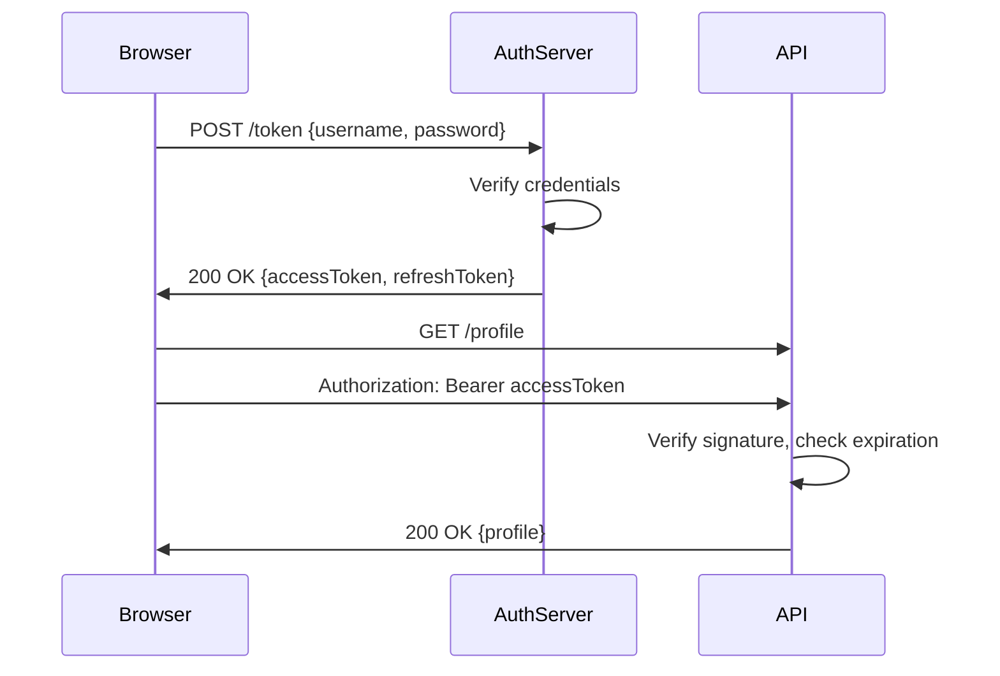

<!-- Generated by Groq via GitHub Actions -->
<!-- Topic ID: T011 -->
<!-- Category: Core Backend Fundamentals -->
<!-- Generated at UTC: 2026-09-25T06:16:18.056920+00:00 -->

# Cookies, sessions, tokens

## 1. What problem does this solve?

When a user interacts with a web application, the server needs a way to remember that the user is the same across multiple HTTP requests. HTTP is stateless, so each request is independent. Without a mechanism to tie requests together, the server would have to ask the user to log in on every request, which is impractical and insecure.

**Why it matters**

* **User experience** – Seamless login, shopping carts, preferences.
* **Security** – Authentication tokens prevent replay attacks and session hijacking if handled correctly.
* **Scalability** – Proper session/token design lets you horizontally scale stateless services.

**What happens if it’s not used**

* Users must re‑authenticate on every request → poor UX.
* You must store state in the client (e.g., hidden form fields) → vulnerable to tampering.
* You risk exposing sensitive data if you transmit it in URLs or query strings.

**Real‑world appearance**

* E‑commerce sites keep a cart in a session cookie.
* APIs use JWTs to authenticate statelessly.
* Microservice backends share session IDs via Redis or a shared database.

---

## 2. Mental model

**Analogy – The library card**

Think of a library card. When you check out a book, you hand the librarian your card. The librarian looks up your card number, finds your account, and records the loan. Later, when you return the book, you hand the same card; the librarian knows who you are and what you borrowed.

**Engineering model**

* **Cookie** – The physical card you carry in your browser.
* **Session ID** – The unique number on the card that identifies your account.
* **Token** – A digital version of the card that can be verified without a lookup (e.g., JWT).

---

## 3. Deep explanation

### Internals

| Concept | How it works | Typical storage |
|---------|--------------|-----------------|
| **Cookie** | Browser stores key/value pairs; sent with every request to matching domain/path. | Client side |
| **Session** | Server stores a mapping `sessionId → sessionData`. The client holds only the `sessionId`. | In‑memory store (Redis), database, or signed cookie |
| **Token** | Self‑contained payload (claims) signed by server. Client holds the whole token. | Client side; optionally verified against a public key |

### Important terminology

* **Secure flag** – Cookie only sent over HTTPS.
* **HttpOnly flag** – Cookie inaccessible to JavaScript (mitigates XSS).
* **SameSite** – Controls cross‑site request behavior (Lax, Strict, None).
* **Expiration** – `max-age` or `expires` header.
* **Refresh token** – Long‑lived token used to obtain new short‑lived access tokens.
* **Revocation** – Invalidate a session or token (e.g., logout, password change).

### Trade‑offs

| Approach | Pros | Cons |
|----------|------|------|
| **Server‑side session** | Easy to revoke, can store arbitrary data, no token leakage. | Requires shared storage (Redis, DB), adds latency, harder to scale statelessly. |
| **Signed cookie (stateless session)** | No server storage, scales horizontally. | Larger cookie size, risk of tampering if signing key compromised. |
| **JWT** | Stateless, can embed claims, works across services. | Cannot be revoked without a blacklist, larger payload, risk of token theft. |

### Failure modes

* **Session fixation** – Attacker sets a known session ID before login.
* **XSS** – If cookies are not HttpOnly, scripts can steal them.
* **CSRF** – If SameSite=Lax/None, cross‑site requests may carry cookies.
* **Token replay** – Stolen JWT used until expiration.

### Limitations

* Cookies are limited to ~4 KB per cookie; many tokens exceed that.
* Tokens cannot be invalidated instantly unless you maintain a revocation list.
* Storing large session data in Redis can become memory‑heavy.

### Where it fits

```
Client (browser) ──► 1. HTTP Request (Cookie/Token)
                     │
                     ▼
          API Gateway / Auth Service
                     │
          ┌──────────┴───────────┐
          │                      │
   Session Store (Redis)   Token Verifier (JWT)
          │                      │
          ▼                      ▼
   Application Service      Application Service
```

Tokens are often used for API authentication, while sessions are common for web UIs.

### Interaction with related concepts

* **CORS** – Must align with SameSite and credentials.
* **OAuth2** – Uses access/refresh tokens; often stored in cookies or localStorage.
* **Rate limiting** – Can be keyed by session ID or token ID.
* **Audit logs** – Store session ID or token ID for traceability.

---

## 4. How it works

### Session flow (server‑side)

```mermaid
sequenceDiagram
    participant Browser
    participant Server
    participant Redis

    Browser->>Server: GET /login
    Server->>Browser: Render login form

    Browser->>Server: POST /login {username, password}
    Server->>Server: Verify credentials
    Server->>Redis: SET sessionId => {userId, expires}
    Server->>Browser: Set-Cookie: sessionId=abc123; HttpOnly; Secure; SameSite=Strict

    Browser->>Server: GET /dashboard
    Server->>Browser: Send Cookie: sessionId=abc123
    Server->>Redis: GET abc123
    Server->>Browser: Render dashboard
```

### Token flow (JWT)



---

## 5. Practical implementation

### 5.1 Server‑side session with Express & Redis

```ts
// src/server.ts
import express from 'express';
import session from 'express-session';
import connectRedis from 'connect-redis';
import { createClient } from 'redis';

const redisClient = createClient({ url: 'redis://localhost:6379' });
await redisClient.connect();

const RedisStore = connectRedis(session);

const app = express();
app.use(express.json());

// Session middleware
app.use(
  session({
    store: new RedisStore({ client: redisClient }),
    secret: process.env.SESSION_SECRET!, // keep secret safe
    resave: false,
    saveUninitialized: false,
    cookie: {
      httpOnly: true,
      secure: process.env.NODE_ENV === 'production',
      sameSite: 'strict',
      maxAge: 1000 * 60 * 60 * 24, // 1 day
    },
  })
);

// Login route
app.post('/login', async (req, res) => {
  const { username, password } = req.body;
  // TODO: verify credentials against DB
  if (username === 'alice' && password === 'secret') {
    req.session.userId = 42; // store minimal data
    return res.json({ ok: true });
  }
  res.status(401).json({ ok: false });
});

// Protected route
app.get('/profile', (req, res) => {
  if (!req.session.userId) return res.status(401).end();
  // fetch user profile from DB
  res.json({ userId: req.session.userId, name: 'Alice' });
});

app.listen(3000, () => console.log('Server listening on :3000'));
```

### 5.2 Stateless JWT with Next.js API route

```ts
// pages/api/login.ts
import { NextApiRequest, NextApiResponse } from 'next';
import jwt from 'jsonwebtoken';

const JWT_SECRET = process.env.JWT_SECRET!;

export default function handler(req: NextApiRequest, res: NextApiResponse) {
  const { username, password } = req.body;
  // TODO: verify credentials
  if (username === 'alice' && password === 'secret') {
    const token = jwt.sign(
      { sub: 42, name: 'Alice' },
      JWT_SECRET,
      { expiresIn: '15m' } // short‑lived
    );
    const refresh = jwt.sign(
      { sub: 42 },
      JWT_SECRET,
      { expiresIn: '7d' }
    );
    res.setHeader('Set-Cookie', `refresh=${refresh}; HttpOnly; Secure; SameSite=Strict`);
    return res.json({ accessToken: token });
  }
  res.status(401).end();
}
```

```ts
// pages/api/profile.ts
import { NextApiRequest, NextApiResponse } from 'next';
import jwt from 'jsonwebtoken';

const JWT_SECRET = process.env.JWT_SECRET!;

export default function handler(req: NextApiRequest, res: NextApiResponse) {
  const auth = req.headers.authorization;
  if (!auth?.startsWith('Bearer ')) return res.status(401).end();

  const token = auth.split(' ')[1];
  try {
    const payload = jwt.verify(token, JWT_SECRET) as any;
    res.json({ userId: payload.sub, name: payload.name });
  } catch {
    res.status(401).end();
  }
}
```

---

## 6. Production considerations

| Concern | Recommendation |
|---------|----------------|
| **Scalability** | Use Redis or a distributed cache for session store; keep session data minimal. |
| **Reliability** | Persist session store to disk or use Redis replication. |
| **Security** | - `Secure` & `HttpOnly` flags. <br> - SameSite=Lax/Strict. <br> - Rotate signing keys, use short‑lived JWTs. |
| **Observability** | Log session creation, expiration, and revocation. Instrument token validation latency. |
| **Performance** | Cache session data in memory; avoid DB lookups on every request. |
| **Error handling** | Gracefully handle missing/expired tokens; redirect to login. |
| **Resource usage** | Keep session payload small; purge expired sessions. |
| **Operational concerns** | Monitor Redis memory, set eviction policy. |
| **Failure recovery** | Implement graceful degradation: if Redis down, fallback to stateless JWT or deny access. |
| **Deployment** | Use environment variables for secrets; keep secrets out of code. |

---

## 7. Common mistakes

1. **Storing sensitive data in cookies** – Exposes data if cookie is intercepted.  
2. **Forgetting `HttpOnly`** – XSS can steal session cookies.  
3. **Using `SameSite=None` without `Secure`** – Allows CSRF over HTTP.  
4. **Long‑lived JWTs** – Hard to revoke; risk of token theft.  
5. **Storing entire user object in session** – Increases memory usage and latency.  
6. **Not rotating signing keys** – Compromised key invalidates all tokens.  
7. **Using `resave: true`** – Causes unnecessary writes to Redis.  
8. **Ignoring token expiration** – Users stay logged in indefinitely.  

---

## 8. Senior engineer perspective

### Architecture decisions

* **Stateless vs stateful** – Choose stateless JWT for microservices; stateful session for monoliths needing revocation.  
* **Storage backend** – Redis cluster vs database; consider persistence, eviction, and replication.  
* **Key management** – Use KMS (AWS KMS, HashiCorp Vault) for signing keys.  
* **Token revocation strategy** – Blacklist, short‑lived tokens, or rotating secrets.  

### Trade‑offs

| Decision | Impact |
|----------|--------|
| **Redis cluster** | Low latency, high throughput, but adds operational cost. |
| **Database session store** | Durable, easier to query, but slower. |
| **JWT with short expiry** | Stateless, but requires refresh flow. |
| **Cookie‑based session** | Simpler, but requires shared storage. |

### Bottlenecks

* **Redis saturation** – High request rate can hit memory limits.  
* **Token verification** – CPU cost of HMAC/SHA256 per request.  

### Failure scenarios

* **Redis outage** – Session loss; fallback to stateless tokens.  
* **Key compromise** – Revoke all tokens, force password reset.  

### Monitoring

* Session creation/expiration metrics.  
* Token validation latency.  
* Redis memory usage, eviction count.  

### Cost/performance

* Redis memory cost scales with session count.  
* JWTs increase payload size → higher bandwidth.  

### When NOT to use

* **Highly regulated data** – Prefer server‑side session with audit logs.  
* **Low‑traffic sites** – Simple cookie‑based session may suffice.  
* **Microservices that need cross‑service auth** – JWT or OAuth2 is preferable.

---

## 9. Interview questions

1. **Beginner** – *What is a cookie and how does it differ from a session?*  
   *Answer:* A cookie is a key/value pair stored in the browser; a session is server‑side data referenced by a session ID stored in a cookie.

2. **Beginner** – *Why should we set the `HttpOnly` flag on session cookies?*  
   *Answer:* It prevents JavaScript from accessing the cookie, mitigating XSS attacks that could steal the session ID.

3. **Senior** – *Explain how you would design a token revocation system for JWTs in a microservice architecture.*  
   *Answer:* Use a short‑lived access token plus a refresh token; store refresh tokens in a database or Redis with revocation flags; optionally maintain a blacklist of revoked JWT IDs.

4. **Senior** – *Compare the scalability implications of using Redis for session storage versus storing sessions in a relational database.*  
   *Answer:* Redis offers sub‑millisecond latency and horizontal scaling via clustering; relational DBs are slower, harder to scale horizontally, but provide durability and easier querying.

5. **Scenario/Debugging** – *A user reports that after logging in, they are immediately logged out on the next page. What could be causing this and how would you investigate?*  
   *Answer:* Possible causes: cookie not being set (missing `Secure`/`SameSite` flags), session not persisted (Redis down), session ID mismatched, or client not sending cookie. Investigate by inspecting network requests, checking server logs, verifying Redis connectivity, and ensuring cookie attributes match the environment.

---

## 10. Hands‑on task

**Task:** Add a “remember me” feature to the Express/Redis session example.

1. Add a checkbox to the login form (`rememberMe`).  
2. If checked, set the session cookie’s `maxAge` to 30 days; otherwise, keep it session‑only.  
3. Ensure the cookie still has `HttpOnly`, `Secure`, and `SameSite=Strict`.  
4. Write a unit test that verifies the cookie’s `maxAge` when `rememberMe` is true.

---

## 11. Quick revision

* HTTP is stateless → need a way to persist identity.  
* **Cookie** – client‑side storage; sent automatically.  
* **Session** – server‑side data keyed by session ID stored in cookie.  
* **Token (JWT)** – self‑contained, signed payload; no server lookup.  
* `Secure`, `HttpOnly`, `SameSite` flags protect cookies.  
* Redis is the de‑facto store for scalable sessions.  
* Short‑lived JWTs + refresh tokens balance security and statelessness.  
* Revocation: sessions can be invalidated instantly; JWTs need blacklist or key rotation.  
* Monitor session count, Redis memory, token validation latency.  
* Avoid storing large payloads in cookies or sessions.  
* Use environment variables for secrets; rotate keys regularly.  
* SameSite=Lax/Strict mitigates CSRF; None requires Secure.  

---

## 12. References

* [MDN Web Docs – HTTP cookies](https://developer.mozilla.org/en-US/docs/Web/HTTP/Cookies)  
* [Express Session](https://expressjs.com/en/resources/middleware/session.html)  
* [connect-redis](https://github.com/tj/connect-redis)  
* [JWT.io – Introduction to JSON Web Tokens](https://jwt.io/introduction/)  
* [Next.js API Routes](https://nextjs.org/docs/api-routes/introduction)  
* [OWASP – Session Management Cheat Sheet](https://cheatsheetseries.owasp.org/cheatsheets/Session_Management_Cheat_Sheet.html)  
* [Redis – Persistence and Replication](https://redis.io/docs/manual/persistence/)  
* [RFC 6265 – HTTP State Management Mechanism](https://datatracker.ietf.org/doc/html/rfc6265)
