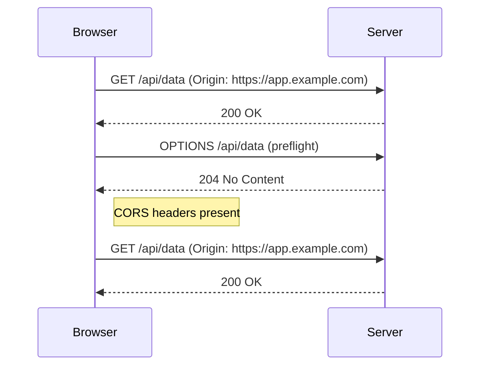

<!-- Generated by Groq via GitHub Actions -->
<!-- Topic ID: T012 -->
<!-- Category: Core Backend Fundamentals -->
<!-- Generated at UTC: 2026-09-25T06:16:18.056920+00:00 -->

# CORS

## 1. What problem does this solve?

**Motivation**  
Web browsers enforce a *same‑origin policy* (SOP) to protect users from malicious cross‑site requests. Under SOP, a script running on `https://app.example.com` can only talk to resources that share the same scheme, host, and port.  

**Problem that exists**  
Modern front‑end applications (React, Next.js, Vue, etc.) are often served from a CDN or a separate domain, while the API lives on a different domain (`api.example.com`, `localhost:8000`, or a cloud provider). Without a way to explicitly allow cross‑origin communication, the browser will block any request from the front‑end to the API.

**Why the problem matters**  
- Users cannot load data or perform actions that require server interaction.  
- The entire user experience breaks (e.g., login, form submission, real‑time updates).  
- Developers may mistakenly think the server is down when the issue is actually a browser policy.

**What happens if this concept is not used**  
- The browser returns a `CORS` error in the console (`Access to fetch at '...' from origin '...' has been blocked by CORS policy`).  
- The HTTP request is not sent to the server (or is sent but the response is discarded).  
- The front‑end receives no data, leading to UI failures or silent errors.

**Where this concept appears in real backend systems**  
- Public APIs exposed to browsers (REST, GraphQL).  
- Microservice architectures where services communicate over HTTP and some services are accessed directly from the browser.  
- API gateways (AWS API Gateway, Kong, NGINX) that need to expose endpoints to front‑ends.  
- Server‑less functions (Vercel, Netlify) that act as backends for static sites.

---

## 2. Mental model

**Simple analogy**  
Think of the browser as a *security guard* at a gated community. The guard only lets people in if they show a valid ID that matches the community’s whitelist.  
- **Origin** = ID (the domain the request comes from).  
- **CORS headers** = the guard’s checklist.  
- **Allowed origins** = the whitelist.  
If the ID isn’t on the list, the guard says “no entry” and the request is blocked.

**Precise engineering model**  
CORS is a set of HTTP headers that the server sends back to the browser, telling it whether the cross‑origin request is permitted. The browser enforces the policy by:

1. Sending the request (sometimes with a *preflight* OPTIONS request).  
2. Inspecting the response headers (`Access-Control-Allow-Origin`, `Access-Control-Allow-Methods`, etc.).  
3. Deciding whether to expose the response to the JavaScript code.

---

## 3. Deep explanation

### Internals
- **Simple requests**: GET, HEAD, POST with `Content-Type` of `application/x-www-form-urlencoded`, `multipart/form-data`, or `text/plain`.  
- **Preflight**: For non‑simple requests (e.g., `PUT`, `DELETE`, custom headers), the browser first sends an `OPTIONS` request to the target URL.  
- **Response headers**:  
  - `Access-Control-Allow-Origin` – which origins are allowed (`*` or a specific origin).  
  - `Access-Control-Allow-Methods` – allowed HTTP methods.  
  - `Access-Control-Allow-Headers` – allowed custom headers.  
  - `Access-Control-Allow-Credentials` – whether cookies or auth headers can be sent.  
  - `Access-Control-Expose-Headers` – which headers the browser can expose to JS.  
  - `Access-Control-Max-Age` – cache duration for preflight responses.

### Important terminology
- **Origin**: scheme + host + port.  
- **Simple request**: meets the simple criteria; no preflight.  
- **Preflight**: OPTIONS request that checks permissions.  
- **Credentials**: cookies, HTTP auth, client‑side TLS certs.  
- **Wildcard (`*`)**: allows any origin but cannot be used with credentials.

### Trade‑offs
| Aspect | Benefit | Drawback |
|--------|---------|----------|
| `*` origin | Easy to set up | Cannot send credentials; less secure |
| Specific origins | Fine‑grained control | Requires maintenance when origins change |
| Preflight caching (`Max-Age`) | Reduces round‑trips | Longer cache can expose stale permissions |

### Failure modes
- **Missing `Access-Control-Allow-Origin`** → request blocked.  
- **Wildcard with credentials** → browser silently drops the request.  
- **Incorrect `Access-Control-Allow-Methods`** → browser rejects the request even if the server supports it.  
- **Preflight not handled** → 404 or 500 on OPTIONS → blocked.  
- **CORS headers sent after body** (e.g., in streaming responses) → headers ignored.

### Limitations
- CORS only applies to browsers; server‑to‑server HTTP calls ignore it.  
- It cannot protect against all cross‑site attacks (e.g., CSRF).  
- It does not control which *data* is returned; only whether the response can be read.  
- WebSocket upgrades use a different header (`Sec-WebSocket-Protocol`) but still rely on CORS‑like checks.

### Where it fits in a backend architecture
- **API Gateway**: Often the first point of contact; handles CORS centrally.  
- **Microservice**: Each service may expose its own CORS policy or rely on the gateway.  
- **CDN**: Some CDNs can inject CORS headers for static assets.  
- **Auth Service**: When credentials are involved, the auth service must set `Access-Control-Allow-Credentials`.

### Interaction with related concepts
- **CSRF**: CORS does not prevent CSRF; you still need CSRF tokens or SameSite cookies.  
- **SameSite cookies**: When `SameSite=None; Secure` is used, CORS must allow credentials.  
- **JWT in Authorization header**: Requires `Access-Control-Allow-Headers: Authorization`.  
- **Rate limiting**: Preflight requests count against limits; cache them to reduce load.

---

## 4. How it works

1. **Browser sends a request** from `origin A` to `resource B`.  
2. If the request is *simple*, the browser attaches the `Origin` header and sends it.  
3. If the request is *non‑simple*, the browser first sends an `OPTIONS` preflight request with `Origin`, `Access-Control-Request-Method`, and `Access-Control-Request-Headers`.  
4. **Server receives the request** (or preflight).  
5. **Server decides** whether to allow the origin and method.  
6. **Server responds** with appropriate CORS headers.  
7. **Browser evaluates** the headers.  
   - If allowed, the original request proceeds and the response is exposed to JS.  
   - If not allowed, the browser blocks the response and reports a CORS error.



---

## 5. Practical implementation

### Node.js / Express

```ts
// src/server.ts
import express from 'express';
import cors from 'cors';

const app = express();
const PORT = process.env.PORT ?? 4000;

// Allow only specific origins
const allowedOrigins = [
  'https://app.example.com',
  'https://staging.app.example.com',
];

// Custom origin function
const corsOptions: cors.CorsOptions = {
  origin: (origin, callback) => {
    // Allow requests with no origin (e.g., mobile apps)
    if (!origin) return callback(null, true);

    if (allowedOrigins.includes(origin)) {
      callback(null, true);
    } else {
      callback(new Error('Not allowed by CORS'));
    }
  },
  credentials: true, // allow cookies / auth headers
  optionsSuccessStatus: 204,
};

app.use(cors(corsOptions));
app.use(express.json());

// Example protected route
app.get('/api/user', (req, res) => {
  // In a real app, you'd fetch from DB
  res.json({ id: 1, name: 'Alice' });
});

app.listen(PORT, () => {
  console.log(`Server listening on http://localhost:${PORT}`);
});
```

**Key lines explained**

- `origin` callback: dynamically validates the request’s origin.  
- `credentials: true`: allows `Cookie` and `Authorization` headers; requires a specific origin, not `*`.  
- `optionsSuccessStatus`: ensures older browsers get a 200 instead of 204.

### FastAPI (Python) – for comparison

```python
# main.py
from fastapi import FastAPI
from fastapi.middleware.cors import CORSMiddleware

app = FastAPI()

app.add_middleware(
    CORSMiddleware,
    allow_origins=["https://app.example.com"],
    allow_credentials=True,
    allow_methods=["GET", "POST"],
    allow_headers=["Authorization", "Content-Type"],
)

@app.get("/api/user")
async def get_user():
    return {"id": 1, "name": "Alice"}
```

### Manual header injection (no middleware)

```ts
app.get('/api/user', (req, res) => {
  res.setHeader('Access-Control-Allow-Origin', 'https://app.example.com');
  res.setHeader('Access-Control-Allow-Credentials', 'true');
  // ... send response
});
```

---

## 6. Production considerations

| Concern | What to watch for | Mitigation |
|---------|-------------------|------------|
| **Scalability** | Preflight requests add extra round‑trips. | Cache preflight responses (`Access-Control-Max-Age`). Use a CDN or API gateway to offload CORS. |
| **Reliability** | Misconfigured CORS can silently block legitimate traffic. | Automated tests that hit all endpoints from each allowed origin. |
| **Security** | Wildcard origins with credentials expose cookies. | Never use `*` with `Access-Control-Allow-Credentials`. Use a strict whitelist. |
| **Observability** | CORS errors appear only in browser console. | Log `Access-Control-Allow-Origin` mismatches on the server. Use Sentry or similar to capture front‑end errors. |
| **Performance** | Large `Access-Control-Allow-Headers` list can slow header parsing. | Keep the list minimal; only expose necessary headers. |
| **Error handling** | 500 on OPTIONS due to missing handler. | Ensure every endpoint has an OPTIONS handler or use a global middleware. |
| **Resource usage** | Excessive preflight traffic can hit rate limits. | Set `Access-Control-Max-Age` to a reasonable value (e.g., 86400). |
| **Deployment** | Environment‑specific origins (dev, staging, prod). | Store allowed origins in env vars; load them at startup. |
| **Failure recovery** | A mis‑deployment that removes CORS headers can lock out the front‑end. | Blue/green deployments with health checks that include a CORS probe. |

---

## 7. Common mistakes

| Mistake | Why it’s problematic |
|---------|----------------------|
| Using `*` with `Access-Control-Allow-Credentials` | Browser will silently drop the request; cookies never reach the server. |
| Forgetting to handle `OPTIONS` preflight | 404/500 on preflight → blocked requests. |
| Setting `Access-Control-Allow-Origin` after sending the body | Header is ignored; request blocked. |
| Allowing all methods (`*`) without specifying `Access-Control-Allow-Methods` | Browser may still reject if the method isn’t listed. |
| Not caching preflight (`Max-Age`) | Extra round‑trips for every non‑simple request. |
| Hard‑coding origins in code and forgetting to update | New front‑end deployments fail. |
| Using `Access-Control-Expose-Headers` incorrectly | Browser may not expose needed headers (e.g., `X-RateLimit-Remaining`). |
| Mixing CORS with CSRF protection incorrectly | Relying on CORS alone for CSRF prevention. |

---

## 8. Senior engineer perspective

### Architecture decisions
- **API Gateway vs per‑service CORS**: Centralizing CORS at the gateway simplifies management but can become a bottleneck if the gateway is overloaded.  
- **CDN injection**: Some CDNs can add CORS headers to static assets, reducing load on origin servers.  
- **Dynamic origin resolution**: For multi‑tenant SaaS, compute allowed origins per tenant at runtime.  

### Trade‑offs
- **Preflight overhead** vs **security**: Caching preflight reduces latency but may expose stale permissions if origins change.  
- **Wildcard vs whitelist**: Wildcard is easier but less secure; whitelist requires maintenance but is safer.  

### Bottlenecks
- **High preflight traffic**: Each non‑simple request triggers an OPTIONS call; can saturate the server under heavy load.  
- **Large `Access-Control-Allow-Headers`**: Parsing overhead on the server.  

### Failure scenarios
- **Mis‑configured `Access-Control-Allow-Origin`** → front‑end cannot read data.  
- **Credentialed requests to a non‑whitelisted origin** → 403 in the browser.  

### Monitoring
- **CORS error metrics**: Count 4xx responses to OPTIONS.  
- **Latency of preflight**: Track round‑trip times.  
- **Origin whitelist drift**: Alert when an origin is missing from the config.  

### Cost/performance
- **Preflight caching** reduces network traffic → lower egress costs.  
- **CDN edge CORS** offloads compute from origin → cheaper scaling.  

### When NOT to use
- **Internal services** accessed only by server‑to‑server code: no need for CORS.  
- **Same‑origin APIs**: CORS headers are unnecessary.  
- **WebSocket upgrades**: Use `Sec-WebSocket-Protocol` instead of CORS.

---

## 9. Interview questions

1. **Beginner**: *What is the purpose of the `Access-Control-Allow-Origin` header?*  
   *Answer*: It tells the browser which origins are allowed to read the response. If the origin of the request matches the value (or is `*`), the browser exposes the response to JavaScript.

2. **Beginner**: *When does a browser send a preflight request?*  
   *Answer*: For non‑simple requests—those that use methods other than GET, HEAD, POST, or that include custom headers or non‑standard content types. The browser sends an `OPTIONS` request first.

3. **Senior**: *Explain how you would design a CORS strategy for a multi‑tenant SaaS platform where each tenant can host its own front‑end domain.*  
   *Answer*: Store allowed origins per tenant in a database or config service. On each request, look up the tenant (via subdomain or token) and validate the `Origin` header against the tenant’s whitelist. Cache the whitelist in memory or use a CDN edge function. Use `Access-Control-Allow-Credentials` only for tenants that require cookie auth, and enforce SameSite cookies.

4. **Senior**: *What are the performance implications of enabling CORS on a high‑traffic API, and how would you mitigate them?*  
   *Answer*: Each non‑simple request incurs an extra OPTIONS round‑trip. Mitigation: set a long `Access-Control-Max-Age` to cache preflight responses, use a CDN or API gateway to handle CORS, batch requests, or redesign the API to use simple requests where possible.

5. **Scenario/Debugging**: *A front‑end app deployed to `https://app.example.com` can’t fetch data from `https://api.example.com`. The browser console shows “Access to fetch at 'https://api.example.com/data' from origin 'https://app.example.com' has been blocked by CORS policy.” What steps would you take to diagnose and fix this?*  
   *Answer*:  
   - Verify the server sends `Access-Control-Allow-Origin: https://app.example.com`.  
   - Check that the header is sent before any body content.  
   - Ensure the request method is allowed (`Access-Control-Allow-Methods`).  
   - If credentials are used, confirm `Access-Control-Allow-Credentials: true` and that the origin is not `*`.  
   - Inspect the network tab for the OPTIONS preflight response.  
   - Look at server logs for any CORS errors.  
   - Update the CORS middleware or headers accordingly.

---

## 10. Hands‑on task

**Goal**: Add CORS support to a Next.js API route that proxies to a FastAPI backend.

1. Create a Next.js API route `pages/api/proxy.ts` that forwards requests to `http://localhost:8000/api/data`.  
2. Configure the route to allow requests from `https://app.example.com` only, with credentials.  
3. Add a preflight handler for the route.  
4. Test from a simple HTML page served from `https://app.example.com` (you can use `localhost` with a custom hosts entry).  
5. Verify that the response is visible in the browser console and that no CORS errors appear.

*Hints*: Use `node-fetch` or `axios` in the API route, set the appropriate headers, and handle `OPTIONS` requests manually.

---

## 11. Quick revision

- CORS is a browser security mechanism that uses HTTP headers to allow or deny cross‑origin requests.  
- `Access-Control-Allow-Origin` is the core header; `*` is allowed only for non‑credentialed requests.  
- Non‑simple requests trigger a preflight `OPTIONS` request.  
- Preflight responses can be cached with `Access-Control-Max-Age`.  
- Credentials require `Access-Control-Allow-Credentials: true` and a specific origin.  
- CORS does not protect against CSRF; use SameSite cookies or CSRF tokens.  
- In production, centralize CORS at an API gateway or CDN to reduce per‑service overhead.  
- Watch for common mistakes: wildcard with credentials, missing preflight, headers sent after body.  
- Monitor CORS errors and preflight latency; adjust caching and whitelists accordingly.  
- When scaling, consider caching preflight responses and using edge functions.  
- Never expose sensitive headers via `Access-Control-Expose-Headers` unless necessary.

---

## 12. References

- MDN Web Docs – [Cross-Origin Resource Sharing (CORS)](https://developer.mozilla.org/en-US/docs/Web/HTTP/CORS)  
- W3C – [Cross-Origin Resource Sharing (CORS)](https://www.w3.org/TR/cors/)  
- Express – [cors middleware](https://github.com/expressjs/cors)  
- FastAPI – [CORS middleware](https://fastapi.tiangolo.com/tutorial/cors/)  
- AWS – [API Gateway CORS configuration](https://docs.aws.amazon.com/apigateway/latest/developerguide/how-to-cors.html)  
- NGINX – [CORS configuration](https://www.nginx.com/blog/cors/)

---
