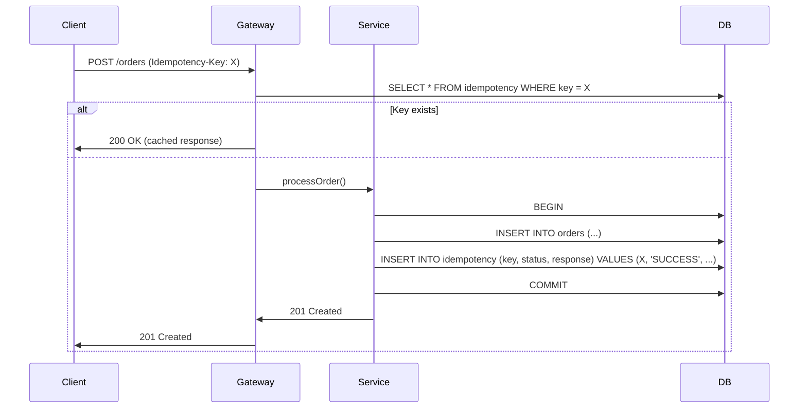

<!-- Generated by Groq via GitHub Actions -->
<!-- Topic ID: T013 -->
<!-- Category: Core Backend Fundamentals -->
<!-- Generated at UTC: 2026-09-25T13:57:05.164912+00:00 -->

# Idempotency

## 1. What problem does this solve?

**Motivation**  
When a client sends a request that changes state (e.g., create an order, charge a card, update a profile), the client often wants to be sure that the operation is performed *exactly once*. Network glitches, retries, or duplicate submissions can cause the same request to hit the server multiple times, leading to duplicate records, double charges, or inconsistent data.

**What problem exists?**  
- Duplicate side‑effects (two orders, two charges).  
- Inconsistent state (partial updates applied twice).  
- Harder error handling (client doesn’t know if the first attempt succeeded).  

**Why the problem matters**  
- Financial systems: double charging a customer is catastrophic.  
- Inventory: duplicate orders can deplete stock incorrectly.  
- User experience: duplicate emails or notifications.  

**What happens if idempotency is not used?**  
- Clients must implement complex retry logic that can’t distinguish “already processed” from “failed”.  
- Backend must guard against duplicates manually (unique constraints, checks), which is error‑prone.  
- Auditing becomes difficult because you can’t reliably trace a single logical operation.  

**Where this concept appears in real backend systems**  
- Payment gateways (Stripe, PayPal) expose an `Idempotency-Key` header.  
- Cloud APIs (AWS S3 `PUT`, Google Cloud Storage `write`).  
- Microservice orchestration (Kafka message deduplication).  
- RESTful APIs that create resources (`POST /orders`).  

---

## 2. Mental model

**Analogy**  
Imagine a vending machine that accepts a coin and dispenses a snack. If you accidentally press the button twice, you might get two snacks. An idempotent vending machine would detect the second press and refuse to dispense again, ensuring you only get one snack per coin.  

**Engineering model**  
- **Key**: A unique identifier supplied by the client (e.g., UUID).  
- **State machine**: The server stores the key and the result of the operation.  
- **Idempotent operation**: When the same key is seen again, the server returns the stored result instead of re‑executing the side‑effect.  

---

## 3. Deep explanation

### Internals
1. **Idempotency key** – a client‑generated value (UUID, hash of payload, etc.).  
2. **Storage** – persist the key + outcome (status, response body, error).  
3. **Lookup** – before performing the operation, check if the key exists.  
4. **Execution** – if not found, run the operation, store the result, and return it.  
5. **Return** – if found, return the stored result (or error) immediately.

### Important terminology
- **Idempotent**: Performing an operation multiple times has the same effect as performing it once.  
- **Idempotency key**: The unique identifier that ties a request to its outcome.  
- **Idempotency store**: The persistence layer that holds keys and results.  
- **TTL (Time‑to‑Live)**: Optional expiration for keys to avoid unbounded growth.  

### Trade‑offs
| Aspect | Benefit | Cost |
|--------|---------|------|
| **Reliability** | Guarantees single side‑effect | Requires extra storage and lookup |
| **Performance** | Fast duplicate detection | Additional DB round‑trips |
| **Complexity** | Cleaner client logic | More moving parts (key generation, storage) |
| **Consistency** | Predictable state | Need to handle partial failures (store before/after) |

### Failure modes
- **Store failure**: If the idempotency store is down, duplicates may slip through.  
- **Race conditions**: Two concurrent requests with the same key may both think they’re the first. Use atomic upsert or locking.  
- **Key collision**: Client re‑uses a key for a different operation – must be avoided.  

### Limitations
- Only protects against *exactly the same* request.  
- Does not prevent *different* requests that have the same effect (e.g., two distinct orders).  
- Requires careful key generation strategy (e.g., include payload hash).  

### Where it fits in a backend architecture
- **API gateway**: Often the first place to validate and store the key.  
- **Service layer**: Performs the actual business logic after key lookup.  
- **Database**: Stores the key + result, often in a separate table or key‑value store (Redis, PostgreSQL).  

### Interaction with related concepts
- **Transactions**: Idempotency key storage should be part of the same transaction that performs the side‑effect to avoid “key stored but operation failed”.  
- **Caching**: Idempotency store can be a cache (Redis) for fast lookup, with a fallback to persistent DB.  
- **Event sourcing**: Idempotent commands become idempotent events; duplicate events are ignored.  

---

## 4. How it works

1. Client generates a UUID `idempotencyKey`.  
2. Client sends request with header `Idempotency-Key: <key>`.  
3. API gateway checks the key store.  
   - **If key exists** → return stored response.  
   - **If key missing** → proceed.  
4. Begin a database transaction.  
5. Perform the business operation.  
6. Store the key + outcome in the idempotency table (atomic upsert).  
7. Commit the transaction.  
8. Return the response to the client.  



---

## 5. Practical implementation

Below is a minimal Node.js/TypeScript example using Express, PostgreSQL (via `pg`), and Redis for fast lookup.  
The idempotency table is in PostgreSQL; Redis is optional for performance.

```ts
// src/idempotency.ts
import { Pool } from 'pg';
import { createClient } from 'redis';

const pgPool = new Pool(); // assumes PG env vars
const redis = createClient(); // assumes REDIS_URL

/**
 * Store or retrieve idempotency result.
 * @param key - Idempotency key
 * @param fn - Function that performs the operation if key is missing
 */
export async function withIdempotency<T>(
  key: string,
  fn: () => Promise<T>
): Promise<T> {
  // 1. Fast path: check Redis
  const cached = await redis.get(key);
  if (cached) {
    return JSON.parse(cached) as T;
  }

  // 2. Lock to avoid race conditions
  const lockKey = `lock:${key}`;
  const lockAcquired = await redis.set(lockKey, '1', {
    NX: true,
    EX: 30, // 30s lock
  });

  if (!lockAcquired) {
    // Another request is processing; wait until it finishes
    await new Promise((res) => setTimeout(res, 100));
    return withIdempotency(key, fn); // retry
  }

  try {
    // 3. Check DB in case Redis missed it
    const client = await pgPool.connect();
    try {
      const res = await client.query(
        'SELECT status, response FROM idempotency WHERE key = $1',
        [key]
      );
      if (res.rows.length) {
        return JSON.parse(res.rows[0].response) as T;
      }

      // 4. Perform the operation inside a transaction
      await client.query('BEGIN');
      const result = await fn(); // e.g., createOrder()
      const responseBody = JSON.stringify(result);

      // 5. Persist idempotency record
      await client.query(
        `INSERT INTO idempotency (key, status, response, created_at)
         VALUES ($1, $2, $3, NOW())`,
        [key, 'SUCCESS', responseBody]
      );
      await client.query('COMMIT');

      // 6. Cache in Redis
      await redis.set(key, responseBody, { EX: 60 * 60 * 24 }); // 24h TTL

      return result;
    } catch (err) {
      await client.query('ROLLBACK');
      // Store failure so subsequent retries get the same error
      const errorBody = JSON.stringify({ error: err.message });
      await client.query(
        `INSERT INTO idempotency (key, status, response, created_at)
         VALUES ($1, $2, $3, NOW())
         ON CONFLICT (key) DO UPDATE SET status = EXCLUDED.status,
           response = EXCLUDED.response`,
        [key, 'FAILURE', errorBody]
      );
      await redis.set(key, errorBody, { EX: 60 * 60 * 24 });
      throw err;
    } finally {
      client.release();
    }
  } finally {
    // Release lock
    await redis.del(lockKey);
  }
}
```

**Usage in an Express route**

```ts
// src/routes/orders.ts
import express from 'express';
import { withIdempotency } from '../idempotency';
import { createOrder } from '../services/orderService';

const router = express.Router();

router.post(
  '/orders',
  async (req, res, next) => {
    const key = req.header('Idempotency-Key');
    if (!key) {
      return res.status(400).json({ error: 'Missing Idempotency-Key' });
    }

    try {
      const order = await withIdempotency(key, async () => {
        // Business logic
        return await createOrder(req.body);
      });
      res.status(201).json(order);
    } catch (err) {
      next(err);
    }
  }
);

export default router;
```

**`createOrder` example**

```ts
// src/services/orderService.ts
import { Pool } from 'pg';
const pool = new Pool();

export async function createOrder(data: any) {
  const client = await pool.connect();
  try {
    await client.query('BEGIN');
    const insert = await client.query(
      'INSERT INTO orders (user_id, amount, status) VALUES ($1, $2, $3) RETURNING *',
      [data.userId, data.amount, 'PENDING']
    );
    const order = insert.rows[0];
    await client.query('COMMIT');
    return order;
  } catch (err) {
    await client.query('ROLLBACK');
    throw err;
  } finally {
    client.release();
  }
}
```

---

## 6. Production considerations

| Concern | How idempotency helps / what to watch |
|---------|---------------------------------------|
| **Scalability** | Store keys in a distributed cache (Redis cluster) to avoid bottlenecks. |
| **Reliability** | Store key + result in the same transaction as the business operation. |
| **Security** | Validate key format; reject duplicate keys from different users. |
| **Observability** | Log key usage, cache hits/misses, and lock contention. |
| **Performance** | Use Redis for fast lookup; fall back to DB only on cache miss. |
| **Error handling** | Persist failures so retries return the same error. |
| **Resource usage** | TTL on keys to prevent unbounded growth. |
| **Operational concerns** | Monitor Redis health, key eviction policy, and DB replication lag. |
| **Failure recovery** | If the idempotency store fails, fallback to a “best‑effort” mode or reject requests. |
| **Deployment** | Ensure idempotency store is part of the same deployment pipeline; version‑compatible schema migrations. |

---

## 7. Common mistakes

| Mistake | Why it’s problematic |
|---------|----------------------|
| **Using a non‑unique key** (e.g., timestamp) | Two different requests can share the same key → duplicate suppression of distinct operations. |
| **Storing only success** | If a request fails, subsequent retries may never see the failure and keep retrying until timeout. |
| **No lock or race guard** | Two concurrent requests with the same key can both execute the operation, causing duplicates. |
| **Long TTLs without cleanup** | Keys accumulate, consuming memory and slowing lookups. |
| **Ignoring idempotency in downstream services** | If a microservice calls another service that isn’t idempotent, duplicates can still propagate. |
| **Client generating key after request** | If the key is generated server‑side, the client can’t retry with the same key. |
| **Using HTTP status 200 for failures** | Clients may think the operation succeeded; use 4xx/5xx consistently. |

---

## 8. Senior engineer perspective

### What changes at scale?
- **Distributed cache**: Use Redis Cluster or DynamoDB with partitioning.  
- **Atomicity**: Leverage `INSERT ... ON CONFLICT` or `SELECT FOR UPDATE` to avoid race conditions.  
- **Batching**: For high‑volume services, batch idempotency checks to reduce round‑trips.  
- **Observability**: Instrument key hit/miss ratios, lock wait times, and error rates.  
- **Cost**: Redis memory cost scales with key count; consider TTL policies or pruning strategies.  

### Design decisions
- **Key format**: UUID v4 vs. hash of payload + user ID.  
- **Storage choice**: Redis for speed vs. PostgreSQL for durability.  
- **Locking strategy**: Distributed lock (Redlock) vs. database row lock.  
- **TTL**: 24h for most ops; longer for critical ones.  
- **Idempotency per service**: Each microservice maintains its own store to avoid cross‑service contamination.  

### Bottlenecks
- **Cache saturation**: Redis memory limits.  
- **Lock contention**: High concurrency on the same key (rare but possible).  
- **Database write amplification**: Every operation writes to the idempotency table.  

### Failure scenarios
- **Cache outage**: Fallback to DB lookup; may increase latency.  
- **DB replication lag**: A read from a replica might miss a recent key; use primary or consistent reads.  

### Monitoring
- **Key hit/miss ratio**  
- **Lock acquisition time**  
- **TTL expiration rate**  
- **Error rate per key**  

### When NOT to use
- **Read‑only operations** – idempotency is unnecessary.  
- **Idempotent by nature** (e.g., `GET /status`).  
- **Low‑volume, low‑risk services** – the overhead may outweigh benefits.  

---

## 9. Interview questions

1. **Beginner**: *What is an idempotency key and why do we use it?*  
   *Answer*: A unique identifier supplied by the client that ties a request to its outcome, ensuring the same operation is performed only once.

2. **Beginner**: *How would you implement idempotency in a REST API?*  
   *Answer*: Store the key and result in a database or cache; on each request, check the store, return cached result if present, otherwise execute and persist.

3. **Senior**: *Explain how you would handle race conditions when two identical requests hit the service concurrently.*  
   *Answer*: Use an atomic upsert (`INSERT ... ON CONFLICT`) or a distributed lock (Redis `SET NX`) to ensure only one request proceeds with the operation.

4. **Senior**: *Discuss trade‑offs between using Redis vs. PostgreSQL for the idempotency store at scale.*  
   *Answer*: Redis offers sub‑millisecond lookups but is volatile; PostgreSQL guarantees durability and can be sharded but adds latency. Consider TTL, durability needs, and cost.

5. **Scenario/Debugging**: *A client reports that after retrying a payment request, they received two charges. What could have gone wrong and how would you investigate?*  
   *Answer*: Likely the idempotency key was missing or changed, or the key was not persisted before the operation. Check logs for key presence, verify the store for the key, inspect transaction boundaries, and ensure the client sends the same key on retry.

---

## 10. Hands‑on task

**Task**: Add idempotency support to the existing `/orders` endpoint in the repository.

1. Create an `idempotency` table in PostgreSQL with columns: `key (PK)`, `status`, `response`, `created_at`.  
2. Implement the `withIdempotency` helper as shown above.  
3. Modify the `/orders` route to require an `Idempotency-Key` header and use the helper.  
4. Write a test that sends the same request twice with the same key and asserts that the database contains only one order record.  
5. (Optional) Add a Redis cache layer and measure the difference in latency between cache hit and miss.

---

## 11. Quick revision

- Idempotency guarantees a single side‑effect for repeated identical requests.  
- Client supplies a unique `Idempotency-Key`.  
- Server checks a fast store (Redis) → if found, return cached response.  
- If not found, execute operation inside a transaction, persist key + result.  
- Use atomic upsert or distributed lock to avoid race conditions.  
- Store failures so retries return the same error.  
- TTLs prevent unbounded growth; monitor hit/miss ratios.  
- Common pitfalls: non‑unique keys, missing failure storage, race conditions.  
- At scale: choose Redis vs. DB, lock strategy, observability, cost.  
- Interview focus: key purpose, implementation, race handling, trade‑offs.

---

## 12. References

- [HTTP Idempotency-Key Header – MDN](https://developer.mozilla.org/en-US/docs/Web/HTTP/Headers/Idempotency-Key)  
- [PostgreSQL Upsert – INSERT … ON CONFLICT](https://www.postgresql.org/docs/current/sql-insert.html)  
- [Redis SET NX / Redlock](https://redis.io/docs/reference/patterns/distributed-locks/)  
- [Express.js Request Handling](https://expressjs.com/en/guide/routing.html)  
- [FastAPI Idempotency Example](https://fastapi.tiangolo.com/tutorial/advanced-usage/#idempotency)  
- [Stripe Idempotency Keys](https://stripe.com/docs/api/idempotency-keys)  

---
