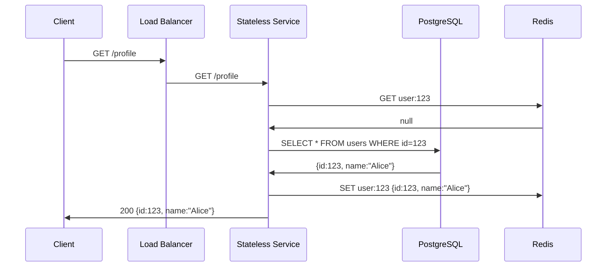
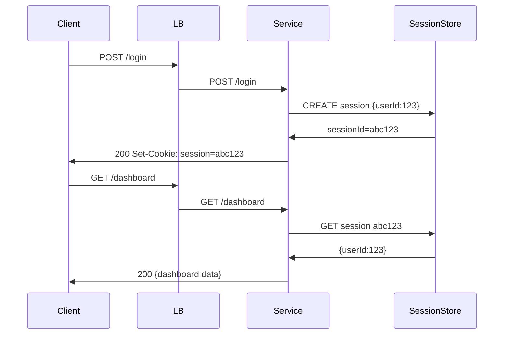

<!-- Generated by Groq via GitHub Actions -->
<!-- Topic ID: T014 -->
<!-- Category: Core Backend Fundamentals -->
<!-- Generated at UTC: 2026-09-25T13:57:05.164912+00:00 -->

# Stateless vs Stateful Services

## 1. What problem does this solve?

| Problem | Why it matters | Consequence of ignoring it | Real‑world example |
|---------|----------------|---------------------------|--------------------|
| **Scaling bottlenecks** | A single server that keeps all session data can become a single point of failure and a resource hog. | Traffic spikes can overwhelm the server, leading to slow responses or crashes. | A login service that stores user session in memory on a single Node.js instance. |
| **Failover complexity** | If a service crashes, you lose all in‑memory state unless you replicate it. | Users lose sessions, data corruption, or need to re‑authenticate. | A chat server that keeps conversation state only in RAM. |
| **Load balancing difficulty** | Sticky sessions are required to keep a user on the same instance, limiting true horizontal scaling. | Load balancers must maintain session affinity, increasing complexity and reducing fault tolerance. | A shopping cart service that stores cart items in a local cache. |
| **Observability & debugging** | Stateful services hide where data lives, making it hard to trace bugs across instances. | Hard to reproduce issues, longer MTTR. | A recommendation engine that keeps user preferences in a local file. |

In production, most backends aim to be **stateless** so that any instance can serve any request. When state is required, it is externalized (database, cache, message queue) so that the service itself remains stateless.

---

## 2. Mental model

### Analogy: The Post Office

| Stateless service | Stateful service |
|-------------------|------------------|
| **Post office clerk**: receives a letter, stamps it, hands it to the courier. The clerk never remembers the letter after handing it off. | **Post office clerk**: receives a letter, keeps it in a drawer until the recipient picks it up. The clerk must remember where each letter is. |

- **Stateless**: The clerk never keeps track of the letter after processing; any clerk can handle any letter.  
- **Stateful**: The clerk must remember the letter’s location, so only that clerk can retrieve it.

### Engineering model

- **Stateless**: Each request is independent; the service has no persistent memory between calls.  
- **Stateful**: The service retains data (session, cache, in‑memory state) that influences subsequent requests.

---

## 3. Deep explanation

### Internals

| Stateless | Stateful |
|-----------|----------|
| No per‑request memory beyond local variables. | Keeps data in RAM, files, or in‑process structures. |
| All data must be passed in the request or fetched from external stores. | Can read/write directly to local data structures. |

### Important terminology

- **Session**: A logical grouping of requests belonging to the same user.  
- **Sticky session**: Load balancer routing that keeps a user’s requests to the same instance.  
- **External state store**: DB, Redis, Kafka, etc. used to persist state.  
- **Idempotency**: Ability to safely retry a request without side effects.  

### Trade‑offs

| Stateless | Stateful |
|-----------|----------|
| **Pros**: Horizontal scaling, easier failover, simpler load balancing, better observability. | **Pros**: Faster access to data, lower latency for stateful operations, simpler code for certain patterns (e.g., in‑memory cache). |
| **Cons**: Requires external stores, potential network latency, higher operational cost for state stores. | **Cons**: Sticky sessions, single‑point failure, harder to scale, more complex recovery. |

### Failure modes

- **Stateless**: Failure of external store (DB, cache) can cause service errors.  
- **Stateful**: Instance crash loses in‑memory state unless persisted; sticky sessions can cause uneven load.

### Limitations

- Stateless services cannot keep per‑user data in RAM; must use external stores.  
- Stateful services cannot scale beyond the memory of a single instance unless state is sharded or replicated.

### Where it fits in architecture

- **Stateless**: API gateways, microservice endpoints, background workers.  
- **Stateful**: Session stores, in‑memory caches, real‑time analytics engines.

### Interaction with related concepts

- **Caching**: Stateless services often use external caches (Redis).  
- **Idempotency keys**: Needed for stateless services to safely retry.  
- **Event sourcing**: Moves state to an event log, enabling stateless event handlers.  
- **Container orchestration**: Stateless services are easier to deploy with Kubernetes; stateful services require StatefulSets or external volumes.

---

## 4. How it works

### Stateless request flow



### Stateful request flow



---

## 5. Practical implementation

### Stateless service with external Redis cache (Node.js)

```ts
// src/server.ts
import express from 'express';
import { createClient } from 'redis';

const app = express();
const redis = createClient(); // defaults to localhost:6379

redis.on('error', console.error);
await redis.connect();

app.get('/profile/:id', async (req, res) => {
  const id = req.params.id;
  // 1️⃣ Try cache
  const cached = await redis.get(`user:${id}`);
  if (cached) {
    return res.json(JSON.parse(cached));
  }

  // 2️⃣ Fallback to DB (pseudo)
  const user = await fakeDbQuery(id); // replace with real DB call

  // 3️⃣ Store in cache
  await redis.set(`user:${id}`, JSON.stringify(user), {
    EX: 60 * 5, // 5 minutes
  });

  res.json(user);
});

app.listen(3000, () => console.log('Server listening on 3000'));
```

**Key lines**

- `redis.get` and `redis.set` keep the service stateless; all state lives in Redis.  
- No per‑request memory beyond local variables.  
- If the service restarts, it still works because the cache is external.

### Stateful service example: in‑memory session store (Node.js)

```ts
// src/sessionService.ts
import express from 'express';
import { v4 as uuidv4 } from 'uuid';

const app = express();
app.use(express.json());

const sessions: Record<string, { userId: string }> = {};

app.post('/login', (req, res) => {
  const { userId } = req.body;
  const sessionId = uuidv4();
  sessions[sessionId] = { userId };
  res.cookie('session', sessionId, { httpOnly: true });
  res.send('Logged in');
});

app.get('/profile', (req, res) => {
  const sessionId = req.cookies.session;
  const session = sessions[sessionId];
  if (!session) return res.status(401).send('Unauthenticated');
  res.json({ userId: session.userId });
});

app.listen(3001, () => console.log('Stateful server listening on 3001'));
```

**Why this is stateful**

- `sessions` object lives in the process memory.  
- If the process restarts, all sessions are lost.  
- Load balancer must use sticky sessions to keep a user on the same instance.

---

## 6. Production considerations

| Concern | Stateless | Stateful |
|---------|-----------|----------|
| **Scalability** | Easy horizontal scaling; any instance can serve any request. | Limited by memory; requires sticky sessions or sharding. |
| **Reliability** | Failover is simple; new instances can take over. | Single instance failure loses state; requires replication. |
| **Security** | No local secrets; external stores can be secured. | In‑memory data may be exposed if the instance is compromised. |
| **Observability** | Logs and metrics are consistent across instances. | Need to aggregate state logs; harder to trace. |
| **Performance** | Network hop to external store may add latency. | Direct memory access is fastest. |
| **Error handling** | External store failures must be retried or fallback. | Instance crashes cause immediate loss of state. |
| **Resource usage** | Minimal RAM per instance. | High RAM usage for large state. |
| **Operational concerns** | Manage external store scaling, persistence, backups. | Manage sticky session load balancer, state replication. |
| **Failure recovery** | Restarting service is trivial. | Must restore state from backup or re‑create. |
| **Deployment** | Stateless containers are idempotent. | Stateful containers need persistent volumes or external stores. |

---

## 7. Common mistakes

| Mistake | Why it’s problematic |
|---------|----------------------|
| **Storing session data in a local variable** | Breaks horizontal scaling; sticky sessions become mandatory. |
| **Assuming a stateless service can cache without external store** | Caches in RAM still create state; risk of data loss on restart. |
| **Using in‑memory cache for critical data without persistence** | Data loss on crash; no durability guarantees. |
| **Ignoring idempotency in stateless APIs** | Duplicate requests can cause duplicate side effects. |
| **Over‑caching in stateless services** | Cache misses become expensive; stale data may be served. |
| **Not handling external store failures** | Service crashes or returns 5xx when DB/Redis is down. |
| **Using sticky sessions with stateless services** | Misses scaling benefits; can create load imbalance. |

---

## 8. Senior engineer perspective

### Architecture decisions

- **Choose stateless for API gateways, microservices, background workers.**  
- **Use stateful only when latency is critical and data can be kept in RAM** (e.g., in‑memory cache, real‑time analytics).  
- **Externalize state**: Redis for sessions, PostgreSQL for durable data, Kafka for event streams.

### Trade‑offs & bottlenecks

- **Cache hit ratio**: Low hit ratio turns stateless service into a DB bottleneck.  
- **Network latency**: External store latency can dominate request time.  
- **Consistency**: Distributed caches need eventual consistency; consider read‑your‑write patterns.  
- **Cost**: External stores (Redis, DB) add operational cost; weigh against in‑memory RAM cost.

### Failure scenarios

- **Cache outage**: Fallback to DB; add circuit breaker.  
- **DB outage**: Use read replicas, graceful degradation.  
- **Network partition**: Ensure service can still serve cached data or return 503.

### Monitoring

- **Cache hit/miss ratio**  
- **External store latency**  
- **Instance memory usage** (for stateful services)  
- **Circuit breaker metrics**  

### Cost/performance

- **Stateless**: Lower per‑instance cost, but higher external store cost.  
- **Stateful**: Higher RAM cost, but lower network latency.

### When NOT to use stateless

- When you need **real‑time in‑memory state** that cannot tolerate network latency (e.g., high‑frequency trading).  
- When the state is **small and short‑lived** and can be kept in a lightweight in‑process cache without external store overhead.

---

## 9. Interview questions

1. **Beginner**: *What does it mean for a service to be stateless?*  
   *Answer*: Each request is independent; the service does not keep any per‑user or per‑request data between calls. All state must be passed in the request or fetched from an external store.

2. **Beginner**: *Why do we use sticky sessions with stateful services?*  
   *Answer*: Sticky sessions ensure that subsequent requests from the same user hit the same instance that holds their session data in memory.

3. **Senior**: *Explain how you would design a session store that balances the need for speed and durability.*  
   *Answer*: Use Redis for fast in‑memory access, with persistence enabled (RDB/AOF) or replication to a master for durability. Optionally, fall back to a relational DB for audit logs.

4. **Senior**: *Describe a scenario where making a stateless service fail‑fast on external store failure is preferable to retrying.*  
   *Answer*: In a payment processing API, retrying on DB outage could double‑charge a user. A fail‑fast response (503) forces the client to retry later, preserving idempotency.

5. **Scenario/Debugging**: *You have a stateless API that suddenly starts returning 500 errors. The logs show “Connection refused” to Redis. What steps do you take to diagnose and fix the issue?*  
   *Answer*:  
   - Verify Redis pod/service is running and reachable (kubectl get pods, logs).  
   - Check network policies/ingress rules.  
   - Inspect Redis metrics for memory exhaustion or restarts.  
   - Add a circuit breaker or fallback to a secondary cache.  
   - Update deployment to include readiness/liveness probes to prevent traffic before Redis is ready.

---

## 10. Hands‑on task

**Task**: Build a simple stateless “product catalog” API that caches product data in Redis.  
- **Requirements**:
  1. `GET /products/:id` returns product details.  
  2. Cache product data for 10 minutes.  
  3. If Redis is down, fallback to a mock in‑memory DB.  
  4. Add a health check endpoint `/health` that reports Redis status.  
- **Deliverables**:  
  - `src/server.ts` with Express, Redis client, and fallback logic.  
  - Dockerfile to run the service.  
  - README with instructions to run locally and test the cache hit/miss.

---

## 11. Quick revision

- Stateless services: no per‑request memory; all state externalized.  
- Stateful services: keep data in RAM; require sticky sessions or replication.  
- External stores (DB, Redis, Kafka) are the backbone of stateless design.  
- Idempotency keys protect against duplicate requests in stateless APIs.  
- Cache hit ratio directly impacts latency and DB load.  
- Circuit breakers prevent cascading failures when external stores fail.  
- Sticky sessions are a sign of stateful design; avoid them for true horizontal scaling.  
- Monitoring cache metrics (hits/misses, latency) is essential for performance tuning.  
- In production, stateless services are easier to deploy, scale, and recover.  
- Use stateful services only when latency or data size justifies in‑memory storage.

---

## 12. References

- [Node.js Redis client documentation](https://github.com/redis/node-redis)  
- [Express.js API documentation](https://expressjs.com/)  
- [Redis best practices](https://redis.io/docs/management/best-practices/)  
- [Kubernetes StatefulSets](https://kubernetes.io/docs/concepts/workloads/controllers/statefulset/)  
- [Circuit Breaker pattern](https://martinfowler.com/bliki/CircuitBreaker.html)  
- [PostgreSQL documentation](https://www.postgresql.org/docs/)  
- [FastAPI documentation](https://fastapi.tiangolo.com/)  
- [Next.js API routes](https://nextjs.org/docs/api-routes/introduction)
