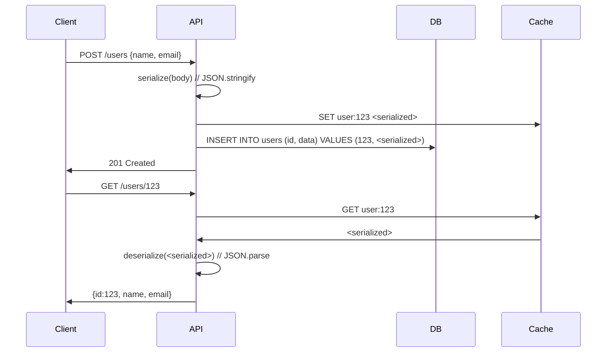

<!-- Generated by Groq via GitHub Actions -->
<!-- Topic ID: T015 -->
<!-- Category: Core Backend Fundamentals -->
<!-- Generated at UTC: 2026-09-25T18:01:35.631821+00:00 -->

# Serialization / deserialization

## 1. What problem does this solve?

- **Data transport & persistence** – When a backend sends data over the network or writes it to a database, the in‑memory JavaScript/TypeScript objects must be converted into a format that can be stored or transmitted (JSON, binary, CSV, etc.).  
- **Type safety & validation** – Deserialization turns the raw payload back into typed objects that the application can safely work with.  
- **Inter‑service communication** – Microservices often communicate via HTTP, gRPC, Kafka, etc.; each side must agree on a wire format.  
- **Caching & storage** – Redis, Memcached, or file systems store serialized blobs; deserialization restores the original structure.  

**Why it matters**  
Without proper serialization you risk data corruption, security holes (e.g., code injection via eval), and brittle APIs that break when the data shape changes.

**What happens if it’s not used**  
- Raw objects cannot be persisted or sent.  
- APIs become untyped, leading to runtime errors.  
- Systems cannot evolve independently; a change in one service breaks others.  

**Real‑world appearance**  
- REST APIs: JSON bodies.  
- Message queues: Avro/Protobuf payloads.  
- Redis caches: JSON or binary blobs.  
- gRPC services: Protobuf.  
- Database ORMs: mapping rows to objects.

---

## 2. Mental model

**Analogy**  
Think of a suitcase.  
- **Packing** (serialization) turns a messy pile of clothes into a neatly organized, labeled bag.  
- **Unpacking** (deserialization) restores the clothes to their original state for use.  
If you forget to label the suitcase, you’ll struggle to find the right item later.

**Engineering model**  
- **Serializer**: walks an object graph, converts each value to a linear representation (string, buffer).  
- **Deserializer**: reads the linear data, reconstructs the original graph, applying type conversions and validation.

---

## 3. Deep explanation

### Internals
| Format | Typical API | Performance | Human‑readable |
|--------|-------------|-------------|----------------|
| JSON | `JSON.stringify` / `JSON.parse` | ~10‑30 µs per MB | ✅ |
| MessagePack | `msgpack-lite` | ~5‑10 µs per MB | ❌ |
| Protobuf | `protobufjs` | ~1‑3 µs per MB | ❌ |
| Avro | `avsc` | ~2‑5 µs per MB | ❌ |

### Important terminology
- **Schema** – formal description of the data shape (JSON Schema, Protobuf `.proto`, Avro `.avsc`).  
- **Schema registry** – central store for schemas, used by Kafka Connect, Confluent.  
- **Schema evolution** – adding/removing fields while maintaining backward/forward compatibility.  
- **Wire format** – the on‑the‑wire representation (JSON string, binary buffer).  
- **Codec** – component that knows how to encode/decode a specific format.

### Trade‑offs
| Factor | JSON | Protobuf |
|--------|------|----------|
| Readability | ✅ | ❌ |
| Size | ❌ | ✅ |
| Speed | ❌ | ✅ |
| Type safety | ❌ | ✅ |
| Tooling | ✅ | ✅ (schema registry, codegen) |

### Failure modes
- **Circular references** – `JSON.stringify` throws.  
- **Missing required fields** – deserializer may produce `undefined` or throw.  
- **Type mismatches** – e.g., string instead of number.  
- **Schema drift** – new field added without backward compatibility.

### Limitations
- Cannot serialize functions, prototypes, or closures.  
- Binary formats require a schema; JSON does not enforce one.  
- Large payloads can cause GC pressure if not streamed.

### Where it fits
- **API layer** – request/response bodies.  
- **Message brokers** – Kafka, RabbitMQ.  
- **Cache layer** – Redis, Memcached.  
- **Persistence** – ORMs, raw SQL/NoSQL drivers.  

### Interaction with related concepts
- **Validation** – often coupled with deserialization (`class-validator`).  
- **Compression** – gzip/deflate before sending.  
- **Encryption** – TLS for transport, field‑level encryption for storage.  
- **Observability** – metrics on payload size, serialization latency.

---

## 4. How it works



---

## 5. Practical implementation

### 5.1 TypeScript + Node.js – JSON with validation

```ts
// src/user.ts
import { plainToInstance, Transform } from 'class-transformer';
import { IsEmail, IsString, validateSync } from 'class-validator';

export class User {
  @IsString()
  id!: string;

  @IsString()
  name!: string;

  @IsEmail()
  email!: string;

  // Convert Date string to Date object on deserialization
  @Transform(({ value }) => new Date(value), { toClassOnly: true })
  createdAt!: Date;
}
```

```ts
// src/handlers.ts
import { Request, Response } from 'express';
import { User } from './user';

export const createUser = async (req: Request, res: Response) => {
  const user = plainToInstance(User, req.body);
  const errors = validateSync(user);
  if (errors.length) {
    return res.status(400).json({ errors });
  }

  // Persist raw JSON (could also use a binary format)
  await redis.set(`user:${user.id}`, JSON.stringify(user));
  await db.query('INSERT INTO users (id, data) VALUES ($1, $2)', [
    user.id,
    JSON.stringify(user),
  ]);

  res.status(201).json(user);
};

export const getUser = async (req: Request, res: Response) => {
  const id = req.params.id;
  const raw = await redis.get(`user:${id}`);
  if (!raw) {
    return res.status(404).send('Not found');
  }
  const user = plainToInstance(User, JSON.parse(raw));
  res.json(user);
};
```

### 5.2 Binary serialization – Protobuf with `protobufjs`

```ts
// proto/user.proto
syntax = "proto3";
package api;

message User {
  string id = 1;
  string name = 2;
  string email = 3;
  int64 created_at = 4; // Unix timestamp
}
```

```ts
// src/proto.ts
import * as protobuf from 'protobufjs';

export const root = await protobuf.load('proto/user.proto');
export const UserMessage = root.lookupType('api.User');
```

```ts
// src/kafkaProducer.ts
import { UserMessage } from './proto';
import { Kafka } from 'kafkajs';

const kafka = new Kafka({ brokers: ['kafka:9092'] });
const producer = kafka.producer();

export const sendUser = async (user: any) => {
  const payload = UserMessage.create({
    ...user,
    created_at: Date.now(),
  });
  const buffer = UserMessage.encode(payload).finish();

  await producer.connect();
  await producer.send({
    topic: 'users',
    messages: [{ key: user.id, value: buffer }],
  });
};
```

---

## 6. Production considerations

| Concern | What to watch for | Mitigation |
|---------|-------------------|------------|
| **Scalability** | Serialization overhead on high‑throughput streams | Use binary formats, stream encoding, batch processing |
| **Reliability** | Schema drift causing consumer failures | Versioned schemas, schema registry, graceful fallback |
| **Security** | Injection via deserialized data | Strict schema validation, avoid `eval`, use safe parsers |
| **Observability** | Latency spikes in serialization | Export metrics (size, time), log warnings |
| **Performance** | GC pressure from large JSON objects | Stream parsing, use buffers, avoid deep copies |
| **Error handling** | Partial deserialization | Wrap in try/catch, provide default values, log errors |
| **Resource usage** | Memory for large payloads | Use streaming APIs, compress payloads |
| **Operational** | Schema evolution | Maintain backward/forward compatibility, use compatibility checks |
| **Failure recovery** | Consumer crashes on new schema | Use schema registry with compatibility checks, retry logic |
| **Deployment** | Different environments using different versions | Pin schema versions, use CI to test against registry |

---

## 7. Common mistakes

| Mistake | Why it’s bad |
|---------|--------------|
| Using `JSON.stringify` on objects with circular refs | Throws `TypeError`; leads to crashes |
| Skipping validation on deserialization | Allows malformed data to enter the system |
| Hard‑coding field names in serializers | Breaks when schema evolves |
| Using `eval` or `new Function` to parse payloads | Security vulnerability (code injection) |
| Storing raw JavaScript objects in Redis without serialization | Inconsistent data across language boundaries |
| Ignoring schema evolution | Consumers break when producers add fields |
| Not handling `null`/`undefined` during deserialization | Unexpected `undefined` values in code |
| Over‑compressing without considering CPU cost | CPU bottleneck on high‑throughput services |

---

## 8. Senior engineer perspective

### Architecture decisions
- **Protocol choice**: JSON for human‑readable APIs, Protobuf/Avro for internal Kafka streams.  
- **Schema registry**: Centralized, versioned schemas; enforce compatibility.  
- **Streaming vs batch**: Use `kafkajs` with `buffer` payloads for low latency.  

### Trade‑offs
- **Readability vs size**: JSON is easier to debug but larger; binary formats reduce bandwidth but add complexity.  
- **Speed vs safety**: Fast JSON parsing vs strict schema validation.  

### Bottlenecks
- **Serialization CPU**: High‑throughput services may hit CPU limits.  
- **Network bandwidth**: Large payloads increase latency.  

### Failure scenarios
- **Schema mismatch**: Consumer fails to decode; use graceful degradation or fallback.  
- **Version drift**: Old consumers reading new messages; maintain backward compatibility.  

### Monitoring
- **Metrics**: `serialization.time`, `message.size`, `deserialization.errors`.  
- **Tracing**: Propagate schema version in trace context.  

### Cost/performance
- **Compression**: gzip vs snappy; balance CPU vs bandwidth.  
- **Storage**: Binary formats reduce disk usage.  

### When NOT to use
- Simple monoliths with low traffic: JSON is sufficient.  
- One‑off scripts: avoid adding a schema registry.  

---

## 9. Interview questions

1. **Beginner** – *What is the difference between serialization and deserialization?*  
   *Answer:* Serialization turns an in‑memory object into a linear format (JSON, binary). Deserialization reverses that process, reconstructing the object from the linear data.

2. **Beginner** – *Why might you prefer Protobuf over JSON in a microservice architecture?*  
   *Answer:* Protobuf is smaller, faster, and provides a strict schema that enforces type safety and backward compatibility.

3. **Senior** – *How would you design a system that needs to evolve its data schema without breaking existing consumers?*  
   *Answer:* Use a schema registry, versioned schemas, enforce backward compatibility, provide default values, and test consumers against new schemas before deployment.

4. **Senior** – *Describe a scenario where serialization could become a performance bottleneck and how you would mitigate it.*  
   *Answer:* High‑throughput Kafka producers serializing large JSON objects can saturate CPU. Mitigate by switching to binary formats, streaming encoding, batching, or offloading to a dedicated serialization service.

5. **Scenario/Debugging** – *You receive a `TypeError: Converting circular structure to JSON` when logging a request body. What’s happening and how would you fix it?*  
   *Answer:* The request body contains a circular reference (e.g., a parent/child relationship). Use a custom replacer in `JSON.stringify`, remove circular refs before logging, or use a library like `flatted`.

---

## 10. Hands‑on task

**Build a small service that:**

1. Exposes `POST /users` to accept a user object (`id`, `name`, `email`).  
2. Serializes the user to a Protobuf buffer and stores it in Redis under key `user:{id}`.  
3. Exposes `GET /users/:id` that retrieves the buffer from Redis, deserializes it back to a JavaScript object, and returns JSON.  

**Requirements**

- Use `protobufjs` for schema definition and encoding/decoding.  
- Validate incoming data with `class-validator`.  
- Log serialization/deserialization times.  
- Write a simple Jest test that creates a user, stores it, retrieves it, and asserts equality.

---

## 11. Quick revision

- Serialization = object → linear format; deserialization = reverse.  
- JSON: human‑readable, no schema enforcement.  
- Protobuf/Avro: binary, schema‑driven, smaller & faster.  
- Schema registry keeps schemas versioned and compatible.  
- Validation is essential before deserialization.  
- Circular refs break `JSON.stringify`; use replacer or custom logic.  
- Compression reduces bandwidth but adds CPU cost.  
- Monitor size, latency, and error rates of serialization.  
- Use streaming APIs for large payloads.  
- Always handle missing/extra fields gracefully.  
- Keep serializers stateless to avoid memory leaks.  
- Prefer immutable data structures when possible.

---

## 12. References

- MDN Web Docs – `JSON.stringify` / `JSON.parse`: https://developer.mozilla.org/en-US/docs/Web/JavaScript/Reference/Global_Objects/JSON  
- Node.js Docs – `stream` module: https://nodejs.org/api/stream.html  
- TypeScript Handbook – Decorators: https://www.typescriptlang.org/docs/handbook/decorators.html  
- class-transformer: https://github.com/typestack/class-transformer  
- class-validator: https://github.com/typestack/class-validator  
- protobufjs: https://github.com/protobufjs/protobuf.js  
- Confluent Schema Registry: https://docs.confluent.io/platform/current/schema-registry/index.html  
- KafkaJS: https://kafka.js.org/  
- Redis Node.js Client: https://github.com/redis/node-redis  
- FastAPI Docs – Pydantic models: https://fastapi.tiangolo.com/tutorial/advanced-models/  

---
