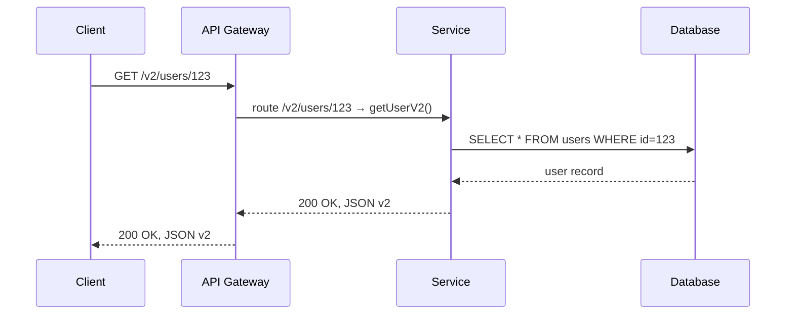
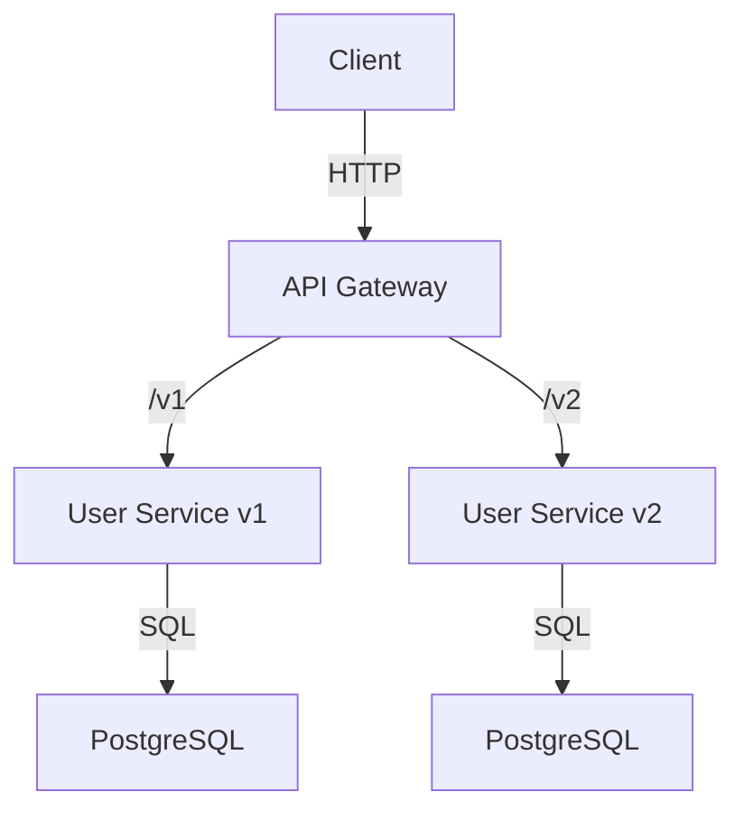

<!-- Generated by Groq via GitHub Actions -->
<!-- Topic ID: T016 -->
<!-- Category: Core Backend Fundamentals -->
<!-- Generated at UTC: 2026-09-25T18:01:35.631821+00:00 -->

# API versioning

## 1. What problem does this solve?

**Motivation**  
When a backend exposes an HTTP API, clients (web, mobile, third‑party services) depend on the shape of the data and the semantics of the endpoints. As the product evolves, new fields, new endpoints, or changed business rules are added. If we simply overwrite the existing routes, every client that still expects the old contract will break.

**Problems that arise**

| Problem | Why it matters | Consequence if ignored |
|---------|----------------|------------------------|
| **Breaking changes** | Clients may crash, show wrong data, or lose functionality. | Loss of user trust, support tickets, and revenue. |
| **Regression risk** | New code may inadvertently change the API contract. | Hard to detect without versioning. |
| **Deployment cadence** | Continuous delivery demands frequent changes. | Cannot ship new features without risking existing clients. |
| **Legal/Compliance** | Some APIs are regulated and must maintain a stable contract. | Violations, fines, or legal disputes. |

**Where it appears in real systems**

- Public REST APIs (Stripe, GitHub, Google Cloud)
- Internal microservice contracts (e.g., a user service that feeds many downstream services)
- Mobile backends that need to support multiple app releases simultaneously
- AI model serving endpoints that evolve as models improve

---

## 2. Mental model

**Analogy – Library book editions**  
Think of an API like a library’s book collection. Each book has an edition number. Readers (clients) can request a specific edition. If the library updates the book, it publishes a new edition but keeps the old one available. Readers who need the older content can still access it.  

**Engineering model**  
An API version is a *namespace* that groups a set of endpoints and data contracts. Clients explicitly request the namespace (e.g., `/v1/...` or `Accept: application/vnd.myapi.v2+json`). The server routes the request to the correct implementation, allowing multiple versions to coexist.

---

## 3. Deep explanation

### Internals

| Concept | What it is | How it works |
|---------|------------|--------------|
| **URL path versioning** | Embed the version in the URL (`/v1/users`) | Simple routing; stateless; easy to cache |
| **Header versioning** | Use a custom header or media type (`Accept: application/vnd.myapi.v2+json`) | Keeps URLs clean; supports content negotiation |
| **Query param versioning** | `?api_version=2` | Quick to add but can be abused; not cache‑friendly |
| **Content‑type negotiation** | `Content-Type: application/vnd.myapi+json; version=2` | Allows multiple representations in one endpoint |

### Important terminology

- **Contract** – The exact shape of request/response payloads.
- **Deprecation** – Marking a version as soon to be removed.
- **Semantic versioning** – Using `MAJOR.MINOR.PATCH` to signal breaking vs. non‑breaking changes.
- **Feature flag** – Toggle new behavior without changing the API surface.

### Trade‑offs

| Approach | Pros | Cons |
|----------|------|------|
| Path | Easy to understand, cacheable, no header parsing | URL clutter, hard to support multiple media types |
| Header | Clean URLs, supports content negotiation | Requires clients to set headers; harder to test in browsers |
| Query | Quick to add | Not cache‑friendly; can be misused |
| Content‑type | Fine‑grained control | Requires custom media types; more complex server logic |

### Failure modes

- **Unintended version drift** – Adding a breaking change to `/v1` without bumping the version.
- **Version leakage** – Exposing internal implementation details in the public contract.
- **Stale data** – Clients using old versions may receive outdated data if the underlying schema changes.

### Limitations

- **Storage cost** – Maintaining multiple code paths can increase codebase size.
- **Testing overhead** – Each version needs its own test suite.
- **Deployment complexity** – Rolling back a specific version may require separate containers or services.

### Where it fits in a backend architecture

```
┌─────────────────────┐
│  Client (Web/Mobile)│
└───────┬──────────────┘
        │
        ▼
┌─────────────────────┐
│  API Gateway / Router│
└───────┬──────────────┘
        │
        ▼
┌─────────────────────┐
│  Service (Node.js,  │
│   FastAPI, etc.)     │
└───────┬──────────────┘
        │
        ▼
┌─────────────────────┐
│  Database / Cache   │
└─────────────────────┘
```

The gateway handles version routing; services expose multiple handlers per version; databases may use versioned schemas or feature flags.

### Interaction with related concepts

- **Feature flags** – Can be used to enable or disable new API features without version changes.
- **Schema evolution** – Database migrations must align with API version changes.
- **Observability** – Metrics should include the API version to detect usage patterns.
- **Security** – Different versions may have different authentication/authorization requirements.

---

## 4. How it works

### Step‑by‑step flow (path versioning)



### Architecture diagram (gateway + multiple services)



---

## 5. Practical implementation

Below is a minimal Node.js/Express example that supports both path and header versioning.  
It uses TypeScript for type safety.

```ts
// src/server.ts
import express, { Request, Response } from 'express';
import { getUserV1, getUserV2 } from './users';

const app = express();
app.use(express.json());

// ---------- Path versioning ----------
app.get('/v1/users/:id', async (req: Request, res: Response) => {
  const user = await getUserV1(req.params.id);
  res.json(user);
});

app.get('/v2/users/:id', async (req: Request, res: Response) => {
  const user = await getUserV2(req.params.id);
  res.json(user);
});

// ---------- Header versioning ----------
app.get('/users/:id', async (req: Request, res: Response) => {
  const version = req.headers['accept']?.toString().match(/v(\d+)/)?.[1] ?? '1';
  const user = version === '2' ? await getUserV2(req.params.id) : await getUserV1(req.params.id);
  res.json(user);
});

app.listen(3000, () => console.log('API listening on :3000'));
```

```ts
// src/users.ts
export async function getUserV1(id: string) {
  // Simulate DB call
  return { id, name: 'Alice', email: 'alice@example.com' };
}

export async function getUserV2(id: string) {
  // New contract: include phone and address
  return {
    id,
    name: 'Alice',
    email: 'alice@example.com',
    phone: '+1-555-1234',
    address: { street: '123 Main St', city: 'Metropolis' },
  };
}
```

### Running

```bash
npm install express
ts-node src/server.ts
```

Test with `curl`:

```bash
# Path v1
curl http://localhost:3000/v1/users/42

# Path v2
curl http://localhost:3000/v2/users/42

# Header v2
curl -H "Accept: application/vnd.myapi.v2+json" http://localhost:3000/users/42
```

---

## 6. Production considerations

| Concern | What to watch for | Mitigation |
|---------|-------------------|------------|
| **Scalability** | Multiple versions increase code paths and memory usage. | Use separate containers per major version; auto‑scale per version. |
| **Reliability** | Deprecating a version may leave clients stranded. | Deprecation policy: announce 6‑month sunset, provide fallback. |
| **Security** | Different versions may have different auth rules. | Centralize auth in gateway; enforce per‑version policies. |
| **Observability** | Metrics per version help detect usage decline. | Tag Prometheus metrics with `api_version`. |
| **Performance** | Older versions may use legacy DB schema. | Profile each version; consider read replicas for legacy data. |
| **Error handling** | Return version‑appropriate error codes. | Use consistent error schema; include `api_version` in response. |
| **Resource usage** | Legacy code may be less efficient. | Refactor legacy handlers gradually; keep them lightweight. |
| **Deployment** | Rolling back a specific version may require separate deploy. | Use feature flags or separate Docker images per version. |
| **Failure recovery** | If a new version introduces a bug, old version must stay available. | Blue‑green deployments per version; keep old containers alive. |

---

## 7. Common mistakes

| Mistake | Why it’s problematic |
|---------|----------------------|
| **Changing the contract in `/v1` without bumping the version** | Breaks existing clients silently. |
| **Using query params for versioning** | Browsers and CDNs ignore query strings for caching; hard to enforce. |
| **Not deprecating old versions** | Clients keep using stale APIs, increasing maintenance burden. |
| **Embedding version in the domain (`api.v1.example.com`)** | Requires DNS changes for every version; not scalable. |
| **Mixing path and header versioning inconsistently** | Confuses clients; hard to document. |
| **Ignoring backward compatibility in database migrations** | New schema may break old API handlers. |
| **Failing to tag metrics with the version** | Hard to spot a sudden drop in usage of a particular version. |

---

## 8. Senior engineer perspective

### What changes at scale?

- **Architecture decisions**  
  - Separate services per major version (micro‑service per version) vs. monolith with versioned routes.  
  - Use an API gateway (e.g., Kong, NGINX, Envoy) to centralize routing and rate‑limiting per version.

- **Trade‑offs**  
  - *Monolith + path versioning* is simpler but can become a maintenance nightmare.  
  - *Micro‑services per version* offers isolation but increases operational overhead.

- **Bottlenecks**  
  - Database schema divergence: older versions may need legacy tables or views.  
  - Cache invalidation: different versions may cache different data shapes.

- **Failure scenarios**  
  - A new version introduces a bug that crashes the entire service.  
  - Deprecation policy is not communicated; clients fail unexpectedly.

- **Monitoring**  
  - Version‑specific latency, error rates, and request counts.  
  - Alert when a version’s traffic drops below a threshold (possible client migration).

- **Cost/performance**  
  - Running multiple versions increases compute and storage costs.  
  - Evaluate whether to retire a version early to reduce cost.

- **When NOT to use the approach**  
  - If the API is internal and all clients are controlled, you can opt for *feature flags* instead of versioning.  
  - For very short‑lived experiments, a temporary query param may suffice.

---

## 9. Interview questions

| Level | Question | Answer points |
|-------|----------|---------------|
| Beginner | What is API versioning and why is it needed? | Keeps backward compatibility; prevents breaking clients; allows independent evolution of API and clients. |
| Beginner | Name two common ways to expose API versions. | Path (`/v1/...`), Header (`Accept: application/vnd.myapi.v2+json`). |
| Senior | How would you design a system that supports many API versions at scale? | Use an API gateway, separate services or containers per major version, shared database with versioned schemas, deprecation policy, observability per version. |
| Senior | What are the trade‑offs between path‑based and header‑based versioning? | Path is cacheable and simple; header keeps URLs clean but requires header support; query is easy but not cache‑friendly. |
| Scenario | A client is suddenly receiving 404 errors after a new deployment. What steps would you take to debug? | Check routing rules for the version; verify that the new version’s handler is registered; inspect gateway logs; confirm that the client is still requesting the correct version; look for deprecation or removal of the endpoint. |

---

## 10. Hands‑on task

**Task**: Add a new `/v3/users/:id` endpoint that returns the user’s full profile **including a list of recent orders**.  
The orders should be fetched from a PostgreSQL table `orders` (fields: `id`, `user_id`, `total`, `created_at`).  

**Requirements**

1. Create a new handler `getUserV3` in `src/users.ts`.  
2. Use a single SQL query with a JOIN to fetch user and orders.  
3. Return the data as:

```json
{
  "id": "...",
  "name": "...",
  "email": "...",
  "orders": [
    { "id": "...", "total": 123.45, "created_at": "2023-01-01T12:00:00Z" },
    ...
  ]
}
```

4. Update the router to expose `/v3/users/:id`.  
5. Add a unit test that verifies the response shape.  
6. Document the new version in the README and add a deprecation notice for `/v2`.

---

## 11. Quick revision

- API versioning keeps clients stable while the backend evolves.  
- Common strategies: path, header, query, content‑type.  
- Path is simplest; header keeps URLs clean.  
- Always bump the version for breaking changes.  
- Deprecate old versions with a clear sunset timeline.  
- Use an API gateway for routing, rate‑limiting, and observability.  
- Tag metrics and logs with `api_version`.  
- Separate services per major version can isolate failures.  
- Avoid query‑string versioning in production due to caching issues.  
- Keep database migrations in sync with API contracts.  
- Test each version independently.  
- Monitor version usage to detect migration issues early.

---

## 12. References

- [Express.js Routing](https://expressjs.com/en/guide/routing.html)  
- [FastAPI Versioning](https://fastapi.tiangolo.com/tutorial/versioning/)  
- [API Versioning Patterns](https://www.oreilly.com/library/view/api-design-patterns/9781492042665/)  
- [Kong API Gateway – Versioning](https://docs.konghq.com/gateway/latest/advanced-features/versioning/)  
- [OpenAPI Specification – Media Types](https://spec.openapis.org/oas/v3.1.0#media-type-object)  
- [Semantic Versioning](https://semver.org/)
