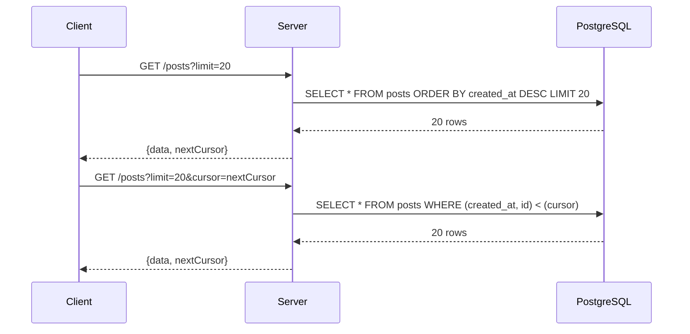

<!-- Generated by Groq via GitHub Actions -->
<!-- Topic ID: T017 -->
<!-- Category: Core Backend Fundamentals -->
<!-- Generated at UTC: 2026-09-26T06:16:14.774101+00:00 -->

# Pagination

## 1. What problem does this solve?

**Motivation**

When a backend service needs to expose a large collection of records (e.g., millions of user posts, logs, or product listings), returning the entire dataset in a single response is impractical:

- **Network cost** – huge payloads increase latency and bandwidth usage.
- **Memory pressure** – the server must buffer the entire result set before sending it.
- **Client UX** – users cannot consume or display thousands of items at once.

**What problem exists**

- **Scalability bottleneck**: A single request that pulls all rows forces the database to scan and return a massive result set.
- **User experience**: Browsers or mobile apps cannot render millions of rows efficiently.
- **Rate limiting**: APIs often enforce limits on payload size or request frequency.

**Why the problem matters**

- **Performance degradation**: Slow queries lead to timeouts and degraded service quality.
- **Cost**: More data transferred means higher cloud egress costs and higher memory usage on the server.
- **Reliability**: Large queries are more prone to failures and can cascade into outages.

**Consequences of not using pagination**

- **Time‑outs**: Clients may abort due to long response times.
- **Out‑of‑memory**: Servers may crash if they try to buffer huge result sets.
- **Poor UX**: Users see incomplete data or experience freezing.

**Real‑world appearance**

- E‑commerce product listings
- Social media feeds
- Admin dashboards with audit logs
- Analytics dashboards querying time‑series data
- API endpoints that return user data (e.g., `/users`, `/orders`)

---

## 2. Mental model

### Analogy: A library catalog

Imagine a library with a catalog of 10 000 books. You want to find all books by a particular author. Instead of handing you the entire catalog, the librarian gives you a **page** of 20 books, plus a **bookmark** (the last book on that page). When you’re ready for more, you show the bookmark and get the next 20. This keeps the workload manageable for both you and the librarian.

### Engineering model

- **Page** → a slice of the dataset (e.g., 20 rows).
- **Bookmark / cursor** → a token that represents the position in the dataset (often the last record’s key).
- **Offset** → a numeric index (e.g., “skip 40, take 20”), which is simple but can be expensive for deep pages.
- **Keyset** → use a column value (e.g., `created_at > last_seen`) to fetch the next slice, which is efficient and stable.

---

## 3. Deep explanation

### Internals

| Term | Meaning | Typical implementation |
|------|---------|------------------------|
| **Offset** | Number of rows to skip. | `LIMIT 20 OFFSET 40` |
| **Limit** | Max rows to return. | `LIMIT 20` |
| **Cursor** | A value that marks the last returned row. | `cursor=eyJpZCI6MTIzfQ==` (base64 JSON) |
| **Keyset pagination** | Uses a column value (e.g., `id`, `created_at`) to fetch the next page. | `WHERE id > :lastId ORDER BY id ASC LIMIT 20` |
| **Page token** | Encoded state that can be passed back to the server. | JWT or opaque string |
| **Total count** | Number of rows that match the query. | `SELECT COUNT(*) FROM table WHERE ...` |

### Trade‑offs

| Approach | Pros | Cons |
|----------|------|------|
| **Offset** | Simple, stateless, works with any ordering | O(N) scan for large offsets; duplicates/omissions on concurrent inserts/deletes |
| **Cursor / Keyset** | O(1) lookup, stable against concurrent changes | Requires a stable, unique ordering column; stateful (needs token) |
| **Page token** | Encapsulates cursor + metadata; can be signed | Slightly larger payload; token validation overhead |

### Failure modes

- **Race conditions**: New rows inserted between pages can cause duplicates or missing items.
- **Out‑of‑sync cursors**: If the ordering column changes (e.g., `updated_at`), the cursor may skip or duplicate rows.
- **Invalid tokens**: Malformed or expired tokens can cause errors.
- **Large offsets**: `OFFSET 1_000_000` forces the DB to scan a million rows.

### Limitations

- **Real‑time updates**: Pagination is inherently snapshot‑based; live updates may not appear until the next page.
- **Complex filtering**: Combining pagination with dynamic filters can lead to inconsistent results if not handled carefully.
- **Non‑unique ordering**: If the ordering column isn’t unique, keyset pagination can return duplicate rows across pages.

### Where it fits

- **API layer**: Exposes `page`, `limit`, `cursor` parameters.
- **Database layer**: Executes paginated queries, often with indexes on the ordering column.
- **Caching layer**: Frequently accessed pages can be cached in Redis or CDN.
- **Monitoring**: Track pagination latency, page size, and error rates.

### Interaction with related concepts

- **Sorting**: Pagination requires a deterministic order; otherwise, results can shuffle.
- **Filtering**: Filters must be applied before pagination to avoid mis‑counting.
- **Caching**: Cache pages but invalidate on data changes.
- **Rate limiting**: Pagination can help spread load over multiple requests.

---

## 4. How it works (cursor‑based example)

1. **Client** requests the first page: `GET /posts?limit=20`.
2. **Server** queries the DB: `SELECT * FROM posts ORDER BY created_at DESC LIMIT 20`.
3. **Server** returns:
   - `data`: array of 20 posts
   - `nextCursor`: base64‑encoded JSON `{ lastCreatedAt: <timestamp>, lastId: <id> }`
4. **Client** stores `nextCursor` and uses it for the next request: `GET /posts?limit=20&cursor=...`.
5. **Server** decodes the cursor and runs:
   ```
   SELECT * FROM posts
   WHERE (created_at, id) < (lastCreatedAt, lastId)
   ORDER BY created_at DESC, id DESC
   LIMIT 20
   ```
6. Repeat until `data` length < `limit` (no more pages).



---

## 5. Practical implementation

### TypeScript/Node.js (Express + pg)

```ts
// src/routes/posts.ts
import { Request, Response } from 'express';
import { pool } from '../db'; // pg.Pool instance
import { Buffer } from 'buffer';

const PAGE_SIZE = 20;

// Helper to encode/decode cursor
function encodeCursor(createdAt: string, id: number): string {
  const payload = JSON.stringify({ createdAt, id });
  return Buffer.from(payload).toString('base64');
}
function decodeCursor(cursor: string): { createdAt: string; id: number } {
  const payload = Buffer.from(cursor, 'base64').toString('utf8');
  return JSON.parse(payload);
}

export async function listPosts(req: Request, res: Response) {
  const limit = Math.min(parseInt(req.query.limit as string) || PAGE_SIZE, 100);
  const cursor = req.query.cursor as string | undefined;

  let query = `
    SELECT id, title, body, created_at
    FROM posts
    WHERE 1=1
  `;
  const params: any[] = [];

  if (cursor) {
    const { createdAt, id } = decodeCursor(cursor);
    query += `
      AND (created_at, id) < ($${params.length + 1}, $${params.length + 2})
    `;
    params.push(createdAt, id);
  }

  query += `
    ORDER BY created_at DESC, id DESC
    LIMIT $${params.length + 1}
  `;
  params.push(limit);

  const { rows } = await pool.query(query, params);

  const nextCursor =
    rows.length === limit
      ? encodeCursor(rows[rows.length - 1].created_at, rows[rows.length - 1].id)
      : null;

  res.json({
    data: rows,
    nextCursor,
  });
}
```

**Key points**

- **Keyset pagination** (`(created_at, id) < (...)`) avoids the `OFFSET` cost.
- The cursor is opaque to the client; it only contains the last seen values.
- The `ORDER BY` clause must match the cursor comparison.

### Optional: Redis cache for hot pages

```ts
import { redis } from '../redis';

async function cachedListPosts(req: Request, res: Response) {
  const cacheKey = `posts:${req.query.cursor || 'first'}:${limit}`;
  const cached = await redis.get(cacheKey);
  if (cached) return res.json(JSON.parse(cached));

  // ... run query as above
  await redis.set(cacheKey, JSON.stringify(result), 'EX', 60); // 1 minute TTL
  res.json(result);
}
```

---

## 6. Production considerations

| Concern | What to watch for | Mitigation |
|---------|-------------------|------------|
| **Scalability** | Deep pagination with `OFFSET` can hit DB limits. | Prefer keyset; add indexes on ordering columns. |
| **Reliability** | Concurrent inserts/deletes may cause missing/duplicate rows. | Use stable ordering columns; consider snapshot isolation. |
| **Security** | Exposing raw IDs or timestamps can leak data. | Encode cursors; optionally sign them. |
| **Observability** | Latency spikes on large pages. | Instrument query times; monitor `nextCursor` usage. |
| **Performance** | Large `LIMIT` values increase memory usage. | Cap `limit` (e.g., max 100). |
| **Error handling** | Malformed cursor → 400 error. | Validate cursor format; return clear error. |
| **Resource usage** | Caching entire pages can consume memory. | Use TTL; evict on data changes. |
| **Operational** | Cache invalidation on data updates. | Publish events to Redis or Kafka; invalidate keys. |
| **Failure recovery** | DB outage during pagination. | Retry logic; graceful degradation. |
| **Deployment** | Schema changes affecting ordering column. | Versioned migrations; maintain backward compatibility. |

---

## 7. Common mistakes

| Mistake | Why it’s bad |
|---------|--------------|
| Using `OFFSET` for deep pages | DB must scan all preceding rows → slow, high CPU. |
| Ignoring `ORDER BY` | Pagination can return shuffled results. |
| Not validating `limit` | Clients can request huge pages → OOM. |
| Exposing raw IDs in cursors | Security risk; can be guessed or enumerated. |
| Not handling duplicates when ordering column isn’t unique | Same row may appear on two pages. |
| Caching pages without invalidation | Stale data served to users. |
| Returning `totalCount` with offset pagination | Requires an expensive `COUNT(*)` query. |
| Using page numbers with keyset pagination | Page numbers become meaningless. |
| Not handling empty result sets | Clients may misinterpret `nextCursor`. |

---

## 8. Senior engineer perspective

### Design decisions at scale

- **Keyset over offset**: Avoids deep scans; scales to millions of rows.
- **Stateless cursors**: Keep tokens opaque and signed to prevent tampering.
- **Index strategy**: Composite index on `(created_at DESC, id DESC)` for keyset queries.
- **Cache hot pages**: Use Redis or CDN; invalidate via pub/sub on data changes.
- **Avoid total counts**: `COUNT(*)` is expensive; provide approximate counts if needed.
- **Pagination limits**: Enforce a hard cap (e.g., 100) to protect resources.
- **Monitoring**: Track per‑page latency, cache hit ratios, cursor usage patterns.
- **Failure scenarios**: Handle DB outages with graceful fallbacks; retry with exponential backoff.
- **Cost**: Large scans cost CPU and I/O; keyset reduces cost dramatically.
- **When NOT to use**: If the dataset is small (< 10 k rows) or the client needs a full export, pagination may be unnecessary.

---

## 9. Interview questions

1. **Beginner**: *What is the difference between offset and cursor pagination?*  
   **Answer**: Offset uses `LIMIT` and `OFFSET` to skip rows; cursor (keyset) uses a value from the last row to fetch the next slice, which is more efficient for large datasets.

2. **Beginner**: *Why do we need an `ORDER BY` clause in pagination queries?*  
   **Answer**: To guarantee deterministic ordering; without it, the same page could return different rows on subsequent requests.

3. **Senior**: *Explain how you would design a pagination system that supports both page numbers and cursors in a single API.*  
   **Answer**: Use a hybrid approach: expose `page` and `limit` for small offsets, but internally convert to keyset when `page * limit` exceeds a threshold. Alternatively, provide a cursor for deep pagination and a page number for shallow queries, documenting the switch point.

4. **Senior**: *Describe a scenario where cursor pagination could lead to duplicate or missing rows, and how you would mitigate it.*  
   **Answer**: If the ordering column (`created_at`) is not unique, two rows with the same timestamp can be split across pages. Mitigation: include a unique secondary column (`id`) in the cursor and comparison (`(created_at, id) < (...)`).

5. **Scenario/Debugging**: *A client reports that after inserting a new post, the next page of results skips that post. What could be causing this and how would you fix it?*  
   **Answer**: Likely using offset pagination; the new row shifts all subsequent offsets, causing the client to miss it. Fix: switch to keyset pagination using a stable ordering column (e.g., `created_at DESC, id DESC`) and encode the last seen values in the cursor.

---

## 10. Hands‑on task

**Task**: Implement cursor‑based pagination for a `/api/posts` endpoint in a Next.js API route.

1. Create a PostgreSQL table `posts` with columns `id`, `title`, `body`, `created_at`.
2. Seed the table with 500 sample posts.
3. In `pages/api/posts.ts`, write an API that:
   - Accepts `limit` (default 20) and `cursor` (optional).
   - Returns `data` and `nextCursor`.
4. Add a simple React component that fetches the first page and renders a “Load more” button that uses the `nextCursor`.
5. Write a unit test that verifies:
   - No duplicate posts across pages.
   - The `nextCursor` is correctly generated and consumed.

**Deliverables**:  
- `pages/api/posts.ts` (API implementation)  
- `components/PostsList.tsx` (React component)  
- `tests/posts.test.ts` (Jest test)

---

## 11. Quick revision

- Pagination solves large‑dataset retrieval by splitting results into manageable chunks.
- **Offset pagination**: `LIMIT` + `OFFSET`; simple but O(N) for deep pages.
- **Cursor/keyset pagination**: Uses a stable ordering column; O(1) lookup.
- **Cursor token**: Encodes last seen values; should be opaque and signed.
- **Ordering**: Must be deterministic; otherwise pages shuffle.
- **Indexing**: Composite index on ordering columns is essential.
- **Cache**: Cache hot pages; invalidate on data changes.
- **Limit cap**: Enforce a maximum page size (e.g., 100).
- **Avoid total counts**: Expensive; use approximate counts if needed.
- **Common pitfalls**: Deep offset, missing `ORDER BY`, duplicate rows, stale cache.
- **Senior considerations**: Cost, scalability, monitoring, failure recovery, hybrid APIs.

---

## 12. References

- PostgreSQL documentation – [Keyset pagination](https://www.postgresql.org/docs/current/sql-select.html#SQL-ORDER-BY)
- Next.js API routes – [API routes](https://nextjs.org/docs/api-routes/introduction)
- Express.js – [Routing](https://expressjs.com/en/guide/routing.html)
- Redis – [Caching patterns](https://redis.io/topics/caching)
- MDN – [Base64 encoding](https://developer.mozilla.org/en-US/docs/Web/API/WindowBase64/Base64_encoding_and_decoding)
- OpenAPI – [Pagination best practices](https://swagger.io/docs/specification/pagination/)

---
