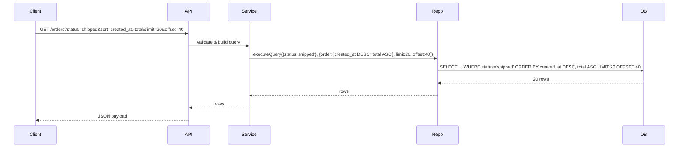

<!-- Generated by Groq via GitHub Actions -->
<!-- Topic ID: T018 -->
<!-- Category: Core Backend Fundamentals -->
<!-- Generated at UTC: 2026-09-26T06:16:14.774101+00:00 -->

# Filtering / Sorting

## 1. What problem does this solve?

- **Problem**: Backend services often expose collections of data (users, orders, logs). Clients need to retrieve only the relevant subset and in a meaningful order. Without filtering/sorting, a client would receive the entire dataset, waste bandwidth, and have to do expensive client‑side processing.
- **Why it matters**:  
  - **Performance**: Large tables (millions of rows) can’t be sent wholesale.  
  - **Cost**: Cloud storage and network egress charges grow with data volume.  
  - **User experience**: Pagination and sorted lists are essential for responsive UIs.  
  - **Security**: Filtering can enforce row‑level access control.  
- **What happens if it’s not used**:  
  - Clients download huge payloads → slow UI, high memory usage.  
  - Backend servers become bottlenecks, potentially exhausting CPU or I/O.  
  - Harder to enforce fine‑grained permissions.  
- **Real‑world appearance**:  
  - REST APIs (`GET /users?role=admin&sort=created_at,-name`)  
  - GraphQL queries with `where` and `orderBy` arguments  
  - Search engines (Elasticsearch) with `query` and `sort` clauses  
  - Redis sorted sets (`ZRANGE key 0 -1 WITHSCORES`)  
  - Kafka consumer offsets with time‑based filtering  

## 2. Mental model

**Analogy**: Think of a library.  
- **Filtering** is like asking the librarian for books that are *fiction* *and* *published after 2010*.  
- **Sorting** is like ordering those books alphabetically by title or by publication date.  
The librarian uses the catalog (index) to quickly locate the requested books, then hands them to you in the requested order.

**Engineering model**:  
- **Filter** → **Predicate** applied to rows/records.  
- **Sort** → **Ordering** based on one or more columns/fields.  
- Both operations are usually performed at the data store level (SQL `WHERE` + `ORDER BY`, MongoDB `$match` + `$sort`, Redis `ZRANGEBYSCORE`, etc.) to avoid transferring unnecessary data.

## 3. Deep explanation

| Aspect | Details |
|--------|---------|
| **Internals** | • Databases use **indexes** to accelerate filtering and sorting. <br>• For range queries, B‑tree or hash indexes are common. <br>• In-memory stores (Redis) use sorted sets or hash maps. <br>• Search engines use inverted indexes and postings lists. |
| **Important terminology** | • **Predicate**: condition used in filtering. <br>• **Projection**: selecting specific columns. <br>• **Ordering key**: column(s) used for sorting. <br>• **Pagination**: `LIMIT/OFFSET` or cursor‑based. <br>• **Compound index**: single index covering multiple columns. |
| **Trade‑offs** | • **Index size vs. query speed**: larger indexes consume memory/disk. <br>• **`LIMIT/OFFSET` vs. cursor**: `OFFSET` causes full scan of preceding rows; cursor is more efficient for deep pagination. <br>• **Sorting on non‑indexed columns**: requires in‑memory sort, expensive. |
| **Failure modes** | • **Missing index** → full table scan, slow. <br>• **Unbounded `OFFSET`** → memory blowup. <br>• **Stale indexes** in write‑heavy workloads. |
| **Limitations** | • Complex predicates (OR, NOT) may not be indexable. <br>• Sorting on computed fields requires materialization. <br>• Distributed databases may need sharding keys aligned with sorting. |
| **Where it fits** | • API layer: receives query params, translates to DB query. <br>• Service layer: validates and applies business rules. <br>• Data layer: executes optimized query. |
| **Interactions** | • **Caching**: cache filtered/sorted results for hot queries. <br>• **Rate limiting**: prevent abuse of `LIMIT 0` + `OFFSET 1e9`. <br>• **Security**: filter by user ID to enforce row‑level access. |

## 4. How it works

1. **Client request**: `GET /orders?status=shipped&sort=created_at,-total&limit=20&offset=40`.  
2. **API layer** parses query params, validates them.  
3. **Service layer** builds a query object: `{ status: 'shipped' }`.  
4. **Repository layer** translates to SQL:  
   ```sql
   SELECT id, total, created_at
   FROM orders
   WHERE status = 'shipped'
   ORDER BY created_at DESC, total ASC
   LIMIT 20 OFFSET 40;
   ```  
5. **Database engine** uses indexes to locate matching rows, applies ordering, returns 20 rows.  
6. **API** serializes to JSON and sends back to client.  



## 5. Practical implementation

### TypeScript/Node.js with PostgreSQL (pg)

```ts
import { Pool } from 'pg';
const pool = new Pool({ connectionString: process.env.DATABASE_URL });

interface OrderFilter {
  status?: string;
  minTotal?: number;
  maxTotal?: number;
}

interface OrderSort {
  field: keyof Order; // e.g., 'created_at'
  direction: 'ASC' | 'DESC';
}

interface OrderQuery {
  filter?: OrderFilter;
  sort?: OrderSort[];
  limit?: number;
  offset?: number;
}

async function getOrders(q: OrderQuery) {
  const values: any[] = [];
  const whereClauses: string[] = [];
  let idx = 1;

  if (q.filter?.status) {
    whereClauses.push(`status = $${idx++}`);
    values.push(q.filter.status);
  }
  if (q.filter?.minTotal !== undefined) {
    whereClauses.push(`total >= $${idx++}`);
    values.push(q.filter.minTotal);
  }
  if (q.filter?.maxTotal !== undefined) {
    whereClauses.push(`total <= $${idx++}`);
    values.push(q.filter.maxTotal);
  }

  const where = whereClauses.length ? `WHERE ${whereClauses.join(' AND ')}` : '';

  const orderBy = q.sort?.map((s, i) => `${s.field} ${s.direction}`).join(', ') || 'id ASC';

  const limit = q.limit ?? 50;
  const offset = q.offset ?? 0;

  const sql = `
    SELECT id, total, status, created_at
    FROM orders
    ${where}
    ORDER BY ${orderBy}
    LIMIT $${idx++} OFFSET $${idx++}
  `;
  values.push(limit, offset);

  const { rows } = await pool.query(sql, values);
  return rows;
}
```

**Key points**  
- Parameterized queries prevent SQL injection.  
- `WHERE` clauses are built only when filters are present.  
- `ORDER BY` uses a safe list of allowed fields to avoid injection.  
- `LIMIT/OFFSET` are also parameterized.

### Redis sorted set example

```ts
import { createClient } from 'redis';
const client = createClient();

async function getTopUsers(limit: number, minScore = 0, maxScore = '+inf') {
  // ZRANGEBYSCORE key min max WITHSCORES LIMIT 0 limit
  const result = await client.zRangeByScoreWithScores(
    'user:activity',
    minScore,
    maxScore,
    { LIMIT: { offset: 0, count: limit } }
  );
  return result; // [{ value: 'userId', score: 123 }]
}
```

## 6. Production considerations

| Concern | How filtering/sorting impacts it | Mitigation |
|---------|----------------------------------|------------|
| **Scalability** | Heavy filtering on large tables can cause full scans. | Use composite indexes, partitioning, or materialized views. |
| **Reliability** | Unindexed queries may time out under load. | Monitor query plans, enforce query limits. |
| **Security** | Exposing raw query parameters can leak data. | Validate and whitelist allowed fields; use row‑level security. |
| **Observability** | Hard to spot slow queries. | Log query execution times, use APM. |
| **Performance** | `OFFSET` can be expensive for deep pages. | Prefer cursor‑based pagination (`WHERE id > lastId`). |
| **Error handling** | Invalid sort fields cause 500 errors. | Return 400 with clear message. |
| **Resource usage** | Sorting large result sets consumes memory. | Limit `LIMIT` size, use server‑side cursors. |
| **Deployment** | Index changes require downtime. | Use online schema change tools (pg_repack, online migrations). |
| **Failure recovery** | Stale indexes after crash. | Regular index rebuilds, WAL replay. |

## 7. Common mistakes

1. **Using `OFFSET` for deep pagination** – leads to full scans of preceding rows.  
2. **Not indexing filter/sort columns** – causes full table scans.  
3. **Allowing arbitrary sort fields** – opens injection and performance holes.  
4. **Ignoring `LIMIT`** – can return millions of rows.  
5. **Mixing client‑side and server‑side filtering** – wastes bandwidth.  
6. **Using `ORDER BY` on computed columns without indexes** – expensive.  
7. **Not handling null values in sort** – inconsistent ordering.  
8. **Over‑fetching data (selecting all columns)** – increases payload size.  

## 8. Senior engineer perspective

At scale, filtering/sorting becomes a **bottleneck** and a **cost driver**.

- **Architecture decisions**  
  - Use **cursor‑based pagination** for deep reads.  
  - Implement **search indexes** (Elasticsearch, Meilisearch) for complex queries.  
  - Leverage **materialized views** for frequent aggregate filters.  
  - Partition tables by time or sharding key aligned with common filters.  

- **Trade‑offs**  
  - **Index maintenance cost** vs. **query speed**.  
  - **Denormalization** for fast reads vs. **write amplification**.  

- **Bottlenecks**  
  - **Disk I/O** when scanning large indexes.  
  - **CPU** during in‑memory sorting of large result sets.  

- **Failure scenarios**  
  - **Index corruption** → fallback to full scan.  
  - **Hot spot** on a single shard due to skewed filter values.  

- **Monitoring**  
  - Query latency dashboards.  
  - Index usage metrics.  
  - Pagination depth metrics.  

- **Cost/performance**  
  - Larger indexes increase storage costs.  
  - Cursor pagination reduces read amplification.  

- **When NOT to use**  
  - For **one‑off ad‑hoc reports**: use a data warehouse.  
  - When **write latency** is critical and indexes would slow writes.  

## 9. Interview questions

1. **Beginner**: *What is the purpose of the `WHERE` clause in SQL?*  
   - *Answer*: It filters rows based on a predicate, reducing the result set before further processing.  

2. **Beginner**: *Why is `LIMIT` important when returning query results?*  
   - *Answer*: It caps the number of rows returned, preventing large payloads and protecting server resources.  

3. **Senior**: *Explain the difference between `OFFSET` pagination and cursor pagination. When would you choose one over the other?*  
   - *Answer*: `OFFSET` requires scanning all preceding rows, becoming expensive for deep pages; cursor pagination uses a key (e.g., last ID) to fetch the next page efficiently. Choose cursor for large datasets, `OFFSET` for simple, shallow pagination.  

4. **Senior**: *Describe how you would design a system that supports filtering and sorting on a highly dynamic set of fields without compromising performance.*  
   - *Answer*: Use a search engine (Elasticsearch) with dynamic mapping, maintain a denormalized index, or employ a hybrid approach: store core fields in a relational DB with indexes, and push complex filters to a dedicated search layer.  

5. **Scenario/Debugging**: *A client reports that fetching the 1000th page of results takes 30 seconds, while earlier pages are fast. What could be causing this, and how would you investigate?*  
   - *Answer*: Likely `OFFSET 999000` causes a full scan of 999,000 rows. Investigate query plan (`EXPLAIN`), check index usage, consider cursor pagination, or add a composite index on the filter columns.  

## 10. Hands‑on task

**Task**: Extend the existing `/orders` endpoint in the repository to support cursor‑based pagination.  
- Add a `cursor` query param that encodes the last seen `id`.  
- Modify the repository to use `WHERE id > $cursor` instead of `OFFSET`.  
- Ensure the API returns the next page and a new cursor.  
- Write a unit test that verifies pagination works correctly for 3 pages of 10 rows each.

## 11. Quick revision

- Filtering narrows data; sorting orders it.  
- Use indexes on filter and sort columns.  
- Prefer cursor pagination over `OFFSET` for deep reads.  
- Validate and whitelist query parameters.  
- Avoid `SELECT *`; project only needed columns.  
- Monitor query plans and latency.  
- Use materialized views for expensive aggregates.  
- In Redis, use sorted sets (`ZRANGEBYSCORE`) for sorted data.  
- In MongoDB, `$match` + `$sort` with compound indexes.  
- For complex search, consider Elasticsearch or Meilisearch.  

## 12. References

- [PostgreSQL Documentation – SELECT](https://www.postgresql.org/docs/current/sql-select.html)  
- [MongoDB Docs – Aggregation Pipeline](https://docs.mongodb.com/manual/core/aggregation-pipeline/)  
- [Redis Docs – Sorted Sets](https://redis.io/docs/data-types/sorted-sets/)  
- [Elasticsearch Docs – Query DSL](https://www.elastic.co/guide/en/elasticsearch/reference/current/query-dsl.html)  
- [OWASP – Input Validation](https://owasp.org/www-project-top-ten/2017/A1_2017-Injection)  
- [SQL Performance Tuning – Indexing](https://www.postgresql.org/docs/current/performance-tips.html)
