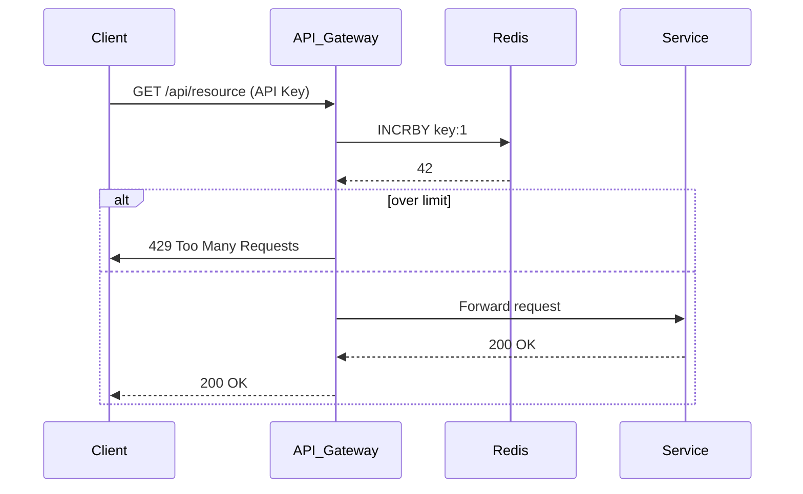

<!-- Generated by Groq via GitHub Actions -->
<!-- Topic ID: T019 -->
<!-- Category: Core Backend Fundamentals -->
<!-- Generated at UTC: 2026-09-26T17:20:34.965526+00:00 -->

# Rate limiting

## 1. What problem does this solve?

**Motivation**  
When a backend service is exposed to the internet, any client can send requests at any speed.  
If a client (or a malicious bot) floods the service with thousands of requests per second, the following can happen:

- **Resource exhaustion** – CPU, memory, database connections, or network bandwidth can be saturated.
- **Denial of Service (DoS)** – legitimate users experience latency or timeouts.
- **Cost blow‑up** – cloud resources (e.g., database read/write units, API gateway requests) spike.
- **Security risk** – brute‑force attacks on authentication endpoints or credential stuffing.

**Why it matters**  
Rate limiting protects the service’s *availability*, *performance*, and *cost* while also providing a first line of defense against abuse.

**Consequences of not using it**  
- Uncontrolled traffic can crash the application or underlying infrastructure.
- Poor user experience due to high latency or timeouts.
- Unexpected billing due to over‑utilization of paid resources.
- Increased attack surface for credential stuffing or credential‑guessing attacks.

**Real‑world appearance**  
- API gateways (AWS API Gateway, Kong, NGINX) enforce per‑IP or per‑API‑key limits.  
- Authentication services throttle login attempts.  
- Web servers limit concurrent connections per client.  
- Cloud functions (AWS Lambda, GCP Cloud Functions) often have built‑in concurrency limits that can be complemented with custom rate limiting.

---

## 2. Mental model

**Analogy**  
Imagine a toll booth on a highway.  
- **Cars** are incoming requests.  
- The booth has a **maximum number of cars it can process per minute** (the rate limit).  
- If too many cars arrive, the booth **queues** or **rejects** them to keep traffic flowing smoothly.

**Engineering model**  
Rate limiting is a *policy* that says: *“Allow at most N requests in a sliding window of T seconds for a given key (IP, API key, user ID, etc.).”*  
If the policy is violated, the service returns a `429 Too Many Requests` response (or similar).  
The policy can be enforced in-memory, distributed cache, or via an API gateway.

---

## 3. Deep explanation

| Topic | Explanation |
|-------|-------------|
| **Internals** | Common algorithms: **Token Bucket**, **Leaky Bucket**, **Fixed Window**, **Sliding Window Log**, **Sliding Window Counter**.  |
| **Important terminology** | *Key* (identifying the client), *Window* (time period), *Limit* (max allowed), *Burst* (extra allowance for short spikes), *Penalty* (rejection or delay). |
| **Trade‑offs** | <ul><li>Accuracy vs. memory: Sliding Window Log is accurate but stores each request timestamp.</li><li>Latency vs. simplicity: Fixed Window is simple but can allow bursty traffic at window boundaries.</li></ul> |
| **Failure modes** | <ul><li>Clock skew in distributed systems can cause windows to misalign.</li><li>Cache eviction can reset counters, temporarily allowing more traffic.</li><li>Network partition can cause inconsistent counter state.</li></ul> |
| **Limitations** | Cannot prevent all abuse (e.g., distributed bots).  Rate limits are per‑key; if an attacker uses many keys, they can bypass it. |
| **Where it fits** | Usually sits in the **API gateway** or **middleware layer**.  It can also be implemented in the **service layer** if per‑service limits are needed. |
| **Interaction with related concepts** | *Authentication* (throttle login attempts), *Caching* (store counters in Redis), *Observability* (metrics on 429 responses), *Security* (combined with IP reputation lists). |

---

## 4. How it works

1. **Client sends request** → includes identifying key (IP, API key, user ID).  
2. **Middleware intercepts** → extracts key.  
3. **Retrieve counter** from storage (e.g., Redis).  
4. **Increment counter** and check against limit.  
5. **If over limit** → respond with `429` (and optionally `Retry-After`).  
6. **If within limit** → allow request to proceed.  
7. **Background job** (optional) cleans up expired counters.



---

## 5. Practical implementation

Below is a minimal, production‑ready rate‑limiting middleware for an Express/Node.js app using **Redis** as a distributed counter store.

```ts
// rateLimiter.ts
import { Request, Response, NextFunction } from 'express';
import { createClient } from 'redis';

const redis = createClient(); // default localhost:6379
redis.on('error', console.error);

export interface RateLimitOptions {
  windowMs: number;          // window size in ms
  max: number;               // max requests per window
  keyGenerator: (req: Request) => string; // how to identify client
  message?: string;          // optional custom 429 message
}

export function rateLimiter(opts: RateLimitOptions) {
  const { windowMs, max, keyGenerator, message } = opts;
  const ttl = Math.ceil(windowMs / 1000); // seconds

  return async (req: Request, res: Response, next: NextFunction) => {
    const key = `rl:${keyGenerator(req)}`;
    try {
      // INCR and set TTL atomically
      const [count] = await redis.multi()
        .incr(key)
        .expire(key, ttl)
        .exec();

      if (count > max) {
        res.set('Retry-After', ttl.toString());
        return res.status(429).json({
          error: message ?? 'Too many requests, please try again later.',
        });
      }
      next();
    } catch (err) {
      console.error('Rate limiter error', err);
      // Fail open: allow request if Redis is down
      next();
    }
  };
}
```

**Usage**

```ts
// app.ts
import express from 'express';
import { rateLimiter } from './rateLimiter';

const app = express();

app.use(
  rateLimiter({
    windowMs: 60 * 1000, // 1 minute
    max: 100,            // 100 requests per minute
    keyGenerator: (req) => req.ip, // per IP
  })
);

app.get('/api/data', (req, res) => {
  res.json({ data: 'Hello, world!' });
});

app.listen(3000, () => console.log('Server listening on 3000'));
```

**Why this works in production**

- Redis is a single‑write, multi‑read store that can handle millions of increments per second.
- The `INCR` command is atomic, so concurrent requests from the same key are correctly counted.
- `EXPIRE` ensures counters are automatically cleaned up after the window.

---

## 6. Production considerations

| Concern | How to address |
|---------|----------------|
| **Scalability** | Use a distributed cache (Redis Cluster, DynamoDB, Cloudflare KV).  Avoid per‑process in‑memory counters. |
| **Reliability** | Fail‑open strategy: if Redis is unavailable, allow requests (or throttle globally).  Use a circuit breaker. |
| **Security** | Combine with IP reputation lists, CAPTCHA, or authentication checks.  Do not rely solely on rate limiting for auth. |
| **Observability** | Emit metrics: `rate_limit_hits`, `rate_limit_exceeded`, `rate_limit_window`.  Log 429 responses. |
| **Performance** | Keep Redis latency < 1 ms.  Use pipelining for high‑throughput.  Cache counters in memory for short bursts if needed. |
| **Error handling** | Gracefully handle Redis errors; log and fallback. |
| **Resource usage** | Redis memory: `key + integer` ~ 50 bytes.  For 1 M keys, ~50 MB.  Use key expiry to free memory. |
| **Operational concerns** | Monitor Redis memory usage, replication lag, and network latency.  Set up alerts for high 429 rates. |
| **Failure recovery** | On Redis restart, counters reset; this is acceptable for rate limits.  Use persistence if you need exact counts across restarts. |
| **Deployment** | Deploy Redis as a managed service (AWS ElastiCache, Azure Cache for Redis).  Use TLS and IAM for secure access. |

---

## 7. Common mistakes

| Mistake | Why it’s problematic |
|---------|----------------------|
| **Using a fixed window** | Allows a burst at the boundary (e.g., 100 requests at 59 s, then 100 at 61 s). |
| **Counting per IP only** | Bots can rotate IPs or use a CDN to bypass limits. |
| **Failing to set TTL** | Counters never expire, causing permanent throttling. |
| **Ignoring clock skew** | In distributed systems, windows may misalign, leading to inconsistent limits. |
| **Blocking on Redis** | Synchronous Redis calls block the event loop; use async/await or worker threads. |
| **Over‑restricting** | Setting limits too low hurts legitimate users; always benchmark. |
| **Not handling 429 properly** | Returning a generic error without `Retry-After` leads to user frustration. |
| **Using in‑memory counters** | Not shared across instances; leads to inconsistent throttling. |

---

## 8. Senior engineer perspective

### What changes at scale?

- **Distributed counters**: Use Redis Cluster or a sharded keyspace to avoid single‑point bottlenecks.
- **Adaptive limits**: Dynamically adjust limits based on traffic patterns or user tier.
- **Global vs. per‑service**: Decide whether to enforce limits globally (gateway) or per microservice.
- **Burst handling**: Implement *Token Bucket* to allow short bursts while maintaining long‑term averages.
- **Multi‑tenant isolation**: Ensure limits are per tenant, not just per IP.

### Design decisions

| Decision | Trade‑off | Impact |
|----------|-----------|--------|
| **Algorithm** | Fixed Window (simple) vs. Sliding Window Log (accurate) | Accuracy vs. memory |
| **Storage** | Redis vs. DynamoDB vs. in‑memory | Latency vs. persistence |
| **Key granularity** | IP vs. API key vs. user ID | Security vs. usability |
| **Burst allowance** | None vs. Token Bucket | User experience vs. abuse risk |
| **Fail‑over** | Fail‑open vs. fail‑closed | Availability vs. security |

### Bottlenecks & failure scenarios

- **Redis saturation**: High write traffic can saturate Redis CPU.  Mitigate with pipelining or sharding.
- **Network partition**: Clients may see inconsistent counters.  Use quorum reads/writes if necessary.
- **Clock drift**: Use NTP or atomic timestamps from Redis to avoid window misalignment.

### Monitoring & cost

- **Metrics**: `rate_limit_exceeded`, `rate_limit_hits`, `redis_latency`.
- **Alerting**: Spike in 429s → possible DoS or misconfiguration.
- **Cost**: Redis memory cost scales with number of keys; consider key eviction policies.

### When NOT to use

- **Very low traffic services**: A simple in‑memory counter may suffice.
- **Stateless micro‑services**: If the service is behind a gateway that already enforces limits, duplicate enforcement is wasteful.
- **Highly dynamic keys**: If the key changes frequently (e.g., per request), the overhead may outweigh benefits.

---

## 9. Interview questions

1. **Beginner** – *What is a rate limiter and why do we need it?*  
   *Answer:* A rate limiter restricts the number of requests a client can make in a given time window to protect resources, prevent abuse, and maintain service availability.

2. **Beginner** – *Explain the difference between a fixed window counter and a sliding window counter.*  
   *Answer:* Fixed window counts requests in discrete intervals (e.g., per minute). At the boundary, a burst can occur. Sliding window counts requests in a moving window, providing smoother limits but requiring more storage (timestamps or counters per sub‑window).

3. **Senior** – *Describe how you would implement a distributed rate limiter that supports burst traffic while preventing abuse, and discuss its trade‑offs.*  
   *Answer:* Use a Token Bucket algorithm stored in Redis. Tokens are refilled at a constant rate; requests consume tokens. Allows bursts up to the bucket size. Trade‑offs: requires atomic token decrement, Redis latency, and careful bucket sizing to balance user experience and abuse prevention.

4. **Senior** – *How would you handle clock skew in a distributed rate‑limiting system?*  
   *Answer:* Use a single source of truth for time (e.g., Redis server time via `TIME` command) or store timestamps relative to a synchronized clock (NTP). Avoid relying on client timestamps.

5. **Scenario/Debugging** – *Your service is suddenly returning a high number of 429 responses, but the rate‑limiting logs show no exceedances. What could be happening?*  
   *Answer:* Possible causes: (1) The rate‑limiting middleware is misconfigured (e.g., wrong key generator causing many distinct keys). (2) Redis is down or slow, causing the middleware to fail‑open or miscount. (3) A misbehaving client is sending requests with rapidly changing keys. (4) The middleware is incorrectly interpreting the `max` value (e.g., off‑by‑one). Investigate logs, Redis metrics, and key distribution.

---

## 10. Hands‑on task

**Goal**: Add a per‑user rate limiter to an existing Express API that returns user data.

**Steps**

1. **Create a Redis client** in `redisClient.ts`.  
2. **Implement a `userRateLimiter` middleware** that limits each authenticated user to 10 requests per minute.  
3. **Integrate the middleware** into the `/api/user/:id` route.  
4. **Add unit tests** using Jest to verify that the limit is enforced.  
5. **Deploy locally** using Docker Compose (Redis + Node.js).  
6. **Verify** by sending more than 10 requests in a minute and observing `429` responses.

**Hints**

- Use `req.user.id` as the key (assume authentication middleware sets `req.user`).  
- Store counters in Redis with key pattern `rl:user:{id}`.  
- Set TTL to 60 s.  
- Log each 429 response for debugging.

---

## 11. Quick revision

- Rate limiting protects against DoS, abuse, and cost spikes.  
- Common algorithms: Fixed Window, Sliding Window, Token Bucket, Leaky Bucket.  
- Key concepts: *Key*, *Window*, *Limit*, *Burst*, *Penalty*.  
- Redis `INCR` + `EXPIRE` is a simple, atomic implementation.  
- Fail‑open vs. fail‑closed: choose based on availability vs. security.  
- Monitor 429 metrics and Redis latency.  
- Avoid per‑IP only limits; combine with API keys or user IDs.  
- Use `Retry-After` header to inform clients.  
- For distributed systems, use a shared store (Redis Cluster, DynamoDB).  
- Token Bucket allows bursts; Sliding Window Log gives precise control at the cost of memory.

---

## 12. References

- [Express Rate Limit – npm](https://www.npmjs.com/package/express-rate-limit)  
- [Redis INCR command](https://redis.io/commands/incr)  
- [AWS API Gateway throttling](https://docs.aws.amazon.com/apigateway/latest/developerguide/api-gateway-throttling.html)  
- [Nginx Rate Limiting](https://nginx.org/en/docs/http/ngx_http_limit_req_module.html)  
- [Token Bucket Algorithm](https://en.wikipedia.org/wiki/Token_bucket)  
- [Sliding Window Log vs. Counter](https://www.oreilly.com/library/view/architecture-of/9781492042388/ch04.html)  
- [Redis Cluster Overview](https://redis.io/docs/manual/scaling/)  

---
