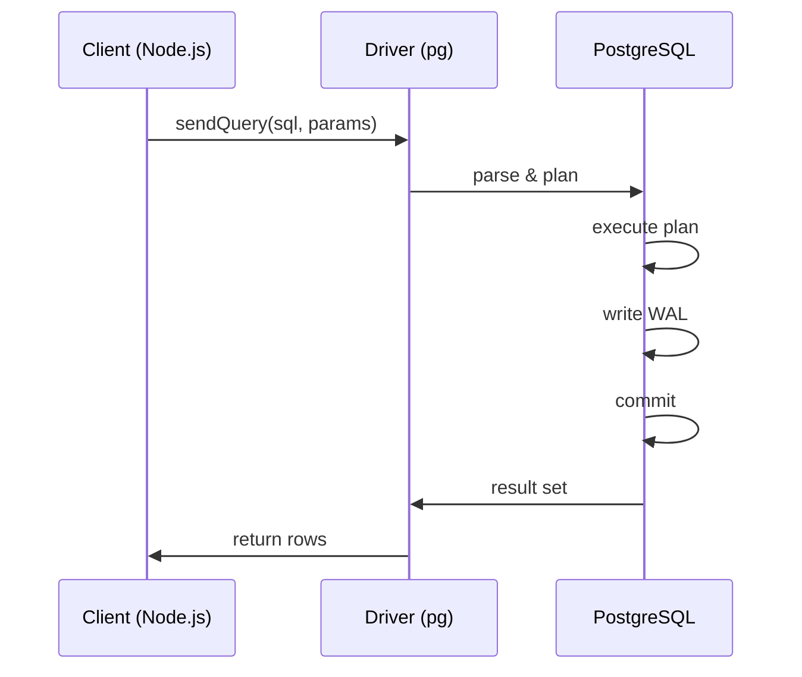

<!-- Generated by Groq via GitHub Actions -->
<!-- Topic ID: T020 -->
<!-- Category: Databases -->
<!-- Generated at UTC: 2026-09-26T17:20:34.965526+00:00 -->

# PostgreSQL

## 1. What problem does this solve?

| Problem | Why it matters | Consequence of not using PostgreSQL | Real‑world use |
|---------|----------------|-------------------------------------|----------------|
| **Structured, relational data** | Many applications need to model entities that have clear relationships (users ↔ orders, posts ↔ comments). | Data duplication, inconsistent state, hard to enforce referential integrity. | E‑commerce sites, SaaS user management, content platforms. |
| **Strong consistency & ACID** | Guarantees that transactions either fully succeed or fail, preventing partial updates that could corrupt business logic. | Lost updates, dirty reads, data corruption, hard‑to‑debug bugs. | Banking, inventory systems, booking engines. |
| **Complex querying & analytics** | Joins, window functions, CTEs, and advanced SQL let you slice data in ways that NoSQL often cannot. | Inefficient ad‑hoc reporting, need for separate analytics stack. | Sales dashboards, recommendation engines, audit logs. |
| **Schema evolution & migrations** | Structured schema with migrations keeps code and data in sync. | Manual data fixes, inconsistent schema across environments. | CI/CD pipelines, multi‑environment deployments. |
| **Robust tooling & ecosystem** | Mature drivers, ORMs, monitoring, backup, and replication features. | Higher maintenance overhead, security gaps. | Production‑grade services, microservices, data pipelines. |

---

## 2. Mental model

### Analogy – The Library

Imagine a library where every book is a **row** in a **table**. The library’s catalog (the **schema**) tells you what each book contains: title, author, ISBN, etc. Shelves (the **indexes**) let you find a book quickly by its ISBN. The librarian (the **transaction manager**) ensures that when you check out a book, the book’s status is updated atomically – you either get the book or you don’t.

### Engineering model

- **Tables** – collections of rows with a fixed set of columns.  
- **Rows** – individual records.  
- **Columns** – typed attributes.  
- **Primary key** – unique identifier for each row.  
- **Foreign key** – enforces relationships between tables.  
- **Indexes** – B‑tree structures that speed up lookups.  
- **Transactions** – ACID guarantees via MVCC and WAL.  
- **Replication** – read replicas for scaling reads.  
- **Partitioning** – split large tables into smaller pieces.

---

## 3. Deep explanation

### Internals

| Component | Role |
|-----------|------|
| **WAL (Write‑Ahead Log)** | Guarantees durability; all changes are logged before being applied. |
| **MVCC (Multi‑Version Concurrency Control)** | Keeps multiple versions of a row to allow readers to see a consistent snapshot while writers update. |
| **Buffer Cache** | In‑memory cache of pages; reduces disk I/O. |
| **Query Planner / Executor** | Chooses the best plan (joins, scans) based on statistics. |
| **Indexes** | B‑tree, hash, GiST, GIN, BRIN – each suited for different query patterns. |
| **Vacuum** | Reclaims space from dead tuples; prevents bloat. |

### Important terminology

- **Isolation level** – `READ COMMITTED`, `REPEATABLE READ`, `SERIALIZABLE`.  
- **Deadlock** – two transactions waiting on each other.  
- **Replication lag** – delay between primary and replica.  
- **Partition** – logical division of a table (range, list, hash).  
- **Foreign data wrapper (FDW)** – access external data sources as tables.

### Trade‑offs

| Aspect | Trade‑off |
|--------|-----------|
| **Schema rigidity** | Easier to enforce constraints, but harder to evolve. |
| **Read vs write scaling** | Replication helps reads; writes still single‑node unless sharding. |
| **Index maintenance** | Faster reads, slower writes, more storage. |
| **Isolation level** | Higher levels prevent anomalies but increase lock contention. |

### Failure modes

- **Deadlocks** – require retry logic.  
- **Long‑running transactions** – block other writers, cause bloat.  
- **Vacuum lag** – leads to bloat, slower queries.  
- **Replication lag** – stale reads on replicas.  
- **WAL corruption** – catastrophic; requires recovery from backup.

### Limitations

- **Horizontal scaling** – native sharding is limited; requires extensions (Citus) or application‑level sharding.  
- **Time‑series workloads** – can be handled but may need specialized extensions (TimescaleDB).  
- **Unstructured data** – JSONB is flexible but not a full NoSQL substitute.

### Where it fits

```
┌───────────────┐
│  API Layer    │
│ (Next.js, FastAPI) │
└───────┬───────┘
        │
┌───────▼───────┐
│  Service Layer│
│ (Business logic) │
└───────┬───────┘
        │
┌───────▼───────┐
│  PostgreSQL   │
│ (Data layer)  │
└───────────────┘
```

It interacts with:

- **ORMs** (TypeORM, Prisma) – map objects to tables.  
- **Connection pools** – `pg.Pool`.  
- **Caching** – Redis for hot data, but PostgreSQL still source of truth.  
- **Replication** – read replicas for scaling.  
- **Backup & restore** – `pg_dump`, WAL archiving.

---

## 4. How it works

1. **Client sends SQL** via driver (`pg`).  
2. **Driver serializes** the query and parameters, sends over TCP.  
3. **PostgreSQL receives** → parses → plans → executes.  
4. **Planner** chooses plan using statistics.  
5. **Executor** runs plan, reading/writing pages.  
6. **WAL** records changes before applying.  
7. **Transaction** commits → WAL flushed → changes visible.  
8. **Result** returned to client.



---

## 5. Practical implementation

### 5.1 Setup

```bash
# Docker compose (postgres.yml)
version: '3.8'
services:
  db:
    image: postgres:16
    environment:
      POSTGRES_USER: app
      POSTGRES_PASSWORD: secret
      POSTGRES_DB: appdb
    ports:
      - "5432:5432"
    volumes:
      - pgdata:/var/lib/postgresql/data
volumes:
  pgdata:
```

```bash
docker compose -f postgres.yml up -d
```

### 5.2 Node.js example – user + profile transaction

```ts
// src/db.ts
import { Pool } from 'pg';

export const pool = new Pool({
  connectionString: process.env.DATABASE_URL,
  max: 20,          // connection pool size
  idleTimeoutMillis: 30000,
  connectionTimeoutMillis: 2000,
});
```

```ts
// src/userService.ts
import { pool } from './db';

export async function createUserWithProfile(
  email: string,
  passwordHash: string,
  displayName: string
) {
  const client = await pool.connect();
  try {
    await client.query('BEGIN');

    // 1️⃣ Insert user
    const insertUser = `
      INSERT INTO users (email, password_hash)
      VALUES ($1, $2)
      RETURNING id
    `;
    const { rows } = await client.query(insertUser, [email, passwordHash]);
    const userId = rows[0].id;

    // 2️⃣ Insert profile
    const insertProfile = `
      INSERT INTO profiles (user_id, display_name)
      VALUES ($1, $2)
    `;
    await client.query(insertProfile, [userId, displayName]);

    await client.query('COMMIT');
    return { userId };
  } catch (err) {
    await client.query('ROLLBACK');
    throw err; // let caller handle
  } finally {
    client.release();
  }
}
```

**Key points**

- `BEGIN/COMMIT/ROLLBACK` ensures atomicity.  
- Parameterized queries (`$1, $2`) prevent SQL injection.  
- `pool.connect()` gives a dedicated connection; `release()` returns it to the pool.  

### 5.3 Indexing

```sql
-- Unique index on email to enforce uniqueness and speed lookups
CREATE UNIQUE INDEX users_email_idx ON users(email);
```

### 5.4 Query example – join

```ts
const usersWithProfiles = await pool.query(`
  SELECT u.id, u.email, p.display_name
  FROM users u
  JOIN profiles p ON u.id = p.user_id
  WHERE u.email = $1
`, [email]);
```

---

## 6. Production considerations

| Concern | What to do |
|---------|------------|
| **Scalability** | Use read replicas; partition large tables; connection pooling; consider sharding (Citus, Postgres‑XL). |
| **Reliability** | Enable WAL archiving; set up streaming replication; automate failover (Patroni, PgBouncer). |
| **Security** | TLS for client connections; role‑based access; encrypt sensitive columns; use `pgcrypto`. |
| **Observability** | Enable `pg_stat_statements`; export metrics to Prometheus; monitor replication lag, vacuum status, WAL size. |
| **Performance** | Regularly analyze tables (`ANALYZE`); tune `shared_buffers`, `work_mem`; use `EXPLAIN ANALYZE` to spot slow queries. |
| **Error handling** | Catch `pg` error codes (`23505` for unique violation); implement idempotent operations; retry on transient errors. |
| **Resource usage** | Keep `max_connections` below physical cores; use `pgbouncer` for lightweight pooling. |
| **Operational concerns** | Version upgrades via `pg_upgrade`; backup strategy (full + WAL archiving); schema migrations with tools like `umzug` or `typeorm`. |
| **Failure recovery** | Test point‑in‑time recovery; monitor `pg_wal` directory size; set `wal_keep_segments`. |
| **Deployment** | Docker image pinned to a specific PostgreSQL version; use environment variables for secrets; keep `pg_hba.conf` minimal. |

---

## 7. Common mistakes

| Mistake | Why it hurts |
|---------|--------------|
| **Using `SELECT *`** | Transfers unnecessary columns, increases I/O and memory usage. |
| **Ignoring indexes** | Leads to full table scans; query times grow linearly. |
| **Over‑indexing** | Each write must update all indexes; slows inserts/updates. |
| **Hardcoding connection strings** | Exposes secrets; makes environment changes hard. |
| **No connection pooling** | Spawns a new process per request; exhausts OS file descriptors. |
| **Not handling transaction errors** | Leaves database in inconsistent state; partial writes. |
| **Using wrong isolation level** | `READ UNCOMMITTED` can cause dirty reads; `SERIALIZABLE` can deadlock. |
| **Skipping `VACUUM`** | Causes table bloat; slows queries and increases disk usage. |
| **Not parameterizing queries** | SQL injection risk. |
| **Ignoring replication lag** | Reading stale data from replicas. |

---

## 8. Senior engineer perspective

### Architecture decisions

- **Single‑node vs sharded**: For >10M rows and high write throughput, consider Citus or application‑level sharding.  
- **Read replicas**: Use for analytics, reporting, or to offload API reads.  
- **Caching layer**: Redis for hot keys; keep PostgreSQL as source of truth.  
- **Data model**: Prefer normalized schema for consistency; denormalize only for performance hotspots.

### Trade‑offs

- **Consistency vs availability**: In a multi‑region setup, you may sacrifice strict consistency for lower latency.  
- **Write amplification**: More indexes = slower writes; balance based on workload.  
- **Operational cost**: Cloud RDS vs self‑hosted; consider IOPS, backup retention, and scaling costs.

### Bottlenecks

- **Connection pool exhaustion** – tune `max_connections` and use `pgbouncer`.  
- **Query planner inaccuracies** – run `ANALYZE` after bulk loads.  
- **Vacuum lag** – schedule `autovacuum` during low traffic or use `VACUUM FREEZE`.  
- **Replication lag** – monitor and alert; consider read‑only replicas with `pg_replication_origin`.

### Failure scenarios

- **Deadlocks** – detect via `pg_locks`; design transactions to acquire locks in consistent order.  
- **Replication failure** – automatic failover with Patroni; test recovery.  
- **WAL corruption** – maintain WAL archiving; use `pg_basebackup` for point‑in‑time recovery.

### Monitoring

- `pg_stat_activity` – active queries.  
- `pg_stat_replication` – replication status.  
- `pg_stat_user_tables` – bloat, vacuum status.  
- Export to Prometheus: `pg_exporter`.  

### Cost/performance

- Use SSDs for `pg_wal`.  
- Scale `shared_buffers` to ~25% of RAM.  
- Use `pg_stat_statements` to identify expensive queries and target them for indexing or rewriting.

### When NOT to use

- **Massive write throughput** (>10k TPS) with no need for ACID – consider NoSQL or time‑series DB.  
- **Highly unstructured data** – MongoDB or DynamoDB may be simpler.  
- **Real‑time analytics** – use a dedicated OLAP engine (Snowflake, BigQuery) or TimescaleDB.

---

## 9. Interview questions

1. **Beginner** – *What is a primary key and why is it important?*  
   *Answer:* Uniquely identifies each row, enforces uniqueness, allows efficient indexing, and is required for foreign keys.

2. **Beginner** – *Explain what an index is and how it helps performance.*  
   *Answer:* A data structure (B‑tree, hash, etc.) that allows the database to locate rows faster than scanning the entire table; reduces I/O and CPU.

3. **Senior** – *How does PostgreSQL implement MVCC and why is it important?*  
   *Answer:* MVCC keeps multiple versions of a row; readers see a snapshot, writers create new tuples; ensures isolation without locking readers, enabling high concurrency.

4. **Senior** – *Describe how you would handle a high‑traffic read‑heavy workload with PostgreSQL.*  
   *Answer:* Use read replicas, connection pooling, query caching, proper indexing, partitioning, and possibly a CDN or Redis cache for hot data; monitor replication lag.

5. **Scenario/Debugging** – *A query that is supposed to use an index is still performing a sequential scan. What steps would you take to debug and optimize it?*  
   *Answer:*  
   - Run `EXPLAIN ANALYZE` to see the plan.  
   - Check if the index exists and is up‑to‑date (`ANALYZE`).  
   - Verify that the query uses the correct column and data type.  
   - Ensure the column is not cast or wrapped in a function that prevents index usage.  
   - Consider adding a covering index or rewriting the query.  
   - Check for `pg_stat_user_indexes` to see index usage stats.

---

## 10. Hands‑on task

**Goal:** Build a small service that creates users and profiles in a single transaction, indexes the email, and measures query performance.

1. **Setup**  
   - Spin up PostgreSQL with Docker (see 5.1).  
   - Create tables `users` and `profiles` with appropriate constraints.

2. **Implementation**  
   - Write `createUserWithProfile` (see 5.2).  
   - Add a unique index on `users.email`.  
   - Expose an HTTP endpoint (`POST /users`) using Express or FastAPI.

3. **Benchmark**  
   - Write a script that inserts 100k users concurrently.  
   - Measure time to insert and time to query a random user.  
   - Experiment: remove the index, add a composite index, change isolation levels.

4. **Observations**  
   - Record how query plans change.  
   - Note the impact on CPU, I/O, and latency.

5. **Deliverable**  
   - GitHub repo with Dockerfile, `docker-compose.yml`, TypeScript source, and a README explaining how to run the benchmark.

---

## 11. Quick revision

- PostgreSQL = relational DB with ACID guarantees.  
- **MVCC**: readers see snapshots; writers create new tuples.  
- **WAL**: ensures durability; required for crash recovery.  
- **Indexes**: B‑tree (default), hash, GiST, GIN, BRIN – choose based on query.  
- **Transactions**: `BEGIN/COMMIT/ROLLBACK`; isolation levels control visibility.  
- **Replication**: streaming, logical, read replicas.  
- **Partitioning**: range, list, hash; reduces table size per node.  
- **Vacuum**: cleans dead tuples; `autovacuum` keeps tables lean.  
- **Connection pooling**: `pg.Pool` or `pgbouncer`.  
- **Security**: TLS, roles, least privilege, parameterized queries.  
- **Observability**: `pg_stat_statements`, Prometheus exporter, logs.  
- **Common pitfalls**: missing indexes, `SELECT *`, hardcoded secrets, no error handling.

---

## 12. References

- PostgreSQL Documentation – https://www.postgresql.org/docs/current/  
- `pg` Node.js driver – https://node-postgres.com/  
- PostgreSQL WAL – https://www.postgresql.org/docs/current/wal.html  
- PostgreSQL MVCC – https://www.postgresql.org/docs/current/mvcc.html  
- PostgreSQL Indexes – https://www.postgresql.org/docs/current/indexes.html  
- PostgreSQL Replication – https://www.postgresql.org/docs/current/warm-standby.html  
- pg_stat_statements – https://www.postgresql.org/docs/current/pgstatstatements.html  
- pg_exporter – https://github.com/prometheus-community/postgres_exporter  
- Citus – https://www.citusdata.com/  
- TimescaleDB – https://www.timescale.com/  

---
