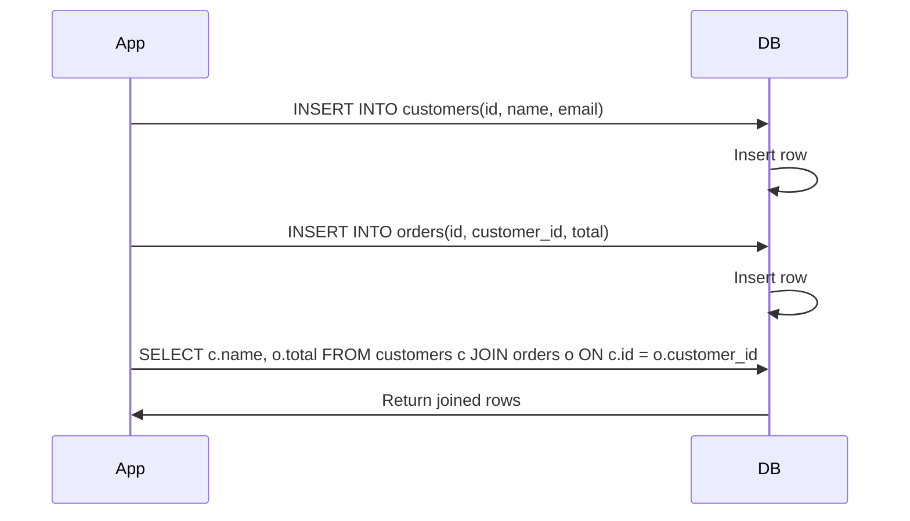

<!-- Generated by Groq via GitHub Actions -->
<!-- Topic ID: T021 -->
<!-- Category: Databases -->
<!-- Generated at UTC: 2026-09-27T06:44:47.681816+00:00 -->

# Database normalization

## 1. What problem does this solve?

**Motivation**  
When you start a backend project you often model data in a single table or a few loosely‑structured collections. As the application grows, that naive design quickly leads to:

- **Data duplication** – the same customer name, address, or product description stored in many rows.
- **Inconsistent updates** – changing a customer’s address in one place but forgetting another.
- **Wasted storage** – repeated strings or blobs take up disk space and slow backups.
- **Harder queries** – you need `JOIN`s or manual de‑duplication logic in code.

**Why it matters**  
- **Correctness** – duplicated data can diverge, causing bugs that are hard to trace.
- **Performance** – larger tables mean slower scans, larger indexes, and more I/O.
- **Maintainability** – schema changes ripple through many places, increasing regression risk.
- **Compliance** – GDPR, HIPAA, etc. require you to control data copies and audit changes.

**What happens if you ignore normalization?**  
- **Anomalies**: insert, update, delete anomalies that corrupt data.
- **Scalability limits**: as rows grow, queries become slower; replication lag increases.
- **Operational headaches**: backups, restores, and migrations become fragile.

**Where it appears in real backends**  
- E‑commerce: customers, orders, products, shipping addresses.
- Social media: users, posts, comments, likes.
- SaaS: tenants, users, subscriptions, usage metrics.
- Microservices: shared reference data (countries, currencies) often stored in a normalized table.

---

## 2. Mental model

### Analogy  
Think of a library. If every book had its own copy of the author’s biography, the library would store the same text thousands of times. Instead, the library keeps one biography per author and references it from each book. This reduces space and ensures that updating the biography updates all books automatically.

### Engineering model  
- **Entities** → tables (or collections) that hold a single concept (e.g., `Customer`, `Order`).
- **Attributes** → columns that describe the entity.
- **Relationships** → foreign keys or references that link entities.
- **Normalization** → a set of rules that reorganize tables so that each piece of information appears only once, and relationships are explicit.

---

## 3. Deep explanation

| Topic | Explanation |
|-------|-------------|
| **Internals** | Normalization is a set of *normal forms* (1NF, 2NF, 3NF, BCNF, …). Each form removes a specific type of redundancy or dependency. |
| **Important terminology** | - **Functional dependency**: `A → B` means column B is determined by A.<br>- **Primary key**: unique identifier for a row.<br>- **Foreign key**: reference to a primary key in another table.<br>- **Candidate key**: any minimal set of columns that can uniquely identify a row.<br>- **Redundancy**: duplicate data stored in multiple places. |
| **Trade‑offs** | - **Read performance**: denormalized tables can be faster for read‑heavy workloads because fewer joins.<br>- **Write performance**: normalization reduces writes because you update one place.<br>- **Complexity**: more tables mean more joins and more complex queries. |
| **Failure modes** | - **Partial updates**: if a transaction fails after updating one table but not another, data becomes inconsistent.<br>- **Deadlocks**: complex joins can lead to lock contention.<br>- **Over‑normalization**: too many tiny tables can hurt performance. |
| **Limitations** | - Normalization is a guideline, not a law. Real‑world systems often blend normalization with denormalization for performance.<br>- Some NoSQL stores (e.g., MongoDB) favor embedding over joins, so normalization is less relevant. |
| **Where it fits** | In a relational‑database‑centric backend, normalization is part of the **data modeling** phase. It influences schema migrations, ORM models, and query generation. |
| **Interaction with related concepts** | - **Indexes**: needed to keep joins fast.<br>- **Transactions**: ensure atomicity across multiple tables.<br>- **Caching**: denormalized data may be cached to reduce join load.<br>- **Event sourcing**: events often store snapshots that are denormalized for quick reads. |

---

## 4. How it works

1. **Identify entities** – list the real‑world objects you need to store.  
2. **Define attributes** – decide what data each entity holds.  
3. **Determine primary keys** – choose a unique identifier for each entity.  
4. **Apply functional dependencies** – find columns that depend on others.  
5. **Apply normal forms** – iteratively split tables to satisfy 1NF → 2NF → 3NF → BCNF.  
6. **Add foreign keys** – link related tables.  
7. **Create indexes** – on foreign keys and frequently queried columns.  
8. **Test with sample data** – run insert/update/delete to ensure no anomalies.



---

## 5. Practical implementation

### Example: Customer & Order tables in PostgreSQL

```sql
-- customers table
CREATE TABLE customers (
    id          BIGSERIAL PRIMARY KEY,
    name        TEXT NOT NULL,
    email       TEXT UNIQUE NOT NULL,
    created_at  TIMESTAMP WITH TIME ZONE DEFAULT now()
);

-- orders table
CREATE TABLE orders (
    id          BIGSERIAL PRIMARY KEY,
    customer_id BIGINT NOT NULL REFERENCES customers(id) ON DELETE CASCADE,
    total       NUMERIC(10,2) NOT NULL,
    status      TEXT NOT NULL,
    created_at  TIMESTAMP WITH TIME ZONE DEFAULT now()
);
```

### TypeScript/Node.js with Prisma

```ts
// prisma/schema.prisma
model Customer {
  id        BigInt   @id @default(autoincrement())
  name      String
  email     String   @unique
  orders    Order[]
  createdAt DateTime @default(now())
}

model Order {
  id         BigInt   @id @default(autoincrement())
  customer   Customer @relation(fields: [customerId], references: [id])
  customerId BigInt
  total      Decimal
  status     String
  createdAt  DateTime @default(now())
}
```

```ts
// src/services/orderService.ts
import { prisma } from '../prismaClient';

export async function createOrder(customerId: number, total: number) {
  // Transaction ensures consistency across tables
  return await prisma.$transaction(async (tx) => {
    const order = await tx.order.create({
      data: { customerId, total, status: 'PENDING' },
    });
    // Example: update customer's last order date
    await tx.customer.update({
      where: { id: customerId },
      data: { lastOrderAt: new Date() },
    });
    return order;
  });
}
```

*Comments*  
- `prisma.$transaction` guarantees that either both inserts succeed or both fail.  
- The foreign key `customerId` enforces referential integrity at the DB level.

---

## 6. Production considerations

| Concern | How normalization helps / what to watch |
|---------|----------------------------------------|
| **Scalability** | Normalized tables keep row sizes small, making sharding easier. However, heavy joins can become a bottleneck; consider read replicas or materialized views. |
| **Reliability** | Transactions across tables prevent partial updates. Use ACID guarantees of PostgreSQL or MySQL. |
| **Security** | Fewer duplicate rows reduce the attack surface. Use row‑level security (RLS) on key tables. |
| **Observability** | Log schema changes (migrations). Monitor join performance with query plans. |
| **Performance** | Index foreign keys. Use `EXPLAIN ANALYZE` to spot slow joins. Cache denormalized aggregates if needed. |
| **Error handling** | Wrap DB operations in try/catch. Use retry logic for transient errors. |
| **Resource usage** | Normalized tables use less disk, but more tables mean more metadata overhead. |
| **Operational concerns** | Keep migrations idempotent. Use tools like Flyway or Prisma Migrate. |
| **Failure recovery** | Backups of normalized DB are smaller. Point‑in‑time recovery is simpler. |
| **Deployment** | Apply migrations in CI/CD. Use versioned schema. |

---

## 7. Common mistakes

| Mistake | Why it’s problematic |
|---------|----------------------|
| **Skipping primary keys** | Without a PK, you can’t enforce uniqueness or join reliably. |
| **Storing derived data** | E.g., storing `full_name` when you already have `first_name` + `last_name`. Leads to update anomalies. |
| **Over‑denormalizing for speed** | Adding redundant columns to avoid joins can make writes expensive and data inconsistent. |
| **Not using foreign keys** | Referential integrity is lost; orphaned rows appear. |
| **Ignoring indexes on FK columns** | Joins become full scans, hurting read performance. |
| **Merging unrelated entities** | E.g., putting `User` and `Order` in one table. Violates 1NF and makes queries messy. |
| **Assuming NoSQL is always better** | MongoDB’s embedding is great for certain patterns, but relational DBs still shine for complex joins. |

---

## 8. Senior engineer perspective

### What changes at scale?

- **Architecture decisions**  
  - Choose a *single source of truth* for reference data (e.g., countries, currencies).  
  - Decide between *schema‑on‑write* (strict normalization) vs *schema‑on‑read* (denormalized views).  
  - Use *materialized views* or *cached aggregates* for heavy read workloads.

- **Trade‑offs**  
  - Normalization reduces write amplification but can increase read latency due to joins.  
  - Denormalization can double storage but speeds up reads; acceptable if writes are rare.

- **Bottlenecks**  
  - Join storms on hot tables.  
  - Lock contention on highly concurrent writes.  
  - Index bloat on large tables.

- **Failure scenarios**  
  - Transaction deadlocks: use consistent lock ordering.  
  - Schema drift: enforce migration pipelines and versioned APIs.

- **Monitoring**  
  - Track query times, lock wait times, and index usage.  
  - Alert on high `SELECT` latency on join queries.

- **Cost/performance**  
  - Normalized tables reduce storage costs but may require more compute for joins.  
  - Denormalized tables can reduce compute but increase storage and backup costs.

- **When NOT to use**  
  - If the workload is *write‑heavy* and *simple* (e.g., logging), a flat table may suffice.  
  - If you need *real‑time analytics* on large fact tables, consider a data warehouse (Snowflake, BigQuery) rather than a normalized OLTP DB.

---

## 9. Interview questions

1. **Beginner** – *What is a primary key and why is it important?*  
   *Answer:* A primary key uniquely identifies each row in a table. It enforces uniqueness, enables indexing, and is required for foreign key relationships.

2. **Beginner** – *Explain the difference between 1NF and 2NF.*  
   *Answer:* 1NF requires atomic columns and no repeating groups. 2NF removes partial dependencies: every non‑key column must depend on the whole primary key, not just part of it.

3. **Senior** – *How would you handle a situation where a normalized schema causes a join storm on a read‑heavy service?*  
   *Answer:* Options: add read replicas, create materialized views, denormalize critical columns, or use a caching layer (Redis) for aggregated data. Discuss trade‑offs and monitoring.

4. **Senior** – *Describe a scenario where denormalization is justified, and how you would mitigate the risks.*  
   *Answer:* Example: a leaderboard that needs to read millions of rows per second. Denormalize the score into a separate table or cache. Mitigate by using immutable snapshots, versioned schemas, and periodic reconciliation.

5. **Scenario/Debugging** – *You notice that updating a customer’s address sometimes leaves old addresses in the orders table. What could be wrong and how would you fix it?*  
   *Answer:* Likely the orders table stores a copy of the address (denormalized). Fix by removing the address column from orders and referencing `customers.address_id` instead, or by adding a trigger to propagate changes. Ensure foreign key constraints and transaction isolation.

---

## 10. Hands‑on task

**Task:**  
Add a `CustomerAddress` table to the existing schema and refactor the `orders` table to reference it via a foreign key instead of storing the address inline.

**Steps:**

1. Create a new `customer_addresses` table with columns: `id`, `customer_id`, `street`, `city`, `state`, `zip`.
2. Add a foreign key `address_id` to `orders`.
3. Write a migration script (Prisma or raw SQL) to populate `customer_addresses` from existing orders.
4. Update the `createOrder` service to accept an `addressId` instead of address fields.
5. Write a unit test that verifies an order’s address is correctly linked and that updating a customer address propagates to all orders.

---

## 11. Quick revision

- Normalization removes data duplication and update anomalies.
- 1NF: atomic columns, no repeating groups.
- 2NF: no partial dependencies on composite keys.
- 3NF: no transitive dependencies.
- BCNF: every determinant is a candidate key.
- Primary key → unique identifier; foreign key → reference.
- Use transactions to keep multi‑table writes atomic.
- Index foreign keys for join performance.
- Denormalization trades consistency for speed; use sparingly.
- Monitor join latency; consider materialized views or caching.
- Always enforce referential integrity with FK constraints.
- Keep migrations idempotent and versioned.
- In NoSQL, embedding is the analog of denormalization.

---

## 12. References

- [PostgreSQL Documentation – Normalization](https://www.postgresql.org/docs/current/ddl-constraints.html)
- [MySQL Documentation – Normalization](https://dev.mysql.com/doc/refman/8.0/en/normalization.html)
- [Prisma Schema Language](https://www.prisma.io/docs/concepts/components/prisma-schema)
- [SQL:2003 Standard – Normal Forms](https://www.iso.org/standard/39115.html)
- [Database Normalization Guide – Microsoft Docs](https://learn.microsoft.com/en-us/sql/relational-databases/databases/database-normalization?view=sql-server-ver15)
- [NoSQL vs Relational: When to Normalize](https://www.mongodb.com/nosql-explained/relational-databases)
