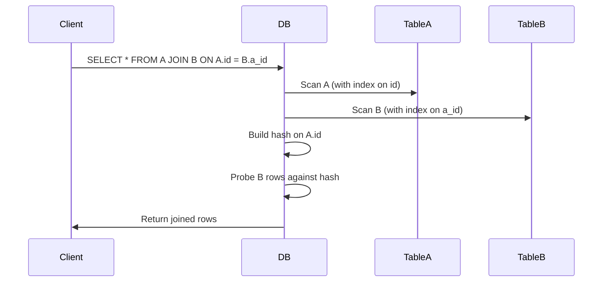

<!-- Generated by Groq via GitHub Actions -->
<!-- Topic ID: T022 -->
<!-- Category: Databases -->
<!-- Generated at UTC: 2026-09-27T06:44:47.681816+00:00 -->

# Joins

## 1. What problem does this solve?

When building a backend you almost always need to combine data that lives in more than one table or collection.  
Typical scenarios:

| Scenario | Data spread across | Why you need a join |
|----------|--------------------|---------------------|
| User profile + orders | `users` + `orders` | Show a user’s order history |
| Blog post + author | `posts` + `authors` | Render author bio next to post |
| Product + inventory | `products` + `stock` | Show stock level next to product details |

**Why it matters**

* **Performance** – Pulling data in separate round‑trips can be slow and waste bandwidth.
* **Consistency** – A single query guarantees that the data is from the same snapshot.
* **Simplicity** – One query is easier to reason about than multiple queries and manual merges.

**If you don’t use joins**

* You’ll write more code to stitch data together.
* You’ll increase latency (multiple round‑trips).
* You’ll risk stale data if the data changes between queries.

**Real‑world use**

* E‑commerce sites join `orders` with `customers` and `products`.
* Social media platforms join `posts` with `users` and `comments`.
* Analytics dashboards join `events` with `users` to compute engagement metrics.

---

## 2. Mental model

**Analogy – a library catalog**

Think of a library where each book has a *catalog record* (title, author ID, genre ID).  
The *author* and *genre* tables hold the actual names.  
When you want to display a book, you look up the catalog record and then “borrow” the author and genre records.  
A *join* is like a librarian who automatically pulls the author and genre for you in one go.

**Engineering model**

A join is a database operation that combines rows from two or more tables based on a related column (the *join key*).  
The database engine decides how to match rows (hash, merge, nested loop) and returns a single result set.

---

## 3. Deep explanation

### Internals

* **Join types**  
  * `INNER JOIN` – only rows with matching keys in both tables.  
  * `LEFT (OUTER) JOIN` – all rows from the left table, plus matching right rows (or `NULL`).  
  * `RIGHT`, `FULL`, `CROSS` – less common but useful in specific cases.

* **Execution strategies**  
  * **Nested loop** – for each row in the left table, scan the right table.  
  * **Hash join** – build a hash table on the join key of one side, then probe with the other.  
  * **Merge join** – both tables sorted on the join key; merge like merge‑sort.

* **Indexes** – the engine uses indexes on join keys to avoid full table scans.

### Important terminology

| Term | Meaning |
|------|---------|
| **Join key** | Column(s) used to match rows. |
| **Foreign key** | Column in one table that references the primary key of another. |
| **Cardinality** | The number of rows in a table or the number of distinct values in a column. |
| **Selectivity** | Fraction of rows that match a predicate; high selectivity means few rows. |

### Trade‑offs

| Factor | Inner Join | Left Join |
|--------|------------|-----------|
| **Result size** | Smaller (only matches) | Larger (includes non‑matches) |
| **Performance** | Usually faster | Can be slower if many non‑matches |
| **Null handling** | No nulls from right side | Nulls for missing right rows |

### Failure modes

* **Cartesian product** – forgetting a join condition (`JOIN table2`) can produce `n*m` rows.
* **Ambiguous column names** – same column name in both tables leads to `column ambiguous` errors.
* **Missing indexes** – can cause full scans and timeouts.

### Limitations

* Joins are relational; they don’t work on unstructured data like plain JSON blobs in MongoDB (unless using `$lookup`).
* Deeply nested joins can be hard to read and maintain.
* Very large tables may require partitioning or materialized views.

### Where it fits

* **Data layer** – SQL queries, ORM query builders, or raw SQL.
* **API layer** – GraphQL resolvers often use joins under the hood.
* **ETL pipelines** – Joins are common when aggregating data from multiple sources.

### Interaction with related concepts

* **Indexes** – critical for join performance.  
* **Transactions** – joins inside a transaction see a consistent snapshot.  
* **Caching** – you can cache the result of a join query to avoid repeated work.  
* **Denormalization** – sometimes you duplicate data to avoid expensive joins.

---

## 4. How it works

1. **Parse query** – the planner reads the `JOIN` clause.  
2. **Choose strategy** – based on statistics, it picks nested loop, hash, or merge.  
3. **Build hash table** (if hash join) – load one side into memory.  
4. **Probe** – iterate over the other side, look up matches in the hash.  
5. **Project** – assemble the output row with columns from both tables.  
6. **Return** – send the result set to the client.



---

## 5. Practical implementation

### TypeScript / Node.js (using `pg`)

```ts
import { Client } from 'pg';

const client = new Client({
  connectionString: process.env.DATABASE_URL,
});
await client.connect();

/**
 * Get user profile with recent orders
 */
async function getUserWithOrders(userId: number) {
  const res = await client.query(
    `
    SELECT
      u.id AS user_id,
      u.name,
      u.email,
      o.id AS order_id,
      o.total,
      o.created_at
    FROM users u
    LEFT JOIN orders o
      ON u.id = o.user_id
    WHERE u.id = $1
    ORDER BY o.created_at DESC
    LIMIT 5
    `,
    [userId]
  );

  // Transform flat rows into nested structure
  const orders = res.rows.map(row => ({
    id: row.order_id,
    total: row.total,
    createdAt: row.created_at,
  }));

  return {
    id: res.rows[0].user_id,
    name: res.rows[0].name,
    email: res.rows[0].email,
    recentOrders: orders,
  };
}
```

**Key points**

* Use `LEFT JOIN` to keep users even if they have no orders.  
* Index `orders.user_id` for fast lookup.  
* Limit the number of orders to avoid huge result sets.

### MongoDB `$lookup` (optional)

```ts
db.users.aggregate([
  { $match: { _id: ObjectId(userId) } },
  {
    $lookup: {
      from: 'orders',
      localField: '_id',
      foreignField: 'userId',
      as: 'orders',
    },
  },
  { $unwind: { path: '$orders', preserveNullAndEmptyArrays: true } },
  { $sort: { 'orders.createdAt': -1 } },
  { $limit: 5 },
]);
```

---

## 6. Production considerations

| Concern | Tips |
|---------|------|
| **Scalability** | Use partitioned tables or sharding if tables exceed a few million rows. |
| **Reliability** | Wrap joins in transactions when you need ACID guarantees. |
| **Security** | Never expose raw SQL; use parameterized queries to avoid injection. |
| **Observability** | Enable query plan logging; monitor `EXPLAIN ANALYZE` output. |
| **Performance** | Keep join keys indexed; consider covering indexes for frequently queried columns. |
| **Error handling** | Catch `Error` from `pg` and map to HTTP 500 or 400 as appropriate. |
| **Resource usage** | Hash joins can consume large memory; monitor `work_mem` in PostgreSQL. |
| **Deployment** | Use connection pooling (`pg.Pool`) to avoid per‑request connection overhead. |
| **Failure recovery** | If a join query times out, fallback to cached data or a simplified query. |

---

## 7. Common mistakes

| Mistake | Why it’s bad |
|---------|--------------|
| **Cartesian product** – forgetting the `ON` clause | Generates `n*m` rows, crippling performance. |
| **Not indexing join keys** | Full scans lead to slow queries. |
| **Using `SELECT *` in production** | Transfers unnecessary columns, increasing I/O. |
| **Assuming join order doesn’t matter** | In some engines, the order can affect plan choice. |
| **Mixing inner and outer joins without understanding nulls** | Can lead to unexpected `NULL` values in results. |
| **Over‑joining** – pulling too many tables | Makes the query hard to maintain and can degrade performance. |

---

## 8. Senior engineer perspective

### Architecture decisions

* **Normalization vs denormalization** – decide whether to keep data in separate tables or duplicate it for read speed.  
* **Materialized views** – pre‑compute expensive joins for dashboards.  
* **Micro‑service boundaries** – sometimes a join is better handled by a dedicated service that owns both tables.

### Trade‑offs

* **Read vs write** – joins favor read‑heavy workloads; writes may need to maintain foreign key constraints.  
* **Consistency** – eventual consistency in distributed systems may require compensating joins or caching strategies.

### Bottlenecks

* **Large hash tables** – can exhaust memory.  
* **Skewed data** – one key with many rows can dominate the join.  
* **Network latency** – in distributed databases, joining across nodes adds round‑trip time.

### Failure scenarios

* **Deadlocks** – complex joins with updates can deadlock; use `SELECT ... FOR UPDATE` carefully.  
* **Data corruption** – missing foreign key constraints can produce orphaned rows that break joins.

### Monitoring

* Query latency dashboards (Prometheus + Grafana).  
* Index hit ratios.  
* `pg_stat_statements` for PostgreSQL.

### Cost/performance

* Indexes cost disk space and write overhead.  
* Materialized views cost refresh time; schedule during low traffic.

### When NOT to use joins

* When the data is truly independent and can be served separately.  
* When you need to aggregate across many tables and the result set is huge – consider pre‑aggregation or NoSQL solutions.

---

## 9. Interview questions

1. **Beginner** – *What is the difference between an INNER JOIN and a LEFT JOIN?*  
   *Answer:* INNER returns only matching rows; LEFT returns all left rows plus matching right rows (NULLs if no match).

2. **Beginner** – *Why should you index the columns used in a JOIN?*  
   *Answer:* Indexes allow the database to locate matching rows quickly, avoiding full table scans.

3. **Senior** – *Explain how PostgreSQL decides between a hash join and a merge join.*  
   *Answer:* It looks at statistics: if both sides are sorted on the join key, a merge join is chosen; if one side is small or the other side is indexed, a hash join may be cheaper. Planner cost estimates guide the choice.

4. **Senior** – *Describe a scenario where a join could lead to a deadlock and how you would mitigate it.*  
   *Answer:* Updating rows in two tables that are joined in different orders can deadlock. Use consistent lock ordering or `SELECT ... FOR UPDATE SKIP LOCKED`.

5. **Scenario/Debugging** – *You notice a query that used to run in 50 ms now takes 5 s after a data migration. What steps would you take to diagnose and fix it?*  
   *Answer:*  
   - Run `EXPLAIN ANALYZE` to see the new plan.  
   - Check if statistics are stale (`ANALYZE`).  
   - Verify indexes still exist and are not fragmented.  
   - Look for increased cardinality or data skew.  
   - Consider adding or adjusting indexes, or rewriting the query.

---

## 10. Hands‑on task

**Goal:** Add a new API endpoint that returns a user’s profile with their 10 most recent posts and the number of likes each post has.

**Steps**

1. Create a new route `/api/users/:id/summary` in your Next.js API route.  
2. Write a PostgreSQL query that joins `users`, `posts`, and `likes` (assuming a `likes` table with `post_id`).  
3. Use a `LEFT JOIN` to include users with no posts.  
4. Return the data as JSON, grouping likes per post.  
5. Add unit tests that mock the database and verify the shape of the response.  
6. Benchmark the endpoint with 100 concurrent requests and document the latency.

---

## 11. Quick revision

- Joins combine rows from two or more tables based on a join key.  
- `INNER JOIN` → only matches; `LEFT JOIN` → all left rows + matches.  
- Index join keys to avoid full scans.  
- Execution strategies: nested loop, hash, merge.  
- Cartesian product occurs if you forget the `ON` clause.  
- Use `EXPLAIN ANALYZE` to inspect query plans.  
- Materialized views pre‑compute expensive joins.  
- In distributed systems, consider data locality and network cost.  
- Always parameterize queries to prevent SQL injection.  
- Monitor query latency and index hit ratios in production.

---

## 12. References

- PostgreSQL documentation – [Joins](https://www.postgresql.org/docs/current/queries-table-expressions.html#QUERIES-JOIN)  
- MySQL documentation – [JOIN Syntax](https://dev.mysql.com/doc/refman/8.0/en/join.html)  
- MongoDB `$lookup` – [Aggregation Pipeline Operators](https://www.mongodb.com/docs/manual/reference/operator/aggregation/lookup/)  
- Node.js `pg` library – [Client API](https://node-postgres.com/features/queries)  
- PostgreSQL `EXPLAIN` – [EXPLAIN](https://www.postgresql.org/docs/current/sql-explain.html)  
- PostgreSQL `pg_stat_statements` – [pg_stat_statements](https://www.postgresql.org/docs/current/pgstatstatements.html)  

---
