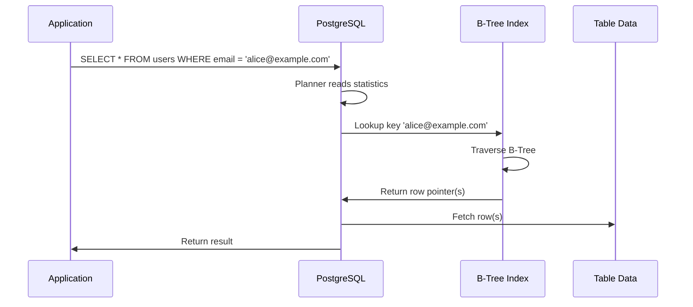

<!-- Generated by Groq via GitHub Actions -->
<!-- Topic ID: T023 -->
<!-- Category: Databases -->
<!-- Generated at UTC: 2026-09-27T17:53:35.709259+00:00 -->

# Indexes

## 1. What problem does this solve?

- **Problem**  
  Databases store data in tables that are essentially unordered collections of rows. When you run a query like `SELECT * FROM users WHERE email = 'alice@example.com'`, the database has to look at every row until it finds a match. This is called a *full table scan*.

- **Why it matters**  
  Full scans are linear in the number of rows. On a table with millions of rows, a scan can take hundreds of milliseconds or even seconds, which is unacceptable for interactive web services, real‑time APIs, or batch jobs that run frequently.

- **What happens if you don’t use indexes**  
  - Slow query response times → poor user experience.  
  - High CPU and I/O load → contention with other queries.  
  - Inability to scale horizontally because each node must scan the entire dataset.

- **Where it appears in real backend systems**  
  - User authentication (`WHERE username = ?`).  
  - E‑commerce order lookups (`WHERE order_id = ?`).  
  - Log aggregation (`WHERE timestamp >= ?`).  
  - AI inference pipelines that filter data by tags or timestamps.

## 2. Mental model

### Analogy  
Think of a library. If every book is just stacked on a shelf, finding a specific title means walking through every book. A library index (the card catalog) lets you jump directly to the shelf and page where the book is.  

### Engineering model  
A database index is a *data structure* that maps a key (e.g., `email`) to the physical location of rows that contain that key. The most common structure is a **B‑tree**, which keeps keys sorted and allows binary search in logarithmic time.

## 3. Deep explanation

| Concept | What it is | Why it matters |
|---------|------------|----------------|
| **Index** | A separate data structure that stores a subset of table columns (the *key*) plus a pointer to the row. | Enables fast lookups without scanning the whole table. |
| **B‑tree** | Balanced tree where each node contains multiple keys and pointers. | Guarantees O(log n) search, insert, delete. |
| **GiST / SP-GiST / GIN** | Generalized index types for spatial, full‑text, array, and JSONB data. | Needed when B‑tree is not expressive enough. |
| **Covering index** | Index that contains all columns needed by a query, so the database can satisfy the query without touching the table. | Eliminates the “index‑only scan” overhead. |
| **Partial index** | Index built only on rows that satisfy a predicate. | Saves space and write cost when only a subset of rows is queried. |
| **Index maintenance** | Automatic updates to the index when rows are inserted, updated, or deleted. | Keeps the index consistent but adds write overhead. |
| **Statistics** | Metadata about column value distribution used by the query planner. | Influences whether the planner chooses to use an index. |

### Trade‑offs

| Benefit | Cost |
|---------|------|
| Faster reads | Extra storage |
| Faster reads on writes | Write amplification (more I/O) |
| Index‑only scans | Requires index to be up‑to‑date |
| Partial indexes | Complexity in maintenance and planning |

### Failure modes

- **Stale statistics** → planner chooses a full scan even though an index exists.  
- **Fragmented index** → slower lookups, higher I/O.  
- **Missing index** on a hot column → catastrophic performance degradation.  
- **Index corruption** (rare) → queries fail or return wrong results.

### Limitations

- Not all queries benefit (e.g., `SELECT * FROM table` without a `WHERE`).  
- High write workloads can negate the benefits.  
- Certain data types (e.g., arrays, JSONB) require specialized index types.  
- Indexes do not help with *clustering* (physical ordering) unless you use a *clustered index* (PostgreSQL’s `CLUSTER` command).

### Where it fits in a backend architecture

```
┌─────────────────────┐
│  Application Layer  │
│  (Node.js / FastAPI)│
└────────────┬────────┘
             │
             ▼
┌─────────────────────┐
│  Database Layer     │
│  (PostgreSQL, etc.) │
└────────────┬────────┘
             │
             ▼
┌─────────────────────┐
│  Storage Layer      │
│  (SSD, HDD)         │
└─────────────────────┘
```

The index lives in the **Database Layer** and is consulted by the query planner before the query is executed on the **Storage Layer**.

### Interaction with related concepts

- **Caching**: Even with a cache, indexes reduce the load on the database.  
- **Sharding**: Each shard must maintain its own indexes.  
- **Replication**: Indexes are replicated automatically.  
- **ORMs**: Many ORMs expose index creation via migrations (e.g., Prisma, TypeORM).  

## 4. How it works

1. **Query received** by the database.  
2. **Planner** reads the query, looks at statistics.  
3. **Planner** decides whether an index can satisfy the `WHERE` clause.  
4. If yes, **index lookup**:  
   - Traverse the B‑tree from root to leaf.  
   - Each node comparison reduces the search space by ~50%.  
5. **Retrieve row pointers** from leaf nodes.  
6. **Fetch rows** from the table (unless a covering index suffices).  
7. **Return result** to the application.



## 5. Practical implementation

### 5.1 PostgreSQL index with Node.js (pg)

```ts
// db.ts
import { Pool } from 'pg';

export const pool = new Pool({
  connectionString: process.env.DATABASE_URL,
});
```

```ts
// migrations/create_user_index.ts
import { pool } from './db';

async function createIndex() {
  await pool.query(`
    CREATE INDEX IF NOT EXISTS idx_users_email
    ON users (email);
  `);
  console.log('Index created');
}

createIndex().catch(console.error);
```

```ts
// queries/findUserByEmail.ts
import { pool } from './db';

export async function findUserByEmail(email: string) {
  const res = await pool.query(
    'SELECT id, username, email FROM users WHERE email = $1',
    [email]
  );
  return res.rows[0];
}
```

> **Important lines**  
> - `CREATE INDEX IF NOT EXISTS` ensures idempotent migrations.  
> - `ON users (email)` creates a B‑tree index on the `email` column.  
> - Parameterized query (`$1`) protects against SQL injection.

### 5.2 Redis sorted set as an index

```ts
// redisIndex.ts
import { createClient } from 'redis';

const client = createClient();
await client.connect();

// Add a user ID to the index keyed by email
async function indexUser(email: string, userId: string) {
  await client.zAdd(`idx:users:email`, { score: 0, value: userId });
  // Store mapping from email to userId
  await client.hSet(`user:${userId}`, 'email', email);
}

// Query by email
async function getUserIdByEmail(email: string) {
  const userId = await client.zScore(`idx:users:email`, email);
  return userId;
}
```

> Redis sorted sets are a simple key‑value index that can be used for small‑scale lookups or as a cache layer.

## 6. Production considerations

| Concern | What to watch for | Mitigation |
|---------|-------------------|------------|
| **Scalability** | Index size grows with table size. | Use partial indexes, drop unused indexes, consider partitioning. |
| **Reliability** | Index corruption or missing indexes. | Regular `pg_dump`/`pg_restore`, monitor `pg_stat_user_indexes`. |
| **Security** | Indexes expose column values. | Use column‑level encryption if needed; indexes are stored in plain text. |
| **Observability** | Hard to see index usage. | Enable `log_min_duration_statement`, use `EXPLAIN (ANALYZE, BUFFERS)`. |
| **Performance** | Write amplification. | Batch inserts, use `UNLOGGED` tables for bulk loads, tune `maintenance_work_mem`. |
| **Error handling** | Index creation failures. | Wrap migrations in transactions, retry logic. |
| **Resource usage** | Disk space. | Monitor `pg_indexes_size`, set alerts. |
| **Operational concerns** | Index rebuild time. | Use `REINDEX CONCURRENTLY` (PostgreSQL 12+), schedule during low traffic. |
| **Failure recovery** | Lost index after crash. | `pg_restore` will recreate indexes; keep migration scripts under version control. |
| **Deployment** | Schema changes in CI/CD. | Use migration tools (Prisma, Flyway, Liquibase) with versioned scripts. |

## 7. Common mistakes

| Mistake | Why it’s problematic |
|---------|----------------------|
| **No index on a highly selective column** | Full scans become the bottleneck. |
| **Index on low‑cardinality column** (e.g., `is_active`) | Index adds overhead but rarely used for filtering. |
| **Over‑indexing** (too many indexes) | Wastes disk space, slows writes, increases maintenance cost. |
| **Ignoring statistics** | Planner may choose a full scan even if an index exists. |
| **Using the wrong index type** (e.g., B‑tree for full‑text search) | Query planner cannot use the index. |
| **Not using covering indexes** | Forces a table lookup after index scan. |
| **Not dropping unused indexes** | Continues to incur write overhead. |
| **Not handling partial indexes correctly** | Queries may miss the index if the predicate is wrong. |

## 8. Senior engineer perspective

### Design decisions at scale

- **Index strategy**:  
  - Use composite indexes that match the most common query patterns.  
  - Prefer partial indexes for hot subsets (e.g., `WHERE status = 'active'`).  
  - Consider covering indexes for read‑heavy workloads.

- **Trade‑offs**:  
  - Write‑heavy systems may need to limit indexes or use write‑optimized storage (e.g., `UNLOGGED` tables).  
  - Storage cost vs. query latency: evaluate with real metrics.

- **Bottlenecks**:  
  - Index rebuilds can lock tables; use `REINDEX CONCURRENTLY`.  
  - High contention on hot index pages; consider sharding or read replicas.

- **Failure scenarios**:  
  - Index corruption: run `REINDEX` or restore from backup.  
  - Missing index: monitor query plans for full scans.

- **Monitoring**:  
  - `pg_stat_user_indexes` for hit ratios.  
  - `pg_stat_user_tables` for index scans vs. sequential scans.  
  - Alert on high `seq_scan` ratio.

- **Cost/performance**:  
  - Estimate disk usage: `pg_indexes_size('table_name')`.  
  - Benchmark query latency before/after index changes.

- **When NOT to use**:  
  - Small tables (< 1 k rows).  
  - Extremely high write throughput where index maintenance dominates.  
  - Queries that touch almost all rows (e.g., `WHERE age > 0` on a table of 10 M rows).

## 9. Interview questions

1. **Beginner** – *What is a database index and why do we use it?*  
   *Answer:* An index is a data structure that maps key values to row locations, enabling fast lookups and reducing the need for full table scans.

2. **Beginner** – *What is a B‑tree index and how does it work?*  
   *Answer:* A B‑tree keeps keys sorted in a balanced tree; searching traverses from root to leaf, halving the search space at each level, giving O(log n) performance.

3. **Senior** – *When would you choose a partial index over a full index?*  
   *Answer:* When only a subset of rows is frequently queried (e.g., `WHERE status = 'active'`), a partial index saves space and write overhead.

4. **Senior** – *Explain how PostgreSQL decides whether to use an index or perform a sequential scan.*  
   *Answer:* The query planner uses statistics (column cardinality, distribution) to estimate cost; if the estimated cost of an index scan is lower than a sequential scan, it chooses the index.

5. **Scenario/Debugging** – *You notice that a query that used to run in 5 ms now takes 200 ms after a bulk insert. What could be wrong and how would you investigate?*  
   *Answer:* Possible causes: stale statistics, index fragmentation, or a missing index. Investigate with `ANALYZE`, `VACUUM`, check `pg_stat_user_indexes`, and run `EXPLAIN (ANALYZE)` to see the plan.

## 10. Hands‑on task

**Goal:** Add a composite index to the `orders` table in the repository’s PostgreSQL database and measure the performance impact.

1. **Create the index**  
   ```ts
   await pool.query(`
     CREATE INDEX IF NOT EXISTS idx_orders_user_date
     ON orders (user_id, created_at DESC);
   `);
   ```

2. **Run a benchmark**  
   - Use `pgbench` or a simple Node.js script that executes a query like:  
     ```ts
     SELECT * FROM orders WHERE user_id = $1 ORDER BY created_at DESC LIMIT 10;
     ```
   - Measure execution time before and after adding the index.

3. **Analyze the plan**  
   ```ts
   const res = await pool.query(`EXPLAIN (ANALYZE, BUFFERS) SELECT ...`);
   console.log(res.rows.map(r => r['QUERY PLAN']).join('\n'));
   ```

4. **Document findings**  
   - Record the query times, plan differences, and any changes in I/O or CPU usage.

## 11. Quick revision

- Indexes are data structures that map key values to row locations.  
- B‑tree is the default index type; GiST, SP‑GiST, GIN for specialized data.  
- Indexes speed up `WHERE`, `ORDER BY`, `GROUP BY`, and join predicates.  
- Write operations incur extra I/O to maintain indexes.  
- Use `EXPLAIN` to verify index usage.  
- Partial indexes target hot subsets; covering indexes avoid table lookups.  
- Monitor `pg_stat_user_indexes` and `pg_stat_user_tables`.  
- Rebuild indexes with `REINDEX CONCURRENTLY` to avoid locking.  
- Drop unused indexes to reduce write overhead.  
- Keep statistics up‑to‑date with `ANALYZE`.  
- Indexes are stored in plain text; encrypt sensitive columns if needed.  
- In high‑write workloads, consider sharding or read replicas to distribute index maintenance.

## 12. References

- PostgreSQL Documentation – [Indexes](https://www.postgresql.org/docs/current/indexes.html)  
- PostgreSQL Documentation – [Index Types](https://www.postgresql.org/docs/current/index-types.html)  
- PostgreSQL Documentation – [Query Planner and Optimizer](https://www.postgresql.org/docs/current/planner-optimizer.html)  
- Node.js `pg` Library – [Official Docs](https://node-postgres.com/)  
- Prisma Migrations – [Creating Indexes](https://www.prisma.io/docs/concepts/components/prisma-migrate/creating-and-running-migrations)  
- Redis – [Sorted Sets](https://redis.io/docs/data-types/sorted-sets/)  

---
