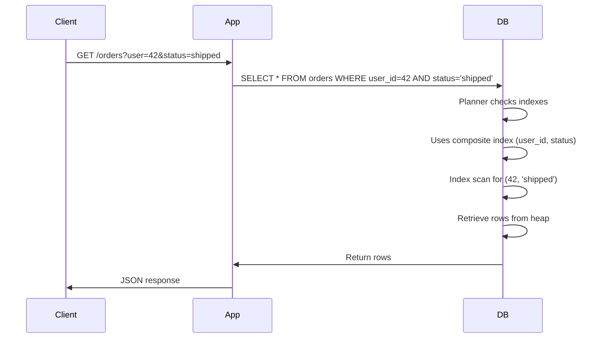

<!-- Generated by Groq via GitHub Actions -->
<!-- Topic ID: T024 -->
<!-- Category: Databases -->
<!-- Generated at UTC: 2026-09-27T17:53:35.709259+00:00 -->

# Composite indexes

## 1. What problem does this solve?

**Motivation**  
When a database receives a query, it must decide how to locate the requested rows.  
If the query filters on multiple columns (`WHERE a = 5 AND b = 10`) and the database
has to scan the whole table, the cost grows linearly with the number of rows.  
A composite index is a data structure that lets the database jump straight to the
rows that satisfy *all* the filter conditions (and sometimes the sort order) in
logarithmic time.

**What problem exists?**  
- Slow queries that touch large tables.  
- Inefficient use of single‑column indexes that cannot satisfy multi‑column predicates.  
- Unnecessary full‑table scans that waste CPU, I/O, and lock resources.

**Why the problem matters**  
- Latency: users see slow page loads or API responses.  
- Throughput: the backend can’t handle more concurrent requests.  
- Cost: more I/O and CPU translates to higher cloud bill.  
- Consistency: long scans can block writes, leading to lock contention.

**What happens if this concept is not used?**  
- Queries degrade to full scans.  
- Write operations may block reads (or vice versa).  
- The system may need to scale out (more replicas, sharding) just to keep up.  
- Developers may resort to “denormalization” or caching hacks that add complexity.

**Where this concept appears in real backend systems**  
- E‑commerce: `SELECT * FROM orders WHERE user_id = $1 AND status = $2`.  
- Social media: `SELECT * FROM posts WHERE author_id = $1 AND created_at > $2`.  
- Analytics dashboards: `SELECT COUNT(*) FROM events WHERE event_type = $1 AND date = $2`.  
- Any system that filters on multiple columns and needs low latency.

---

## 2. Mental model

### Analogy: Library shelf vs. book index  
Imagine a library that stores books alphabetically on shelves.  
If you want to find every book by *author* and *genre*, you’d have to walk the whole
library (full scan).  
Instead, the library creates a **catalog index** that lists every book under the
combination “author → genre → title”.  
Now you can jump straight to the shelf section that contains the exact author‑genre
combination and read only those books.

### Engineering model  
A composite index is a sorted tree (usually a B‑tree) that stores tuples of the
indexed columns in a specific order.  
When a query asks for `WHERE a = 5 AND b = 10`, the planner looks up the first
tuple `(5, 10)` in the index, then follows pointers to the actual rows.  
If the index order is `(b, a)` instead of `(a, b)`, the planner can still use it
for `WHERE b = 10` but not for the combined predicate.

---

## 3. Deep explanation

### Internals  
- **B‑tree** (default in PostgreSQL, MySQL, SQLite): balanced tree of pages; each leaf contains sorted key tuples and pointers to data rows.  
- **Hash** (PostgreSQL 10+): used for equality predicates on a single column; not suitable for range or multi‑column queries.  
- **GiST, SP-GiST, GIN**: extensible indexes for geometric, full‑text, or array data.  
- **Covering index**: an index that contains all columns needed for a query, allowing an *index‑only scan*.

### Important terminology  
- **Key**: the tuple of indexed columns.  
- **Leaf node**: contains actual key/value pairs.  
- **Internal node**: contains routing keys.  
- **Selectivity**: fraction of rows that match a predicate; high selectivity (low fraction) is good for indexes.  
- **Index statistics**: histogram of key distribution used by the planner.  
- **Index maintenance**: updates, deletes, and inserts that modify the index.  
- **Partial index**: index built only on rows that satisfy a predicate (`WHERE status = 'active'`).  
- **Unique composite index**: enforces uniqueness across multiple columns.

### Trade‑offs  
| Aspect | Benefit | Cost |
|--------|---------|------|
| **Read performance** | Fast lookups for multi‑column predicates | |
| **Write performance** | Extra work to update index on INSERT/UPDATE/DELETE | |
| **Storage** | Extra disk space for index pages | |
| **Maintenance** | Requires statistics refresh, rebuilds | |
| **Complexity** | More indexes to manage | |

### Failure modes  
- **Stale statistics**: planner chooses wrong plan → full scan.  
- **Fragmentation**: many updates cause index pages to split/merge → slower scans.  
- **Wrong column order**: index unusable for certain predicates.  
- **Over‑indexing**: too many indexes increase write latency and storage.

### Limitations  
- Cannot index functions or expressions unless explicitly defined (e.g., `LOWER(name)`).  
- Some databases (e.g., MongoDB) limit index size per document.  
- Composite indexes are not useful for queries that only filter on a single column
  if a single‑column index already exists.  
- Indexes do not help with *full‑text* or *geospatial* queries unless specialized index types are used.

### Where this concept fits in a backend architecture  
- **Query planner**: decides whether to use an index.  
- **ORM layer**: often exposes index creation via decorators or migration scripts.  
- **Cache layer**: indexes can be mirrored in Redis for hot queries, but that’s a separate concern.  
- **Replication**: indexes are replicated to standby nodes; write latency is affected.  
- **Sharding**: composite indexes can be used to shard on a combination of columns.

### Interaction with related backend concepts  
- **Partitioning**: a composite index can span across partitions if the partition key is part of the index.  
- **Caching**: an index can be considered a form of cache for query results.  
- **Monitoring**: `pg_stat_user_indexes` in PostgreSQL shows index usage.  
- **Security**: indexes can expose column data in the index file; ensure encryption at rest if needed.

---

## 4. How it works

1. **Query arrives** – e.g., `SELECT * FROM orders WHERE user_id = 42 AND status = 'shipped'`.  
2. **Planner analyzes** – looks at available indexes and statistics.  
3. **Index match** – finds composite index on `(user_id, status)`.  
4. **Index scan** – performs a B‑tree lookup for key `(42, 'shipped')`.  
5. **Row retrieval** – follows pointers to heap pages, reads matching rows.  
6. **Return result** – sends rows to the client.



---

## 5. Practical implementation

### PostgreSQL + TypeScript (Prisma)

```ts
// prisma/schema.prisma
model Order {
  id        Int      @id @default(autoincrement())
  userId    Int
  status    String
  createdAt DateTime @default(now())

  @@index([userId, status]) // composite index
}
```

```ts
// src/index.ts
import { PrismaClient } from '@prisma/client';
const prisma = new PrismaClient();

async function getShippedOrders(userId: number) {
  // Uses the composite index automatically
  return await prisma.order.findMany({
    where: { userId, status: 'shipped' },
  });
}

getShippedOrders(42).then(console.log).catch(console.error);
```

> **Important line**: `@@index([userId, status])` tells Prisma to create a B‑tree index on the two columns in that order.  
> The planner will use it for queries that filter on both columns.

### MongoDB (Node.js driver)

```js
// db.js
const { MongoClient } = require('mongodb');
const client = new MongoClient(process.env.MONGO_URI);
await client.connect();
const db = client.db('shop');
const orders = db.collection('orders');

// Create composite index
await orders.createIndex({ userId: 1, status: 1 });

async function getShippedOrders(userId) {
  return await orders.find({ userId, status: 'shipped' }).toArray();
}
```

> MongoDB automatically uses the index if the query matches the key pattern.

### Redis (sorted set as a composite key)

```ts
// Not a true composite index, but a common pattern
import { createClient } from 'redis';
const client = createClient();
await client.connect();

async function addOrder(userId: number, status: string, orderId: string) {
  const key = `orders:${userId}:${status}`;
  await client.zAdd(key, { score: Date.now(), value: orderId });
}

async function getOrders(userId: number, status: string) {
  const key = `orders:${userId}:${status}`;
  return await client.zRange(key, 0, -1);
}
```

> Redis uses the key prefix (`orders:42:shipped`) as a composite index.

---

## 6. Production considerations

| Concern | What to watch for | Mitigation |
|---------|-------------------|------------|
| **Scalability** | Index size grows with data; can become a bottleneck on read‑heavy workloads. | Use partial indexes, partitioning, or sharding. |
| **Reliability** | Index corruption can lead to query failures. | Regular `VACUUM`/`REINDEX`, monitor `pg_stat_user_indexes`. |
| **Security** | Index files may expose sensitive column values. | Enable encryption at rest; use column‑level encryption if needed. |
| **Observability** | Unused indexes waste resources. | Query `pg_stat_user_indexes` to see hit ratios; drop unused indexes. |
| **Performance** | Write latency increases with many indexes. | Balance read vs. write load; consider write‑optimized storage (e.g., write‑ahead logs). |
| **Error handling** | Index creation can fail due to duplicate keys. | Use `ON CONFLICT` or `IF NOT EXISTS` clauses; handle errors in migrations. |
| **Resource usage** | Disk space for indexes. | Monitor disk usage; set alerts for index growth. |
| **Operational concerns** | Index rebuilds during peak traffic. | Schedule maintenance windows; use `CREATE INDEX CONCURRENTLY`. |
| **Failure recovery** | Lost index after crash. | Keep migrations versioned; run `prisma migrate deploy` on startup. |
| **Deployment** | Schema changes require migrations. | Use CI/CD pipelines that run migrations before service start. |

---

## 7. Common mistakes

| Mistake | Why it’s problematic |
|---------|----------------------|
| **Wrong column order** | Index on `(status, user_id)` won’t help `WHERE user_id = ? AND status = ?` because the planner can’t use it for the first column. |
| **Indexing low‑selectivity columns** | If `status` has only 3 values, the index is almost useless for filtering. |
| **Over‑indexing** | Every write updates every index; too many indexes slow down inserts/updates. |
| **Ignoring statistics** | Out‑of‑date stats cause the planner to pick a full scan. |
| **Using composite index for single‑column queries** | The planner may still use the single‑column index; the composite index adds unnecessary overhead. |
| **Not considering partial indexes** | Indexing all rows when only a subset is queried wastes space and write time. |
| **Neglecting index maintenance** | Fragmented indexes degrade performance over time. |
| **Assuming indexes are “free”** | They consume disk, memory, and CPU on every write. |

---

## 8. Senior engineer perspective

### What changes at scale?

- **Design decisions**  
  - Choose index columns based on query patterns and cardinality.  
  - Prefer partial indexes for hot subsets (e.g., `WHERE status = 'active'`).  
  - Use covering indexes to avoid heap lookups.  
  - Align index order with the most common query predicates.  

- **Trade‑offs**  
  - Write latency vs. read latency: heavy write workloads may need fewer indexes.  
  - Storage cost: large indexes can consume significant disk; consider compression.  
  - Maintenance windows: rebuild indexes during low traffic.  

- **Bottlenecks**  
  - Index contention on hot keys (e.g., `user_id` for a popular user).  
  - Lock escalation on large index updates.  

- **Failure scenarios**  
  - Index corruption → query failures; mitigated by regular backups and `pg_dump`.  
  - Out‑of‑space on index tablespace → service outage; monitor disk usage.  

- **Monitoring**  
  - `pg_stat_user_indexes` for hit ratios.  
  - `EXPLAIN (ANALYZE, BUFFERS)` to see if index scans are used.  
  - Alert on high index update rates.  

- **Cost/performance**  
  - Evaluate cost of additional storage vs. query latency improvement.  
  - Use cost‑based planner estimates; tune `random_page_cost` and `seq_page_cost`.  

- **When NOT to use**  
  - For write‑heavy tables where index maintenance dominates.  
  - When the query only filters on a single high‑selectivity column; a single‑column index suffices.  
  - When the data set is tiny; full scans are cheaper.  

---

## 9. Interview questions

1. **Beginner** – *What is a composite index and why would you use it?*  
   *Answer:* A composite index is an index that covers multiple columns. It speeds up queries that filter or sort on those columns together, reducing the need for full table scans.

2. **Beginner** – *How does the order of columns in a composite index affect query performance?*  
   *Answer:* The planner can use the index only if the query predicates match the left‑most columns. For example, an index on `(a, b)` can satisfy `WHERE a = ? AND b = ?` but not `WHERE b = ?`.

3. **Senior** – *Explain how you would decide between a composite index and a partial index in a high‑traffic e‑commerce system.*  
   *Answer:* Use a partial index if only a subset of rows is frequently queried (e.g., `WHERE status = 'active'`). This reduces index size and write overhead. Evaluate cardinality, query frequency, and write patterns.

4. **Senior** – *Describe a scenario where a composite index could actually hurt performance and how you would detect it.*  
   *Answer:* If the index is on low‑selectivity columns (e.g., `status` with only 3 values) and the query also filters on a high‑selectivity column, the planner may still choose a full scan. Detect via `EXPLAIN` showing a sequential scan and low index hit ratio.

5. **Scenario/Debugging** – *You notice that a query that used to be fast has become slow after a recent data load. What steps would you take to diagnose and fix the issue?*  
   *Answer:*  
   - Run `EXPLAIN (ANALYZE, BUFFERS)` to see if the planner still uses the index.  
   - Check `pg_stat_user_indexes` for hit ratio.  
   - Verify statistics are up‑to‑date (`ANALYZE`).  
   - Look for index fragmentation or bloat (`pgstattuple`).  
   - Consider rebuilding the index (`REINDEX`).  
   - If the data load changed cardinality, adjust the index or add a partial index.

---

## 10. Hands‑on task

**Goal:** Measure the performance impact of a composite index on a real query.

1. **Setup**  
   - Create a PostgreSQL database with a table `orders` (id, user_id, status, amount, created_at).  
   - Populate it with 1 M rows using a script.  

2. **Baseline**  
   - Run `SELECT * FROM orders WHERE user_id = 12345 AND status = 'shipped'` without any composite index.  
   - Record execution time and rows returned.  

3. **Add index**  
   - Create composite index: `CREATE INDEX idx_user_status ON orders(user_id, status);`  
   - Run the same query again; record execution time.  

4. **Analysis**  
   - Compare execution plans (`EXPLAIN`).  
   - Observe the change in I/O and CPU.  
   - Optionally, add a partial index (`WHERE status = 'shipped'`) and repeat.  

5. **Deliverable**  
   - A short report (Markdown) summarizing the findings and explaining why the index helped (or didn’t).  

> **Tip:** Use `pgbench` or a simple Node.js script with `pg` to automate the queries.

---

## 11. Quick revision

- Composite index = B‑tree on multiple columns.  
- Order matters: left‑most columns must match query predicates.  
- Use for multi‑column `WHERE` or `ORDER BY`.  
- Improves read latency but adds write overhead.  
- Partial indexes index only a subset of rows.  
- Covering index contains all needed columns → index‑only scan.  
- Monitor `pg_stat_user_indexes` for hit ratios.  
- Rebuild indexes during low traffic; use `CONCURRENTLY`.  
- Avoid indexing low‑selectivity columns alone.  
- Use `EXPLAIN` to verify index usage.  
- In sharded systems, include shard key in composite index.  
- Index corruption → run `REINDEX`.  

---

## 12. References

- PostgreSQL: Composite indexes – https://www.postgresql.org/docs/current/indexes.html  
- PostgreSQL: Partial indexes – https://www.postgresql.org/docs/current/indexes-partial.html  
- MongoDB: Indexes – https://docs.mongodb.com/manual/core/indexes/  
- Prisma: Indexes – https://www.prisma.io/docs/concepts/components/prisma-schema/relations#indexes  
- PostgreSQL: `pg_stat_user_indexes` – https://www.postgresql.org/docs/current/monitoring-stats.html#PG-STAT-USER-INDEXES  
- PostgreSQL: `EXPLAIN` – https://www.postgresql.org/docs/current/sql-explain.html  

---
