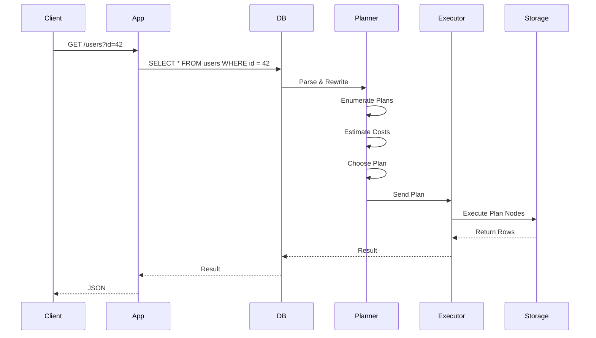

<!-- Generated by Groq via GitHub Actions -->
<!-- Topic ID: T025 -->
<!-- Category: Databases -->
<!-- Generated at UTC: 2026-09-28T07:10:10.880904+00:00 -->

# Query Planning

## 1. What problem does this solve?

When a backend receives a request that needs data from a database, the database must decide **how** to fetch that data.  
The *query planner* is the component that chooses the most efficient execution plan for a SQL statement.

### What problem exists
- A SQL query can be executed in many ways (e.g., full table scan, index scan, hash join, nested‑loop join).
- Each plan has different costs in CPU, I/O, memory, and network.
- Choosing a sub‑optimal plan can turn a fast request into a slow one, or even exhaust resources.

### Why the problem matters
- **Latency**: Users expect sub‑second responses. A bad plan can increase latency from milliseconds to seconds.
- **Throughput**: In high‑traffic services, a single slow query can throttle the entire system.
- **Resource usage**: Inefficient plans consume more CPU, disk I/O, and memory, raising operational costs.

### What happens if this concept is not used
- The database would have to try every possible plan until one succeeds, which is infeasible.
- Developers would need to hand‑craft every query for every workload, leading to brittle code and hard‑to‑maintain optimizations.

### Where this concept appears in real backend systems
- **PostgreSQL**: `EXPLAIN`/`EXPLAIN ANALYZE` shows the chosen plan.
- **MySQL / MariaDB**: `EXPLAIN` keyword.
- **MongoDB**: `explain()` on a query.
- **Distributed engines** (e.g., Snowflake, BigQuery): internal planners that decide how to split work across nodes.

---

## 2. Mental model

### Simple analogy
Imagine you’re ordering a pizza.  
You can **drive** to the shop, **walk**, or **order online**.  
The *planner* is like a GPS that decides the fastest route based on traffic, distance, and your car’s fuel efficiency.

### Precise engineering model
- **Query** → **Planner** → **Execution Plan** → **Executor** → **Result**  
The planner receives the parsed query, estimates costs for each possible plan using statistics, and picks the one with the lowest estimated cost.

---

## 3. Deep explanation

### Internals
1. **Parsing**: SQL is parsed into a parse tree.
2. **Rewriting**: The planner rewrites the tree (e.g., expands views, applies constant folding).
3. **Cost Estimation**: For each candidate plan, the planner estimates:
   - I/O cost (disk reads/writes)
   - CPU cost (row processing)
   - Memory cost (hash tables, sort buffers)
4. **Plan Selection**: The plan with the lowest estimated cost is chosen.
5. **Execution**: The executor walks the plan tree, performing operations like scans, joins, sorts, and aggregations.

### Important terminology
- **Plan node**: A single operation (e.g., `Seq Scan`, `Index Scan`, `Hash Join`).
- **Cost**: A numeric estimate of resources needed; often split into `startup` and `total`.
- **Statistics**: Histogram of column values, row counts, index selectivity.
- **Optimizer**: The component that performs cost estimation and plan selection.
- **Planner hints**: Optional directives to influence plan choice (e.g., `USE INDEX`).

### Trade‑offs
- **Accuracy vs. speed**: More sophisticated cost models (e.g., sampling) give better plans but take longer to compute.
- **Static statistics vs. dynamic data**: Statistics may be stale, leading to sub‑optimal plans.
- **Index maintenance**: Keeping indexes up‑to‑date costs write time but can dramatically reduce read cost.

### Failure modes
- **Stale statistics** → wrong cost estimates → bad plan.
- **Missing indexes** → forced full scans.
- **Complex queries** → planner may not find the optimal join order.

### Limitations
- Relies on accurate statistics; if data distribution changes, the planner may be misled.
- Cannot foresee runtime conditions (e.g., concurrent lock contention).
- Some engines (e.g., MongoDB) have simpler planners; they may not support advanced join strategies.

### Where this concept fits in a backend architecture
- **Application layer**: Sends SQL to the database; may provide hints or rewrite queries.
- **Database layer**: Planner decides execution strategy.
- **Infrastructure layer**: Physical resources (CPU, SSD, RAM) influence cost estimates.

### Interaction with related backend concepts
- **Indexing**: Indexes provide alternative plan nodes.
- **Caching**: Query result caching bypasses the planner entirely for cached queries.
- **Connection pooling**: Planner runs per query; pooling affects concurrency but not plan choice.
- **Distributed query engines**: Planner must consider data locality and network costs.

---

## 4. How it works

1. **Client sends query** →  
2. **Parser** builds parse tree →  
3. **Rewriter** expands views, applies constant folding →  
4. **Optimizer** enumerates candidate plans →  
5. **Cost estimator** uses statistics to assign costs →  
6. **Planner** selects cheapest plan →  
7. **Executor** runs plan nodes sequentially →  
8. **Result** returned to client.



---

## 5. Practical implementation

Below is a Node.js example using `pg` (node‑postgres) that shows how to inspect the planner’s chosen plan with `EXPLAIN`.

```ts
// db.ts
import { Pool } from 'pg';

export const pool = new Pool({
  connectionString: process.env.DATABASE_URL,
  // Enable statement timeout to avoid runaway queries
  statement_timeout: 5000,
});
```

```ts
// queryPlannerDemo.ts
import { pool } from './db';

async function explainQuery(sql: string, params: any[]) {
  // Prefix with EXPLAIN (ANALYZE, BUFFERS) to get runtime stats
  const explainSql = `EXPLAIN (ANALYZE, BUFFERS) ${sql}`;
  const res = await pool.query(explainSql, params);
  console.log(res.rows.map(r => r['QUERY PLAN']).join('\n'));
}

async function main() {
  const userId = 42;

  // Simple query
  await explainQuery(
    'SELECT * FROM users WHERE id = $1',
    [userId]
  );

  // Query that benefits from an index
  await explainQuery(
    'SELECT * FROM orders WHERE user_id = $1 ORDER BY created_at DESC LIMIT 10',
    [userId]
  );
}

main().catch(console.error);
```

### Key lines
- `EXPLAIN (ANALYZE, BUFFERS)` forces PostgreSQL to execute the query and report actual I/O and CPU usage.
- `pool.query` runs the statement; the planner is invoked automatically.
- Inspecting the output helps you see whether an index scan is used or a full table scan occurs.

---

## 6. Production considerations

| Concern | How it applies | Mitigation |
|---------|----------------|------------|
| **Scalability** | Planner cost model must scale with data size. | Keep statistics up‑to‑date (`ANALYZE`), use partitioning. |
| **Reliability** | Bad plans can cause timeouts. | Set `statement_timeout`, use `pgbouncer` for pooling. |
| **Security** | Planner can expose sensitive data via `EXPLAIN`. | Restrict `EXPLAIN` privileges to admins. |
| **Observability** | Monitor slow queries and planner output. | Use `pg_stat_statements`, Grafana dashboards. |
| **Performance** | Planner overhead is negligible compared to execution. | Avoid `EXPLAIN` in production; use it only in dev. |
| **Error handling** | Planner may fail if statistics are corrupted. | Regularly run `VACUUM ANALYZE`. |
| **Resource usage** | Complex queries can consume CPU/memory during planning. | Limit planner depth (`max_parallel_workers_per_gather`). |
| **Operational concerns** | Need to maintain indexes and statistics. | Automate `VACUUM`, `ANALYZE`, and index rebuilds. |
| **Failure recovery** | If planner picks a bad plan, query fails. | Use retry logic with back‑off; fallback to simpler queries. |
| **Deployment** | Schema changes affect planner. | Run `ANALYZE` after migrations; use CI to test query plans. |

---

## 7. Common mistakes

| Mistake | Why it’s problematic |
|---------|----------------------|
| **Ignoring `EXPLAIN`** | Developers assume the DB always chooses the best plan. |
| **Over‑indexing** | Too many indexes increase write latency and storage cost. |
| **Stale statistics** | After large data loads, the planner misestimates selectivity. |
| **Hard‑coding query strings** | Prevents parameterization, leading to SQL injection and sub‑optimal plans. |
| **Using `SELECT *`** | Forces the planner to fetch all columns, even if only a few are needed. |
| **Not using `LIMIT`** | Full scans may be performed when only a few rows are required. |
| **Relying on hints** | Hints can become obsolete as data changes; they may hide underlying issues. |
| **Not monitoring slow queries** | Hidden performance regressions go unnoticed. |

---

## 8. Senior engineer perspective

### What changes at scale
- **Data volume**: Statistics become more critical; you may need to maintain per‑partition stats.
- **Concurrency**: Planner decisions affect lock contention; a bad plan can starve other queries.
- **Distributed DBs**: Planner must account for network latency and data locality.

### Design decisions
- **Index strategy**: Choose between covering indexes, composite indexes, and partial indexes based on query patterns.
- **Partitioning**: Horizontal partitioning can reduce plan cost by limiting scan scope.
- **Materialized views**: Pre‑aggregate data to avoid expensive joins.
- **Query rewrite rules**: Use `pg_hint_plan` or `pg_rewrite` to enforce efficient plans when necessary.

### Bottlenecks
- **Full table scans** on large tables.
- **Nested loop joins** on large datasets.
- **Sort operations** that spill to disk.

### Failure scenarios
- **Index corruption** → planner falls back to scans.
- **Statistic drift** → misestimated costs → timeouts.
- **Lock contention** → planner may choose a plan that locks many rows.

### Monitoring
- `pg_stat_statements` for query latency and frequency.
- `pg_stat_user_indexes` for index usage.
- Alert on queries that exceed `statement_timeout`.

### Cost/performance
- Index maintenance cost vs. read performance.
- Storage cost for indexes vs. query speed.

### When NOT to use the approach
- **Very small tables**: Full scan may be cheaper than index lookup.
- **Write‑heavy workloads**: Indexes can degrade write performance; consider denormalization.
- **Ad‑hoc analytics**: Use a separate analytical engine (e.g., Redshift) where planner can be tuned separately.

---

## 9. Interview questions

| Level | Question | Answer points |
|-------|----------|---------------|
| Beginner | What is the role of a query planner in a database? | Decides execution strategy; chooses scans, joins, indexes; optimizes cost. |
| Beginner | How can you see which plan a PostgreSQL query uses? | Run `EXPLAIN` or `EXPLAIN ANALYZE`; inspect plan nodes. |
| Senior | Explain how PostgreSQL estimates the cost of a plan. | Uses statistics (row counts, histograms), I/O cost, CPU cost; startup vs. total cost. |
| Senior | What are the trade‑offs of using a covering index versus a regular index? | Covering index reduces I/O but may increase write cost; can avoid sort/lookup. |
| Scenario | A query that used to run in 50 ms now takes 5 s after a bulk insert. What could be wrong and how would you fix it? | Likely stale statistics → run `ANALYZE`; maybe index fragmentation → rebuild; check planner output. |

---

## 10. Hands‑on task

**Task**: Build a small Express API that serves user data from PostgreSQL.  
1. Create a `users` table with 1 M rows.  
2. Add an index on `email`.  
3. Implement two endpoints:  
   - `/users/:id` – fetch by primary key.  
   - `/users/by-email?email=` – fetch by email.  
4. Use `EXPLAIN ANALYZE` to verify that the email query uses the index.  
5. Measure latency before and after adding the index.  
6. (Optional) Add a `pg_stat_statements` view and expose a `/stats` endpoint that returns the top 5 slowest queries.

---

## 11. Quick revision

- Query planner chooses the cheapest execution plan based on cost estimates.  
- `EXPLAIN` shows the chosen plan; `EXPLAIN ANALYZE` shows actual runtime.  
- Index scans vs. sequential scans: indexes reduce I/O but add write overhead.  
- Statistics (row counts, histograms) are essential for accurate cost estimation.  
- Stale statistics → bad plans; run `ANALYZE` after large data changes.  
- Partitioning limits scan scope and improves planner decisions.  
- `pg_stat_statements` helps identify slow queries.  
- Over‑indexing hurts writes; under‑indexing hurts reads.  
- Use parameterized queries to avoid SQL injection and enable plan reuse.  
- Monitor `statement_timeout` to catch runaway queries.  
- In distributed engines, planner must consider data locality and network costs.  

---

## 12. References

- PostgreSQL documentation – [EXPLAIN](https://www.postgresql.org/docs/current/sql-explain.html)  
- PostgreSQL documentation – [Planner and Optimizer](https://www.postgresql.org/docs/current/planner-optimizer.html)  
- PostgreSQL documentation – [Statistics Collector](https://www.postgresql.org/docs/current/sql-analyze.html)  
- PostgreSQL documentation – [pg_stat_statements](https://www.postgresql.org/docs/current/pgstatstatements.html)  
- PostgreSQL documentation – [Indexing](https://www.postgresql.org/docs/current/indexes.html)  
- PostgreSQL documentation – [Partitioning](https://www.postgresql.org/docs/current/ddl-partitioning.html)  

---
