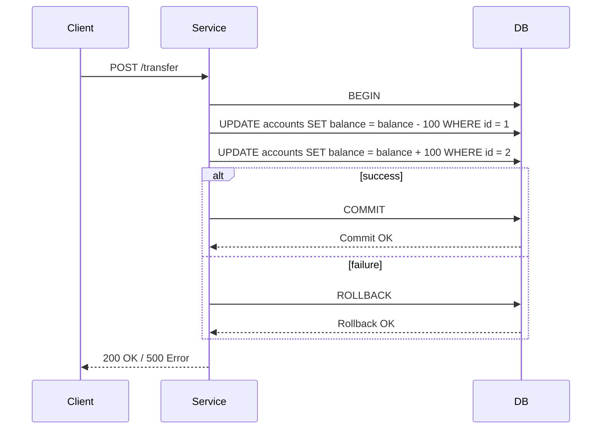

<!-- Generated by Groq via GitHub Actions -->
<!-- Topic ID: T026 -->
<!-- Category: Databases -->
<!-- Generated at UTC: 2026-09-28T07:10:10.880904+00:00 -->

# Transactions

## 1. What problem does this solve?

**Motivation**  
When a backend service performs multiple database operations that belong to a single logical unit of work, we want either *all* of those operations to succeed or *none* to have any effect. Without a mechanism to enforce this, partial updates can leave the system in an inconsistent state.

**What problem exists**  
- **Inconsistent data**: e.g., a user’s account balance is debited but the corresponding transaction record is not created.
- **Lost updates**: two concurrent requests may overwrite each other’s changes.
- **Partial failures**: a network glitch causes one write to succeed while another fails.

**Why the problem matters**  
- **Business correctness**: Financial, inventory, or booking systems rely on atomicity.
- **User trust**: Users expect operations to either complete fully or not at all.
- **Data integrity**: Inconsistent data can cascade into downstream services, causing bugs and data corruption.

**What happens if this concept is not used**  
- Data races lead to incorrect totals, duplicate orders, or orphaned records.
- Auditing becomes impossible because logs may not match the database state.
- Debugging is harder because the root cause may be a missing rollback.

**Where this concept appears in real backend systems**  
- E‑commerce order placement (decrement stock, create order, charge payment).
- Banking transfers (debit one account, credit another).
- Social media posts (create post, update user feed, notify followers).
- Microservice orchestration (Saga pattern, two‑phase commit).

---

## 2. Mental model

**Analogy**  
Think of a transaction as a *shopping cart checkout* in a physical store.  
- You add items to the cart (multiple operations).
- When you press “Pay”, the store processes all items together.
- If the payment fails, the cart is emptied and no items are sold.
- If everything succeeds, the items are removed from inventory and the receipt is printed.

**Engineering model**  
A transaction is a *unit of work* that follows the ACID properties (Atomicity, Consistency, Isolation, Durability). All operations inside the transaction are treated as a single, indivisible step.

---

## 3. Deep explanation

### Internals
- **Atomicity**: The DB engine uses a write‑ahead log (WAL) or redo log. All changes are first written to the log; only when the log is flushed do the changes become visible.
- **Consistency**: Constraints (FK, unique, check) are enforced at commit time.
- **Isolation**: The DB engine provides isolation levels (Read Uncommitted, Read Committed, Repeatable Read, Serializable). It uses locks, MVCC, or timestamp ordering to prevent dirty reads, non‑repeatable reads, or phantom reads.
- **Durability**: Once a transaction commits, its changes survive crashes because they are persisted to stable storage.

### Important terminology
- **BEGIN / COMMIT / ROLLBACK**: SQL statements to start, finalize, or abort a transaction.
- **Savepoint**: A named point inside a transaction that can be rolled back to without aborting the whole transaction.
- **Isolation level**: Degree of visibility of uncommitted changes.
- **Deadlock**: Two transactions waiting on each other’s locks.
- **Two‑Phase Commit (2PC)**: Distributed transaction protocol across multiple resources.

### Trade‑offs
- **Performance vs. Isolation**: Higher isolation levels lock more rows, reducing concurrency.
- **Complexity vs. Simplicity**: Distributed transactions (2PC) are hard to implement and can become bottlenecks.
- **Consistency vs. Availability**: In a highly distributed system, strict ACID may reduce availability.

### Failure modes
- **Lock contention**: Long transactions block others, causing timeouts.
- **Deadlocks**: Must be detected and resolved (usually by aborting one transaction).
- **Partial failures**: Network partitions can cause one side to commit while the other rolls back.

### Limitations
- **Not a silver bullet**: Transactions cannot fix all consistency problems (e.g., eventual consistency in NoSQL).
- **Scalability**: Large transactions lock many rows, hurting throughput.
- **Cross‑service boundaries**: Traditional DB transactions don’t span microservices.

### Where this concept fits in a backend architecture
- **Data layer**: Inside a single relational DB or a single document store.
- **Service layer**: A service may wrap multiple DB calls in a transaction.
- **Orchestration layer**: For distributed systems, a Saga or compensating transaction pattern is often preferred over 2PC.

### Interaction with related concepts
- **Connection pooling**: Each connection can have its own transaction context.
- **ORMs**: Provide transaction helpers (e.g., `sequelize.transaction()`).
- **Caching**: Cache invalidation must happen after commit.
- **Event sourcing**: Events are emitted after commit; otherwise, consumers may see stale state.

---

## 4. How it works

1. **Client** sends a request to the service.
2. **Service** obtains a DB connection from the pool.
3. **Service** starts a transaction (`BEGIN`).
4. **Service** performs a series of DB operations (INSERT, UPDATE, DELETE).
5. **Service** checks for errors; if any, it issues `ROLLBACK`.
6. **Service** issues `COMMIT` if all operations succeeded.
7. **DB** writes the transaction log, flushes to disk, and releases locks.
8. **Service** returns a response to the client.



---

## 5. Practical implementation

### TypeScript/Node.js with PostgreSQL (pg)

```ts
import { Pool } from 'pg';

const pool = new Pool({
  connectionString: process.env.DATABASE_URL,
});

async function transferFunds(
  fromAccountId: number,
  toAccountId: number,
  amount: number
) {
  const client = await pool.connect();
  try {
    await client.query('BEGIN'); // 1. start transaction

    // 2. debit source account
    const debitRes = await client.query(
      'UPDATE accounts SET balance = balance - $1 WHERE id = $2 AND balance >= $1 RETURNING balance',
      [amount, fromAccountId]
    );
    if (debitRes.rowCount === 0) {
      throw new Error('Insufficient funds');
    }

    // 3. credit destination account
    await client.query(
      'UPDATE accounts SET balance = balance + $1 WHERE id = $2',
      [amount, toAccountId]
    );

    await client.query('COMMIT'); // 4. commit
    return { success: true };
  } catch (err) {
    await client.query('ROLLBACK'); // 5. rollback on error
    console.error('Transfer failed', err);
    return { success: false, error: err.message };
  } finally {
    client.release(); // 6. release connection back to pool
  }
}
```

**Key points**

- `BEGIN`/`COMMIT`/`ROLLBACK` are executed on the same connection; otherwise, the transaction context is lost.
- The `RETURNING` clause ensures we only debit if the balance is sufficient.
- Errors trigger a rollback, guaranteeing atomicity.

### Redis transactions (MULTI/EXEC)

```ts
import { createClient } from 'redis';

const client = createClient();
await client.connect();

async function incrementCounter(key: string, delta: number) {
  const tx = client.multi();
  tx.incrby(key, delta);
  tx.get(key);
  const [_, newValue] = await tx.exec(); // atomic
  return Number(newValue);
}
```

Redis guarantees that all commands in a `MULTI` block are executed atomically.

---

## 6. Production considerations

| Concern | What to watch for | Mitigation |
|---------|-------------------|------------|
| **Scalability** | Long transactions lock many rows → contention | Keep transactions short; batch updates; use optimistic locking |
| **Reliability** | Deadlocks, timeouts | Detect deadlocks; retry logic; use lower isolation levels |
| **Security** | Privilege escalation via transaction boundaries | Enforce least‑privilege DB roles; audit logs |
| **Observability** | Hard to trace transaction flow | Log transaction IDs; use tracing (OpenTelemetry) |
| **Performance** | WAL writes, disk I/O | Tune checkpoint intervals; use SSDs; monitor write latency |
| **Error handling** | Partial failures, network glitches | Use idempotent operations; implement retry with exponential backoff |
| **Resource usage** | Connection pool exhaustion | Configure pool size; use connection pooling libraries |
| **Operational concerns** | Schema migrations inside transactions | Run migrations in separate maintenance windows |
| **Failure recovery** | Crash during commit | DB durability guarantees; use WAL replay |
| **Deployment** | Schema changes affecting transactions | Versioned migrations; feature flags |

---

## 7. Common mistakes

| Mistake | Why it’s problematic |
|---------|----------------------|
| **Using `BEGIN`/`COMMIT` on different connections** | The transaction context is per connection; changes are not atomic. |
| **Leaving transactions open for too long** | Locks linger, causing contention and deadlocks. |
| **Ignoring isolation level defaults** | Default `READ COMMITTED` may still allow non‑repeatable reads in some workloads. |
| **Assuming `ROLLBACK` always succeeds** | If the connection is lost, rollback may not be sent; the transaction may stay open. |
| **Not handling deadlocks** | Unhandled deadlocks lead to transaction failures; must retry. |
| **Using transactions for read‑only queries** | Unnecessary overhead; use snapshot reads instead. |
| **Mixing sync/async code incorrectly** | Async callbacks may run after `COMMIT`, causing race conditions. |
| **Not releasing connections** | Connection leaks exhaust the pool, leading to service slowdown. |

---

## 8. Senior engineer perspective

### When used at scale
- **Design decisions**: Choose the right isolation level; consider optimistic vs. pessimistic locking; decide between local transactions and distributed patterns (Saga, 2PC).
- **Trade‑offs**: Balancing consistency with throughput; deciding when to relax ACID for performance.
- **Bottlenecks**: Long‑running transactions, lock contention, checkpoint I/O.
- **Failure scenarios**: Network partitions, node failures, database crashes; plan for graceful degradation.
- **Monitoring**: Track transaction latency, deadlock counts, lock wait times, and rollback rates.
- **Cost/performance**: Higher isolation levels increase CPU and I/O; evaluate cost of additional storage for WAL.
- **When NOT to use**: For high‑throughput write‑heavy workloads where eventual consistency is acceptable; use optimistic concurrency or event sourcing instead.

---

## 9. Interview questions

1. **Beginner**: *What is the purpose of a database transaction?*  
   *Answer*: Ensures a group of operations either all succeed or all fail, maintaining data consistency.

2. **Beginner**: *Explain the difference between `COMMIT` and `ROLLBACK`.*  
   *Answer*: `COMMIT` makes all changes permanent; `ROLLBACK` undoes all changes made in the current transaction.

3. **Senior**: *How does PostgreSQL implement isolation levels, and what are the trade‑offs of `SERIALIZABLE` vs. `READ COMMITTED`?*  
   *Answer*: PostgreSQL uses MVCC; `SERIALIZABLE` provides full isolation but can cause serialization failures and higher contention; `READ COMMITTED` is less strict, allowing more concurrency but risking non‑repeatable reads.

4. **Senior**: *Describe a scenario where a two‑phase commit would be necessary, and explain its drawbacks.*  
   *Answer*: When a single logical operation spans multiple databases (e.g., updating PostgreSQL and Redis). 2PC ensures atomicity across them but introduces a coordinator, potential blocking, and reduced availability.

5. **Scenario/Debugging**: *You notice that a microservice occasionally returns “deadlock detected” errors during high load. What steps would you take to diagnose and fix the issue?*  
   *Answer*:  
   - Enable deadlock logs in the DB.  
   - Identify the queries involved and their lock patterns.  
   - Reduce transaction scope or reorder operations to avoid cyclic locks.  
   - Consider using optimistic locking or retry logic.  
   - Adjust isolation level if appropriate.  
   - Scale the DB or add read replicas to reduce contention.

---

## 10. Hands‑on task

**Task**: Implement a “transfer” endpoint in a Node.js/Express app that moves money between two user accounts stored in PostgreSQL.  
Requirements:

1. Use a single transaction to debit one account and credit another.  
2. Return a 400 error if the source account lacks sufficient funds.  
3. Log the transaction ID and status (committed/rolled back).  
4. Write a unit test that simulates a concurrent transfer to trigger a deadlock, and ensure the service retries or fails gracefully.

**Hints**:  
- Use `pg`’s `Pool` and `client.query('BEGIN')`.  
- Store the transaction ID in a `transactions` table for audit.  
- Use `async-retry` or a custom retry loop.  
- In tests, spawn two async transfers that swap account IDs.

---

## 11. Quick revision

- Transactions guarantee **Atomicity, Consistency, Isolation, Durability** (ACID).
- Use `BEGIN`, `COMMIT`, `ROLLBACK` on the same DB connection.
- Isolation levels control visibility of uncommitted data.
- Long transactions → lock contention; keep them short.
- Deadlocks: detect, abort, and retry.
- Distributed transactions (2PC) are complex; prefer Sagas for microservices.
- Always release DB connections back to the pool.
- Log transaction IDs for observability.
- Use savepoints for partial rollbacks within a transaction.
- Monitor transaction latency, deadlock counts, and rollback rates.
- In Node.js, wrap DB calls in `try/catch/finally` to ensure rollback and release.

---

## 12. References

- PostgreSQL documentation – Transactions: https://www.postgresql.org/docs/current/transaction-iso.html  
- Node.js `pg` library: https://node-postgres.com/  
- Redis transactions: https://redis.io/docs/manual/transactions/  
- OpenTelemetry for tracing: https://opentelemetry.io/docs/collector/  
- “Designing Data-Intensive Applications” – Chapter on Transactions  
- MongoDB transactions: https://docs.mongodb.com/manual/core/transactions/  

---
