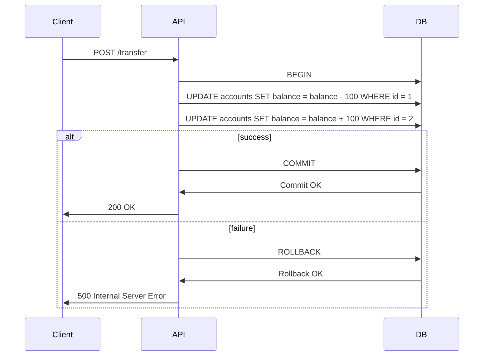

<!-- Generated by Groq via GitHub Actions -->
<!-- Topic ID: T027 -->
<!-- Category: Databases -->
<!-- Generated at UTC: 2026-09-28T20:11:20.379002+00:00 -->

# ACID

## 1. What problem does this solve?

When a backend service performs multiple database operations that belong to a single logical task—like transferring money between accounts or creating an order with inventory deduction—there is a risk that some operations succeed while others fail. This can leave the system in an inconsistent state (e.g., money deducted from one account but not credited to the other).  

**Why it matters**

* **Data integrity** – Users expect that a completed transaction reflects all its effects or none at all.
* **Business rules** – Financial systems, inventory, reservations, and any domain that relies on atomic changes must never expose partial updates.
* **Regulatory compliance** – Auditable trails require that operations are either fully applied or fully rolled back.

**What happens if ACID is not enforced**

* Inconsistent data can propagate errors downstream (e.g., shipping orders with missing inventory).
* Audits fail because logs show partial changes.
* Users may lose trust if they see data anomalies.

**Where it appears in real backend systems**

* Banking and payment gateways (money transfers, refunds).
* E‑commerce order processing (order creation + inventory update).
* Reservation systems (seat booking + payment).
* Microservice orchestration where multiple services must coordinate a single business event.

---

## 2. Mental model

**Analogy – The “All‑or‑Nothing” recipe**

Imagine you’re baking a cake that requires flour, sugar, eggs, and butter. If you accidentally skip adding butter, the cake will taste off. The recipe guarantees that *either* all ingredients are added *or* the cake is discarded.  

**Engineering model**

A database transaction is the same: a *unit of work* that groups multiple operations. The database guarantees that the unit is **Atomic** (all or nothing), **Consistent** (leaves the database in a valid state), **Isolated** (does not interfere with concurrent transactions), and **Durable** (once committed, it survives crashes). These four properties are the ACID guarantees.

---

## 3. Deep explanation

### Internals

| Property | What it guarantees | Typical implementation |
|----------|--------------------|------------------------|
| **Atomicity** | Either all changes are applied or none. | Write-ahead logs (WAL), two‑phase commit (2PC). |
| **Consistency** | Database constraints and business rules are preserved. | Enforced by schema, triggers, application logic. |
| **Isolation** | Concurrent transactions do not see each other’s intermediate states. | Locking (pessimistic), MVCC (optimistic), snapshot isolation. |
| **Durability** | Once a commit is acknowledged, changes survive crashes. | Flushing WAL to disk, replication. |

### Important terminology

* **Transaction** – A logical unit of work.
* **Commit** – Finalizes the transaction; changes become visible.
* **Rollback** – Undoes all changes in the transaction.
* **Isolation level** – Degree of visibility between concurrent transactions (`READ UNCOMMITTED`, `READ COMMITTED`, `REPEATABLE READ`, `SERIALIZABLE`).
* **Two‑Phase Commit (2PC)** – Protocol for coordinating commits across multiple resources.
* **Optimistic Concurrency Control** – Assume no conflict; validate before commit.
* **Pessimistic Concurrency Control** – Acquire locks before accessing data.

### Trade‑offs

| Aspect | Trade‑off |
|--------|-----------|
| **Isolation level** | Higher isolation → more locking → lower concurrency. |
| **Durability** | Writing to disk → latency; using SSDs or replication can mitigate. |
| **Atomicity across services** | 2PC is reliable but adds latency and complexity; Sagas are more scalable but sacrifice strict ACID. |

### Failure modes

* **Deadlocks** – Two transactions wait on each other’s locks. Detected by the DB and one transaction is aborted.
* **Lost updates** – Concurrent updates overwrite each other if isolation is too low.
* **Partial commits** – If a crash occurs before commit, WAL ensures rollback.
* **Network partitions** – In distributed DBs, a node may be isolated; consensus protocols (Raft, Paxos) help.

### Limitations

* **Scalability** – Strict ACID can limit horizontal scaling; sharding often requires eventual consistency.
* **Performance** – Heavy locking or WAL writes can become bottlenecks.
* **Complexity** – Coordinating transactions across microservices (2PC) is hard; often replaced by compensating actions (Sagas).

### Where it fits in a backend architecture

```
mermaid
sequenceDiagram
    participant Client
    participant API
    participant DB
    Client->>API: POST /transfer
    API->>DB: BEGIN
    API->>DB: UPDATE accounts SET balance = balance - 100 WHERE id = 1
    API->>DB: UPDATE accounts SET balance = balance + 100 WHERE id = 2
    API->>DB: COMMIT
    DB->>API: OK
    API->>Client: 200 OK
```

* The API layer starts a transaction, performs multiple updates, and commits.
* If any step fails, the API rolls back.

### Interaction with related concepts

* **Caching** – Cache invalidation must happen after commit.
* **Event sourcing** – Events are appended after commit; the event store must be durable.
* **Distributed tracing** – Transactions span multiple services; tracing helps detect deadlocks or long waits.
* **Idempotency** – Retry logic must respect transaction boundaries to avoid double commits.

---

## 4. How it works

1. **Client sends request** (e.g., transfer money).
2. **API starts a transaction** (`BEGIN`).
3. **API performs operations** (updates, inserts).
4. **Database checks constraints** and writes to WAL.
5. **If all operations succeed** → `COMMIT` writes a commit record to WAL and releases locks.
6. **If any operation fails** → `ROLLBACK` undoes changes using WAL.
7. **Client receives response** based on commit/rollback outcome.



---

## 5. Practical implementation

### TypeScript / Node.js with PostgreSQL (pg)

```ts
import { Pool } from 'pg';

const pool = new Pool({
  connectionString: process.env.DATABASE_URL,
});

async function transferFunds(
  fromAccountId: number,
  toAccountId: number,
  amount: number
) {
  const client = await pool.connect();
  try {
    // 1. Start transaction
    await client.query('BEGIN');

    // 2. Debit source account
    const debitRes = await client.query(
      'UPDATE accounts SET balance = balance - $1 WHERE id = $2 AND balance >= $1 RETURNING balance',
      [amount, fromAccountId]
    );
    if (debitRes.rowCount === 0) {
      throw new Error('Insufficient funds or account not found');
    }

    // 3. Credit destination account
    await client.query(
      'UPDATE accounts SET balance = balance + $1 WHERE id = $2',
      [amount, toAccountId]
    );

    // 4. Commit
    await client.query('COMMIT');
    console.log('Transfer successful');
  } catch (err) {
    // 5. Rollback on any error
    await client.query('ROLLBACK');
    console.error('Transfer failed:', err);
    throw err;
  } finally {
    client.release();
  }
}
```

**Key points**

* `BEGIN` starts a transaction; all subsequent queries run in the same context.
* The debit query uses a `WHERE balance >= $1` to prevent overdraft; if it returns 0 rows, we throw and rollback.
* `COMMIT` writes a commit record to the WAL; if the process crashes before commit, the WAL will roll back on restart.
* `ROLLBACK` undoes all changes made in the transaction.

### Using Redis transactions (MULTI/EXEC)

```ts
import { createClient } from 'redis';

const redis = createClient();

async function incrementCounter(key: string, delta: number) {
  await redis.connect();
  try {
    await redis.multi()
      .incrby(key, delta)
      .exec();
  } catch (err) {
    console.error('Redis transaction failed', err);
  } finally {
    await redis.disconnect();
  }
}
```

Redis guarantees that all commands in a `MULTI/EXEC` block are executed atomically.

---

## 6. Production considerations

| Concern | How ACID affects it | Mitigation |
|---------|---------------------|------------|
| **Scalability** | Strict ACID can limit horizontal scaling (e.g., locking). | Use read replicas, sharding, or eventual consistency for non‑critical data. |
| **Reliability** | WAL and replication ensure durability. | Enable synchronous replication for critical data; monitor WAL lag. |
| **Security** | Transactions prevent partial data exposure. | Use role‑based access control; encrypt data at rest. |
| **Observability** | Long transactions can hide bottlenecks. | Instrument transaction start/commit times; trace deadlocks. |
| **Performance** | Lock contention can slow throughput. | Tune isolation level; use optimistic concurrency where possible. |
| **Error handling** | Need to catch and rollback on any error. | Wrap transaction logic in try/catch; use helper libraries. |
| **Resource usage** | WAL writes consume I/O. | Use SSDs; tune checkpoint intervals. |
| **Operational concerns** | Deadlocks require monitoring. | Enable deadlock detection logs; set timeout. |
| **Failure recovery** | Crash before commit → WAL rollback. | Ensure WAL is on durable storage; test recovery. |
| **Deployment** | Schema migrations must respect transactions. | Use migration tools that wrap changes in transactions. |

---

## 7. Common mistakes

| Mistake | Why it’s problematic |
|---------|----------------------|
| **Using `READ UNCOMMITTED` isolation** | Allows dirty reads; can lead to inconsistent business logic. |
| **Assuming `COMMIT` is instantaneous** | Commit may block until WAL is flushed; can cause latency spikes. |
| **Not handling deadlocks** | Transactions may be aborted silently; leads to silent failures. |
| **Mixing auto‑commit with manual transactions** | Auto‑commit can interleave with manual `BEGIN/COMMIT`, breaking atomicity. |
| **Ignoring rollback on error** | Leaving the transaction open can lock resources indefinitely. |
| **Using `SELECT … FOR UPDATE` without understanding lock scope** | Can cause unnecessary contention. |
| **Assuming all databases support the same isolation levels** | PostgreSQL vs. MySQL vs. MongoDB differ; mis‑configuring can break consistency. |
| **Over‑locking entire tables** | Reduces concurrency; consider row‑level locks or optimistic patterns. |
| **Not testing transaction rollback paths** | Hidden bugs in error handling may surface only in production. |

---

## 8. Senior engineer perspective

### What changes at scale?

* **Architecture decisions** – Decide between single‑node ACID DB vs. distributed consensus (e.g., CockroachDB, Spanner).  
* **Trade‑offs** – 2PC across microservices is reliable but introduces latency; Sagas trade strict ACID for eventual consistency.  
* **Bottlenecks** – Lock contention on hot keys; WAL throughput on high‑write workloads.  
* **Failure scenarios** – Network partitions in distributed DBs; node failures during commit.  
* **Monitoring** – Track transaction latency, deadlock counts, WAL lag, and replication lag.  
* **Cost/performance** – Synchronous replication increases cost; sharding reduces per‑node load but complicates joins.  
* **When NOT to use ACID** – For analytics pipelines where eventual consistency is acceptable; for high‑throughput logging where batching is preferred.

---

## 9. Interview questions

1. **Beginner** – What does the “Atomic” part of ACID guarantee?  
   *Answer:* All operations in a transaction either all succeed or none are applied; no partial state is visible.

2. **Beginner** – Why is durability important in a transaction?  
   *Answer:* It ensures that once a commit is acknowledged, the changes survive crashes and are recoverable from the WAL.

3. **Senior** – Explain the difference between `REPEATABLE READ` and `SERIALIZABLE` isolation levels in PostgreSQL.  
   *Answer:* `REPEATABLE READ` guarantees that any row read during the transaction will not change, but allows phantom reads. `SERIALIZABLE` adds a check to prevent phantom reads by ensuring the transaction behaves as if it were the only one running.

4. **Senior** – How would you design a money transfer service that needs to be highly available and still guarantee ACID across two separate databases?  
   *Answer:* Use a two‑phase commit (2PC) or a distributed transaction coordinator; alternatively, adopt a Saga pattern with compensating actions if strict ACID is too costly. Discuss trade‑offs, latency, and failure recovery.

5. **Scenario/Debugging** – A user reports that after a transfer, the source account shows a negative balance, but the destination account is correct. What could have gone wrong and how would you investigate?  
   *Answer:* Likely the debit operation succeeded but the credit failed and the transaction was not rolled back. Investigate logs for rollback, check isolation level, look for deadlocks or constraint violations, and verify that the application correctly handled errors and performed a rollback.

---

## 10. Hands‑on task

**Task:** Implement a “transfer” endpoint in the provided Node.js repository that:

1. Accepts `fromAccountId`, `toAccountId`, and `amount` via POST `/api/transfer`.
2. Uses a PostgreSQL transaction to debit and credit accounts atomically.
3. Returns HTTP 200 on success, 400 if insufficient funds, and 500 on any other error.
4. Logs transaction start, commit, rollback, and any deadlock errors.

*Hints:* Use `pg`’s `client.query('BEGIN')`, `client.query('COMMIT')`, and `client.query('ROLLBACK')`. Add a `WHERE balance >= $1` clause to prevent overdraft. Wrap logic in `try/catch/finally`.

---

## 11. Quick revision

- ACID: Atomicity, Consistency, Isolation, Durability.
- Atomicity = all or nothing; enforced via WAL and rollback.
- Consistency = schema & business rules; enforced by constraints.
- Isolation levels control visibility; higher levels → more locking.
- Durability = WAL + replication; survives crashes.
- 2PC coordinates commits across multiple resources.
- Deadlocks: detect and abort one transaction.
- Optimistic vs. pessimistic concurrency control.
- In microservices, consider Sagas for eventual consistency.
- Monitor transaction latency, deadlock counts, WAL lag.
- Avoid `READ UNCOMMITTED`; use `READ COMMITTED` or higher.
- Always rollback on error; never leave transactions open.
- Use `SELECT … FOR UPDATE` for row‑level locking when needed.
- Sharding can break strict ACID; use distributed DBs if needed.
- Test rollback paths; handle network partitions.

---

## 12. References

- PostgreSQL documentation – Transactions: <https://www.postgresql.org/docs/current/transaction-iso.html>
- MySQL documentation – Isolation Levels: <https://dev.mysql.com/doc/refman/8.0/en/innodb-transaction-isolation-levels.html>
- Redis – MULTI/EXEC: <https://redis.io/docs/manual/transactions/>
- Two‑Phase Commit: <https://en.wikipedia.org/wiki/Two-phase_commit>
- CockroachDB – Distributed ACID: <https://www.cockroachlabs.com/docs/stable/architecture.html>
- Kafka – Exactly‑once semantics: <https://kafka.apache.org/documentation/#exactly_once>
- Node.js pg library: <https://node-postgres.com/>
