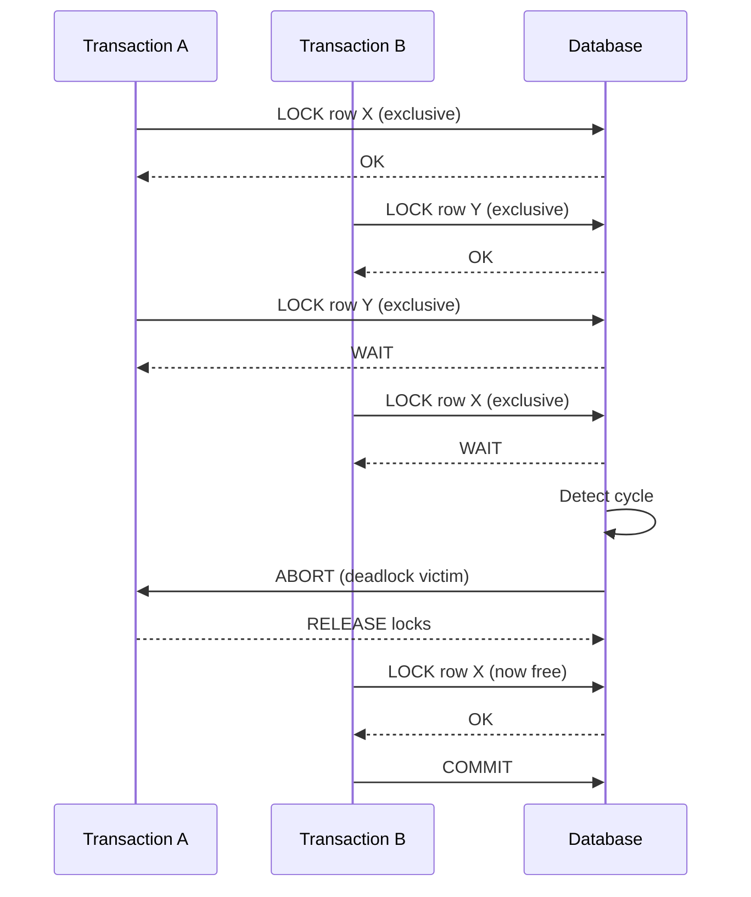

<!-- Generated by Groq via GitHub Actions -->
<!-- Topic ID: T029 -->
<!-- Category: Databases -->
<!-- Generated at UTC: 2026-09-29T07:06:42.727047+00:00 -->

# Deadlocks

## 1. What problem does this solve?

**Motivation**  
When multiple concurrent processes (transactions, threads, or services) try to modify the same data, they must coordinate to keep the database consistent. If they lock resources in conflicting orders, they can end up waiting forever for each other – a *deadlock*. Deadlocks break availability: the involved transactions never finish, and the system stalls until a timeout or manual intervention.

**What problem exists**  
- Two or more transactions hold locks that the others need.
- Each transaction waits for the other to release its lock.
- No transaction can proceed, leading to a stand‑still.

**Why the problem matters**  
- **Availability loss**: Users see timeouts or errors.
- **Throughput drop**: Resources are tied up unnecessarily.
- **Complex debugging**: Deadlocks can surface only under specific load patterns.

**What happens if this concept is not used**  
Without deadlock detection or resolution, a system can hang indefinitely. In a production environment, this could mean a critical service becomes unresponsive, potentially causing cascading failures.

**Where this concept appears in real backend systems**  
- Relational DBs (PostgreSQL, MySQL, Oracle) during concurrent updates.
- Distributed locks in Redis or ZooKeeper.
- Message brokers (Kafka) when consumers hold offsets and lock partitions.
- Microservice orchestration where services acquire locks on shared resources.

---

## 2. Mental model

### Simple analogy  
Imagine two chefs, Alice and Bob, each in a kitchen that has only one stove and one oven.  
- Alice wants to use the stove first, then the oven.  
- Bob wants to use the oven first, then the stove.  

If Alice grabs the stove and Bob grabs the oven, both wait forever for the other to release the resource they need next. That’s a deadlock.

### Precise engineering model  
In a database, *locks* are like the stove and oven.  
- **Shared (read) locks** let many readers coexist.  
- **Exclusive (write) locks** let only one writer at a time.  
When two transactions acquire locks in opposite orders, they form a cycle in the *wait‑for graph*—the formal structure that deadlock detection algorithms analyze.

---

## 3. Deep explanation

### Internals  
- **Lock modes**: `SELECT FOR UPDATE`, `UPDATE`, `DELETE`, etc.  
- **Wait‑for graph**: Nodes = transactions, edges = “T1 waits for T2”.  
- **Deadlock detection**: Periodic scan of the graph; if a cycle is found, the DB aborts one transaction (the *victim*).  
- **Deadlock resolution**: Abort, rollback, and return an error (e.g., `ERROR: deadlock detected` in PostgreSQL).

### Important terminology  
- **Lock granularity**: row‑level vs table‑level.  
- **Lock escalation**: upgrading many row locks to a table lock.  
- **Lock timeout**: configurable period after which a transaction aborts if it cannot acquire a lock.  
- **Deadlock victim**: the transaction chosen to roll back.  
- **Wait‑for graph**: directed graph used to detect cycles.

### Trade‑offs  
| Aspect | Row‑level locks | Table‑level locks |
|--------|-----------------|-------------------|
| Concurrency | High | Low |
| Overhead | Low per lock | High (acquiring a table lock) |
| Deadlock risk | Lower (fewer resources) | Higher (fewer resources, more contention) |

### Failure modes  
- **Unrecovered deadlock**: if detection fails, the system stalls.  
- **Repeated victim selection**: if the same transaction is always chosen, it never completes.  
- **Long rollback**: aborting a transaction that has made many changes can be expensive.

### Limitations  
- **Detection latency**: detection runs at intervals; a deadlock may persist briefly.  
- **No prevention**: DBs only detect and resolve; preventing requires careful design.  
- **Distributed systems**: deadlocks can span multiple services; DB deadlock detection doesn’t cover those.

### Where this concept fits in a backend architecture  
- **Transactional layer**: DB engines handle deadlocks.  
- **Service layer**: should catch deadlock errors and retry or fallback.  
- **Infrastructure**: monitoring (e.g., Prometheus alerts on deadlock logs).  
- **Data consistency**: deadlocks are a symptom of contention; design choices (optimistic concurrency, sharding) can reduce them.

### Interaction with related concepts  
- **Isolation levels**: higher isolation (e.g., `SERIALIZABLE`) increases lock usage, raising deadlock risk.  
- **Optimistic concurrency control**: avoids locks but may still need retries on conflicts.  
- **Distributed transactions (XA)**: can introduce cross‑service deadlocks.  
- **Connection pooling**: too many concurrent connections can amplify contention.

---

## 4. How it works

1. **Transaction A** starts and acquires a lock on `row X`.  
2. **Transaction B** starts and acquires a lock on `row Y`.  
3. **Transaction A** attempts to lock `row Y` → blocks, waiting for B.  
4. **Transaction B** attempts to lock `row X` → blocks, waiting for A.  
5. The DB’s deadlock detector scans the wait‑for graph, finds a cycle.  
6. It selects a victim (e.g., the transaction with the least work).  
7. Victim is rolled back; its locks are released.  
8. The other transaction proceeds, commits, and releases its locks.



---

## 5. Practical implementation

### Node.js example with `pg` (PostgreSQL)

```ts
// deadlock-demo.ts
import { Client } from 'pg';

const client = new Client({
  connectionString: process.env.DATABASE_URL,
});

async function runDeadlockDemo() {
  await client.connect();

  // Create a test table
  await client.query(`
    CREATE TABLE IF NOT EXISTS accounts (
      id SERIAL PRIMARY KEY,
      balance NUMERIC NOT NULL
    );
  `);

  // Seed data
  await client.query(`INSERT INTO accounts (balance) VALUES (100), (200) ON CONFLICT DO NOTHING`);

  // Two concurrent transactions that will deadlock
  const tx1 = async () => {
    const t = await client.query('BEGIN');
    try {
      await client.query('UPDATE accounts SET balance = balance - 10 WHERE id = 1 FOR UPDATE');
      // Simulate work
      await new Promise(r => setTimeout(r, 100));
      await client.query('UPDATE accounts SET balance = balance + 10 WHERE id = 2 FOR UPDATE');
      await client.query('COMMIT');
      console.log('Tx1 committed');
    } catch (e) {
      await client.query('ROLLBACK');
      console.error('Tx1 aborted:', e.message);
    }
  };

  const tx2 = async () => {
    const t = await client.query('BEGIN');
    try {
      await client.query('UPDATE accounts SET balance = balance - 20 WHERE id = 2 FOR UPDATE');
      await new Promise(r => setTimeout(r, 100));
      await client.query('UPDATE accounts SET balance = balance + 20 WHERE id = 1 FOR UPDATE');
      await client.query('COMMIT');
      console.log('Tx2 committed');
    } catch (e) {
      await client.query('ROLLBACK');
      console.error('Tx2 aborted:', e.message);
    }
  };

  // Run both concurrently
  await Promise.all([tx1(), tx2()]);

  await client.end();
}

runDeadlockDemo().catch(console.error);
```

**Key points**  
- `FOR UPDATE` acquires an exclusive row lock.  
- The two transactions lock rows in opposite order → deadlock.  
- PostgreSQL aborts one transaction and returns `ERROR: deadlock detected`.  
- The catch block rolls back and logs the error.

### Handling deadlocks with retry

```ts
async function runWithRetry(fn: () => Promise<void>, maxRetries = 3) {
  for (let attempt = 1; attempt <= maxRetries; attempt++) {
    try {
      await fn();
      return;
    } catch (e: any) {
      if (e.code === '40P01') { // PostgreSQL deadlock error code
        console.warn(`Deadlock detected, retrying (${attempt}/${maxRetries})`);
        await new Promise(r => setTimeout(r, 200 * attempt)); // exponential back‑off
      } else {
        throw e; // other errors propagate
      }
    }
  }
  throw new Error('Max deadlock retries exceeded');
}
```

Wrap each transaction in `runWithRetry` to automatically recover.

---

## 6. Production considerations

| Concern | Recommendation |
|---------|----------------|
| **Scalability** | Use fine‑grained row locks; avoid table locks. |
| **Reliability** | Catch deadlock errors (`40P01`) and retry with back‑off. |
| **Security** | Ensure only authorized services can issue transactions that lock critical rows. |
| **Observability** | Log deadlock events; expose metrics (e.g., `pg_deadlocks_total`). |
| **Performance** | Tune `lock_timeout` to fail fast; use `SELECT FOR UPDATE SKIP LOCKED` for high‑concurrency queues. |
| **Error handling** | Return a clear error to callers; avoid leaking internal transaction IDs. |
| **Resource usage** | Limit max concurrent connections; use connection pooling. |
| **Operational concerns** | Monitor lock wait times; adjust isolation levels if contention is high. |
| **Failure recovery** | Ensure idempotent operations so retries don’t corrupt data. |
| **Deployment** | Keep DB version and configuration (e.g., `deadlock_timeout`) consistent across environments. |

---

## 7. Common mistakes

| Mistake | Why it’s problematic |
|---------|----------------------|
| **Ignoring lock ordering** | Leads to cyclic waits; deadlocks become frequent. |
| **Using high isolation (`SERIALIZABLE`) without need** | Increases lock usage, raising deadlock risk. |
| **Not handling deadlock errors** | Application crashes or returns generic 500 errors. |
| **Retrying without back‑off** | Causes thundering herd; can worsen contention. |
| **Locking large tables** | Escalates to table locks, blocking many transactions. |
| **Assuming deadlocks are rare** | Under load they can surface unexpectedly; need monitoring. |
| **Using `SELECT FOR UPDATE` on read‑only queries** | Unnecessary lock acquisition, increasing contention. |
| **Not using `SKIP LOCKED` for queue workers** | Workers block each other, reducing throughput. |

---

## 8. Senior engineer perspective

### What changes at scale?

- **Architecture decisions**  
  - Prefer **optimistic concurrency** (e.g., version columns) over pessimistic locks when possible.  
  - Use **advisory locks** for cross‑service coordination instead of row locks.  
  - Partition data (sharding) to reduce contention on hot rows.

- **Trade‑offs**  
  - **Throughput vs consistency**: higher isolation → more locks → more deadlocks.  
  - **Complexity vs reliability**: adding retry logic and back‑off increases code complexity but improves resilience.

- **Bottlenecks**  
  - Hot rows (e.g., counters, inventory) become contention points.  
  - Long‑running transactions hold locks longer, increasing deadlock probability.

- **Failure scenarios**  
  - Cascading deadlocks across microservices when each holds a lock on a shared resource.  
  - Deadlock storms during traffic spikes.

- **Monitoring**  
  - Track `pg_stat_activity` for `waiting` state.  
  - Alert on `deadlock_detected` logs.  
  - Expose metrics: deadlock count, average lock wait time.

- **Cost/performance**  
  - Frequent retries increase CPU and I/O load.  
  - Using advisory locks can reduce DB load but requires coordination logic.

- **When NOT to use**  
  - If the workload is read‑heavy and contention is low, avoid explicit locks.  
  - For idempotent operations, rely on optimistic updates and retry on conflict instead of locking.

---

## 9. Interview questions

1. **Beginner** – *What is a deadlock in the context of databases?*  
   *Answer points:*  
   - A situation where two or more transactions wait indefinitely for each other’s locks.  
   - Causes a stand‑still; DB must abort one transaction.

2. **Beginner** – *How does PostgreSQL detect a deadlock?*  
   *Answer points:*  
   - Periodically scans the wait‑for graph.  
   - Detects cycles; aborts a victim transaction.

3. **Senior** – *Explain PostgreSQL’s deadlock detection algorithm and its time complexity.*  
   *Answer points:*  
   - Uses a depth‑first search on the wait‑for graph.  
   - Complexity is O(V+E) per scan; scans run every `deadlock_timeout` ms.

4. **Senior** – *What strategies would you employ to avoid deadlocks in a high‑concurrency microservice that updates inventory and orders?*  
   *Answer points:*  
   - Consistent lock ordering (e.g., always lock inventory before order).  
   - Use `SELECT FOR UPDATE SKIP LOCKED` for queue workers.  
   - Prefer optimistic concurrency with version columns.  
   - Use advisory locks or distributed lock services (Redis, ZooKeeper).  
   - Partition inventory to reduce hot spots.

5. **Scenario/Debugging** – *You see the following log: `ERROR: deadlock detected` in your application. What steps would you take to diagnose and fix the issue?*  
   *Answer points:*  
   - Enable `log_lock_waits` and `deadlock_timeout` to capture wait times.  
   - Inspect `pg_locks` and `pg_stat_activity` to see which rows/transactions are involved.  
   - Identify lock ordering patterns in the code.  
   - Add retry logic with back‑off.  
   - Consider refactoring to reduce lock contention (e.g., use advisory locks or sharding).  

---

## 10. Hands‑on task

**Goal**: Build a small Node.js service that simulates a deadlock and then implements a robust retry mechanism.

1. Create a PostgreSQL table `accounts(id, balance)`.  
2. Write two endpoints (`/transferA` and `/transferB`) that perform opposite transfers between two accounts using `FOR UPDATE`.  
3. Run both endpoints concurrently (e.g., via `curl` or a simple script) and observe the deadlock error.  
4. Refactor the transfer logic to use `runWithRetry` from section 5.  
5. Add logging of deadlock events and expose a `/metrics` endpoint that returns the number of deadlocks encountered.

**Deliverables**  
- `transfer.ts` with the two endpoints.  
- `deadlock-demo.ts` that triggers concurrent requests.  
- README explaining how to run and observe the deadlock and retry.

---

## 11. Quick revision

- Deadlock = cyclic wait for locks → system stalls.  
- DBs detect via wait‑for graph; abort victim.  
- PostgreSQL error code `40P01` signals deadlock.  
- Use fine‑grained row locks; avoid table locks.  
- Consistent lock ordering prevents cycles.  
- `SELECT FOR UPDATE SKIP LOCKED` helps queue workers.  
- Retry with exponential back‑off on deadlock errors.  
- Monitor `pg_stat_activity`, `pg_locks`, and deadlock logs.  
- Prefer optimistic concurrency when possible.  
- Advisory locks can replace row locks for cross‑service coordination.  
- Deadlocks are a symptom of contention; design to reduce hot spots.

---

## 12. References

- PostgreSQL Documentation – [Deadlock Detection](https://www.postgresql.org/docs/current/transaction-iso.html#XACT-LOCKS)  
- PostgreSQL Documentation – [Locking](https://www.postgresql.org/docs/current/explicit-locking.html)  
- Node.js `pg` Library – [Official Docs](https://node-postgres.com/)  
- PostgreSQL Error Codes – [Error Codes](https://www.postgresql.org/docs/current/errcodes-appendix.html)  
- PostgreSQL `SELECT FOR UPDATE` – [Manual](https://www.postgresql.org/docs/current/sql-select.html)  
- PostgreSQL `SKIP LOCKED` – [Manual](https://www.postgresql.org/docs/current/sql-select.html#SQL-SELECT-FOR-UPDATE)  
- PostgreSQL `deadlock_timeout` – [Configuration](https://www.postgresql.org/docs/current/runtime-config-connection.html)  

---
