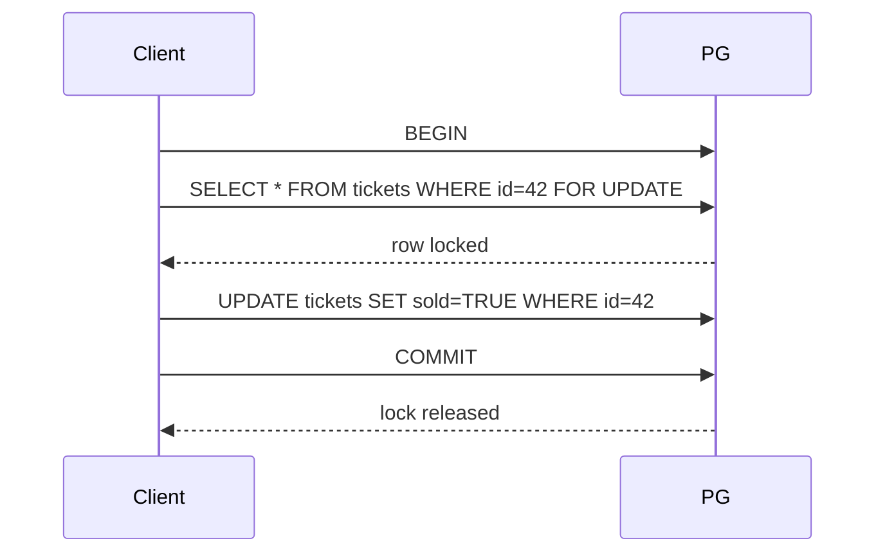

<!-- Generated by Groq via GitHub Actions -->
<!-- Topic ID: T030 -->
<!-- Category: Databases -->
<!-- Generated at UTC: 2026-09-29T07:06:42.727047+00:00 -->

# Locks

## 1. What problem does this solve?

### Motivation
When multiple processes or threads try to read or write the same data concurrently, they can interfere with each other. Imagine two people editing the same paragraph in a document at the same time; the final text could become corrupted or inconsistent.

### The problem
- **Race conditions**: Two or more operations interleave in a way that produces an incorrect result.
- **Lost updates**: One update overwrites another because they happened concurrently.
- **Inconsistent reads**: A transaction reads stale data while another transaction is modifying it.

### Why it matters
- **Data integrity**: A banking system must never double‑charge a customer.
- **Business rules**: Inventory counts must never go negative.
- **User experience**: A seat reservation system must not allow two users to book the same seat.

### Consequences of not using locks
- **Corrupted state**: Inconsistent data that breaks downstream services.
- **Security holes**: Race conditions can be exploited for privilege escalation.
- **Hard-to‑debug bugs**: Intermittent failures that appear only under load.

### Real‑world appearance
- **Relational DBs**: Row‑level locks (`SELECT … FOR UPDATE`) to serialize updates.
- **NoSQL**: MongoDB transactions use internal locks.
- **Distributed systems**: Redis or ZooKeeper locks to coordinate services.
- **Application code**: Mutexes in Node.js (`async-mutex`) to protect shared in‑memory state.

---

## 2. Mental model

### Simple analogy
Think of a library with a single copy of a book.  
- **Borrowing** = acquiring a lock.  
- **Reading** = performing the operation while holding the lock.  
- **Returning** = releasing the lock.  
If two people try to borrow the same copy simultaneously, the library gives it to one and the other must wait.

### Engineering model
- **Lock** = a token that grants exclusive or shared access to a resource.  
- **Lock acquisition** = a request to the lock manager.  
- **Lock release** = returning the token.  
- **Lock manager** = the component that enforces the rules (DB engine, Redis, etc.).  
- **Lock modes** = exclusive (write) vs shared (read).  
- **Lock granularity** = row, table, or database level.

---

## 3. Deep explanation

### Internals
| DB | Lock type | How it works | Typical use |
|----|-----------|--------------|-------------|
| PostgreSQL | Row‑level (`SELECT … FOR UPDATE`) | The planner marks the row as “locked” in the MVCC system; other transactions wait or abort. | Prevent double booking, serializable transactions. |
| MongoDB | Transaction locks | Uses a two‑phase commit; locks are held until commit/abort. | Multi‑document ACID operations. |
| Redis | Redlock | Multiple Redis nodes vote; a client obtains a lock if it gets majority. | Distributed critical sections. |
| ZooKeeper | Ephemeral nodes | Clients create a node; ZooKeeper guarantees uniqueness. | Service discovery, leader election. |

### Important terminology
- **Pessimistic locking**: Assume conflicts; lock before reading/writing.
- **Optimistic locking**: Assume no conflict; detect conflicts at commit (e.g., version columns).
- **Deadlock**: Two or more transactions wait on each other indefinitely.
- **Lock escalation**: Promoting many fine‑grained locks to a coarser lock to reduce overhead.
- **Lock timeout**: Maximum wait time before aborting.

### Trade‑offs
| Aspect | Pessimistic | Optimistic |
|--------|-------------|------------|
| **Consistency** | Strong, immediate | Eventual, may need retry |
| **Throughput** | Lower under contention | Higher when conflicts are rare |
| **Complexity** | Simple to reason about | Requires versioning or timestamps |
| **Latency** | Higher wait times | Potential retries add latency |

### Failure modes
- **Deadlocks** → transaction aborts or application must retry.
- **Starvation** → a transaction never gets the lock because others keep acquiring it.
- **Lock leaks** → locks not released (e.g., due to crashes) → system stalls.
- **Network partitions** → distributed locks may become inconsistent.

### Limitations
- Locks serialize access; they can become bottlenecks.
- They require careful handling of timeouts and retries.
- Distributed locks add network overhead and can fail if nodes are unreachable.

### Where it fits in architecture
- **Data layer**: DB engines enforce row/table locks.
- **Service layer**: Application code may use mutexes or distributed locks to coordinate microservices.
- **Infrastructure**: Service discovery, leader election, and configuration management often rely on locks.

### Interaction with related concepts
- **Transactions**: Locks are the backbone of ACID guarantees.
- **Concurrency control**: Optimistic vs pessimistic strategies.
- **Caching**: Cache invalidation often uses locks to avoid stale reads.
- **Event sourcing**: Locks may be used to serialize event application.

---

## 4. How it works

### PostgreSQL row‑level lock example



### Redis Redlock algorithm

```mermaid
sequenceDiagram
    participant Client
    participant R1
    participant R2
    participant R3
    participant R4
    participant R5
    Client->>R1: SET key value NX PX 30000
    Client->>R2: SET key value NX PX 30000
    Client->>R3: SET key value NX PX 30000
    Client->>R4: SET key value NX PX 30000
    Client->>R5: SET key value NX PX 30000
    alt majority acquired
        Client->>R1: OK
        Client->>R2: OK
        Client->>R3: OK
        Client->>R4: OK
        Client->>R5: OK
        Client: lock granted
    else
        Client: lock failed
    end
    Client->>R1: DEL key
    Client->>R2: DEL key
    Client->>R3: DEL key
    Client->>R4: DEL key
    Client->>R5: DEL key
```

---

## 5. Practical implementation

### 5.1 PostgreSQL row‑level lock in Node.js

```ts
// db.ts
import { Pool } from 'pg';
export const pool = new Pool({
  connectionString: process.env.DATABASE_URL,
});
```

```ts
// ticketService.ts
import { pool } from './db';

export async function bookTicket(ticketId: number): Promise<void> {
  const client = await pool.connect();
  try {
    await client.query('BEGIN');

    // Acquire exclusive lock on the row
    const res = await client.query(
      'SELECT sold FROM tickets WHERE id = $1 FOR UPDATE',
      [ticketId]
    );

    if (res.rows[0].sold) {
      throw new Error('Ticket already sold');
    }

    // Mark as sold
    await client.query(
      'UPDATE tickets SET sold = TRUE WHERE id = $1',
      [ticketId]
    );

    await client.query('COMMIT');
  } catch (err) {
    await client.query('ROLLBACK');
    throw err;
  } finally {
    client.release();
  }
}
```

**Key lines**

- `BEGIN` starts a transaction.
- `FOR UPDATE` locks the selected row until `COMMIT`/`ROLLBACK`.
- `ROLLBACK` on error guarantees the lock is released.

### 5.2 Distributed lock with Redis (Redlock)

```ts
// redisLock.ts
import Redis from 'ioredis';
import { v4 as uuidv4 } from 'uuid';

const redisNodes = [
  new Redis({ host: 'redis-1' }),
  new Redis({ host: 'redis-2' }),
  new Redis({ host: 'redis-3' }),
  new Redis({ host: 'redis-4' }),
  new Redis({ host: 'redis-5' }),
];

export async function acquireLock(
  key: string,
  ttl = 30000
): Promise<string | null> {
  const lockId = uuidv4();
  const results = await Promise.all(
    redisNodes.map((node) =>
      node.set(key, lockId, 'NX', 'PX', ttl).then((ok) => ok === 'OK')
    )
  );

  const acquired = results.filter(Boolean).length >= Math.floor(redisNodes.length / 2) + 1;
  if (!acquired) {
    // Release any partial locks
    await Promise.all(
      redisNodes.map((node) => node.del(key))
    );
    return null;
  }
  return lockId;
}

export async function releaseLock(key: string, lockId: string): Promise<void> {
  const script = `
    if redis.call("get", KEYS[1]) == ARGV[1] then
      return redis.call("del", KEYS[1])
    else
      return 0
    end
  `;
  await Promise.all(
    redisNodes.map((node) => node.eval(script, 1, key, lockId))
  );
}
```

**Usage**

```ts
async function criticalSection() {
  const lockId = await acquireLock('my-critical-key');
  if (!lockId) throw new Error('Could not acquire lock');

  try {
    // perform critical work
  } finally {
    await releaseLock('my-critical-key', lockId);
  }
}
```

---

## 6. Production considerations

| Concern | Tips |
|---------|------|
| **Scalability** | Use fine‑grained locks (row, key) instead of table‑level. |
| **Reliability** | Set lock timeouts; avoid long‑running transactions. |
| **Security** | Ensure lock keys are not guessable; use secrets for distributed locks. |
| **Observability** | Instrument lock acquisition latency, wait counts, and deadlock incidents. |
| **Performance** | Batch lock acquisitions when possible; avoid unnecessary locks. |
| **Error handling** | Retry with exponential backoff; detect deadlocks and abort. |
| **Resource usage** | Monitor connection pool size; lock contention can exhaust connections. |
| **Operational concerns** | Keep DB and Redis replicas healthy; monitor replication lag. |
| **Failure recovery** | Use transaction logs; implement idempotent operations. |
| **Deployment** | Ensure all nodes use the same lock implementation; version‑compatibility. |

---

## 7. Common mistakes

| Mistake | Why it hurts |
|---------|--------------|
| **Not releasing locks** | Causes deadlocks or lock starvation. |
| **Locking too early** | Locks rows before checking conditions → wasted contention. |
| **Using table locks in high‑traffic services** | Serializes all writes, killing throughput. |
| **Ignoring lock timeouts** | Transactions hang forever, exhausting resources. |
| **Using locks in async callbacks without proper `await`** | Locks may be released too early or never. |
| **Assuming Redis locks are atomic across nodes** | Without Redlock, a single node can grant the lock twice. |
| **Mixing optimistic and pessimistic locks without clear policy** | Leads to confusing retry logic. |
| **Hard‑coding lock keys** | Key collisions can corrupt unrelated data. |

---

## 8. Senior engineer perspective

### What changes at scale?
- **Lock contention becomes a bottleneck**: Need to profile lock wait times and refactor to reduce contention.
- **Distributed locks must be fault‑tolerant**: Use consensus protocols (ZooKeeper, etcd) or Redlock with majority voting.
- **Observability is critical**: Dashboards for lock wait times, deadlock counts, and lock acquisition rates.
- **Cost vs performance**: Heavy locking can increase DB load; consider sharding or partitioning to reduce contention.

### Design decisions
- **Granularity**: Prefer row‑level or key‑based locks; avoid table‑level unless necessary.
- **Lock strategy**: Use optimistic concurrency control for low‑conflict workloads; fall back to pessimistic locks for critical sections.
- **Timeouts**: Set realistic TTLs; avoid “sticky” locks that never expire.
- **Retry logic**: Exponential backoff with jitter to avoid thundering herd.
- **Monitoring**: Track lock wait times, deadlock incidents, and lock acquisition success rates.
- **Cost**: Distributed lock services add network overhead; weigh against the cost of lost consistency.

### When NOT to use locks
- **Event‑driven architectures**: Prefer eventual consistency and idempotent handlers.
- **Stateless services**: Use token‑based concurrency control (e.g., CAS operations) instead of locks.
- **High‑throughput read‑heavy workloads**: Use read replicas and avoid locks on reads.

---

## 9. Interview questions

1. **Beginner**: *What is the difference between a shared lock and an exclusive lock?*  
   *Answer:* Shared locks allow multiple readers but no writers; exclusive locks allow only one writer and block all readers.

2. **Intermediate**: *Explain how PostgreSQL’s `SELECT … FOR UPDATE` works and why it is useful.*  
   *Answer:* It acquires an exclusive row lock within a transaction, preventing other transactions from modifying the row until commit/rollback. Useful for preventing race conditions on updates.

3. **Senior**: *Describe a scenario where a distributed lock could lead to a split‑brain situation and how you would mitigate it.*  
   *Answer:* If a majority of nodes fail, the remaining nodes may still grant locks, leading to inconsistent state. Mitigation: use a consensus protocol (ZooKeeper, etcd) or require a quorum of nodes to grant the lock.

4. **Senior**: *How would you monitor and tune lock contention in a microservice that uses PostgreSQL?*  
   *Answer:* Enable `pg_stat_activity` and `pg_locks` views, set alerts on high wait times, analyze query plans, reduce lock scope, add indexes, or switch to optimistic locking.

5. **Scenario/Debugging**: *Your application occasionally throws “deadlock detected” errors during high traffic. What steps would you take to diagnose and fix the issue?*  
   *Answer:*  
   - Capture deadlock traces from the DB (`SHOW ENGINE INNODB STATUS` or `pg_locks`).  
   - Identify the conflicting queries and their lock order.  
   - Refactor to acquire locks in a consistent order or reduce lock scope.  
   - Add retry logic with backoff.  
   - Consider using optimistic locking for low‑conflict operations.

---

## 10. Hands‑on task

**Build a simple ticket booking API** that uses PostgreSQL row‑level locks to prevent double booking.

1. Create a `tickets` table with columns `id`, `event_id`, `sold` (boolean).
2. Implement an endpoint `/book/:ticketId` that:
   - Starts a transaction.
   - Locks the row with `FOR UPDATE`.
   - Checks `sold`; if `false`, sets it to `true`.
   - Commits or rolls back on error.
3. Write a test that spawns 10 concurrent requests to book the same ticket and assert that only one succeeds.

*Deliverables:*  
- `db.ts` with connection pool.  
- `ticketService.ts` with `bookTicket`.  
- `server.ts` exposing the endpoint.  
- `test.ts` using `Promise.all` to simulate concurrency.

---

## 11. Quick revision

- Locks serialize access to shared resources to avoid race conditions.
- **Pessimistic locking**: lock before reading/writing (e.g., `SELECT … FOR UPDATE`).
- **Optimistic locking**: detect conflicts at commit (e.g., version columns).
- **Deadlock**: cyclic wait; DB aborts one transaction.
- **Lock granularity**: row → table → database; finer granularity reduces contention.
- **Distributed locks**: Redlock, ZooKeeper, etcd; require majority consensus.
- **Timeouts**: always set TTLs or lock wait limits.
- **Observability**: monitor lock wait times, deadlock counts, and lock acquisition success.
- **Best practice**: keep critical sections short, use fine‑grained locks, and retry with backoff.

---

## 12. References

- PostgreSQL documentation – [Locking](https://www.postgresql.org/docs/current/transaction-iso.html#XACT-LOCKS)
- Redis documentation – [Redlock](https://redis.io/docs/manual/persistence/replication/replica/)
- ZooKeeper documentation – [Distributed Locks](https://zookeeper.apache.org/doc/r3.7.0/recipes.html#sc_lock)
- Node.js `pg` library – [Client](https://node-postgres.com/features/transactions)
- ioredis – [Redlock implementation](https://github.com/luin/ioredis/blob/master/docs/api.md#redlock)
- MongoDB documentation – [Transactions](https://www.mongodb.com/docs/manual/core/transactions/)
- AWS DynamoDB – [Optimistic Locking](https://docs.aws.amazon.com/amazondynamodb/latest/developerguide/OptimisticLocking.html)
