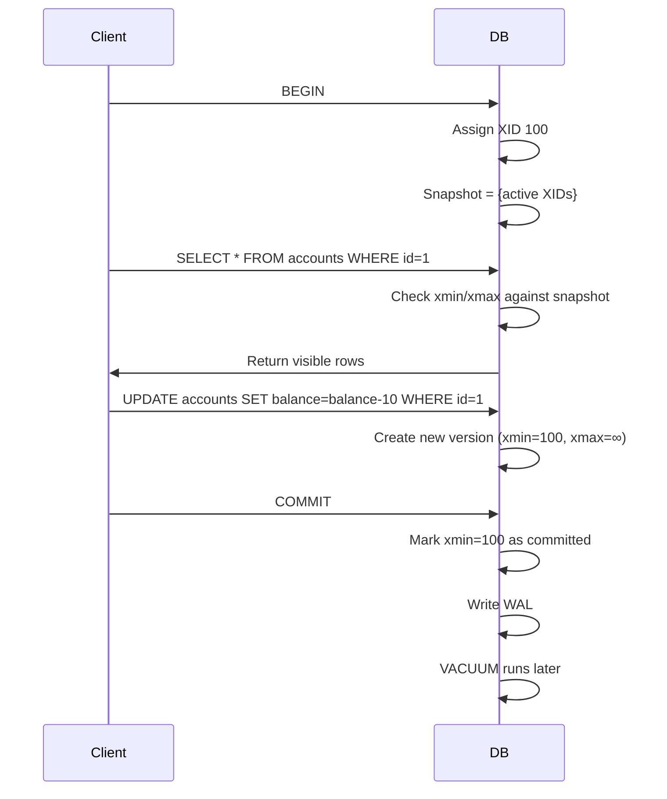

<!-- Generated by Groq via GitHub Actions -->
<!-- Topic ID: T031 -->
<!-- Category: Databases -->
<!-- Generated at UTC: 2026-09-29T18:47:57.853189+00:00 -->

# MVCC

## 1. What problem does this solve?

**Motivation**  
In a multi‑user database, concurrent reads and writes can interfere with each other. If a transaction updates a row while another transaction is reading it, the reader might see a partially‑written state or be blocked until the writer finishes. This leads to:

- **Blocking**: Readers wait for writers, hurting throughput.
- **Inconsistent reads**: Readers may see a mix of old and new data.
- **Write‑skew anomalies**: Two concurrent updates may overwrite each other.

**Why it matters**  
Backend services (e.g., e‑commerce order placement, banking transfers, real‑time analytics) often need:

- **High concurrency**: Thousands of requests per second.
- **Low latency**: Users expect instant responses.
- **Strong consistency**: Business rules must not be violated.

Without a mechanism to isolate concurrent operations, you either sacrifice performance (by serializing all access) or risk data corruption.

**What happens if MVCC is not used**  
- **Pessimistic locking**: Every write locks the row, causing readers to wait → throughput drops.
- **Lost updates**: Two transactions read the same value, both write back, one overwrite the other → business logic breaks.
- **Dirty reads**: A transaction reads uncommitted data → inconsistent state.

**Real‑world appearance**  
- PostgreSQL, Oracle, MySQL (InnoDB), SQL Server, and many NoSQL stores (e.g., DynamoDB) implement MVCC.
- In a microservice architecture, a service that writes to a PostgreSQL database uses MVCC to allow other services to read the same data concurrently without blocking.

---

## 2. Mental model

### Analogy: Library with time‑travel copies  
Imagine a library where every book has an infinite shelf of copies, each stamped with the time it was made. When you want to read a book, you pick the copy that was created at the moment you started reading. If someone else updates the book (adds a new chapter), they create a new copy stamped with a later time. Your reading copy never changes, so you’re never blocked by the author’s edits.

### Engineering model  
- **Snapshot isolation**: Each transaction sees a *snapshot* of the database as of the time it started.
- **Version chain**: Every row has multiple versions (committed snapshots). A transaction reads the latest version that is visible to it.
- **Write‑ahead**: When a transaction writes, it creates a new version that becomes visible only after commit.

---

## 3. Deep explanation

### Internals
- **Tuple visibility**: Each row stores a *xmin* (transaction ID that created it) and *xmax* (transaction ID that deleted it). A transaction can read a row if `xmin <= current_txn_id < xmax`.
- **WAL (Write‑Ahead Log)**: In PostgreSQL, changes are logged before being applied, enabling crash recovery and replication.
- **Multiversion storage**: Physical storage keeps all visible versions; old ones are eventually cleaned by VACUUM.

### Important terminology
- **Transaction ID (XID)**: Monotonically increasing identifier for each transaction.
- **Snapshot**: Set of XIDs that were active when a transaction began.
- **Serializable isolation**: Highest level; uses MVCC plus conflict detection.
- **Read‑committed**: Reads only committed rows at the time of each statement.
- **Repeatable read**: Reads the same snapshot for the entire transaction.

### Trade‑offs
| Benefit | Cost |
|---------|------|
| **Non‑blocking reads** | Extra storage for old versions |
| **High concurrency** | More complex write path (version creation) |
| **Snapshot isolation** | Potential write‑skew anomalies |
| **Crash recovery** | Requires WAL and periodic VACUUM |

### Failure modes
- **Write‑skew**: Two concurrent transactions read the same data, both decide to write based on that data, and the final state violates invariants.
- **Long‑running transactions**: Keep old versions alive, increasing storage and slowing VACUUM.
- **Deadlocks**: Still possible when transactions acquire locks on the same set of rows in different orders.

### Limitations
- MVCC does **not** guarantee *serializability* unless the database enforces it (e.g., PostgreSQL’s `SERIALIZABLE` mode).
- Requires careful transaction management; blind updates can lead to lost updates if not checked.

### Where it fits in backend architecture
- **Database layer**: Core feature of relational engines.
- **ORMs**: Often expose isolation levels; e.g., Prisma, TypeORM.
- **Microservices**: Each service may use MVCC‑enabled DB to allow concurrent reads while performing writes.

### Interaction with related concepts
- **Locking**: MVCC reduces the need for shared locks but still uses exclusive locks for schema changes.
- **Replication**: WAL streams are used for logical replication; MVCC ensures replicas see consistent snapshots.
- **Caching**: Cache layers (Redis) can store snapshot data; invalidation must respect MVCC semantics.

---

## 4. How it works

1. **Transaction starts** → DB assigns a new XID and captures a snapshot of active XIDs.
2. **Read** → For each row, DB checks `xmin` and `xmax` against the snapshot to decide visibility.
3. **Write** → DB creates a new row version with `xmin = current XID`, `xmax = ∞`. The old version remains until the transaction commits.
4. **Commit** → DB marks the new version’s `xmin` as committed, updates any indexes, and writes WAL entries.
5. **Cleanup** → VACUUM removes rows whose `xmax` is committed and no longer visible to any snapshot.



---

## 5. Practical implementation

### TypeScript/Node.js example with `pg` (PostgreSQL)

```ts
import { Client } from 'pg';

const client = new Client({
  connectionString: process.env.DATABASE_URL,
});
await client.connect();

async function transfer(from: number, to: number, amount: number) {
  // Start a transaction with READ COMMITTED (default)
  await client.query('BEGIN');

  try {
    // 1️⃣ Read balances
    const fromRes = await client.query(
      'SELECT balance FROM accounts WHERE id = $1 FOR UPDATE',
      [from]
    );
    const toRes = await client.query(
      'SELECT balance FROM accounts WHERE id = $1 FOR UPDATE',
      [to]
    );

    const fromBal = fromRes.rows[0].balance;
    const toBal = toRes.rows[0].balance;

    if (fromBal < amount) throw new Error('Insufficient funds');

    // 2️⃣ Write new balances
    await client.query(
      'UPDATE accounts SET balance = $1 WHERE id = $2',
      [fromBal - amount, from]
    );
    await client.query(
      'UPDATE accounts SET balance = $1 WHERE id = $2',
      [toBal + amount, to]
    );

    // 3️⃣ Commit
    await client.query('COMMIT');
  } catch (err) {
    await client.query('ROLLBACK');
    throw err;
  }
}
```

**Key points**

- `FOR UPDATE` acquires an exclusive lock on the selected rows, preventing other transactions from writing until commit. This is optional if you rely solely on MVCC, but helps avoid lost updates.
- The transaction sees a consistent snapshot of the database at the start of `BEGIN`.
- If two concurrent `transfer` calls try to modify the same account, the second will wait for the lock, ensuring serializability.

### Using `typeorm` with isolation level

```ts
import { getConnection } from 'typeorm';

async function safeTransfer() {
  await getConnection().transaction(
    async (manager) => {
      // Default isolation is READ COMMITTED
      // You can set SERIALIZABLE if needed
      const from = await manager.findOne(Account, { id: 1 });
      const to = await manager.findOne(Account, { id: 2 });

      if (!from || !to) throw new Error('Account missing');

      if (from.balance < 100) throw new Error('Insufficient funds');

      from.balance -= 100;
      to.balance += 100;

      await manager.save([from, to]); // writes new versions
    },
    { isolation: 'SERIALIZABLE' } // optional
  );
}
```

---

## 6. Production considerations

| Concern | How MVCC helps / what to watch |
|---------|--------------------------------|
| **Scalability** | Non‑blocking reads allow many concurrent reads. However, write throughput can be limited by the need to create new versions and by the cost of VACUUM. |
| **Reliability** | WAL guarantees durability; MVCC ensures that a crash leaves the database in a consistent state. |
| **Security** | Isolation levels can be tuned per user role; e.g., read‑only users use `READ COMMITTED`. |
| **Observability** | Monitor `pg_stat_activity` for long‑running transactions; track `pg_locks` to detect contention. |
| **Performance** | Use `VACUUM` and `ANALYZE` regularly to reclaim space and keep query plans optimal. |
| **Error handling** | Catch `serialization_failure` errors when using `SERIALIZABLE` and retry. |
| **Resource usage** | Old row versions consume disk; tune `autovacuum` thresholds. |
| **Operational concerns** | Plan for `pg_repack` or `pg_dump/restore` to reduce bloat. |
| **Failure recovery** | WAL replay restores MVCC state; ensure WAL retention policies. |
| **Deployment** | Use rolling updates; avoid schema changes that require exclusive locks on large tables. |

---

## 7. Common mistakes

| Mistake | Why it’s problematic |
|---------|----------------------|
| **Assuming MVCC = serializable** | MVCC only guarantees snapshot isolation; write‑skew can still occur. |
| **Ignoring `FOR UPDATE` when needed** | Without locks, concurrent updates can overwrite each other, leading to lost updates. |
| **Leaving long‑running transactions open** | Keeps old versions alive, causing bloat and slowing VACUUM. |
| **Disabling autovacuum** | Old versions accumulate, leading to disk exhaustion and degraded query performance. |
| **Using `READ UNCOMMITTED`** | PostgreSQL ignores it; but in other DBs it can lead to dirty reads. |
| **Not handling `serialization_failure`** | In `SERIALIZABLE` mode, you must retry transactions; otherwise, you’ll get errors. |

---

## 8. Senior engineer perspective

### What changes at scale?

- **Architecture decisions**: Choose a database that supports MVCC (PostgreSQL, MySQL InnoDB) vs. a NoSQL store that uses optimistic concurrency control.
- **Trade‑offs**: Decide between `READ COMMITTED` (higher throughput) vs. `SERIALIZABLE` (stronger guarantees) based on business rules.
- **Bottlenecks**: Write amplification due to versioning; VACUUM overhead; lock contention on hot rows.
- **Failure scenarios**: Long‑running transactions causing “write skew” bugs; WAL disk full leading to crash.
- **Monitoring**: Track `pg_stat_activity`, `pg_locks`, `pg_stat_user_tables` for bloat, and `pg_stat_replication` for replication lag.
- **Cost/performance**: More storage for old versions; higher CPU for conflict detection in `SERIALIZABLE`.
- **When NOT to use**: If the workload is read‑heavy with minimal writes, a simpler lock‑based approach may suffice; if you need horizontal scaling without a single DB, consider a distributed NoSQL with eventual consistency.

---

## 9. Interview questions

1. **Beginner**: *What is MVCC and why is it useful in a database?*  
   *Answer*: MVCC stands for Multi‑Version Concurrency Control. It allows readers to see a consistent snapshot of the data without blocking writers, improving concurrency and performance.

2. **Beginner**: *How does PostgreSQL determine if a row is visible to a transaction?*  
   *Answer*: By checking the row’s `xmin` (creator XID) and `xmax` (deleter XID) against the transaction’s snapshot of active XIDs.

3. **Senior**: *Explain the difference between `READ COMMITTED` and `REPEATABLE READ` isolation levels in the context of MVCC.*  
   *Answer*: `READ COMMITTED` sees only committed rows at the time of each statement; `REPEATABLE READ` sees the same snapshot for the entire transaction, preventing non‑repeatable reads but still allowing write skew.

4. **Senior**: *What are the main performance implications of using `SERIALIZABLE` isolation level in a high‑write workload?*  
   *Answer*: It requires conflict detection and may abort transactions, leading to retries. It also increases lock contention and can reduce throughput.

5. **Scenario/Debugging**: *You notice that a batch job that updates millions of rows is taking an hour and the database shows a lot of deadlocks. What could be causing this, and how would you investigate and fix it?*  
   *Answer*: Likely due to long transactions holding locks on many rows, causing contention. Investigate with `pg_locks` and `pg_stat_activity`. Fix by batching updates into smaller transactions, using `FOR UPDATE SKIP LOCKED`, or increasing `max_locks_per_transaction`. Also ensure `autovacuum` is running to clean up dead tuples.

---

## 10. Hands‑on task

**Task**: Implement a *concurrent counter* service in Node.js that safely increments a counter stored in PostgreSQL using MVCC.

1. Create a table `counters(id serial primary key, value bigint)`.
2. Seed it with one row (`id=1, value=0`).
3. Write an API endpoint `/increment` that:
   - Starts a transaction.
   - Reads the current value.
   - Increments it by 1.
   - Writes back the new value.
   - Commits.
4. Run 100 concurrent requests to `/increment` and verify that the final value is 100.
5. Experiment with `READ COMMITTED` vs. `SERIALIZABLE` and observe any differences.

**Goal**: Observe how MVCC allows concurrent increments without blocking, and how isolation levels affect correctness.

---

## 11. Quick revision

- MVCC = Multi‑Version Concurrency Control: non‑blocking reads via snapshots.
- Each row stores `xmin` and `xmax` to track visibility.
- Snapshot isolation: reads see a consistent view; writes create new versions.
- PostgreSQL uses WAL + VACUUM for durability and cleanup.
- Isolation levels: `READ COMMITTED`, `REPEATABLE READ`, `SERIALIZABLE`.
- Write‑skew is a known anomaly under snapshot isolation.
- Long transactions keep old tuples alive → bloat.
- Use `FOR UPDATE` to lock rows when needed.
- Monitor `pg_stat_activity`, `pg_locks`, and `pg_stat_user_tables`.
- `SERIALIZABLE` requires retry logic on `serialization_failure`.
- MVCC is essential for high‑concurrency, low‑latency systems.

---

## 12. References

- PostgreSQL Documentation – MVCC: https://www.postgresql.org/docs/current/mvcc.html  
- PostgreSQL Documentation – Transaction Isolation Levels: https://www.postgresql.org/docs/current/transaction-iso.html  
- PostgreSQL Documentation – VACUUM: https://www.postgresql.org/docs/current/sql-vacuum.html  
- PostgreSQL Documentation – WAL: https://www.postgresql.org/docs/current/wal-intro.html  
- TypeORM Docs – Transactions: https://typeorm.io/#/transactions  
- Prisma Docs – Isolation Levels: https://www.prisma.io/docs/concepts/components/prisma-client/transaction#transaction-isolation-levels  

---
