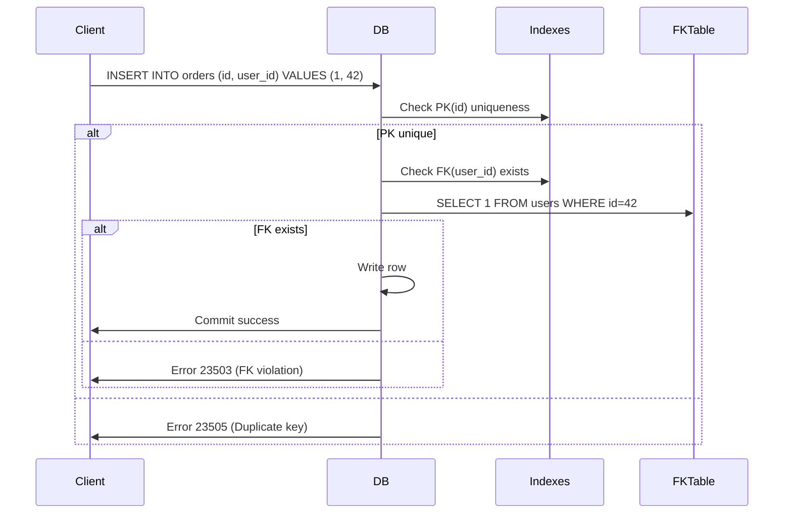

<!-- Generated by Groq via GitHub Actions -->
<!-- Topic ID: T032 -->
<!-- Category: Databases -->
<!-- Generated at UTC: 2026-09-29T18:47:57.853189+00:00 -->

# Constraints

## 1. What problem does this solve?

- **Data integrity** – Guarantees that the data stored in the database is valid, consistent, and meaningful.  
- **Prevent orphaned rows** – Ensures that foreign‑key references always point to existing records.  
- **Avoid duplicates** – Enforces uniqueness where required (e.g., email addresses).  
- **Business rules enforcement** – Encodes simple rules (e.g., `age >= 18`) directly in the schema.  

**Why it matters**  
Without constraints, a backend could store contradictory data: two users with the same email, an order referencing a non‑existent user, or a product with a negative price. These inconsistencies can cascade into application bugs, security holes, and data corruption that are hard to trace.

**What happens if constraints are not used**  
- Application logic must manually validate every write, increasing code complexity and the chance of bugs.  
- Data anomalies become common, making analytics unreliable.  
- Auditing and compliance become difficult because the database cannot guarantee correctness.

**Real‑world appearance**  
- E‑commerce sites use foreign‑key constraints to link orders to customers.  
- Banking systems enforce unique account numbers and check constraints on balances.  
- Social networks use unique constraints on usernames and not‑null constraints on required fields.

---

## 2. Mental model

**Analogy**  
Think of a library catalog.  
- **Primary key** = the unique ISBN that identifies a book.  
- **Foreign key** = a reference from a loan record to the book’s ISBN.  
- **Unique constraint** = ensures no two books share the same ISBN.  
- **Check constraint** = guarantees that the number of copies is non‑negative.  
If the catalog allows duplicate ISBNs or a loan that points to a non‑existent book, the library’s inventory becomes unreliable.

**Engineering model**  
A constraint is a rule stored in the database schema that the DBMS enforces automatically whenever data is inserted, updated, or deleted. The rule is evaluated *inside* the transaction, so the database guarantees that the rule holds after the transaction commits.

---

## 3. Deep explanation

| Term | What it is | How it works |
|------|------------|--------------|
| **Primary Key (PK)** | Uniquely identifies a row. | Usually backed by a unique index; automatically not null. |
| **Foreign Key (FK)** | Reference to a PK in another table. | On insert/update, DB checks that the referenced row exists; on delete, can cascade or restrict. |
| **Unique** | Ensures all values in a column (or set) are distinct. | Implemented via a unique index. |
| **Not Null** | Disallows `NULL` values. | Simple check during write. |
| **Check** | Custom boolean expression. | Evaluated per row; can reference other columns in the same row. |
| **Deferrable** | Constraint can be postponed until transaction commit. | Useful for circular FK references. |

### Internals
- Constraints are stored in the system catalog.  
- Most DBMSs use indexes to enforce uniqueness and FK lookups.  
- Constraint checks run *before* the row is written to disk.  
- In PostgreSQL, a `CHECK` constraint is compiled into a *constraint trigger* that fires on `INSERT`/`UPDATE`.

### Trade‑offs
- **Performance**: Indexes speed lookups but add write overhead.  
- **Complexity**: Over‑constraint can make migrations hard.  
- **Flexibility**: Some business rules are easier in application code (e.g., cross‑table logic).  

### Failure modes
- **Violation errors**: DB throws an error (e.g., `23505` duplicate key).  
- **Deadlocks**: Heavy FK checks under high concurrency can lock rows.  
- **Cascade deletes**: Unintended data loss if `ON DELETE CASCADE` is misused.

### Limitations
- Cannot express *temporal* constraints (e.g., “no overlapping bookings”) without triggers or application logic.  
- Cross‑database constraints are impossible; you need application coordination.  
- Some DBs (e.g., MongoDB) lack built‑in constraints; you must enforce them in code.

### Where it fits
- **Schema design**: Constraints are part of the data model.  
- **ORMs**: Many ORMs map constraints to annotations (`@PrimaryKey`, `@ForeignKey`).  
- **Migrations**: Adding/removing constraints is a migration step.  
- **Transactions**: Constraints are evaluated inside the transaction boundary.

### Interaction with related concepts
- **Transactions**: Constraints are atomic with the transaction.  
- **Indexes**: Required for PK, FK, Unique, and some Check constraints.  
- **Replication**: Constraints must be replicated to all nodes.  
- **Sharding**: FK constraints across shards are not enforceable; you need application logic or a distributed transaction protocol.

---

## 4. How it works

1. **Client sends `INSERT`/`UPDATE`/`DELETE`.**  
2. **DB parses the statement and starts a transaction.**  
3. **For each affected row:**
   - Check `NOT NULL` constraints.  
   - Check `UNIQUE`/`PK` indexes for duplicates.  
   - Check `CHECK` expressions.  
   - For `FK`, look up referenced row (or queue a deferred check).  
4. **If any check fails, abort the transaction and return an error.**  
5. **If all checks pass, write the row and commit.**  



---

## 5. Practical implementation

### PostgreSQL + TypeScript (node‑pg)

```ts
// db.ts
import { Pool } from 'pg';

export const pool = new Pool({
  connectionString: process.env.DATABASE_URL,
});
```

```ts
// schema.sql
CREATE TABLE users (
  id SERIAL PRIMARY KEY,
  email TEXT NOT NULL UNIQUE,
  age INT NOT NULL CHECK (age >= 18)
);

CREATE TABLE orders (
  id SERIAL PRIMARY KEY,
  user_id INT NOT NULL REFERENCES users(id) ON DELETE CASCADE,
  total NUMERIC NOT NULL CHECK (total >= 0)
);
```

```ts
// createOrder.ts
import { pool } from './db';

export async function createOrder(userId: number, total: number) {
  const client = await pool.connect();
  try {
    await client.query('BEGIN');
    const res = await client.query(
      'INSERT INTO orders (user_id, total) VALUES ($1, $2) RETURNING id',
      [userId, total]
    );
    await client.query('COMMIT');
    return res.rows[0].id;
  } catch (err: any) {
    await client.query('ROLLBACK');
    // Handle constraint errors
    if (err.code === '23503') { // foreign key violation
      throw new Error('User does not exist');
    }
    if (err.code === '23505') { // unique violation
      throw new Error('Duplicate entry');
    }
    throw err;
  } finally {
    client.release();
  }
}
```

**Key lines explained**

- `REFERENCES users(id) ON DELETE CASCADE` – FK that automatically removes orders when a user is deleted.  
- `CHECK (total >= 0)` – ensures no negative order totals.  
- Error codes (`23503`, `23505`) are PostgreSQL’s SQLSTATE codes for FK and unique violations.

---

## 6. Production considerations

| Concern | How constraints affect it | Mitigation |
|---------|---------------------------|------------|
| **Scalability** | Indexes on PK/FK/Unique can become large; sharding may break FK enforcement. | Use partitioned tables, index only necessary columns, consider application‑level FK for cross‑shard data. |
| **Reliability** | Constraints guarantee consistency even under crashes. | Ensure transactions are used; enable WAL/replication. |
| **Security** | Prevents injection of invalid data. | Use parameterized queries; validate inputs. |
| **Observability** | Constraint violations surface as database errors. | Log error codes; expose metrics on violation counts. |
| **Performance** | Write latency increases with more constraints. | Batch writes, use `ON CONFLICT DO NOTHING` for idempotent inserts, tune index fill factor. |
| **Error handling** | Application must interpret SQLSTATE codes. | Centralized error mapper. |
| **Resource usage** | Indexes consume disk and memory. | Monitor index bloat; run `VACUUM`. |
| **Operational** | Schema migrations must add/remove constraints safely. | Use migration tools (Flyway, Prisma Migrate) with offline testing. |
| **Failure recovery** | Constraint errors abort transactions; no partial writes. | Use retry logic for transient errors. |
| **Deployment** | Schema changes require coordinated rollout. | Zero‑downtime migrations: add constraint in `DEFERRABLE INITIALLY DEFERRED` mode, then enable. |

---

## 7. Common mistakes

| Mistake | Why it’s problematic |
|---------|----------------------|
| Forgetting `NOT NULL` on required columns | Allows `NULL` values that break application logic. |
| Using `UNIQUE` on a column that needs duplicates | Prevents legitimate data (e.g., multiple orders per user). |
| Not indexing foreign keys | Slows FK lookups and can cause table scans. |
| Relying on triggers instead of constraints | Triggers are harder to maintain and can be bypassed. |
| Ignoring `DEFERRABLE` constraints for circular references | Causes deadlocks or manual workarounds. |
| Adding constraints without testing migrations | Can lock tables or cause long downtime. |
| Using `ON DELETE CASCADE` indiscriminately | Unintended data loss if a parent row is mistakenly deleted. |

---

## 8. Senior engineer perspective

### At scale

- **Sharding**: FK constraints across shards are impossible; you must enforce them in application code or use a distributed transaction layer (e.g., two‑phase commit).  
- **Partial indexes**: Only index rows that matter (e.g., active users) to reduce write overhead.  
- **Constraint exclusion**: PostgreSQL’s ability to skip index scans when a `CHECK` constraint guarantees no match.  
- **Monitoring**: Track constraint violation rates; high rates may indicate a bug in upstream services.  
- **Cost**: Indexes increase storage and I/O; evaluate whether the integrity benefit outweighs the cost.  

### Design decisions

- **When to use constraints**: Simple, row‑level rules that can be expressed declaratively.  
- **When to defer to application**: Complex business logic, cross‑shard relationships, or performance‑critical hot paths.  
- **Bottlenecks**: Heavy FK checks under high write load; consider denormalization or eventual consistency.  
- **Failure scenarios**: A mis‑configured `ON DELETE CASCADE` can wipe large data sets; always test in staging.  
- **Monitoring**: Expose metrics for `constraint_violation` events; alert on spikes.  
- **Cost/performance**: Evaluate write latency impact; consider `INSERT … ON CONFLICT DO UPDATE` to reduce round‑trips.  

---

## 9. Interview questions

1. **Beginner** – *What is a primary key and why is it important?*  
   - Guarantees row uniqueness.  
   - Serves as the target for foreign keys.  
   - Usually backed by a unique index.

2. **Beginner** – *Explain a foreign key and what happens when you delete a referenced row.*  
   - Enforces referential integrity.  
   - `ON DELETE CASCADE` removes dependent rows; `RESTRICT` blocks deletion; `SET NULL` sets FK to null.

3. **Senior** – *How would you enforce a uniqueness constraint on a composite key (e.g., `user_id` + `role`) in PostgreSQL?*  
   - `UNIQUE (user_id, role)` creates a composite unique index.  
   - Discuss index size, write overhead, and potential use of partial indexes.

4. **Senior** – *Describe a scenario where you would use a deferrable constraint and why.*  
   - Circular foreign keys (A references B, B references A).  
   - Deferrable allows the insert/update to be postponed until commit, avoiding deadlocks.

5. **Scenario/Debugging** – *You receive a `23505` error when inserting a new user, but the email you’re inserting is unique. What could be wrong?*  
   - Duplicate email already exists (race condition).  
   - Case‑insensitive collation causing perceived duplicate.  
   - Unique index on a different column (e.g., `username`).  
   - Trigger or partial index causing conflict.

---

## 10. Hands‑on task

Create a small Node.js project that:

1. Sets up a PostgreSQL database (use Docker).  
2. Defines two tables: `customers` and `subscriptions` with the following constraints:  
   - `customers.id` PK, `email` unique, `created_at` not null.  
   - `subscriptions.id` PK, `customer_id` FK to `customers(id)` with `ON DELETE CASCADE`, `plan` not null, `start_date` not null, `end_date` check `end_date > start_date`.  
3. Write a script that attempts to insert a subscription for a non‑existent customer and handles the error gracefully.  
4. Write a second script that inserts a duplicate email and logs the constraint violation.  
5. Run the scripts and observe the database logs or error messages.

---

## 11. Quick revision

- Constraints enforce data validity at the database level.  
- **Primary Key**: unique, not null, indexed.  
- **Foreign Key**: enforces referential integrity; supports `ON DELETE` actions.  
- **Unique**: guarantees distinct values; implemented via unique index.  
- **Not Null**: disallows `NULL`.  
- **Check**: custom boolean expression per row.  
- Constraints are evaluated inside transactions.  
- Indexes are required for PK, FK, Unique, and many Check constraints.  
- Deferrable constraints postpone checks until commit.  
- Over‑constraint can hurt write performance; under‑constraint leads to data corruption.  
- In sharded environments, FK constraints across shards must be handled by the application.  
- Monitor constraint violations as a signal of upstream bugs.  
- Use migration tools to add/remove constraints safely.  

---

## 12. References

- PostgreSQL documentation – [Constraints](https://www.postgresql.org/docs/current/ddl-constraints.html)  
- MySQL documentation – [Table Constraints](https://dev.mysql.com/doc/refman/8.0/en/create-table-constraints.html)  
- Prisma documentation – [Schema Reference – Constraints](https://www.prisma.io/docs/concepts/components/prisma-schema/relations)  
- Node‑pg documentation – [Client](https://node-postgres.com/features/queries)  
- SQLSTATE error codes – [PostgreSQL Error Codes](https://www.postgresql.org/docs/current/errcodes-appendix.html)  

---
