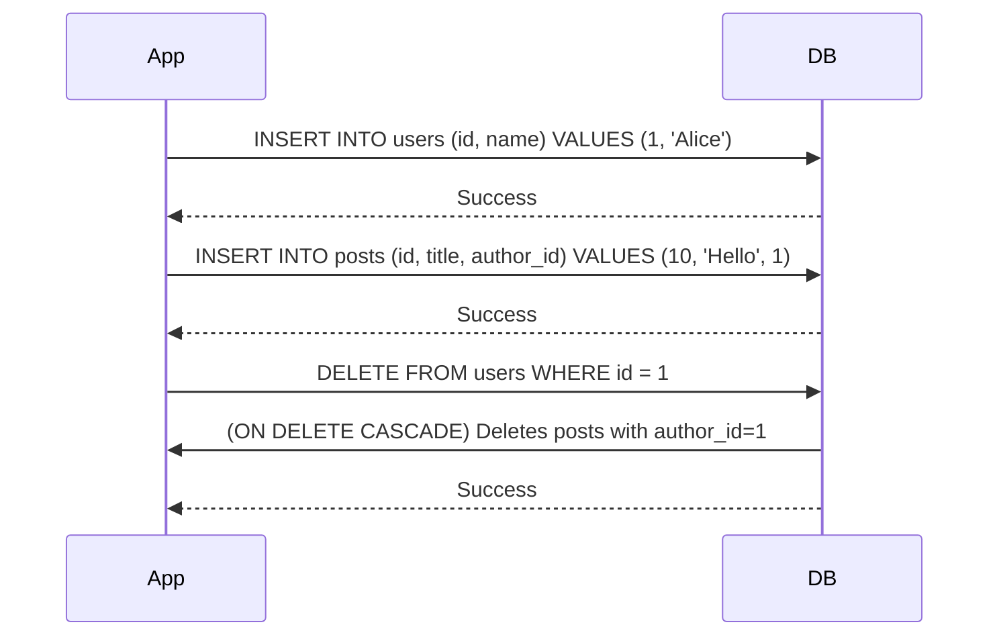

<!-- Generated by Groq via GitHub Actions -->
<!-- Topic ID: T033 -->
<!-- Category: Databases -->
<!-- Generated at UTC: 2026-09-30T06:57:06.190792+00:00 -->

# Foreign keys

## 1. What problem does this solve?

### Motivation

When building relational data models you often have entities that belong to other entities.  
For example, a **Post** belongs to a **User**. In a database this relationship is represented by a *foreign key* column in the `posts` table that references the primary key of the `users` table.

### The problem

* **Orphan records** – a post could exist without a corresponding user if the link is not enforced.
* **Inconsistent data** – deleting a user could leave dangling posts, or updating a user’s ID could break references.
* **Business rule violations** – you might want to prevent deleting a user who still has posts, or automatically delete all posts when a user is removed.

### Why it matters

* **Data integrity** – guarantees that relationships are valid at the database level, not just in application code.
* **Simplified application logic** – you can rely on the database to enforce rules, reducing bugs.
* **Performance** – the database can use indexes on foreign keys to speed up joins and lookups.

### Consequences of not using foreign keys

* Manual checks in code become error‑prone.
* Harder to maintain consistency across services or micro‑services.
* Increased risk of data corruption, especially under concurrent writes.

### Where it appears in real backend systems

* E‑commerce platforms (orders → customers, order_items → orders)
* Social networks (posts → users, comments → posts)
* Content management systems (articles → authors)
* Financial systems (transactions → accounts)

---

## 2. Mental model

### Simple analogy

> **Library books and shelves**  
> Think of a library where each book must be placed on a shelf that exists.  
> *Shelf* → `users` table (primary key: `user_id`)  
> *Book* → `posts` table (foreign key: `author_id` referencing `user_id`)

If a shelf is removed, you decide whether to:
* Keep the books (orphaned) – not allowed in a well‑managed library.
* Move the books to another shelf – handled automatically by the system.
* Delete the books – cascade delete.

### Precise engineering model

* **Primary key** – unique identifier for a row (e.g., `user_id`).
* **Foreign key** – a column that references a primary key in another table.
* **Referential integrity** – the database guarantees that every foreign key value either matches a primary key or is `NULL` (if nullable).
* **Actions** – `ON DELETE` / `ON UPDATE` clauses define what happens when the referenced row changes.

---

## 3. Deep explanation

### Internals

* The database stores a **constraint** that links two columns.
* On **INSERT/UPDATE**, the engine checks that the foreign key value exists in the referenced table.
* On **DELETE/UPDATE** of the referenced row, the engine enforces the defined action (restrict, cascade, set null, set default).

### Important terminology

| Term | Meaning |
|------|---------|
| **Referential integrity** | Guarantee that relationships are valid. |
| **ON DELETE / ON UPDATE** | Actions applied to dependent rows. |
| **Cascade** | Propagate delete/update to dependent rows. |
| **Restrict / No action** | Prevent delete/update if dependents exist. |
| **Set null / Set default** | Nullify or set a default value on dependents. |
| **Deferred constraint** | Check constraints at transaction commit instead of immediately. |

### Trade‑offs

| Benefit | Drawback |
|---------|----------|
| **Strong consistency** | Extra checks add overhead on writes. |
| **Simplified code** | Less flexibility for complex business logic. |
| **Index requirement** | Must index foreign key columns for performance. |
| **Cascades** | Can cause large, unintended deletes if mis‑configured. |

### Failure modes

* **Deadlocks** – cascading deletes can lock many rows; careful ordering or batching helps.
* **Long transactions** – deferred constraints can delay errors until commit, making debugging harder.
* **Partial failures** – if a cascade delete fails midway, you may end up with orphaned rows unless wrapped in a transaction.

### Limitations

* **Cross‑database references** – most RDBMS do not support foreign keys across databases.
* **Distributed systems** – enforcing referential integrity across services requires additional coordination (e.g., two‑phase commit, sagas).
* **No support in NoSQL** – MongoDB, Redis, etc., don’t enforce foreign keys natively; you must handle it in application logic.

### Where it fits in a backend architecture

* **Data layer** – the database enforces constraints.
* **Service layer** – may rely on database guarantees to simplify business logic.
* **API layer** – can expose errors like `23503` (foreign key violation) to clients.
* **Cache layer** – must invalidate or update cached data when foreign key changes occur.

### Interaction with related concepts

* **ORMs** – map foreign keys to object relationships; can generate constraints automatically.
* **Transactions** – foreign key checks happen inside transactions; use `DEFERRED` for complex scenarios.
* **Indexes** – foreign key columns should be indexed for join performance.
* **Replication** – foreign key constraints are replicated to read replicas; consistency must be maintained.

---

## 4. How it works

### Step‑by‑step flow

1. **Create tables** – define primary key and foreign key constraints.
2. **Insert parent row** – e.g., insert a user.
3. **Insert child row** – insert a post referencing the user’s `id`.
4. **Attempt invalid insert** – insert a post with a non‑existent `author_id`; database rejects.
5. **Delete parent row** – depending on `ON DELETE` action:
   * `RESTRICT` – fails if child rows exist.
   * `CASCADE` – deletes all child rows automatically.
   * `SET NULL` – sets `author_id` to `NULL` on child rows.
6. **Update parent key** – if `ON UPDATE CASCADE`, child rows’ foreign keys are updated automatically.



---

## 5. Practical implementation

Below is a minimal Node.js example using the `pg` library (PostgreSQL).  
It demonstrates creating tables, inserting data, and observing cascade delete.

```ts
// db.ts
import { Pool } from 'pg';

export const pool = new Pool({
  connectionString: process.env.DATABASE_URL,
});
```

```ts
// schema.ts
import { pool } from './db';

export async function initSchema() {
  // Create users table
  await pool.query(`
    CREATE TABLE IF NOT EXISTS users (
      id SERIAL PRIMARY KEY,
      name TEXT NOT NULL
    );
  `);

  // Create posts table with foreign key
  await pool.query(`
    CREATE TABLE IF NOT EXISTS posts (
      id SERIAL PRIMARY KEY,
      title TEXT NOT NULL,
      author_id INT NOT NULL,
      CONSTRAINT fk_author
        FOREIGN KEY (author_id)
        REFERENCES users(id)
        ON DELETE CASCADE   -- change to RESTRICT / SET NULL as needed
    );
  `);
}
```

```ts
// demo.ts
import { pool } from './db';
import { initSchema } from './schema';

async function runDemo() {
  await initSchema();

  // Insert a user
  const { rows: userRows } = await pool.query(
    `INSERT INTO users (name) VALUES ($1) RETURNING *`,
    ['Alice']
  );
  const user = userRows[0];
  console.log('Created user:', user);

  // Insert a post referencing the user
  const { rows: postRows } = await pool.query(
    `INSERT INTO posts (title, author_id) VALUES ($1, $2) RETURNING *`,
    ['My first post', user.id]
  );
  console.log('Created post:', postRows[0]);

  // Attempt to insert a post with a non‑existent author
  try {
    await pool.query(
      `INSERT INTO posts (title, author_id) VALUES ($1, $2)`,
      ['Invalid', 9999]
    );
  } catch (err: any) {
    console.error('Foreign key violation:', err.code); // 23503
  }

  // Delete the user – cascade deletes posts
  await pool.query(`DELETE FROM users WHERE id = $1`, [user.id]);
  console.log('Deleted user; posts should be gone.');

  // Verify posts table is empty
  const { rows: remainingPosts } = await pool.query(`SELECT * FROM posts`);
  console.log('Remaining posts:', remainingPosts);
}

runDemo().catch(console.error).finally(() => pool.end());
```

**Key lines explained**

| Line | Explanation |
|------|-------------|
| `ON DELETE CASCADE` | Automatically removes posts when a user is deleted. |
| `RETURNING *` | Retrieves the inserted row for immediate use. |
| `err.code === '23503'` | PostgreSQL error code for foreign key violation. |

---

## 6. Production considerations

| Concern | What to watch for | Mitigation |
|---------|-------------------|------------|
| **Scalability** | Large cascade deletes can lock many rows. | Batch deletes, use `ON DELETE SET NULL` for heavy tables, or implement soft deletes. |
| **Reliability** | Distributed transactions across services are hard. | Use sagas or event sourcing; keep foreign keys within a single database. |
| **Security** | Exposing raw constraint errors to clients leaks schema info. | Translate errors to generic “invalid data” messages. |
| **Observability** | Silent failures in deferred constraints. | Log constraint violations, enable `log_min_error_statement`. |
| **Performance** | Foreign key checks add overhead on writes. | Index foreign key columns; use `NOT NULL` where possible. |
| **Error handling** | Application must handle `23503` errors gracefully. | Wrap DB calls in try/catch, retry if transient. |
| **Resource usage** | Cascades can consume CPU and I/O. | Monitor lock wait times, use `pg_stat_activity`. |
| **Operational concerns** | Schema migrations must preserve constraints. | Use migration tools (Flyway, Liquibase) with `--safe` flags. |
| **Failure recovery** | Partial deletes due to transaction abort. | Wrap cascade operations in a single transaction. |
| **Deployment** | Adding constraints can lock tables. | Deploy migrations during low‑traffic windows or use online schema change tools. |

---

## 7. Common mistakes

| Mistake | Why it’s problematic |
|---------|----------------------|
| **Omitting `ON DELETE` action** | Defaults to `RESTRICT`, causing unexpected failures when deleting parents. |
| **Using nullable foreign keys without intent** | Allows orphaned rows; harder to enforce integrity later. |
| **Not indexing foreign key columns** | Slows down joins and cascade operations. |
| **Relying on application code for referential integrity** | Bugs creep in; race conditions under concurrency. |
| **Using `ON UPDATE CASCADE` on surrogate keys that change rarely** | Unnecessary overhead; better to keep primary keys immutable. |
| **Creating foreign keys across sharded tables** | Most RDBMS don’t support cross‑shard constraints; leads to data inconsistency. |
| **Ignoring deferred constraints in long transactions** | Errors surface only at commit, making debugging hard. |
| **Using `SET NULL` without handling `NULL` in queries** | Leads to subtle bugs when filtering on foreign key. |

---

## 8. Senior engineer perspective

### What changes at scale?

* **Cross‑service data** – In micro‑services you often keep data in separate databases; foreign keys become *logical* constraints enforced by the application or via event streams.
* **Partitioning / sharding** – Foreign key constraints cannot span shards; you must design sharding keys that keep related rows together or accept eventual consistency.
* **Bulk operations** – Large cascade deletes can become a bottleneck; consider soft deletes or background jobs.
* **Monitoring** – Track lock wait times, deadlocks, and constraint violation rates as early indicators of schema issues.

### Design decisions

| Decision | Trade‑offs |
|----------|------------|
| **Use surrogate (UUID) vs natural keys** | UUIDs avoid collisions across shards but are larger; natural keys are smaller but may change. |
| **Cascade vs set null** | Cascades keep data clean but risk large deletes; set null preserves child rows but requires handling `NULL` values. |
| **Deferred vs immediate constraints** | Deferred allows complex multi‑row updates but delays error detection; immediate ensures instant consistency. |
| **Index strategy** | Composite indexes on foreign key + other columns improve query performance but increase write cost. |
| **Schema evolution** | Adding constraints in production can lock tables; use online schema change tools or schedule maintenance windows. |

### When NOT to use foreign keys

* When you need **high write throughput** and the overhead of constraint checks outweighs the benefit.
* In **distributed micro‑service architectures** where data lives in separate services; enforce consistency via events instead.
* With **NoSQL stores** that do not support constraints; rely on application logic or secondary indexes.

---

## 9. Interview questions

1. **Beginner** – *What is a foreign key and why do we use it?*  
   *Answer:* A foreign key is a column that references a primary key in another table, ensuring referential integrity. It prevents orphaned rows and simplifies application logic.

2. **Beginner** – *What happens if you try to delete a parent row that has child rows without specifying `ON DELETE`?*  
   *Answer:* The default action is `RESTRICT` (or `NO ACTION`), so the delete fails with a foreign key violation.

3. **Senior** – *Explain the difference between `ON DELETE CASCADE` and `ON DELETE SET NULL`. When would you choose one over the other?*  
   *Answer:* `CASCADE` deletes all dependent rows; `SET NULL` nullifies the foreign key. Use `CASCADE` when child data is only meaningful with the parent; use `SET NULL` when child data can exist independently.

4. **Senior** – *How would you handle referential integrity in a micro‑service architecture where the parent and child tables live in different databases?*  
   *Answer:* Use eventual consistency via event sourcing or sagas; enforce business rules in the application layer, possibly with compensating actions. Avoid database‑level foreign keys across services.

5. **Scenario/Debugging** – *You have a `orders` table referencing `customers`. After a bulk import, you notice many orders have `customer_id` set to `NULL`, but the foreign key constraint is `NOT NULL`. What could have happened and how would you investigate?*  
   *Answer:* Likely the import bypassed the constraint (e.g., used `COPY` with `DISABLE TRIGGER` or a different database). Investigate logs for `ALTER TABLE DISABLE TRIGGER ALL`, check transaction isolation, and ensure the constraint is enabled. Use `pg_constraint` to verify the constraint status.

---

## 10. Hands‑on task

**Task:** Build a small blog API that enforces foreign key constraints between `users` and `posts`.

1. Create a PostgreSQL database (use Docker or local install).
2. Write a Node.js/Express server with TypeScript.
3. Define `users` and `posts` tables with a foreign key (`author_id` → `users.id`).
4. Implement endpoints:
   * `POST /users` – create a user.
   * `POST /posts` – create a post (must provide a valid `author_id`).
   * `DELETE /users/:id` – delete a user; observe cascade delete.
5. Add error handling to return a 400 status when a foreign key violation occurs.
6. Write a simple script that attempts to insert a post with an invalid `author_id` and logs the error.

**Goal:** Verify that the database enforces referential integrity and that your API correctly surfaces constraint violations.

---

## 11. Quick revision

- **Foreign key** links a child column to a parent primary key.
- Enforces **referential integrity** at the database level.
- `ON DELETE / ON UPDATE` actions: `RESTRICT`, `CASCADE`, `SET NULL`, `SET DEFAULT`.
- Must **index** foreign key columns for performance.
- **Deferred constraints** delay checks until transaction commit.
- In micro‑services, foreign keys become *logical* constraints; enforce via events.
- Common pitfalls: missing `ON DELETE` action, nullable FK without intent, no indexing.
- Production concerns: cascade delete performance, lock contention, monitoring constraint violations.
- Use `pg` or an ORM (Prisma, TypeORM) to map relationships; let the ORM generate constraints.
- Error code `23503` in PostgreSQL indicates a foreign key violation.

---

## 12. References

- PostgreSQL documentation – [Foreign Key Constraints](https://www.postgresql.org/docs/current/ddl-constraints.html#DDL-CONSTRAINTS-FOREIGN)
- Node.js `pg` library – [Official Docs](https://node-postgres.com/)
- Prisma – [Foreign Key Relations](https://www.prisma.io/docs/concepts/components/prisma-schema/relations)
- TypeORM – [Relations](https://typeorm.io/#/relations)
- SQL standard – [Foreign Key](https://www.iso.org/standard/63554.html)
- Docker – [PostgreSQL Image](https://hub.docker.com/_/postgres)
