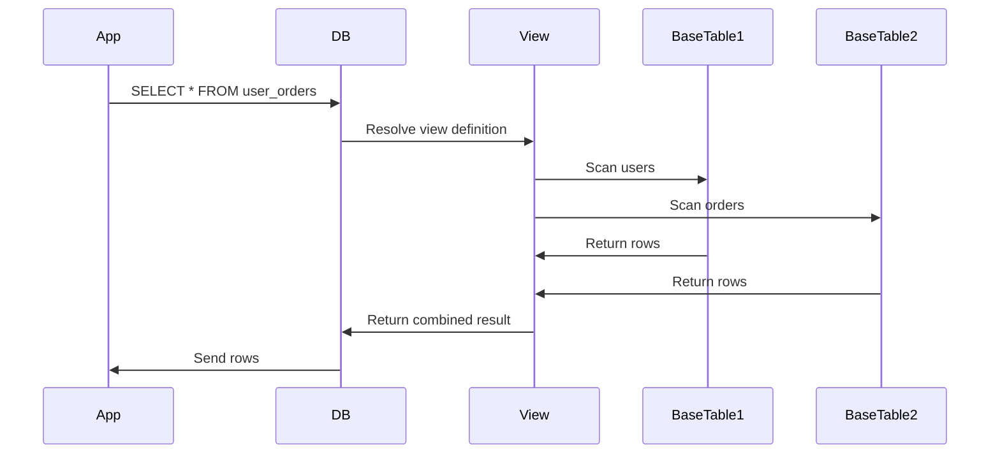

<!-- Generated by Groq via GitHub Actions -->
<!-- Topic ID: T034 -->
<!-- Category: Databases -->
<!-- Generated at UTC: 2026-09-30T06:57:06.190792+00:00 -->

# Views

## 1. What problem does this solve?

| Problem | Why it matters | Consequence of not using views | Real‑world use cases |
|---------|----------------|--------------------------------|----------------------|
| **Repeated complex logic** | Every service that needs the same join/aggregation must duplicate the SQL. | Tight coupling, hard‑to‑maintain code, bugs in one place ripple to many. | Reporting dashboards, analytics pipelines, microservice data contracts. |
| **Security & data‑sharding** | Different tenants or roles need different subsets of data. | Exposing raw tables can leak data; manual filtering in code is error‑prone. | Multi‑tenant SaaS, GDPR compliance, row‑level security. |
| **Performance tuning** | Queries that aggregate large tables can be expensive. | High latency, CPU spikes, slow user experience. | OLAP workloads, real‑time dashboards. |
| **Schema evolution** | Base tables change (new columns, indexes). | All query sites must be updated; risk of runtime failures. | Evolving data models, feature flags. |

Views let you **declare a reusable, named SELECT** that the database engine can treat like a table. They provide a single source of truth for complex logic, enforce consistent security, and can be optimized or materialized for performance.

---

## 2. Mental model

### Analogy
Think of a **view as a camera lens**.  
- The lens (view definition) focuses on a particular part of a scene (base tables).  
- You can look through the lens (query the view) and see the same image every time, regardless of how the scene changes behind the camera.  
- If you change the lens (alter the view), everyone who looks through it sees the updated image.

### Engineering model
- **View**: a stored `SELECT` statement.  
- **Base tables**: the underlying data.  
- **Query planner**: rewrites `SELECT * FROM view` into the underlying query (unless the view is materialized).  
- **Materialized view**: a physical table that stores the result of the view’s query, refreshed on demand or on schedule.

---

## 3. Deep explanation

### Internals
- **Definition storage**: the view’s SQL is stored in the database’s system catalog.  
- **Dependency graph**: the engine tracks which tables a view depends on.  
- **Execution**: for non‑materialized views, the planner inlines the view’s query into the outer query.  
- **Materialized view**: the engine materializes the result set and keeps it in sync via `REFRESH MATERIALIZED VIEW`.

### Important terminology
| Term | Meaning |
|------|---------|
| **View** | Virtual table defined by a SELECT. |
| **Materialized view** | Physical table storing the view’s result. |
| **Refresh** | Re‑executing the underlying query to update a materialized view. |
| **Dependency** | Relationship between a view and its base tables. |
| **Updatable view** | A view that can be used in INSERT/UPDATE/DELETE (rare, limited). |

### Trade‑offs
| Aspect | Non‑materialized | Materialized |
|--------|------------------|--------------|
| **Freshness** | Always up‑to‑date | Stale until refreshed |
| **Storage** | None | Requires disk space |
| **Write performance** | No extra cost | Refresh cost on writes |
| **Read performance** | Depends on query complexity | Fast reads (indexable) |
| **Maintenance** | None | Refresh scheduling, monitoring |

### Failure modes
- **Stale data**: if the base tables change and the view isn’t refreshed.  
- **Dependency breakage**: dropping a base table invalidates the view.  
- **Permission errors**: querying a view may require permissions on base tables.  
- **Refresh failures**: long queries can lock the view or consume resources.

### Limitations
- Views are **read‑only** (except for limited updatable views).  
- Cannot contain procedural code, DDL, or certain non‑deterministic functions.  
- Some ORMs treat views as tables but may not support all features (e.g., auto‑generated primary keys).

### Where it fits
- **Data access layer**: encapsulate business logic in the database.  
- **Reporting**: expose pre‑aggregated data to BI tools.  
- **Security**: enforce row‑level filtering at the database level.  
- **Microservices**: provide a stable contract for downstream services.

### Interaction with related concepts
- **ORMs**: treat views as tables; may need explicit mapping.  
- **Caching layers**: can cache view results in Redis for ultra‑fast reads.  
- **Sharding**: views can span shards if the database supports cross‑shard queries.  
- **Row‑level security (RLS)**: views can be combined with RLS policies for fine‑grained access.

---

## 4. How it works

1. **Define the view**  
   ```sql
   CREATE VIEW user_orders AS
   SELECT u.id, u.name, o.id AS order_id, o.total
   FROM users u
   JOIN orders o ON o.user_id = u.id
   WHERE o.status = 'completed';
   ```

2. **Query the view**  
   ```sql
   SELECT * FROM user_orders WHERE total > 100;
   ```

3. **Planner rewrites**  
   The planner expands `user_orders` into the underlying join, applying any indexes.

4. **Execution**  
   The database executes the expanded query, returning results as if they came from a table.

5. **Materialized view (optional)**  
   ```sql
   CREATE MATERIALIZED VIEW mv_user_sales AS
   SELECT user_id, SUM(total) AS sales
   FROM orders
   WHERE status = 'completed'
   GROUP BY user_id;
   ```

6. **Refresh**  
   ```sql
   REFRESH MATERIALIZED VIEW mv_user_sales;
   ```

### Mermaid diagram



---

## 5. Practical implementation

### 5.1 Non‑materialized view with `pg` (Node.js)

```ts
import { Client } from 'pg';

const client = new Client({ connectionString: process.env.DATABASE_URL });
await client.connect();

// 1️⃣ Create the view
await client.query(`
  CREATE OR REPLACE VIEW user_orders AS
  SELECT u.id, u.name, o.id AS order_id, o.total
  FROM users u
  JOIN orders o ON o.user_id = u.id
  WHERE o.status = 'completed';
`);

// 2️⃣ Query the view
const res = await client.query(`
  SELECT * FROM user_orders
  WHERE total > $1
`, [100]);

console.log(res.rows);
await client.end();
```

### 5.2 Materialized view with Prisma

```ts
// prisma/schema.prisma
model User {
  id    Int    @id @default(autoincrement())
  name  String
  orders Order[]
}

model Order {
  id     Int    @id @default(autoincrement())
  userId Int
  total  Float
  status String
}

model UserSales {
  userId Int @id
  sales  Float
}
```

```ts
// prisma/migrate/migrations/.../steps.sql
CREATE MATERIALIZED VIEW user_sales AS
SELECT user_id, SUM(total) AS sales
FROM orders
WHERE status = 'completed'
GROUP BY user_id;
```

```ts
// refresh script
import { execSync } from 'child_process';

execSync('psql $DATABASE_URL -c "REFRESH MATERIALIZED VIEW CONCURRENTLY user_sales;"', { stdio: 'inherit' });
```

### 5.3 Multi‑tenant filtering view

```sql
CREATE VIEW tenant_orders AS
SELECT o.*
FROM orders o
JOIN tenants t ON t.id = o.tenant_id
WHERE t.is_active = true;
```

In Node.js:

```ts
const tenantId = req.headers['x-tenant-id'];
const res = await client.query(`
  SELECT * FROM tenant_orders
  WHERE tenant_id = $1
`, [tenantId]);
```

---

## 6. Production considerations

| Concern | Tips |
|---------|------|
| **Scalability** | Use materialized views for heavy aggregations; partition base tables to reduce scan size. |
| **Reliability** | Track view dependencies; rebuild on schema changes. |
| **Security** | Grant `SELECT` on the view only; revoke direct access to base tables. |
| **Observability** | Enable query logging for view usage; monitor refresh times. |
| **Performance** | Create indexes on materialized view columns; use `CONCURRENTLY` refresh to avoid blocking. |
| **Error handling** | Catch `view does not exist` errors; fallback to base tables if needed. |
| **Resource usage** | Materialized view storage can grow large; purge old data or use `REFRESH WITH DATA` vs `WITH NO DATA`. |
| **Operational** | Automate refresh via cron or Airflow; alert on refresh failures. |
| **Deployment** | Include view creation in schema migrations; version‑control view definitions. |
| **Failure recovery** | Re‑create view if corrupted; use `pg_dump` to restore. |

---

## 7. Common mistakes

| Mistake | Why it’s bad |
|---------|--------------|
| **Using a view for writes** | Views are read‑only; attempts to insert/update fail or silently ignore changes. |
| **Ignoring indexes on materialized views** | Queries against the view become slow; indexes are required for performance. |
| **Over‑nesting views** | Deep view chains increase planner complexity and can lead to unexpected query plans. |
| **Not handling dependency changes** | Dropping a base table invalidates the view; forgetting to rebuild causes runtime errors. |
| **Granting base‑table permissions to everyone** | Bypasses the security benefits of the view. |
| **Using non‑deterministic functions in views** | Makes caching and refresh logic unreliable. |

---

## 8. Senior engineer perspective

### Design decisions at scale
- **Materialized vs. non‑materialized**: choose based on read/write ratio and freshness tolerance.  
- **Refresh strategy**: incremental refresh, `CONCURRENTLY`, or event‑driven triggers.  
- **Partitioning**: partition base tables and materialized views to limit scan scope.  
- **Indexing**: create covering indexes on the view; consider partial indexes for high‑cardinality columns.  
- **Caching**: layer Redis or Memcached on top of materialized views for ultra‑fast reads.  
- **Monitoring**: track refresh duration, query latency, and view dependency changes.  
- **Cost**: materialized views consume storage and compute; balance against query performance.  

### Bottlenecks
- **Refresh contention**: long refreshes block reads if not `CONCURRENTLY`.  
- **Planner complexity**: deep view nesting can lead to suboptimal plans.  
- **Dependency churn**: frequent schema changes can invalidate many views.

### Failure scenarios
- **Stale data**: users see outdated aggregates; mitigate with `WITH NO DATA` refresh and alerting.  
- **Refresh failure**: due to long-running queries or resource exhaustion; implement retry logic.  
- **Permission drift**: accidental grant of base‑table access; enforce least‑privilege policies.

### When NOT to use
- **High write volume**: materialized views become a bottleneck.  
- **Simple queries**: a view adds unnecessary indirection.  
- **Non‑SQL databases**: MongoDB views are limited; consider aggregation pipelines instead.

---

## 9. Interview questions

| Level | Question | Answer points |
|-------|----------|---------------|
| Beginner | What is a database view? | Virtual table, defined by a SELECT, no data stored. |
| Beginner | How does a materialized view differ from a normal view? | Stores data physically, needs refresh, faster reads, consumes storage. |
| Senior | When would you choose a materialized view over an index? | Heavy aggregations, complex joins, low write frequency, need fast reads. |
| Senior | How do you handle view refresh in a production system with high write traffic? | Use `CONCURRENTLY`, incremental refresh, event‑driven triggers, schedule during low load. |
| Scenario | A view stops returning results after a schema change. What steps would you take to debug and fix it? | 1️⃣ Check dependency graph. 2️⃣ Verify base table changes. 3️⃣ Re‑create or alter view. 4️⃣ Ensure permissions. 5️⃣ Test with sample query. |

---

## 10. Hands‑on task

**Goal**: Create a materialized view that aggregates daily revenue per product, refresh it every hour, and expose it via a Next.js API route.

1. **Schema**: `orders(product_id, amount, created_at)` and `products(id, name)`.  
2. **View**: `daily_product_revenue(product_id, revenue_date, total_amount)`.  
3. **Refresh**: Use a Node.js cron job (`node-cron`) that runs `REFRESH MATERIALIZED VIEW CONCURRENTLY daily_product_revenue;`.  
4. **API**: `/api/revenue?date=YYYY-MM-DD` returns the aggregated data for that date.  
5. **Testing**: Insert sample orders, run the refresh, call the API, verify correctness.

---

## 11. Quick revision

- A **view** is a stored SELECT; behaves like a table.  
- **Non‑materialized**: always fresh, no storage, planner inlines.  
- **Materialized**: physical storage, needs refresh, fast reads.  
- Use views for reusable logic, security, and reporting.  
- Grant permissions on the view, not on base tables.  
- Index materialized views; consider `CONCURRENTLY` refresh.  
- Monitor refresh duration and query performance.  
- Avoid nested views; keep dependency graphs simple.  
- In ORMs, map views as tables; handle primary keys manually.  
- For multi‑tenant data, create tenant‑specific views.  
- Refresh strategy depends on write frequency and freshness needs.

---

## 12. References

- PostgreSQL: [Views](https://www.postgresql.org/docs/current/sql-createview.html)  
- PostgreSQL: [Materialized Views](https://www.postgresql.org/docs/current/sql-creatematerializedview.html)  
- MySQL: [Views](https://dev.mysql.com/doc/refman/8.0/en/create-view.html)  
- Oracle: [Materialized Views](https://docs.oracle.com/en/database/oracle/oracle-database/19/sqlrf/CREATE-MATERIALIZED-VIEW.html)  
- Prisma: [Schema Reference](https://www.prisma.io/docs/reference/api-reference/prisma-schema-reference)  
- Node.js `pg` library: [Documentation](https://node-postgres.com/)  
- `node-cron`: [GitHub](https://github.com/node-cron/node-cron)
