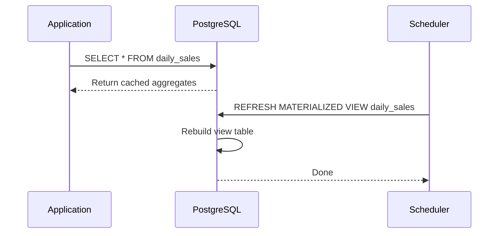

<!-- Generated by Groq via GitHub Actions -->
<!-- Topic ID: T035 -->
<!-- Category: Databases -->
<!-- Generated at UTC: 2026-09-30T18:30:54.988037+00:00 -->

# Materialized views

## 1. What problem does this solve?

| Problem | Why it matters | Consequence of not using | Real‑world use cases |
|---------|----------------|--------------------------|----------------------|
| **Slow aggregate queries** | Aggregations over millions of rows (e.g., daily sales totals) can take seconds or minutes. | Users see laggy dashboards, API responses become stale, and downstream services block on long queries. | BI dashboards, analytics APIs, recommendation engines that need near‑real‑time summaries. |
| **High read load on hot tables** | A single table can be the source of many read queries (e.g., user profiles). | Database becomes a bottleneck, causing increased latency and cost. | Social media feeds, e‑commerce product catalogs. |
| **Complex joins and calculations** | Joins across many tables or expensive window functions are costly. | Query planners may still choose suboptimal plans, leading to CPU spikes. | Financial reporting, fraud detection. |
| **Need for deterministic snapshots** | Some processes require a consistent view of data at a point in time (e.g., compliance audits). | Inconsistent reads can lead to incorrect decisions or regulatory violations. | Audit logs, regulatory reporting. |

If materialized views are not used, systems often resort to:

- Recomputing aggregates on every request (inefficient).
- Caching at the application layer (requires custom invalidation logic).
- Using denormalized tables (increases write complexity).

Materialized views provide a **database‑level, declarative way** to store pre‑computed results that can be refreshed on demand or automatically, giving predictable performance and consistency.

---

## 2. Mental model

### Analogy: The “Pre‑Cooked Meal”  
Imagine you’re a chef who needs to serve a large crowd of diners. Instead of cooking a full meal from scratch for each order, you prepare a **pre‑cooked dish** (e.g., a lasagna) in advance. When a diner orders lasagna, you just plate it and serve it instantly. The pre‑cooked dish is the *materialized view*: a ready‑made result that can be served quickly, while the kitchen (the underlying tables) keeps cooking new ingredients.

### Engineering model  
- **Base tables**: Raw data (e.g., `orders`, `order_items`).
- **Materialized view**: A table that stores the result of a query over the base tables (e.g., `daily_sales`).
- **Refresh**: Re‑run the query to update the view, either **on demand** (`REFRESH MATERIALIZED VIEW`) or **automatically** (e.g., using triggers or a scheduler).
- **Query**: The application reads from the materialized view instead of the base tables, gaining speed.

---

## 3. Deep explanation

### Internals (PostgreSQL example)

1. **Creation**  
   ```sql
   CREATE MATERIALIZED VIEW daily_sales AS
   SELECT
     DATE(order_date) AS day,
     SUM(total_amount) AS revenue
   FROM orders
   GROUP BY 1;
   ```
   PostgreSQL creates a new table and populates it with the query result.

2. **Storage**  
   The view is stored as a regular table on disk. It has its own indexes, statistics, and can be queried like any other table.

3. **Refresh**  
   - **Full refresh** (`REFRESH MATERIALIZED VIEW`) rebuilds the entire view.  
   - **Concurrent refresh** (`REFRESH MATERIALIZED VIEW CONCURRENTLY`) keeps the old data available while rebuilding, but requires a unique index.

4. **Dependencies**  
   PostgreSQL tracks dependencies. If a base table changes, the view is **not** automatically refreshed; you must trigger it yourself.

### Important terminology

| Term | Meaning |
|------|---------|
| **Snapshot** | The state of the view at a specific point in time. |
| **Refresh strategy** | How and when the view is updated (manual, scheduled, trigger‑based). |
| **Concurrent refresh** | Refresh that allows reads during the operation. |
| **Index on view** | Indexes created on the materialized view table to speed up queries. |
| **Partitioned view** | A view that spans multiple partitions; not directly supported in PostgreSQL but can be simulated. |

### Trade‑offs

| Aspect | Benefit | Cost |
|--------|---------|------|
| **Read performance** | Very fast, constant‑time queries. | None for reads. |
| **Write performance** | Base tables unaffected by view reads. | Refresh operation can be expensive and block writes if not concurrent. |
| **Storage** | Requires extra disk space. | Additional maintenance overhead. |
| **Staleness** | Data may be out of date. | Must decide acceptable freshness window. |

### Failure modes

- **Stale data**: If refresh is delayed, consumers see outdated results.  
- **Refresh lock contention**: A full refresh locks the view, blocking reads.  
- **Index bloat**: Frequent refreshes can cause index fragmentation.  
- **Dependency drift**: Schema changes to base tables may break the view if not updated.

### Limitations

- Not supported in all RDBMS (e.g., MySQL before 8.0.13).  
- Cannot be used for real‑time streaming updates without external orchestration.  
- No built‑in support for incremental refresh in PostgreSQL (requires manual logic or extensions like `pg_partman`).

### Where it fits in a backend architecture

```
┌───────────────────────┐
│  Application Layer    │
│  (Next.js / FastAPI)  │
└─────────────┬─────────┘
              │
              ▼
┌───────────────────────┐
│  Query Layer           │
│  (PostgreSQL)          │
│  ├─ Base tables        │
│  ├─ Materialized view │
│  └─ Indexes            │
└─────────────┬─────────┘
              │
              ▼
┌───────────────────────┐
│  Cache Layer (Redis)   │
└───────────────────────┘
```

The application queries the materialized view for fast reads. A background job (e.g., a cron job or Kafka consumer) triggers `REFRESH MATERIALIZED VIEW` to keep data fresh.

---

## 4. How it works

1. **Define the view** – Write a `SELECT` that aggregates or joins base tables.  
2. **Create the view** – PostgreSQL stores the result in a new table.  
3. **Add indexes** – Create indexes on the view to speed up downstream queries.  
4. **Schedule refresh** – Use a scheduler (cron, `pg_cron`, Airflow) or triggers to run `REFRESH MATERIALIZED VIEW`.  
5. **Query the view** – Application reads from the view as if it were a regular table.  
6. **Handle staleness** – Decide on a refresh cadence that balances freshness and load.



---

## 5. Practical implementation

### Node.js example (TypeScript)

```ts
// src/db.ts
import { Pool } from 'pg';

export const pool = new Pool({
  connectionString: process.env.DATABASE_URL,
});

// src/materializedView.ts
import { pool } from './db';

export async function refreshDailySales() {
  // Full refresh – blocks reads until complete
  await pool.query('REFRESH MATERIALIZED VIEW daily_sales');
  console.log('daily_sales refreshed');
}

// src/server.ts
import express from 'express';
import { pool } from './db';
import { refreshDailySales } from './materializedView';

const app = express();
const PORT = process.env.PORT ?? 3000;

// Endpoint that reads from the materialized view
app.get('/api/daily-sales', async (req, res) => {
  const { rows } = await pool.query(
    'SELECT day, revenue FROM daily_sales ORDER BY day DESC LIMIT 30'
  );
  res.json(rows);
});

// Endpoint to trigger manual refresh (for dev/testing)
app.post('/api/refresh-sales', async (req, res) => {
  await refreshDailySales();
  res.send('Refreshed');
});

app.listen(PORT, () => console.log(`🚀 Server listening on ${PORT}`));
```

#### How to schedule automatic refresh

```bash
# Using cron (runs every hour)
0 * * * * /usr/bin/psql -d mydb -c "REFRESH MATERIALIZED VIEW CONCURRENTLY daily_sales;"
```

Or use `pg_cron` extension:

```sql
SELECT cron.schedule('0 * * * *', 'REFRESH MATERIALIZED VIEW CONCURRENTLY daily_sales');
```

#### Adding an index

```sql
CREATE UNIQUE INDEX daily_sales_day_idx ON daily_sales(day);
```

---

## 6. Production considerations

| Concern | Recommendation |
|---------|----------------|
| **Scalability** | Use `CONCURRENTLY` refresh to avoid blocking reads. Partition the view if it grows large. |
| **Reliability** | Wrap refresh in a transaction and monitor success/failure. Use a retry policy. |
| **Security** | Grant `SELECT` on the view to application roles only. Keep base tables with stricter permissions. |
| **Observability** | Expose metrics: refresh duration, last refresh timestamp, number of rows. |
| **Performance** | Keep the view query simple; avoid subqueries that force full table scans. |
| **Error handling** | Catch refresh errors and alert. Log failures to a dedicated channel. |
| **Resource usage** | Monitor CPU and disk I/O during refresh. Schedule during low‑traffic windows if possible. |
| **Operational concerns** | Automate view creation and index maintenance in migrations. |
| **Failure recovery** | If a refresh fails, fallback to the last successful snapshot. |
| **Deployment** | Include view creation in database migrations (e.g., using `node-pg-migrate`). |

---

## 7. Common mistakes

| Mistake | Why it’s problematic |
|---------|----------------------|
| **Assuming automatic refresh** | PostgreSQL does not auto‑refresh; data becomes stale. |
| **Using `REFRESH MATERIALIZED VIEW` on a hot table** | Blocks reads for the entire duration, causing latency spikes. |
| **Ignoring indexes on the view** | Queries on the view become slow; you lose the performance benefit. |
| **Over‑refreshing** | Frequent refreshes waste resources and may degrade write performance. |
| **Not handling failures** | A failed refresh can leave the view in an inconsistent state; downstream services may crash. |
| **Using the view for writes** | Materialized views are read‑only; attempting inserts/updates fails. |
| **Not partitioning large views** | A single huge view table can become a bottleneck. |

---

## 8. Senior engineer perspective

### Architecture decisions

- **Refresh strategy**: Manual vs. scheduled vs. trigger‑based.  
  - *Manual*: fine for low‑frequency updates.  
  - *Scheduled*: good for predictable workloads.  
  - *Trigger‑based*: requires careful design to avoid excessive refreshes.

- **Concurrent vs. full refresh**: Choose `CONCURRENTLY` when reads must remain available. Requires a unique index.

- **Partitioning**: For very large views, partition by time or key to improve maintenance and query performance.

- **Cache layer**: Combine materialized views with Redis caching for ultra‑fast reads.

### Trade‑offs

- **Freshness vs. load**: Higher refresh frequency → more load on the database.  
- **Storage vs. speed**: More indexes speed reads but increase write cost during refresh.

### Bottlenecks

- **Refresh lock**: Even `CONCURRENTLY` can lock the view for a short period.  
- **CPU spikes**: Large refreshes can consume significant CPU, impacting other queries.  
- **Disk I/O**: Writing the refreshed table can saturate disk bandwidth.

### Failure scenarios

- **Refresh crash**: View remains stale; need a fallback strategy.  
- **Index corruption**: Can cause query errors; monitor index health.  
- **Schema drift**: Adding a column to a base table may break the view; enforce migrations.

### Monitoring

- **Prometheus metrics**: `materialized_view_last_refresh`, `materialized_view_refresh_duration_seconds`.  
- **Alerting**: Trigger if refresh fails or exceeds threshold.  
- **Logging**: Store refresh logs with timestamps.

### Cost/performance considerations

- **Compute cost**: Frequent refreshes increase CPU usage.  
- **Storage cost**: View tables consume disk; consider compression.  
- **Network cost**: If the view is queried across services, consider colocating it.

### When NOT to use

- **Real‑time data**: If you need millisecond latency, materialized views are too slow.  
- **Highly volatile data**: If data changes every second, the refresh overhead outweighs benefits.  
- **Simple queries**: If a query is already fast, adding a view adds unnecessary complexity.

---

## 9. Interview questions

1. **Beginner**: *What is a materialized view and how does it differ from a regular view?*  
   - *Answer*: A materialized view stores the result set on disk, unlike a regular view which recomputes the query each time. It improves read performance at the cost of staleness and refresh overhead.

2. **Beginner**: *How do you refresh a materialized view in PostgreSQL?*  
   - *Answer*: Use `REFRESH MATERIALIZED VIEW [CONCURRENTLY] view_name;`. `CONCURRENTLY` allows reads during refresh but requires a unique index.

3. **Senior**: *Explain the trade‑offs between using `REFRESH MATERIALIZED VIEW CONCURRENTLY` versus a full refresh, and when you would choose one over the other.*  
   - *Answer*: `CONCURRENTLY` keeps the view readable but needs a unique index and takes longer; full refresh is faster but blocks reads. Choose `CONCURRENTLY` when uptime is critical; full refresh when the view is rarely queried or during maintenance windows.

4. **Senior**: *Describe a strategy to keep a materialized view up‑to‑date in a system with high write volume, without causing significant performance degradation.*  
   - *Answer*: Use incremental refresh logic (e.g., maintain a change log table and apply deltas), schedule refreshes during low‑traffic periods, or use a hybrid approach: a base table with a nightly full refresh and a real‑time Kafka consumer that updates a delta table.

5. **Scenario/Debugging**: *Your application suddenly returns stale data from a materialized view after a recent deployment. What steps would you take to diagnose and fix the issue?*  
   - *Answer*:  
     1. Check the last refresh timestamp (`SELECT relname, last_vacuum, last_autovacuum FROM pg_stat_user_tables WHERE relname='daily_sales';`).  
     2. Verify that the refresh job is running (cron, scheduler logs).  
     3. Ensure the view definition matches the base tables (schema drift).  
     4. Look for errors in the refresh logs.  
     5. If the view is not refreshed, trigger a manual refresh and monitor performance.  
     6. Add alerts for future failures.

---

## 10. Hands‑on task

**Goal**: Build a small Node.js service that exposes an endpoint `/api/top-products` returning the top 10 products by sales for the last 30 days. Use a materialized view to store the aggregated data and refresh it every hour.

**Steps**

1. Create a PostgreSQL table `orders` and `order_items`.  
2. Write a `CREATE MATERIALIZED VIEW top_products AS SELECT product_id, SUM(quantity) AS qty FROM order_items GROUP BY product_id;`.  
3. Add an index on `qty DESC` to speed up the top‑10 query.  
4. Implement a cron job (or `pg_cron`) that runs `REFRESH MATERIALIZED VIEW CONCURRENTLY top_products;` every hour.  
5. Create an Express endpoint that queries the view and returns the top 10 rows.  
6. Verify that the endpoint returns fast results and that the view updates correctly after new orders are inserted.

**Deliverables**

- SQL migration scripts for tables and view.  
- Node.js code for the API and refresh job.  
- Documentation of the refresh schedule and any index creation.

---

## 11. Quick revision

- Materialized view = pre‑computed, stored result set.  
- Created with `CREATE MATERIALIZED VIEW`.  
- Requires manual or scheduled `REFRESH`.  
- `CONCURRENTLY` keeps reads available but needs a unique index.  
- Storing the view consumes disk and requires index maintenance.  
- Ideal for heavy read, low‑write or batch‑updated data.  
- Not suitable for real‑time or highly volatile data.  
- Use with caching (Redis) for ultra‑fast reads.  
- Monitor refresh duration, staleness, and failure rates.  
- Avoid over‑refreshing; balance freshness vs. load.  
- Keep view definition simple; add indexes on query columns.  
- Test refresh logic in staging before production.

---

## 12. References

- PostgreSQL Documentation – Materialized Views: https://www.postgresql.org/docs/current/sql-creatematerializedview.html  
- PostgreSQL Documentation – Refreshing Materialized Views: https://www.postgresql.org/docs/current/sql-refreshmaterializedview.html  
- `pg_cron` Extension: https://github.com/citusdata/pg_cron  
- Node.js `pg` library: https://node-postgres.com/  
- Express.js: https://expressjs.com/  
- Mermaid Live Editor: https://mermaid.live/  

---
