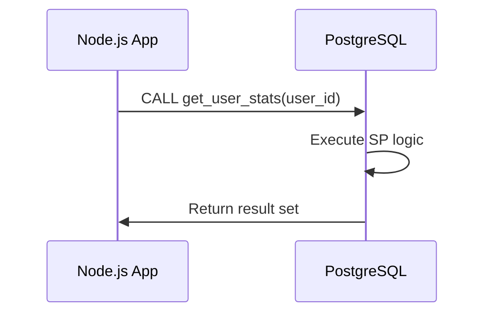

<!-- Generated by Groq via GitHub Actions -->
<!-- Topic ID: T036 -->
<!-- Category: Databases -->
<!-- Generated at UTC: 2026-09-30T18:30:54.988037+00:00 -->

# Stored procedures

## 1. What problem does this solve?

**Motivation**  
When a backend service needs to perform a complex data transformation or a multi‑step transaction, it can either:

1. Pull raw data into the application layer, process it in code, and write back.
2. Push the logic into the database as a *stored procedure* (SP).

**Problem exists**  
- **Network round‑trips**: Every SELECT/UPDATE pair costs a round‑trip and latency.
- **Data transfer**: Moving large result sets over the wire consumes bandwidth and memory.
- **Business logic duplication**: If the same logic is needed by multiple services, duplicating it in each codebase is error‑prone.

**Why it matters**  
- **Performance**: SPs run inside the DB engine, so they can use indexes, plan caching, and avoid shipping data.
- **Consistency**: All callers hit the same logic, reducing bugs.
- **Security**: Granting execute rights instead of raw table access limits what callers can do.

**What happens if not used**  
- Increased latency and bandwidth usage.
- Higher risk of data inconsistency across services.
- More code to maintain and test.

**Real‑world appearance**  
- E‑commerce order processing: a SP that locks inventory, creates order rows, and updates stock atomically.
- Financial services: a SP that calculates interest, applies fees, and writes to ledger tables.
- Analytics pipelines: a SP that aggregates logs and writes summary tables.

---

## 2. Mental model

**Analogy**  
Think of a stored procedure as a *factory assembly line* inside the database.  
- **Raw materials**: Rows in tables.  
- **Workers**: The SQL code inside the SP.  
- **Product**: Updated rows, new rows, or a single result.  

Just as a factory reduces the need to transport raw materials to the shop floor, a SP keeps data close to where it lives, minimizing movement.

**Precise engineering model**  
- A stored procedure is a named, pre‑compiled block of SQL (and optionally procedural language code) stored in the database catalog.  
- It receives parameters, executes a series of statements, and returns a result set or scalar value.  
- The DB engine optimizes the entire block as a single unit, potentially reusing execution plans across calls.

---

## 3. Deep explanation

### Internals
- **Catalog entry**: The SP is stored in `pg_proc` (PostgreSQL) with its bytecode or source text.
- **Compilation**: On first call, the engine parses, type‑checks, and plans the procedure. The plan can be cached.
- **Execution context**: Runs in the same transaction as the caller unless `VOLATILE`/`IMMUTABLE` flags dictate otherwise.
- **Isolation**: Uses the same locking and MVCC semantics as ordinary queries.

### Important terminology
- `IMMUTABLE`, `STABLE`, `VOLATILE`: Hint the planner about side effects.
- `LANGUAGE sql` vs `LANGUAGE plpgsql`: Declarative vs procedural.
- `RETURNS TABLE`, `RETURNS SETOF`, `RETURNS void`: Return types.
- `CALL` vs `SELECT`: Invocation syntax.
- `EXECUTE` dynamic SQL: Building queries at runtime.

### Trade‑offs
| Benefit | Drawback |
|---------|----------|
| **Performance** | Less flexible than application code; harder to debug. |
| **Security** | Requires careful privilege management; can expose sensitive logic. |
| **Portability** | Vendor‑specific syntax; migrating to another DB can be costly. |
| **Maintainability** | Requires DB‑side version control; can be overlooked by devs. |

### Failure modes
- **Deadlocks**: SPs that lock rows in a different order than other code can deadlock.
- **Long‑running SPs**: Can tie up connection pool slots.
- **Version drift**: Application and DB code diverge if not synced.

### Limitations
- Limited by the procedural language’s expressiveness (e.g., no async I/O in PL/pgSQL).
- Cannot directly call external services (unless via extensions).
- Debugging tools are less mature than application debuggers.

### Where it fits in architecture
- **Data layer**: Encapsulates business logic that must run atomically.
- **API layer**: Calls SPs via ORM or raw driver.
- **Batch jobs**: Periodic SPs for ETL or cleanup.

### Interaction with related concepts
- **Transactions**: SPs can start/commit/rollback; often called inside a transaction.
- **ORMs**: Many ORMs expose a `callProcedure` API; otherwise use raw queries.
- **Caching**: Results of SPs can be cached at the application layer.
- **Monitoring**: DB query logs, pg_stat_statements.

---

## 4. How it works

1. **Define** the SP in SQL (or PL/pgSQL) and store it in the database.
2. **Grant** `EXECUTE` privilege to the application role.
3. **Call** the SP from Node.js using a driver (e.g., `pg`).
4. **Receive** the result set or scalar value.
5. **Handle** errors and rollback if needed.



---

## 5. Practical implementation

### 5.1 PostgreSQL stored procedure

```sql
-- File: sql/create_user_stats_sp.sql
CREATE OR REPLACE FUNCTION get_user_stats(
    p_user_id BIGINT
)
RETURNS TABLE (
    total_orders INT,
    total_spent NUMERIC,
    last_order_date TIMESTAMP
) AS $$
BEGIN
    RETURN QUERY
    SELECT
        COUNT(*) AS total_orders,
        COALESCE(SUM(amount), 0) AS total_spent,
        MAX(order_date) AS last_order_date
    FROM orders
    WHERE user_id = p_user_id;
END;
$$ LANGUAGE plpgsql STABLE;
```

> **Why `STABLE`?**  
> The function reads data but does not modify it, so it can be safely called multiple times in a single query without re‑planning.

### 5.2 Node.js call (TypeScript)

```ts
// File: src/db/userStats.ts
import { Pool } from 'pg';

const pool = new Pool({
  connectionString: process.env.DATABASE_URL,
});

export interface UserStats {
  total_orders: number;
  total_spent: string; // numeric comes back as string
  last_order_date: string; // ISO string
}

export async function getUserStats(userId: bigint): Promise<UserStats> {
  const client = await pool.connect();
  try {
    // CALL returns a result set like SELECT
    const res = await client.query(
      'SELECT * FROM get_user_stats($1)', // using SELECT for compatibility
      [userId]
    );
    if (res.rows.length === 0) {
      throw new Error('No stats found');
    }
    return res.rows[0];
  } finally {
    client.release();
  }
}
```

> **Key lines**  
> - `SELECT * FROM get_user_stats($1)` – using `SELECT` instead of `CALL` for compatibility with older drivers.  
> - `client.release()` – ensures the connection returns to the pool even on error.

### 5.3 Usage in an API route (Next.js)

```ts
// File: pages/api/user/[id]/stats.ts
import type { NextApiRequest, NextApiResponse } from 'next';
import { getUserStats } from '../../../src/db/userStats';

export default async function handler(
  req: NextApiRequest,
  res: NextApiResponse
) {
  const userId = BigInt(req.query.id as string);
  try {
    const stats = await getUserStats(userId);
    res.status(200).json(stats);
  } catch (err) {
    console.error(err);
    res.status(500).json({ error: 'Failed to fetch stats' });
  }
}
```

---

## 6. Production considerations

| Concern | How SPs affect it | Mitigation |
|---------|-------------------|------------|
| **Scalability** | SPs reduce round‑trips, but long‑running SPs can tie up connections. | Keep SPs short; use async patterns where possible. |
| **Reliability** | SPs run inside DB; if DB fails, all dependent logic fails. | Use read replicas for read‑only SPs; implement retry logic. |
| **Security** | Grant only `EXECUTE` rights; avoid `SELECT`/`UPDATE` on tables. | Least‑privilege roles; audit logs. |
| **Observability** | DB logs, `pg_stat_statements` show SP usage. | Instrument DB metrics; expose via Prometheus. |
| **Performance** | Cached execution plans; avoid dynamic SQL. | Mark SPs `IMMUTABLE`/`STABLE`; use `PREPARE` if needed. |
| **Error handling** | Exceptions propagate to caller; need transaction control. | Wrap calls in `BEGIN/COMMIT` or use `SAVEPOINT`. |
| **Resource usage** | SPs consume CPU and memory inside DB. | Profile with `EXPLAIN ANALYZE`; limit loops. |
| **Operational concerns** | Schema migrations must update SPs. | Version‑control SQL; use migration tools (Flyway, Liquibase). |
| **Failure recovery** | Rollback on error; idempotent SPs help. | Design SPs to be idempotent; use `ON CONFLICT` for inserts. |
| **Deployment** | Deploy SPs alongside application code. | Use CI/CD to run `psql -f` scripts; test in staging. |

---

## 7. Common mistakes

| Mistake | Why it’s problematic |
|---------|----------------------|
| **Using `CALL` instead of `SELECT`** | Some drivers (e.g., `pg`) expect `SELECT` for SPs; `CALL` may return no rows. |
| **Granting `SELECT` on underlying tables** | Exposes data that should be hidden; violates least‑privilege. |
| **Long‑running loops inside SP** | Blocks connections, reduces throughput. |
| **Not handling NULLs** | Returning NULLs can break application logic expecting numbers. |
| **Ignoring plan caching** | Re‑parsing on every call; use `STABLE`/`IMMUTABLE`. |
| **Mixing transaction control inside SP** | Nested commits/rollbacks can cause unexpected behavior. |
| **Hard‑coding table names** | Makes refactoring difficult; use dynamic SQL sparingly. |
| **Not version‑controlling SPs** | Drift between dev and prod; hard to debug. |

---

## 8. Senior engineer perspective

### Design decisions at scale

- **Architecture**  
  - Decide which logic belongs in the DB vs application.  
  - Use SPs for data‑centric, transactional logic; keep business rules in services.

- **Trade‑offs**  
  - *Pros*: Atomicity, reduced network latency.  
  - *Cons*: Vendor lock‑in, harder to unit test.

- **Bottlenecks**  
  - Connection pool exhaustion if SPs are long‑running.  
  - CPU contention on the DB host.

- **Failure scenarios**  
  - Deadlocks caused by SPs locking rows in a different order than other code.  
  - Unexpected `NULL` returns causing application crashes.

- **Monitoring**  
  - `pg_stat_statements` for SP execution time.  
  - Alert on high `calls` or `total_time` thresholds.

- **Cost/performance**  
  - Running heavy SPs on a single DB can increase CPU cost.  
  - Offload heavy analytics to a separate warehouse.

- **When NOT to use**  
  - When the logic requires external I/O (e.g., calling an API).  
  - When you need to support multiple DB vendors.  
  - When the logic is highly dynamic and changes frequently.

---

## 9. Interview questions

| Level | Question | Answer points |
|-------|----------|---------------|
| Beginner | What is a stored procedure and why would you use one? | • Encapsulates SQL logic in DB.<br>• Reduces round‑trips.<br>• Centralizes business logic. |
| Beginner | How do you call a stored procedure from Node.js using the `pg` library? | • Use `client.query('SELECT * FROM proc($1)', [param])`.<br>• Handle result rows.<br>• Release client. |
| Senior | Explain the difference between `IMMUTABLE`, `STABLE`, and `VOLATILE` functions in PostgreSQL. | • `IMMUTABLE`: no side effects, same result for same input.<br>• `STABLE`: may read data but not modify.<br>• `VOLATILE`: can change data or depend on nondeterministic functions. |
| Senior | How would you mitigate deadlocks caused by stored procedures in a high‑concurrency system? | • Lock ordering consistency.<br>• Use `SELECT ... FOR UPDATE SKIP LOCKED`.<br>• Keep SPs short and deterministic. |
| Scenario | A stored procedure that calculates user rewards runs slowly after a data migration. What steps would you take to debug and fix it? | • Run `EXPLAIN ANALYZE` on the SP.<br>• Check index usage.<br>• Look for full scans.<br>• Consider rewriting with set‑based logic.<br>• Update statistics. |

---

## 10. Hands‑on task

**Task**: Add a new stored procedure `apply_discount` that applies a percentage discount to all orders of a given user, but only if the user has more than 5 orders.

1. Create the SP in `sql/apply_discount_sp.sql`.  
2. Grant execute rights to the app role.  
3. Write a TypeScript function `applyDiscount(userId: bigint, percent: number)` that calls the SP.  
4. Add an API route `/api/user/[id]/discount` that triggers the SP and returns the number of rows updated.  
5. Write a unit test that verifies the discount is applied correctly.

---

## 11. Quick revision

- SPs are pre‑compiled SQL blocks stored in the DB catalog.  
- Use `IMMUTABLE`, `STABLE`, `VOLATILE` to inform planner.  
- Call SPs via `SELECT * FROM func($1)` in Node.js.  
- Grant only `EXECUTE` to application role.  
- Keep SPs short; avoid long loops.  
- Monitor with `pg_stat_statements`.  
- Avoid deadlocks by consistent lock ordering.  
- Use `ON CONFLICT` for idempotent inserts.  
- Version‑control SPs alongside application code.  
- Prefer SPs for data‑centric, transactional logic; use services for external I/O.

---

## 12. References

- PostgreSQL Documentation – Functions and Stored Procedures: https://www.postgresql.org/docs/current/sql-createfunction.html  
- PostgreSQL Documentation – Function Volatility: https://www.postgresql.org/docs/current/sql-createfunction.html#SQL-CREATEFUNCTION-DECLARATION  
- Node.js `pg` Library – Querying: https://node-postgres.com/features/queries  
- pg_stat_statements Extension: https://www.postgresql.org/docs/current/pgstatstatements.html  
- Flyway – Database Migration Tool: https://flywaydb.org/documentation/  
- Liquibase – Database Version Control: https://docs.liquibase.com/  

---
