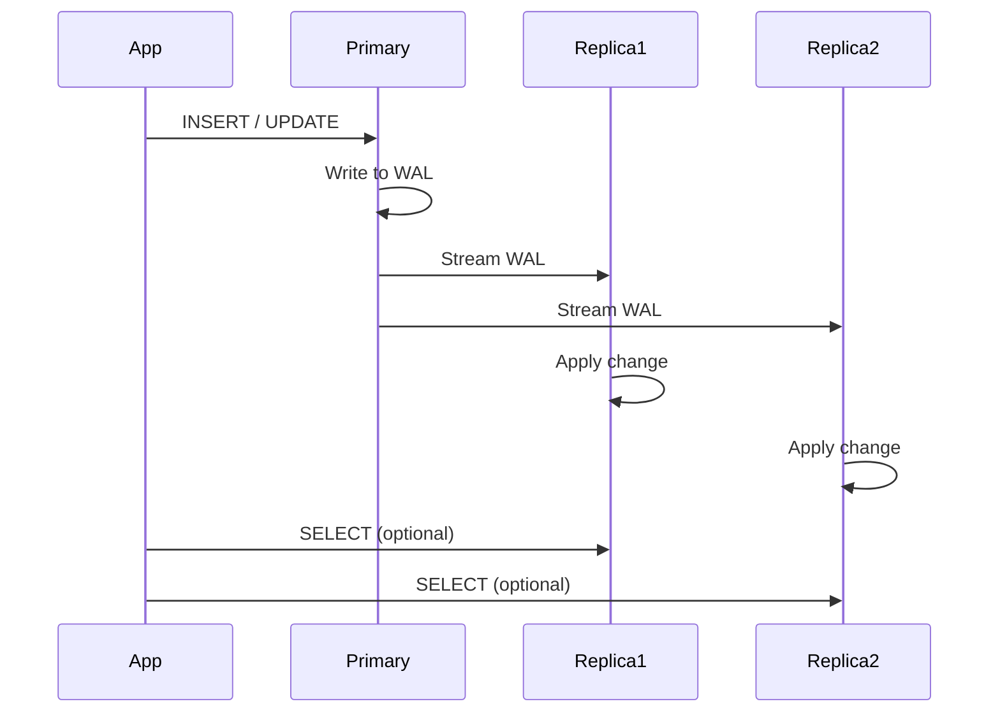

<!-- Generated by Groq via GitHub Actions -->
<!-- Topic ID: T037 -->
<!-- Category: Databases -->
<!-- Generated at UTC: 2026-10-01T07:22:07.523690+00:00 -->

# Replication

## 1. What problem does this solve?

**Motivation**  
In a real‑world backend you rarely have a single database instance that can serve all traffic, guarantee uptime, and provide fast reads for users spread across the globe. Replication solves the problem of **availability, scalability, and disaster recovery** by maintaining multiple copies of the same data.

**What problem exists**  
- A single database node is a single point of failure.  
- As traffic grows, a single node can become a bottleneck for reads or writes.  
- Geographic latency hurts users far from the data center.  
- Backups can be slow and may lock the database.

**Why the problem matters**  
- Downtime costs money and erodes user trust.  
- Slow queries degrade the user experience.  
- Data loss can be catastrophic for business continuity.

**What happens if this concept is not used**  
- The application will crash when the database goes down.  
- Users will experience high latency or timeouts.  
- Scaling becomes difficult; you’ll need to sharding or sharding‑like solutions.

**Where this concept appears in real backend systems**  
- PostgreSQL streaming replication for HA clusters.  
- MongoDB replica sets for read scaling and failover.  
- Redis Sentinel or Cluster for high‑availability caching.  
- Kafka mirrors for cross‑data‑center replication.  
- Cloud providers’ managed services (RDS, Cloud Spanner, DynamoDB) expose replication under the hood.

---

## 2. Mental model

**Analogy**  
Think of a library that keeps a single copy of every book. If the library burns down, all books are lost. Instead, you create **branch libraries** that hold copies of the same books. Patrons can go to any branch, and if one branch closes, the others still serve the books. The branches sync with each other so that new editions are distributed automatically.

**Engineering model**  
- **Primary (master)**: the source of truth for writes.  
- **Secondary (replica)**: copies of the primary’s data, usually read‑only.  
- **Replication protocol**: a stream of changes (transactions, oplogs, WAL) that the replica consumes to stay up‑to‑date.  
- **Consistency level**: how fresh the replica’s data is relative to the primary.

---

## 3. Deep explanation

### Internals
- **Write-Ahead Log (WAL)**: PostgreSQL writes every change to a WAL before applying it. Replicas replay the WAL to stay in sync.  
- **Oplog**: MongoDB’s operation log records each write operation. Replicas read the oplog.  
- **Change Streams**: Kafka topics or Redis streams that expose changes for downstream services.  

### Important terminology
| Term | Meaning |
|------|---------|
| **Primary / Master** | Node that accepts writes. |
| **Replica / Secondary** | Node that applies changes from the primary. |
| **Lag** | Time or number of operations the replica is behind the primary. |
| **Read‑only** | Replicas typically disallow writes to avoid conflicts. |
| **Failover** | Automatic promotion of a replica to primary when the primary fails. |
| **Consistency model** | `ReadCommitted`, `Snapshot`, `Linearizable`, etc. |
| **Topology** | How nodes are connected (e.g., master‑slave, multi‑master). |

### Trade‑offs
| Aspect | Replication | No replication |
|--------|-------------|----------------|
| **Availability** | High (failover possible) | Low (single point of failure) |
| **Read scalability** | Yes (read replicas) | No |
| **Write latency** | Slightly higher (log shipping) | Lower |
| **Consistency** | Depends on config (eventual vs strong) | Strong by default |
| **Operational complexity** | Medium‑high | Low |

### Failure modes
- **Network partition**: replicas may become isolated; writes may be lost if not handled.  
- **Stale reads**: replicas lag behind; read‑heavy services may serve outdated data.  
- **Promotion errors**: automatic failover may promote a replica that has not fully caught up.  
- **Data corruption**: if the replication stream is corrupted, replicas may diverge.

### Limitations
- **Write conflicts**: Multi‑master replication can lead to conflicts; requires conflict resolution.  
- **Latency**: Replication lag can be significant over long distances.  
- **Resource overhead**: Replicas consume CPU, memory, and storage.  
- **Complexity in schema migrations**: Must coordinate changes across replicas.

### Where it fits in a backend architecture
```
┌───────────────────────┐
│   Client (API) Layer  │
└────────────┬──────────┘
             │
             ▼
┌───────────────────────┐
│   Load Balancer / API │
└────────────┬──────────┘
             │
             ▼
┌───────────────────────┐
│  Application Servers  │
└────────────┬──────────┘
             │
             ▼
┌───────────────────────┐
│   Database Layer      │
│  Primary + Replicas   │
└───────────────────────┘
```
- The API layer routes reads to replicas and writes to the primary.  
- Replication keeps replicas in sync, enabling read scaling and failover.

### Interaction with related concepts
- **Caching**: Replicas can be used as cache backends for read‑heavy workloads.  
- **Sharding**: Replication can be combined with sharding to scale horizontally.  
- **Event sourcing**: Change streams can feed event buses.  
- **CI/CD**: Automated promotion scripts rely on replication status.

---

## 4. How it works

1. **Write**: Application sends a write to the primary.  
2. **Log**: Primary writes the change to its WAL/oplog.  
3. **Ship**: The WAL/oplog is streamed to each replica (often via a replication slot).  
4. **Apply**: Replica receives the log entry and applies the change to its local copy.  
5. **Confirm**: Replica acknowledges receipt; primary may log the success.  
6. **Read**: Clients read from replicas; the application may route reads based on latency or consistency needs.  
7. **Failover**: If the primary fails, a replica is promoted (via election or manual intervention).  



---

## 5. Practical implementation

Below is a minimal Node.js example using **pg** (PostgreSQL) to set up streaming replication via a replication slot.  
> **Prerequisites**: PostgreSQL 13+, Node.js 18+, `pg` npm package.

```ts
// replication.ts
import { Client } from 'pg';

/**
 * Connect to the primary PostgreSQL instance.
 * The user must have REPLICATION privilege.
 */
const primary = new Client({
  host: 'primary-db.example.com',
  port: 5432,
  user: 'replicator',
  password: 'secret',
  database: 'app',
  replication: 'database', // enable replication mode
});

/**
 * Create a replication slot if it doesn't exist.
 * This slot will stream WAL records to the replica.
 */
async function createSlot() {
  await primary.query(`
    SELECT * FROM pg_create_logical_replication_slot(
      'app_slot', 'pgoutput'
    )
  `).catch(err => {
    if (err.code !== '42710') { // duplicate_object
      throw err;
    }
  });
}

/**
 * Stream WAL records and apply them to the replica.
 * In a real system you would parse the messages and
 * apply them to a local PostgreSQL instance or a cache.
 */
async function stream() {
  await primary.query('START_REPLICATION SLOT app_slot LOGICAL 0/0');
  primary.on('data', (msg) => {
    console.log('Received WAL record:', msg);
    // TODO: Apply to replica
  });
  primary.on('error', (err) => console.error(err));
}

async function main() {
  await primary.connect();
  await createSlot();
  await stream();
}

main().catch(console.error);
```

**Key points**

- `replication: 'database'` tells `pg` to open a replication connection.  
- `pg_create_logical_replication_slot` creates a logical slot that streams changes in a format you can parse (`pgoutput`).  
- The `START_REPLICATION` command initiates the stream; the client receives binary WAL records.  
- In production you would forward these records to a replica or a downstream service (e.g., Redis cache, Kafka topic).

---

## 6. Production considerations

| Concern | What to watch for | Mitigation |
|---------|-------------------|------------|
| **Scalability** | Replicas can become bottlenecks if too many read requests hit a single node. | Use read‑load balancers, add more replicas, or use read‑scaling features (e.g., PostgreSQL read replicas with connection pooling). |
| **Reliability** | Network partitions can cause replicas to fall behind or lose sync. | Monitor replication lag, set up alerts, use synchronous replication for critical writes. |
| **Security** | Replication traffic may expose sensitive data. | Encrypt replication traffic (SSL/TLS), restrict replication users, use firewall rules. |
| **Observability** | Hard to detect subtle lag or data divergence. | Expose metrics (`pg_stat_replication`, `pg_stat_wal_receiver`), use Prometheus exporters. |
| **Performance** | Replication can add CPU/memory overhead on the primary. | Tune WAL settings (`wal_buffers`, `commit_delay`), use asynchronous replication for non‑critical data. |
| **Error handling** | Failed replication slots or corrupted WAL can halt replication. | Implement retry logic, monitor slot status, use `pg_basebackup` for recovery. |
| **Resource usage** | Replicas consume disk space for WAL. | Clean up old WAL files, use `wal_keep_segments` appropriately. |
| **Operational concerns** | Manual failover can be error‑prone. | Automate with tools like Patroni, Stolon, or cloud‑managed failover. |
| **Deployment** | Rolling updates may break replication if not coordinated. | Use blue‑green deployments, keep replication slots alive during upgrades. |

---

## 7. Common mistakes

| Mistake | Why it’s problematic |
|---------|----------------------|
| **Assuming replicas are always fresh** | Replication lag can be minutes; reads may return stale data. |
| **Using replicas for writes** | Conflicts, lost updates, or data corruption. |
| **Ignoring replication lag metrics** | Missed alerts for failing replicas, leading to data loss. |
| **Not securing replication connections** | Eavesdropping or unauthorized replication. |
| **Over‑provisioning replicas** | Wasted resources; unnecessary cost. |
| **Failing to test failover** | Production failover may fail silently. |
| **Using synchronous replication for all writes** | Unnecessary latency for non‑critical data. |
| **Not cleaning up old replication slots** | Disk space exhaustion. |

---

## 8. Senior engineer perspective

### Architecture decisions
- **Primary‑only vs. multi‑master**: Choose based on write concurrency and conflict tolerance.  
- **Synchronous vs. asynchronous replication**: Balance latency vs. durability.  
- **Topology**: Single primary with many replicas, or a ring of primaries (e.g., Galera).  
- **Geographic placement**: Place replicas near users to reduce read latency.  

### Trade‑offs
- **Consistency vs. availability**: Strong consistency may require synchronous replication, hurting write latency.  
- **Cost vs. performance**: More replicas = higher cost but better read throughput.  

### Bottlenecks
- **Primary write throughput**: WAL generation can saturate CPU.  
- **Network bandwidth**: Large WAL streams can saturate links.  

### Failure scenarios
- **Network partition**: Use `pg_hba.conf` rules to prevent split‑brain.  
- **Replica corruption**: Detect via checksums, rebuild with `pg_basebackup`.  

### Monitoring
- `pg_stat_replication` (primary) and `pg_stat_wal_receiver` (replica).  
- Export metrics to Prometheus; alert on lag > threshold.  

### Cost/performance
- Cloud managed services (RDS, Cloud SQL) abstract replication but may charge per replica.  
- Self‑managed clusters give more control but require ops overhead.  

### When NOT to use replication
- **Write‑heavy, low‑latency workloads** where replication lag would be unacceptable.  
- **Highly dynamic schema changes** that cannot be applied consistently.  
- **Single‑tenant, small‑scale apps** where a single node suffices.  

---

## 9. Interview questions

| Level | Question | Answer points |
|-------|----------|---------------|
| Beginner | What is a replica in database replication? | Copy of the primary; usually read‑only; keeps data in sync via WAL/oplog. |
| Beginner | Why do we use replication instead of just scaling a single database node? | Avoid single point of failure; scale reads; provide failover; reduce latency. |
| Senior | Explain the difference between synchronous and asynchronous replication. | Synchronous waits for replica ack before commit; asynchronous does not; affects durability vs. latency. |
| Senior | How would you design a replication strategy for a globally distributed e‑commerce site? | Primary in one region, read replicas in each region; use asynchronous replication; consider eventual consistency; use CDN for static assets. |
| Scenario | A replica is lagging behind the primary by 5 minutes. What steps would you take to diagnose and resolve the issue? | Check network latency, disk I/O, CPU on replica; verify replication slot status; look at `pg_stat_replication`; consider increasing `max_wal_senders`; check for blocking queries; if persistent, rebuild replica. |

---

## 10. Hands‑on task

**Goal**: Set up a PostgreSQL primary and a replica in Docker, enable streaming replication, and verify that writes to the primary are visible on the replica.

**Steps**

1. Create a `docker-compose.yml` with two PostgreSQL services (`primary` and `replica`).  
2. Configure `primary` with `wal_level=logical`, `max_wal_senders=3`, and a replication user.  
3. In `replica`, set `hot_standby=on` and use `pg_basebackup` to initialize from `primary`.  
4. Write a small Node.js script that inserts a row into the primary and queries the replica.  
5. Observe replication lag via `pg_stat_replication`.  
6. Simulate a failover by stopping the primary and promoting the replica (use `pg_ctl promote`).  
7. Verify the application can still read/write after failover.

**Deliverables**  
- `docker-compose.yml`  
- Node.js script (`replication-demo.ts`)  
- README with instructions and screenshots of metrics.

---

## 11. Quick revision

- Replication keeps multiple database copies in sync via WAL/oplog streams.  
- **Primary** accepts writes; **replicas** apply changes and serve reads.  
- **Lag** is the delay between primary and replica; monitor it.  
- **Synchronous replication** guarantees durability but adds latency.  
- **Asynchronous replication** is faster but may lose recent writes on failure.  
- Replication slots prevent WAL truncation until replicas catch up.  
- Failover requires promoting a replica; use tools or manual `pg_ctl promote`.  
- Security: use SSL/TLS, restrict replication users, firewall.  
- Observability: `pg_stat_replication`, `pg_stat_wal_receiver`, Prometheus exporters.  
- Common pitfalls: stale reads, unprotected replication traffic, ignoring lag.

---

## 12. References

- PostgreSQL Replication Documentation: https://www.postgresql.org/docs/current/warm-standby.html  
- MongoDB Replica Sets: https://docs.mongodb.com/manual/core/replica-set/  
- Redis Sentinel: https://redis.io/docs/management/sentinel/  
- Kafka MirrorMaker: https://kafka.apache.org/documentation/#mirrormaker  
- Patroni for PostgreSQL HA: https://patroni.readthedocs.io/en/latest/  
- Prometheus PostgreSQL Exporter: https://github.com/prometheus-community/postgres_exporter  
- AWS RDS Replication: https://docs.aws.amazon.com/AmazonRDS/latest/UserGuide/USER_ReadRepl.html  

---
