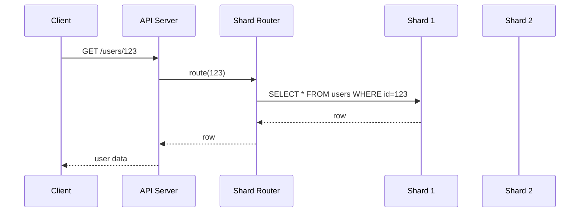

<!-- Generated by Groq via GitHub Actions -->
<!-- Topic ID: T039 -->
<!-- Category: Databases -->
<!-- Generated at UTC: 2026-10-01T18:58:22.020049+00:00 -->

# Sharding

## 1. What problem does this solve?

**Motivation**  
When a single database instance grows beyond its hardware limits—whether in storage, I/O, or query throughput—it becomes a bottleneck. A monolithic database can no longer serve the latency and throughput demands of a global user base or high‑volume analytics workloads.

**What problem exists**  
- **Capacity limits**: A single PostgreSQL or MongoDB node can only hold a few terabytes before disk I/O saturates.  
- **Performance limits**: Long‑running queries, heavy write traffic, or a high number of concurrent connections can degrade response times.  
- **Availability limits**: A single point of failure means the entire application goes down if that node crashes or needs maintenance.

**Why the problem matters**  
- Users experience slow or failed requests.  
- Revenue‑critical services (e.g., e‑commerce orders) stall.  
- Regulatory or SLA requirements for uptime and latency cannot be met.

**What happens if sharding is not used**  
- The database becomes a choke‑point.  
- Scaling vertically (more RAM, faster disks) eventually hits diminishing returns.  
- Operational costs rise sharply (e.g., buying a larger instance).  
- The system may need to be redesigned from scratch once limits are reached.

**Where this concept appears in real backend systems**  
- **Social networks**: User data spread across shards by user ID to balance load.  
- **E‑commerce**: Order tables sharded by region or order number to isolate high‑traffic periods.  
- **Analytics**: Time‑series data partitioned by time window across multiple nodes.  
- **Gaming**: Player state distributed by shard key to reduce cross‑region latency.

---

## 2. Mental model

### Simple analogy  
Think of a library that suddenly gets 10 million books. If all books are stored on a single shelf, finding a title takes forever. Instead, the library splits books into sections (fiction, non‑fiction, science, etc.) and places each section on a different shelf. When someone asks for a book, the librarian directs them to the right shelf, speeding up the search.

### Precise engineering model  
- **Shard key**: A deterministic value (e.g., user ID, hash of a primary key) that determines which shard a row belongs to.  
- **Shard**: A logical or physical partition of the database—often a separate database instance or cluster.  
- **Routing layer**: Middleware that maps a request to the correct shard based on the shard key.  
- **Rebalancing**: Periodic redistribution of data when shards become unevenly loaded.

---

## 3. Deep explanation

### Internals
- **Horizontal partitioning**: Rows are distributed across multiple nodes; each node holds a subset of the data.  
- **Consistent hashing** (common in distributed key‑value stores) reduces data movement when nodes are added/removed.  
- **Range partitioning** (e.g., by ID ranges) is simple but can lead to hotspots if the key distribution is skewed.  
- **Hash partitioning** distributes keys uniformly but makes range queries expensive.

### Important terminology
- **Shard key** – the column(s) used to decide shard placement.  
- **Shard map** – metadata mapping keys to shard endpoints.  
- **Cross‑shard query** – a query that needs data from multiple shards (often expensive).  
- **Rebalancer** – tool that moves data between shards to balance load.  
- **Hot shard** – a shard that receives a disproportionate amount of traffic.

### Trade‑offs
| Aspect | Hash partitioning | Range partitioning |
|--------|-------------------|--------------------|
| **Uniformity** | High | Low (depends on data) |
| **Range queries** | Expensive | Efficient |
| **Rebalancing** | Simple (add node → rehash) | Complex (move ranges) |
| **Hotspot risk** | Low | High |

### Failure modes
- **Shard loss**: If a node crashes and data is not replicated, data is lost.  
- **Routing failure**: Misconfigured shard map can route to wrong node.  
- **Rebalancing race**: Concurrent writes during data migration can lead to lost updates.  
- **Hot shard**: One shard becomes a bottleneck, causing overall latency spikes.

### Limitations
- **Complexity**: Requires a routing layer, consistent hashing, and careful monitoring.  
- **Cross‑shard joins**: Not natively supported; often need application‑level aggregation.  
- **Data consistency**: Strong consistency across shards is hard; many systems opt for eventual consistency.  
- **Operational overhead**: More nodes mean more backups, monitoring, and network traffic.

### Where this concept fits in a backend architecture
```
┌───────────────────────┐
│  Client (Next.js)     │
└─────────────┬─────────┘
              │
          HTTP API (FastAPI/Express)
              │
          ┌────▼────┐
          │ Router  │  <-- Shard router
          └────┬────┘
               │
      ┌────────▼────────┐
      │  Shard 1 (PG)   │
      ├─────────────────┤
      │  Shard 2 (PG)   │
      └─────────────────┘
```
The router sits between the API and the shards, translating a request into a target shard based on the shard key.

### Interaction with related backend concepts
- **Replication**: Each shard is usually replicated for HA.  
- **Caching**: Redis or in‑memory caches can sit per shard to reduce read load.  
- **Message queues**: Kafka topics can be partitioned in sync with database shards for event sourcing.  
- **Observability**: Distributed tracing must propagate shard identifiers.

---

## 4. How it works

1. **Client request** includes a shard key (e.g., `userId`).  
2. **Router** receives the request, looks up the shard map to find the target node.  
3. **Router forwards** the request (or query) to the shard.  
4. **Shard processes** the query locally and returns the result.  
5. **Router aggregates** results if multiple shards were queried (rare for writes).  
6. **Response** is sent back to the client.



---

## 5. Practical implementation

Below is a minimal Node.js example using **PostgreSQL** shards and a simple **hash‑based router**.

### 5.1 Setup

Assume two PostgreSQL instances:

| Shard | Host | Port | DB |
|-------|------|------|----|
| 0     | 127.0.0.1 | 5432 | `app_shard_0` |
| 1     | 127.0.0.1 | 5433 | `app_shard_1` |

Create a table in each shard:

```sql
CREATE TABLE users (
  id BIGINT PRIMARY KEY,
  name TEXT NOT NULL,
  email TEXT UNIQUE NOT NULL
);
```

### 5.2 Router implementation

```ts
// router.ts
import { Pool } from 'pg';
import crypto from 'crypto';

const shards = [
  new Pool({ host: '127.0.0.1', port: 5432, database: 'app_shard_0' }),
  new Pool({ host: '127.0.0.1', port: 5433, database: 'app_shard_1' }),
];

// Simple hash function to pick shard
function getShardIndex(key: string | number): number {
  const hash = crypto.createHash('md5').update(String(key)).digest('hex');
  const intHash = parseInt(hash.slice(0, 8), 16);
  return intHash % shards.length;
}

export async function queryUser(id: number) {
  const idx = getShardIndex(id);
  const pool = shards[idx];
  const res = await pool.query('SELECT * FROM users WHERE id = $1', [id]);
  return res.rows[0];
}
```

### 5.3 API endpoint

```ts
// app.ts
import express from 'express';
import { queryUser } from './router';

const app = express();

app.get('/users/:id', async (req, res) => {
  const id = Number(req.params.id);
  if (isNaN(id)) return res.status(400).send('Invalid ID');

  try {
    const user = await queryUser(id);
    if (!user) return res.status(404).send('Not found');
    res.json(user);
  } catch (err) {
    console.error(err);
    res.status(500).send('Internal error');
  }
});

app.listen(3000, () => console.log('API listening on 3000'));
```

### 5.4 Running locally

```bash
# Start two PostgreSQL containers (or use local instances)
docker run -d --name pg0 -p 5432:5432 -e POSTGRES_PASSWORD=pass postgres
docker run -d --name pg1 -p 5433:5432 -e POSTGRES_PASSWORD=pass postgres

# Create databases and tables in each (use psql or a script)
# Then run the Node.js app
npm install express pg
node app.ts
```

Now `GET http://localhost:3000/users/42` will hit the appropriate shard.

---

## 6. Production considerations

| Concern | What to watch for | Mitigation |
|---------|-------------------|------------|
| **Scalability** | Shard count limits horizontal scaling | Use consistent hashing; add shards gradually |
| **Reliability** | Node failure → data loss | Replicate each shard (primary‑replica) |
| **Security** | Exposing shard credentials | Store secrets in Vault/Secrets Manager; use IAM roles |
| **Observability** | Hard to trace cross‑shard ops | Include shard ID in logs, use distributed tracing (OpenTelemetry) |
| **Performance** | Hot shards, network latency | Monitor shard load; auto‑scale shards; use local caching |
| **Error handling** | Partial failures | Implement retries with exponential backoff; circuit breakers |
| **Resource usage** | More nodes → more memory/disk | Use container orchestration (K8s) to manage resources |
| **Operational concerns** | Backup, restore, schema migrations | Run migrations per shard; use tools like Flyway or Liquibase |
| **Failure recovery** | Rebalancing during writes | Use two‑phase commit or write‑ahead logs; lock during migration |
| **Deployment** | Rolling updates across shards | Deploy new code to one shard at a time; keep API backward compatible |

---

## 7. Common mistakes

| Mistake | Why it’s bad |
|---------|--------------|
| **Choosing a poor shard key** (e.g., timestamp) | Creates hotspots; one shard gets all writes |
| **Ignoring replication** | Single point of failure; data loss |
| **Hard‑coding shard map** | No dynamic rebalancing; stale routing |
| **Cross‑shard joins in application code** | Performance hit; complex error handling |
| **Not sharding read replicas** | Read traffic still hits primary shards |
| **Skipping monitoring** | Hard to detect uneven load or failing shards |
| **Over‑sharding early** | Adds complexity without performance benefit |
| **Using range sharding without data analysis** | Skewed ranges lead to hot shards |

---

## 8. Senior engineer perspective

### What changes at scale
- **Architecture decisions**: Decide between *shared‑schema* (same tables on all shards) vs *sharded‑schema* (different tables per shard).  
- **Consistency model**: Strong consistency across shards is expensive; many systems adopt eventual consistency with conflict resolution.  
- **Data migration strategy**: Use *online* rebalancing tools (e.g., Vitess, Citus) to avoid downtime.  
- **Observability**: Implement distributed tracing that propagates shard IDs; set up alerts for shard latency spikes.  
- **Cost/performance**: Evaluate whether sharding is cheaper than vertical scaling; consider cloud provider pricing for multi‑region shards.  

### Design decisions
- **Shard key selection**: Must be *stable* (never changes) and *uniform*.  
- **Number of shards**: Start with a small, manageable number; plan for linear scaling.  
- **Replication factor**: 2x or 3x replicas per shard for HA.  
- **Backup strategy**: Snapshot each shard independently; use incremental backups.  
- **Failover**: Automatic promotion of replicas; use a load balancer that can detect failed shards.  

### Bottlenecks
- **Network**: Cross‑region shards increase latency.  
- **Routing layer**: Must be highly available; consider caching shard map in memory.  
- **Write amplification**: Replication + sharding can double write traffic.  

### Failure scenarios
- **Shard node crash**: Replica takes over; client retries.  
- **Shard map corruption**: Route to wrong shard → data inconsistency; detect via checksum.  
- **Rebalancing failure**: Partial data movement → duplicate or missing rows; use transactional migration.  

### When NOT to use sharding
- Small datasets (< 10 GB) where a single node suffices.  
- Workloads dominated by complex joins across many tables (cross‑shard joins are costly).  
- Strict ACID requirements that cannot tolerate eventual consistency.  

---

## 9. Interview questions

1. **Beginner**: *What is a shard key and why is it important?*  
   *Answer*: A shard key is the column(s) used to decide which shard a row belongs to. It ensures uniform data distribution and determines routing.

2. **Beginner**: *Explain the difference between hash partitioning and range partitioning.*  
   *Answer*: Hash partitions distribute rows uniformly using a hash of the key, good for writes but bad for range queries. Range partitions group contiguous key values, efficient for range queries but can create hotspots if data is skewed.

3. **Senior**: *How would you design a sharding strategy for a global e‑commerce platform that needs to support both high write throughput and real‑time analytics?*  
   *Answer*: Use hash sharding on order IDs for write scalability, replicate each shard for HA, and maintain a separate analytics cluster that ingests events via Kafka partitions aligned with shards. Use materialized views or a data warehouse for analytics.

4. **Senior**: *Describe a scenario where a cross‑shard join becomes a bottleneck and how you would mitigate it.*  
   *Answer*: Joining user profiles (sharded by user ID) with orders (sharded by order ID) requires fetching data from multiple shards. Mitigation: denormalize by storing a copy of user data in the orders shard, or use a distributed query engine (e.g., Presto) that can aggregate across shards efficiently.

5. **Scenario/Debugging**: *During a recent deployment, a user reported that their profile updates were not visible for 30 minutes. Logs show that writes were routed to shard 2, but reads went to shard 1. What could be the cause and how would you fix it?*  
   *Answer*: Likely the shard map was stale or the routing layer had a caching issue. Verify that the shard map is refreshed after deployment, clear any in‑memory cache, and ensure that the routing logic uses the same shard key extraction for both reads and writes. Add a health check to detect stale routing.

---

## 10. Hands‑on task

**Task**: Add *read‑replica* support to the existing router.

1. Spin up a read replica for each shard (e.g., PostgreSQL streaming replica).  
2. Modify `router.ts` to route `SELECT` queries to replicas and `INSERT/UPDATE/DELETE` to primaries.  
3. Add a simple health check endpoint `/health` that verifies connectivity to all shards and replicas.  
4. Write a test that inserts a user, reads it back, and asserts the read came from a replica.

---

## 11. Quick revision

- Sharding = horizontal partitioning of data across multiple nodes.  
- **Shard key**: deterministic value that maps a row to a shard.  
- **Hash vs. range partitioning**: trade‑offs between uniformity and range query efficiency.  
- **Routing layer**: central component that directs requests to the correct shard.  
- **Replication**: each shard usually has replicas for HA.  
- **Cross‑shard queries** are expensive; avoid or denormalize.  
- **Consistent hashing** minimizes data movement during scaling.  
- **Observability**: include shard ID in logs, use distributed tracing.  
- **Common pitfalls**: bad shard key, hard‑coded shard map, ignoring replication.  
- **Senior considerations**: consistency model, rebalancing strategy, cost vs. performance.  
- **Deployment**: rolling updates, health checks, automated failover.

---

## 12. References

- PostgreSQL sharding guide: https://www.postgresql.org/docs/current/sharding.html  
- MongoDB sharding documentation: https://docs.mongodb.com/manual/sharding/  
- Vitess sharding architecture: https://vitess.io/docs/architecture/  
- Consistent hashing explanation: https://en.wikipedia.org/wiki/Consistent_hashing  
- OpenTelemetry for distributed tracing: https://opentelemetry.io/docs/  

---
