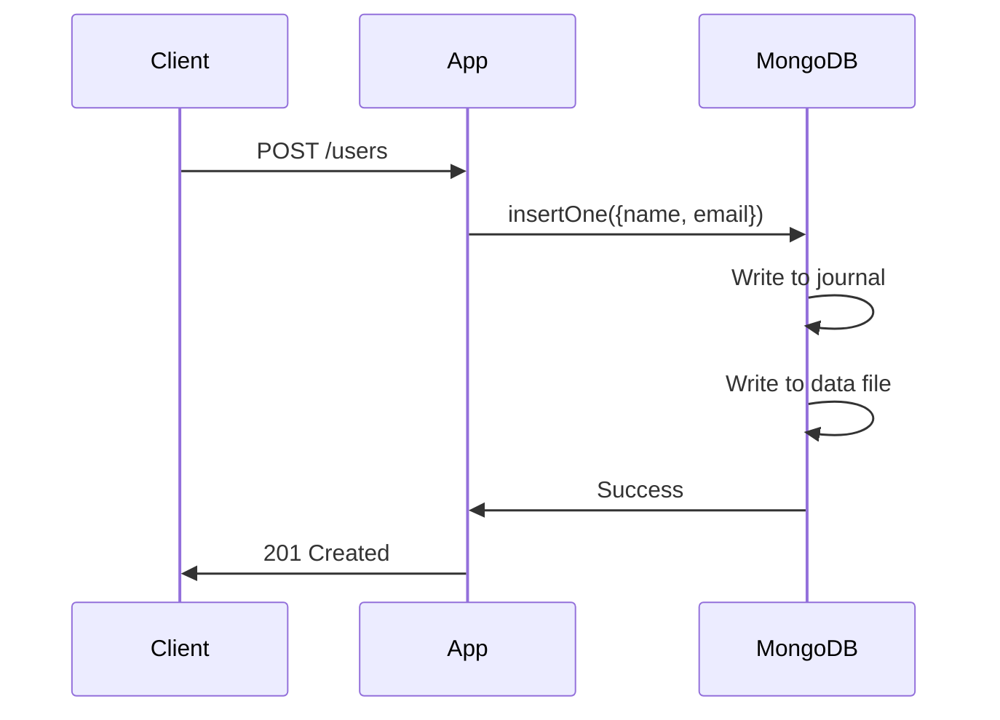
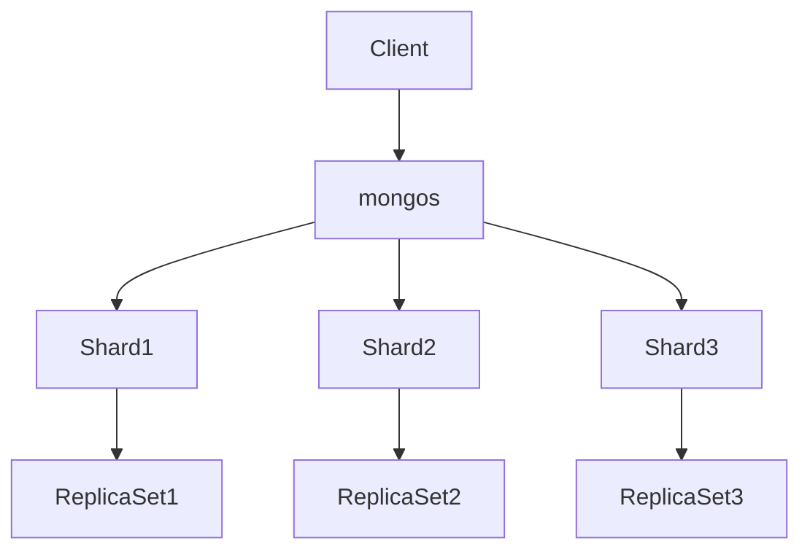

<!-- Generated by Groq via GitHub Actions -->
<!-- Topic ID: T040 -->
<!-- Category: Databases -->
<!-- Generated at UTC: 2026-10-01T18:58:22.020049+00:00 -->

# MongoDB

## 1. What problem does this solve?

**Motivation**  
Modern web services need to store large amounts of semi‑structured data that evolve over time. Traditional relational databases force a rigid schema, which can slow development and make it hard to add new fields or change data shapes. MongoDB is a **document‑oriented NoSQL database** that stores JSON‑like documents, allowing developers to model data naturally and change it without costly migrations.

**The problem**  
- **Schema rigidity** in SQL forces migrations for every new field.  
- **Fixed column types** make it hard to store heterogeneous data.  
- **Scaling read/write traffic** often requires sharding or read replicas, which are complex to set up in relational systems.

**Why it matters**  
- Faster feature iteration: add a new field without altering tables.  
- Better fit for nested data (e.g., user profile with address, preferences).  
- Horizontal scalability: shard data across many servers for high throughput.

**What happens if not used**  
- Development slows due to schema migrations.  
- Legacy systems may become bottlenecks when traffic spikes.  
- Teams may need to maintain complex ETL pipelines to keep data in sync.

**Real‑world appearance**  
- Content management systems storing articles with varying metadata.  
- E‑commerce platforms storing product catalogs with optional attributes.  
- Logging services that ingest arbitrary event payloads.

---

## 2. Mental model

**Analogy**  
Think of MongoDB as a **digital filing cabinet** where each drawer (collection) holds folders (documents). Each folder can have a different set of tabs (fields) and nested sub‑folders (embedded documents). You can pull out any folder without reorganizing the entire cabinet.

**Engineering model**  
- **Document**: a BSON object (JSON + binary types).  
- **Collection**: a logical grouping of documents, similar to a table but without enforced schema.  
- **Database**: a namespace for collections.  
- **Replica set**: a cluster of nodes that maintain copies of the same data for high availability.  
- **Sharding**: horizontal partitioning across multiple replica sets to scale out.

---

## 3. Deep explanation

### Internals
- **BSON**: Binary JSON, supports additional types (ObjectId, Date, Binary).  
- **WiredTiger**: Default storage engine; uses document‑level locking and compression.  
- **Indexing**: B‑tree indexes on fields; compound, hashed, text, geospatial.  
- **Write concern**: `w` and `j` options control durability.  
- **Read concern**: `local`, `majority`, `linearizable`.  
- **Transactions**: Multi‑document ACID transactions (since 4.0) across replica sets or sharded clusters.

### Important terminology
| Term | Meaning |
|------|---------|
| **Document** | BSON object stored in a collection. |
| **Collection** | Group of documents; no enforced schema. |
| **Index** | B‑tree structure to speed queries. |
| **Replica set** | Set of mongod instances that maintain the same data. |
| **Shard** | A subset of data in a sharded cluster. |
| **Chunk** | 64 MiB unit of data moved between shards. |
| **Write concern** | Guarantees about data durability. |
| **Read concern** | Guarantees about data consistency. |

### Trade‑offs
| Feature | Pros | Cons |
|---------|------|------|
| **Schema flexibility** | Rapid iteration | Risk of data inconsistency |
| **Embedded documents** | Fewer joins, faster reads | Document size limit (16 MiB) |
| **Sharding** | Horizontal scalability | Complexity, rebalancing overhead |
| **Transactions** | ACID guarantees | Performance hit, limited to replica sets/shards |
| **Indexing** | Fast queries | Extra storage, write overhead |

### Failure modes
- **Network partitions**: Replica set may split; majority write concern fails.  
- **Chunk migration stalls**: Shard balancing can block writes.  
- **Index corruption**: Rare but can cause query failures.  
- **Out‑of‑memory**: Large aggregation pipelines can exhaust RAM.

### Limitations
- **16 MiB document size**: Must split large data into multiple documents.  
- **No foreign key constraints**: Referential integrity must be enforced at application level.  
- **Limited join support**: `$lookup` is expensive; prefer embedding or denormalization.  
- **Write amplification**: WiredTiger writes to journal and data files.

### Where it fits in backend architecture
- **Data layer**: Stores user profiles, product catalogs, logs.  
- **Microservice data store**: Each service owns its own MongoDB cluster.  
- **Event sourcing**: Persist events as documents.  
- **Cache fallback**: Use Redis for hot reads, MongoDB for persistence.

### Interaction with related concepts
- **ORMs**: Mongoose, TypeORM (MongoDB driver).  
- **GraphQL resolvers**: Often fetch documents directly.  
- **CI/CD**: Deploy replica sets via Kubernetes operators.  
- **Observability**: Use MongoDB Atlas metrics or `mongostat`, `mongotop`.  

---

## 4. How it works

### CRUD request flow (Node.js + Mongoose)



### Sharding architecture



- `mongos` is the query router.  
- Each shard is a replica set.  
- Data is partitioned by shard key; chunks migrate between shards.

---

## 5. Practical implementation

### Setup

```bash
# Install MongoDB locally or use Atlas
npm install mongoose
```

### TypeScript example

```ts
// src/db.ts
import mongoose from 'mongoose';

const uri = process.env.MONGO_URI ?? 'mongodb://localhost:27017/myapp';

export async function connect() {
  await mongoose.connect(uri, {
    // Use the new URL parser and unified topology
    useNewUrlParser: true,
    useUnifiedTopology: true,
  });
  console.log('MongoDB connected');
}
```

```ts
// src/models/user.ts
import { Schema, model, Document } from 'mongoose';

export interface IUser extends Document {
  name: string;
  email: string;
  preferences?: Record<string, any>;
  createdAt: Date;
}

const UserSchema = new Schema<IUser>({
  name: { type: String, required: true, index: true },
  email: { type: String, required: true, unique: true, index: true },
  preferences: { type: Schema.Types.Mixed },
  createdAt: { type: Date, default: Date.now },
});

// Compound index for fast lookup by name and email
UserSchema.index({ name: 1, email: 1 });

export const User = model<IUser>('User', UserSchema);
```

```ts
// src/routes/user.ts
import express from 'express';
import { User } from '../models/user';

const router = express.Router();

// Create
router.post('/', async (req, res) => {
  try {
    const user = await User.create(req.body);
    res.status(201).json(user);
  } catch (err) {
    res.status(400).json({ error: err.message });
  }
});

// Read
router.get('/:id', async (req, res) => {
  const user = await User.findById(req.params.id).lean();
  if (!user) return res.status(404).json({ error: 'Not found' });
  res.json(user);
});

// Update
router.patch('/:id', async (req, res) => {
  const user = await User.findByIdAndUpdate(req.params.id, req.body, {
    new: true,
  }).lean();
  if (!user) return res.status(404).json({ error: 'Not found' });
  res.json(user);
});

// Delete
router.delete('/:id', async (req, res) => {
  const result = await User.deleteOne({ _id: req.params.id });
  if (result.deletedCount === 0)
    return res.status(404).json({ error: 'Not found' });
  res.status(204).send();
});

export default router;
```

```ts
// src/index.ts
import express from 'express';
import { connect } from './db';
import userRoutes from './routes/user';

const app = express();
app.use(express.json());

app.use('/users', userRoutes);

connect().then(() => {
  app.listen(3000, () => console.log('Server listening on 3000'));
});
```

**Key points**

- `mongoose.connect` uses the new topology engine for better failover.  
- Indexes are declared in the schema; MongoDB automatically builds them.  
- `lean()` returns plain JavaScript objects, improving read performance.  
- Error handling is minimal; production code should use a middleware.

### Aggregation example

```ts
// src/routes/user.ts (add a new route)
router.get('/stats', async (req, res) => {
  const stats = await User.aggregate([
    { $group: { _id: null, total: { $sum: 1 }, avgAge: { $avg: '$age' } } },
  ]);
  res.json(stats[0] ?? { total: 0, avgAge: null });
});
```

---

## 6. Production considerations

| Concern | What to do |
|---------|------------|
| **Scalability** | Use replica sets for HA; shard large collections; choose a shard key that distributes writes evenly. |
| **Reliability** | Enable write concern `majority`; monitor replica set elections; keep backups (point‑in‑time). |
| **Security** | Enable TLS; use role‑based access control; enable authentication (`SCRAM-SHA-256`). |
| **Observability** | Export metrics (`mongostat`, `mongotop`); use Atlas or Prometheus exporters; log slow queries. |
| **Performance** | Keep documents < 16 MiB; use indexes; avoid `$where`; cache hot queries in Redis. |
| **Error handling** | Catch `MongoError` codes (`DuplicateKey`, `WriteConcernFailed`). |
| **Resource usage** | Monitor WiredTiger cache; tune `wiredTigerCacheSizeGB`. |
| **Operational concerns** | Use Kubernetes StatefulSets or managed services; automate rolling upgrades. |
| **Failure recovery** | Plan for split brain; use `rs.stepDown()`; test failover scenarios. |
| **Deployment** | Use CI to run `mongodump`/`mongorestore` for migrations; keep schema changes backward compatible. |

---

## 7. Common mistakes

| Mistake | Why it’s problematic |
|---------|----------------------|
| **No indexes on query fields** | Linear scans → slow queries, high CPU. |
| **Using `findOneAndUpdate` without `new:true`** | Returns old document, confusing API. |
| **Ignoring document size limit** | Insert fails; data loss. |
| **Storing large binary blobs in MongoDB** | Inefficient; use GridFS or external storage. |
| **Over‑embedding** | Documents grow too large; makes updates expensive. |
| **Not handling duplicate key errors** | Unhandled 11000 errors crash services. |
| **Using `ObjectId` as string everywhere** | Type mismatch; performance hit. |
| **Running heavy aggregations on production** | Locks collection; high memory usage. |

---

## 8. Senior engineer perspective

### Design decisions at scale

| Decision | Considerations |
|----------|----------------|
| **Shard key** | Must be high cardinality and frequently queried; avoid hot spots. |
| **Replica set size** | Minimum 3 for majority; consider 5 for read scaling. |
| **Index strategy** | Compound indexes for common query patterns; avoid too many indexes. |
| **Write concern** | `majority` for critical data; `w:1` for high throughput writes. |
| **Read concern** | `local` for latency; `majority` for consistency. |
| **Backup strategy** | Point‑in‑time backups; incremental restores. |
| **Monitoring** | Use Atlas or Prometheus; set alerts on `oplatency`, `wiredTigerCachePercent`. |
| **Cost** | Sharding adds storage overhead; replica set adds RAM. |
| **When NOT to use** | Highly relational data with strict foreign keys; real‑time analytics requiring joins. |

### Bottlenecks

- **Chunk migrations**: can stall writes during rebalancing.  
- **Index rebuilds**: expensive on large collections.  
- **Network latency**: cross‑region replica sets increase write latency.  

### Failure scenarios

- **Network partition**: majority write concern fails; fallback to local writes.  
- **Shard key collision**: many writes to same chunk → hot spot.  
- **Index corruption**: triggers `mongod` crash; requires repair.  

### Monitoring

- `mongostat` for ops/sec, insert/lookup rates.  
- `mongotop` for per‑collection read/write.  
- Atlas metrics: `writeLatency`, `readLatency`, `storageSize`.  

---

## 9. Interview questions

1. **Beginner** – *What is a MongoDB document and how does it differ from a SQL row?*  
   *Answer:* A document is a BSON object that can contain nested objects and arrays; no fixed schema, unlike a SQL row which has a predefined set of columns.

2. **Beginner** – *Why do we need indexes in MongoDB?*  
   *Answer:* Indexes speed up queries by allowing the engine to locate documents without scanning the entire collection; without them, queries are linear scans.

3. **Senior** – *Explain how you would choose a shard key for a collection that stores user activity logs.*  
   *Answer:* The shard key should have high cardinality and be part of the most common query patterns. For logs, a composite key of `userId` and `timestamp` or just `userId` can distribute writes evenly; avoid keys that cause hot chunks.

4. **Senior** – *Describe the trade‑offs between embedding and referencing in MongoDB documents.*  
   *Answer:* Embedding reduces read latency and eliminates joins but can lead to large documents and duplicate data. Referencing keeps documents small and normalizes data but requires multiple queries or `$lookup`, which is expensive.

5. **Scenario/Debugging** – *A production deployment shows a sudden spike in `oplatency` and many `WriteConcernFailed` errors. What could be causing this and how would you investigate?*  
   *Answer:* Possible causes: network partition, replica set election, insufficient majority nodes, or disk I/O bottleneck. Investigate by checking `rs.status()`, reviewing `mongod.log` for `writeConcern` failures, monitoring disk I/O, and ensuring all nodes are healthy.

---

## 10. Hands‑on task

**Task**: Build a simple “Task Manager” microservice.

1. **Schema**: `Task` document with fields `title`, `description`, `status` (`todo`, `in_progress`, `done`), `assigneeId`, `createdAt`, `updatedAt`.  
2. **Endpoints**: CRUD + `/tasks/summary` that returns counts per status.  
3. **Indexes**: Compound index on `assigneeId` + `status`.  
4. **Transactions**: When moving a task from `todo` to `done`, also update a `User` document’s `completedTasks` counter in a transaction.  
5. **Deployment**: Run the service locally with Docker Compose, including a MongoDB replica set.  
6. **Observability**: Expose `/metrics` endpoint that outputs Prometheus metrics for request latency and MongoDB ops.

**Deliverables**:  
- `docker-compose.yml` with MongoDB replica set.  
- TypeScript code for service and models.  
- README with instructions to run and test.

---

## 11. Quick revision

- MongoDB stores **documents** (BSON) in **collections**; no enforced schema.  
- **Indexes** (B‑tree) are essential for query performance.  
- **Replica sets** provide HA; **sharding** provides horizontal scaling.  
- **Write concern** (`w`, `j`) controls durability; **read concern** (`local`, `majority`) controls consistency.  
- **Transactions** are ACID across multiple documents/collections (since 4.0).  
- **Document size limit**: 16 MiB; use GridFS for larger files.  
- **Embedding vs. referencing**: trade‑off between read speed and data duplication.  
- **Shard key** must be high cardinality and part of query patterns.  
- **Monitoring**: `mongostat`, `mongotop`, Atlas metrics, Prometheus exporters.  
- **Common pitfalls**: missing indexes, ignoring duplicate key errors, over‑embedding, not handling write concerns.

---

## 12. References

- https://docs.mongodb.com/manual/  
- https://docs.mongodb.com/manual/core/indexes/  
- https://docs.mongodb.com/manual/core/sharding/  
- https://docs.mongodb.com/manual/core/replica-set/  
- https://docs.mongodb.com/manual/core/transactions/  
- https://docs.mongodb.com/manual/reference/method/db.collection.aggregate/  
- https://docs.mongodb.com/manual/reference/method/db.collection.findOneAndUpdate/  
- https://docs.mongodb.com/manual/reference/method/db.collection.createIndex/  
- https://docs.mongodb.com/manual/reference/command/rs.status/  
- https://www.mongodb.com/docs/atlas/monitoring/metrics/  

---
