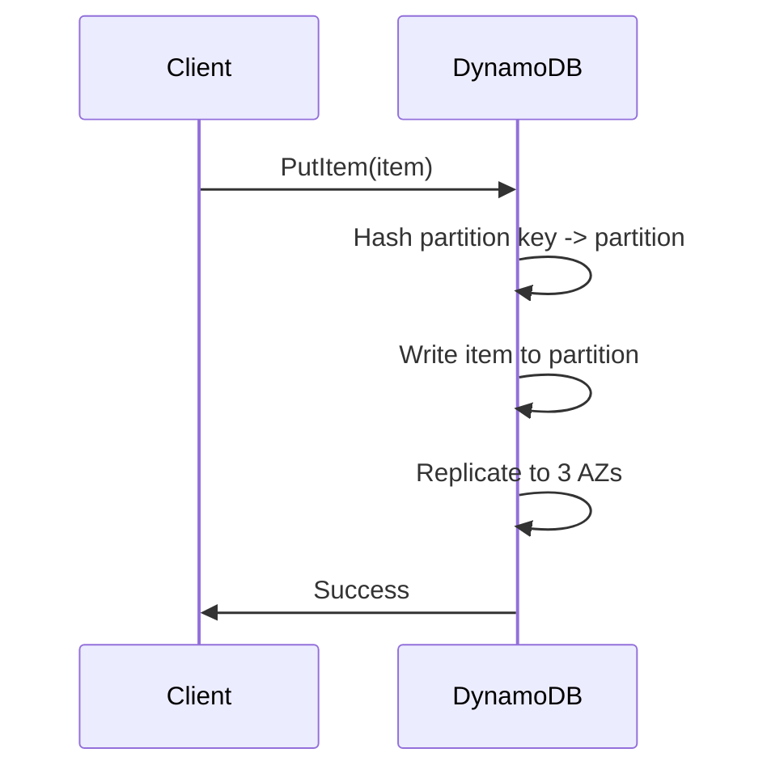
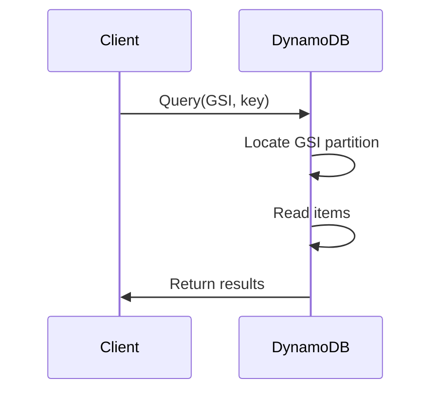

<!-- Generated by Groq via GitHub Actions -->
<!-- Topic ID: T041 -->
<!-- Category: Databases -->
<!-- Generated at UTC: 2026-10-02T07:10:19.453609+00:00 -->

# DynamoDB concepts

## 1. What problem does this solve?

| Problem | Why it matters | Consequence of not using | Real‑world use case |
|---------|----------------|--------------------------|---------------------|
| **Horizontal scaling of a key‑value store** | Modern web apps (gaming, IoT, real‑time analytics) need to handle millions of requests per second with sub‑millisecond latency. | You must build sharding, replication, and failover yourself, which is error‑prone and costly. | A multiplayer game server that stores player state across regions. |
| **Managed, highly available storage** | Operational overhead (patching, backups, scaling) is a distraction for developers. | You spend engineering time on ops instead of features. | A SaaS product that stores user preferences. |
| **Flexible schema** | Applications evolve; adding new attributes shouldn't break existing code. | Schema migrations can be painful and risk downtime. | A data‑driven marketing platform that adds new campaign fields over time. |
| **Low‑latency reads/writes** | User experience degrades with high latency. | Users abandon the app or experience lag. | Real‑time chat or notification service. |

In production systems, DynamoDB is often the backbone for session stores, analytics pipelines, leaderboards, and any component that requires fast, scalable key‑value access.

---

## 2. Mental model

### Analogy: The Library

| DynamoDB concept | Library equivalent | What it does |
|------------------|--------------------|--------------|
| **Table** | Library | A collection of books. |
| **Item** | Book | A single record. |
| **Partition key** | Shelf identifier | Determines which shelf a book lives on. |
| **Sort key** | Book title | Orders books on the same shelf. |
| **Global Secondary Index (GSI)** | Alternate catalog | Lets you find books by author, genre, etc. |
| **Provisioned capacity** | Library staff hours | You decide how many staff (read/write units) to hire. |
| **On‑demand** | Pay‑per‑use | You pay only for the books you read or write. |

### Engineering model

* **Partition key** is hashed to a *partition* (a physical storage unit).  
* **Sort key** (optional) orders items within that partition.  
* **GSIs** create separate hash/sort key pairs that allow alternative query patterns.  
* **Capacity units** (RCU/WCU) quantify how many reads/writes per second you can perform.  
* **Consistency**: reads can be *eventual* (fast, cheap) or *strong* (slower, guaranteed).  
* **TTL** automatically deletes items after a timestamp.

---

## 3. Deep explanation

### Internals

1. **Partitioning** – DynamoDB distributes data across *partitions* using the partition key hash.  
2. **Replication** – Each partition is replicated across three Availability Zones (AZs).  
3. **SSD storage** – Low‑latency, high‑throughput.  
4. **Indexing** – GSIs are stored as separate tables; updates to the base table trigger writes to the index.  
5. **Capacity** –  
   * *Provisioned*: you specify read/write units; DynamoDB throttles if exceeded.  
   * *On‑Demand*: DynamoDB scales automatically; you pay per request.

### Important terminology

| Term | Meaning |
|------|---------|
| **Item** | A single record (JSON document). |
| **Attribute** | Key/value pair inside an item. |
| **Key schema** | Defines partition key (+ optional sort key). |
| **Capacity unit** | 1 RCU ≈ 4 KB strongly consistent read; 1 WCU ≈ 1 KB write. |
| **TTL** | Time‑to‑live; DynamoDB deletes items after the timestamp. |
| **Provisioned throughput** | Fixed RCU/WCU. |
| **Auto‑scaling** | Dynamically adjusts provisioned capacity. |
| **Consistent read** | Guarantees you see the latest data. |
| **Eventual read** | Faster, may lag by milliseconds. |
| **Transactional write** | ACID across up to 25 items. |

### Trade‑offs

| Choice | Pros | Cons |
|--------|------|------|
| **Provisioned** | Predictable cost, fine‑grained control | Requires capacity planning, risk of throttling |
| **On‑Demand** | No capacity planning, auto‑scales | Higher per‑request cost at high throughput |
| **Strong consistency** | Guarantees latest data | ~2× latency, higher RCU cost |
| **Eventual consistency** | Lower latency, cheaper | Data may be stale for a few milliseconds |
| **GSIs** | Flexible queries | Extra write cost, replication latency |
| **LSIs** | Query on sort key | Must be defined at table creation, limited to 5 per table |

### Failure modes

* **Throttling** – Exceeding RCU/WCU → `ProvisionedThroughputExceededException`.  
* **Hot partitions** – Poor key design → uneven load, throttling.  
* **Eventual consistency lag** – Reads may miss recent writes.  
* **Index replication lag** – GSIs may be out of sync for a few milliseconds.  
* **Item size > 400 KB** – Write fails (`ItemSizeTooLargeException`).  

### Limitations

* No joins or subqueries.  
* Max item size 400 KB.  
* Max 10 GB per partition.  
* Limited query patterns (must use key or index).  
* No server‑side joins or aggregations (use Athena or Redshift for analytics).  

### Where it fits

* **Microservice data store** – per‑service tables.  
* **Session store** – TTL for automatic cleanup.  
* **Analytics** – Append‑only logs, later exported to S3/Redshift.  
* **Event sourcing** – Append events, read by event ID.  

### Interaction with other backend concepts

| Backend concept | Interaction |
|-----------------|-------------|
| **Caching (Redis)** | Cache hot items; fall back to DynamoDB on miss. |
| **Message queues (Kafka)** | Write events to DynamoDB; consume via stream. |
| **Relational DB** | Use DynamoDB for high‑throughput ops, Postgres for complex queries. |
| **GraphQL** | Resolve fields by querying DynamoDB. |
| **CI/CD** | Use CloudFormation/Terraform to deploy tables. |

---

## 4. How it works

### Request flow for a `PutItem`



### General flow for a `Query` with GSI



---

## 5. Practical implementation

Below is a minimal TypeScript example using **AWS SDK v3**.  
It demonstrates:

1. Creating a table with a partition key (`UserId`) and sort key (`Timestamp`).  
2. Adding a Global Secondary Index (`EmailIndex`).  
3. Performing `PutItem`, `Query`, and `Scan`.  
4. Using TTL.

```ts
// dynamodb-demo.ts
import {
  DynamoDBClient,
  CreateTableCommand,
  DeleteTableCommand,
  PutItemCommand,
  QueryCommand,
  ScanCommand,
  UpdateTimeToLiveCommand,
} from "@aws-sdk/client-dynamodb";
import { marshall, unmarshall } from "@aws-sdk/util-dynamodb";

const REGION = "us-east-1";
const client = new DynamoDBClient({ region: REGION });

const TABLE_NAME = "Users";
const GSI_NAME = "EmailIndex";

// 1️⃣ Create table
async function createTable() {
  const params = {
    TableName: TABLE_NAME,
    AttributeDefinitions: [
      { AttributeName: "UserId", AttributeType: "S" },
      { AttributeName: "Timestamp", AttributeType: "N" },
      { AttributeName: "Email", AttributeType: "S" },
    ],
    KeySchema: [
      { AttributeName: "UserId", KeyType: "HASH" },
      { AttributeName: "Timestamp", KeyType: "RANGE" },
    ],
    GlobalSecondaryIndexes: [
      {
        IndexName: GSI_NAME,
        KeySchema: [
          { AttributeName: "Email", KeyType: "HASH" },
          { AttributeName: "Timestamp", KeyType: "RANGE" },
        ],
        Projection: { ProjectionType: "ALL" },
        ProvisionedThroughput: { ReadCapacityUnits: 5, WriteCapacityUnits: 5 },
      },
    ],
    ProvisionedThroughput: { ReadCapacityUnits: 5, WriteCapacityUnits: 5 },
  };
  await client.send(new CreateTableCommand(params));
  console.log(`Table ${TABLE_NAME} created`);
}

// 2️⃣ Enable TTL on the 'ExpiresAt' attribute
async function enableTTL() {
  await client.send(
    new UpdateTimeToLiveCommand({
      TableName: TABLE_NAME,
      TimeToLiveSpecification: { AttributeName: "ExpiresAt", Enabled: true },
    })
  );
  console.log("TTL enabled");
}

// 3️⃣ Put an item
async function putUser(user: {
  UserId: string;
  Email: string;
  Name: string;
  ExpiresAt: number;
}) {
  const item = {
    UserId: { S: user.UserId },
    Timestamp: { N: Date.now().toString() },
    Email: { S: user.Email },
    Name: { S: user.Name },
    ExpiresAt: { N: user.ExpiresAt.toString() },
  };
  await client.send(new PutItemCommand({ TableName: TABLE_NAME, Item: item }));
  console.log(`User ${user.UserId} stored`);
}

// 4️⃣ Query by Email using GSI
async function queryByEmail(email: string) {
  const params = {
    TableName: TABLE_NAME,
    IndexName: GSI_NAME,
    KeyConditionExpression: "Email = :e",
    ExpressionAttributeValues: {
      ":e": { S: email },
    },
  };
  const result = await client.send(new QueryCommand(params));
  const users = result.Items?.map((i) => unmarshall(i));
  console.log(`Found ${users?.length ?? 0} users with email ${email}`);
  return users;
}

// 5️⃣ Scan the table (not recommended for large tables)
async function scanAll() {
  const result = await client.send(new ScanCommand({ TableName: TABLE_NAME }));
  const items = result.Items?.map((i) => unmarshall(i));
  console.log(`Scanned ${items?.length ?? 0} items`);
  return items;
}

// Example usage
(async () => {
  await createTable();
  await enableTTL();

  await putUser({
    UserId: "u123",
    Email: "alice@example.com",
    Name: "Alice",
    ExpiresAt: Math.floor(Date.now() / 1000) + 60 * 60, // 1 hour
  });

  await queryByEmail("alice@example.com");
  await scanAll();

  // Clean up
  await client.send(new DeleteTableCommand({ TableName: TABLE_NAME }));
  console.log(`Table ${TABLE_NAME} deleted`);
})();
```

> **Important lines**  
> *`AttributeDefinitions`* – must match key schema.  
> *`ProvisionedThroughput`* – sets RCU/WCU; adjust for load.  
> *`UpdateTimeToLiveCommand`* – TTL attribute name must be numeric epoch.  
> *`QueryCommand`* – uses GSI; otherwise you must query by primary key.

---

## 6. Production considerations

| Concern | What to do | Why it matters |
|---------|------------|----------------|
| **Scalability** | Use **on‑demand** for unpredictable traffic or **auto‑scaling** for predictable peaks. | Avoid throttling and cost spikes. |
| **Reliability** | Enable **point‑in‑time recovery** (PITR) and **continuous backups**. | Recover from accidental deletes or corruption. |
| **Security** | Apply **IAM policies** scoped to table, enable **encryption at rest** (default KMS), use **VPC endpoints**. | Protect data and meet compliance. |
| **Observability** | Monitor **ConsumedReadCapacityUnits**, **ConsumedWriteCapacityUnits**, **ThrottledRequests** via CloudWatch. Enable **AWS X-Ray** for request tracing. | Detect hot partitions, throttling, and performance regressions. |
| **Performance** | Use **strongly consistent reads** only when needed; otherwise default to eventual. Cache hot items in Redis. | Reduce latency and cost. |
| **Error handling** | Implement **retry with exponential backoff** for throttling. Use **`@aws-sdk/middleware-retry`**. | Graceful degradation. |
| **Resource usage** | Keep items < 400 KB; split large payloads into multiple items or use S3. | Avoid write failures and high RU consumption. |
| **Operational concerns** | Use **Infrastructure as Code** (CDK, Terraform). Automate **table updates** via CI/CD. | Reduce drift and manual errors. |
| **Failure recovery** | Test **PITR** and **cross‑region replication**. | Ensure business continuity. |
| **Deployment** | Deploy tables in the same region as your application to reduce latency. | Lower network hops. |

---

## 7. Common mistakes

| Mistake | Why it’s problematic |
|---------|----------------------|
| **Choosing a low‑cardinality partition key** (e.g., `status = "active"`) | Creates a hot partition; all writes go to one node → throttling. |
| **Storing large blobs (>400 KB)** | Write fails; DynamoDB rejects the item. |
| **Ignoring eventual consistency** | Reads may return stale data; leads to bugs in real‑time apps. |
| **Over‑provisioning capacity** | Unnecessary cost; DynamoDB charges per provisioned unit. |
| **Using `Scan` for frequent queries** | Reads the entire table → high RU consumption and latency. |
| **Not handling throttling** | Application crashes; no retry logic. |
| **Using GSIs without considering write amplification** | Each write updates the base table *and* the GSI → double the write cost. |
| **Leaving TTL disabled** | Orphaned items accumulate, increasing storage cost. |

---

## 8. Senior engineer perspective

### Architecture decisions

| Decision | Considerations |
|----------|----------------|
| **Provisioned vs On‑Demand** | On‑Demand is simpler but more expensive at high throughput. Provisioned + auto‑scaling gives cost control. |
| **Partition key design** | Must be *high cardinality* and *uniformly distributed*. Use composite keys or hash prefixes if needed. |
| **Index strategy** | GSIs for alternate query patterns; LSIs only if you need range queries on the same partition key. |
| **Data modeling** | Prefer *single‑table design* for related entities to reduce cross‑table joins. |
| **TTL usage** | Automate cleanup of session data; avoid manual deletes. |
| **Cross‑region replication** | For global apps, enable global tables or use DynamoDB Streams + Lambda to sync. |

### Trade‑offs & bottlenecks

* **Hot partitions** → throttle, high latency.  
* **Write amplification** → GSIs double write cost.  
* **Index replication lag** → eventual consistency across indexes.  
* **Large items** → high RU consumption, risk of failure.

### Failure scenarios

| Scenario | Mitigation |
|----------|------------|
| **AZ outage** | Replication across AZs; use global tables for cross‑region failover. |
| **Throttling** | Auto‑scaling, retry with backoff, redesign key. |
| **Data corruption** | Enable PITR, use DynamoDB Streams for audit. |

### Monitoring

* CloudWatch metrics: `ConsumedReadCapacityUnits`, `ConsumedWriteCapacityUnits`, `ThrottledRequests`.  
* CloudTrail logs for table changes.  
* X‑Ray traces for request latency.  
* Custom dashboards for hot partition detection.

### Cost/performance

* Estimate RU usage: `ReadCost = (StrongReadUnits * 4KB) + (EventualReadUnits * 4KB)`; `WriteCost = WriteUnits * 1KB`.  
* Use **reserved capacity** if traffic is predictable.  
* Avoid unnecessary GSIs; each GSI adds write cost.

### When NOT to use DynamoDB

* Complex relational queries (joins, multi‑row transactions).  
* Need for ACID across many items (>25).  
* Heavy analytical workloads (use Redshift or Athena).  
* Very small datasets that fit comfortably in memory or a relational DB.

---

## 9. Interview questions

| Level | Question | Key answer points |
|-------|----------|-------------------|
| **Beginner** | What is a partition key in DynamoDB? | Unique identifier that determines data placement; must be high cardinality. |
| **Beginner** | Explain the difference between eventual and strongly consistent reads. | Strong reads guarantee latest data (≈2× latency, higher RCU); eventual reads are faster, may lag. |
| **Senior** | How would you design a table to support queries by `UserId` and `Timestamp`? | Use composite key (`UserId` hash, `Timestamp` range); optionally add GSI on `Email`. |
| **Senior** | Discuss strategies to mitigate hot partitions. | Use hash prefixes, composite keys, randomization, or redesign schema to spread load. |
| **Scenario** | You have a table with 10 M items and notice write throttling. Diagnose and fix. | Check `ThrottledRequests`; examine partition key distribution; enable auto‑scaling or switch to on‑demand; add GSI if needed; consider sharding. |

---

## 10. Hands‑on task

**Build a session store**

1. Create a table `Sessions` with `SessionId` (partition key) and `ExpiresAt` (TTL).  
2. Add a GSI `UserIdIndex` on `UserId`.  
3. Implement `createSession(userId, data)` that writes a session with a 30‑minute TTL.  
4. Implement `getSession(sessionId)` and `getSessionsByUser(userId)`.  
5. Write a simple Express/Next.js API that uses these functions.  
6. Deploy locally with Docker and test with `curl` or Postman.

*Goal:* Understand TTL, GSIs, and basic CRUD in a real backend context.

---

## 11. Quick revision

- **Partition key** – distributes data; must be unique and high cardinality.  
- **Sort key** – orders items within a partition; enables range queries.  
- **GSIs** – alternate query patterns; each has its own capacity.  
- **LSIs** – same partition key, different sort key; limited to 5 per table.  
- **Provisioned vs On‑Demand** – capacity planning vs pay‑per‑use.  
- **RCU/WCU** – units of read/write throughput; 1 RCU ≈ 4 KB strongly consistent.  
- **Strong vs Eventual consistency** – trade‑off between latency and freshness.  
- **TTL** – automatic deletion of expired items.  
- **Hot partitions** – uneven load → throttling; mitigate with key design.  
- **Auto‑scaling** – dynamic capacity adjustment.  
- **PITR** – point‑in‑time recovery for accidental deletes.  
- **IAM & encryption** – secure access and data at rest.  

---

## 12. References

- [Amazon DynamoDB Developer Guide](https://docs.aws.amazon.com/amazondynamodb/latest/developerguide/Welcome.html)  
- [AWS SDK for JavaScript v3 – DynamoDB Client](https://docs.aws.amazon.com/AWSJavaScriptSDK/v3/latest/clients/client-dynamodb/index.html)  
- [DynamoDB Best Practices](https://docs.aws.amazon.com/amazondynamodb/latest/developerguide/best-practices.html)  
- [DynamoDB Capacity Modes](https://docs.aws.amazon.com/amazondynamodb/latest/developerguide/CapacityModes.html)  
- [DynamoDB Global Secondary Indexes](https://docs.aws.amazon.com/amazondynamodb/latest/developerguide/SecondaryIndexes.html)  
- [DynamoDB Time‑to‑Live (TTL)](https://docs.aws.amazon.com/amazondynamodb/latest/developerguide/TTL.html)  
- [DynamoDB Auto Scaling](https://docs.aws.amazon.com/amazondynamodb/latest/developerguide/AutoScaling.html)  
- [AWS CloudWatch Metrics for DynamoDB](https://docs.aws.amazon.com/amazondynamodb/latest/developerguide/Monitoring.html)  

---
