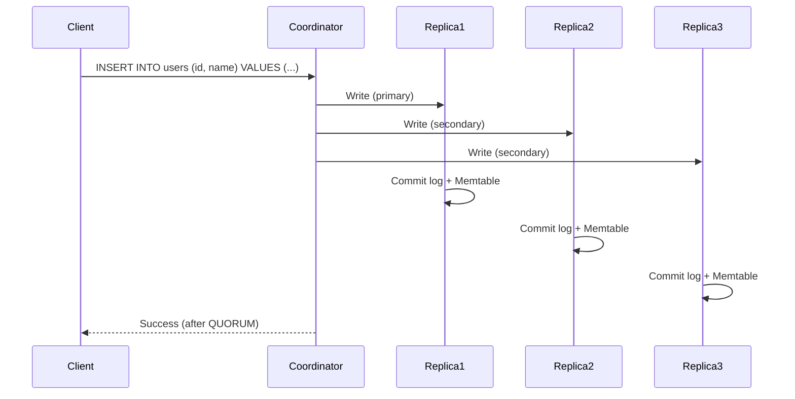
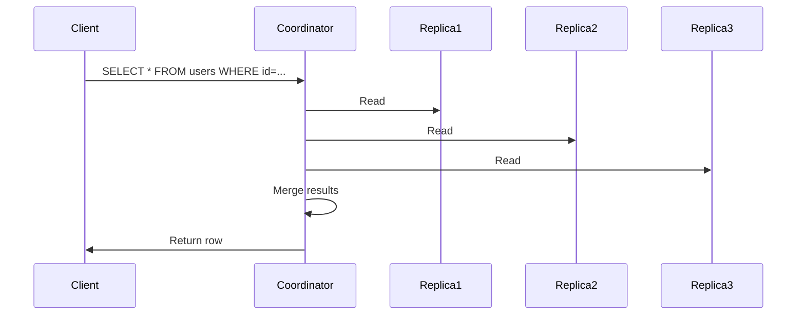
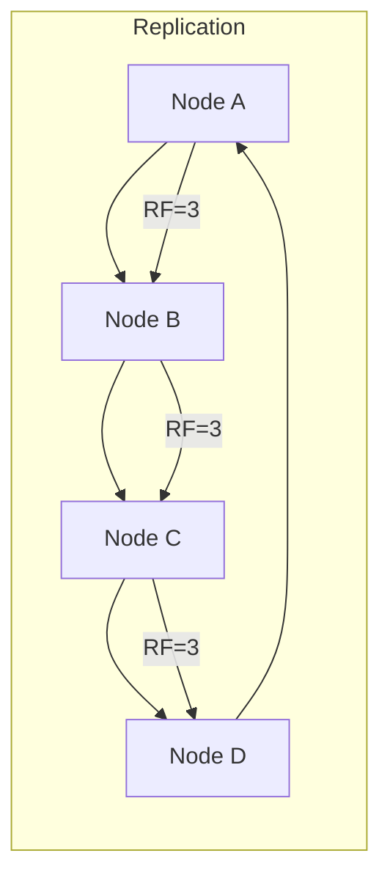

<!-- Generated by Groq via GitHub Actions -->
<!-- Topic ID: T042 -->
<!-- Category: Databases -->
<!-- Generated at UTC: 2026-10-02T07:10:19.453609+00:00 -->

# Cassandra concepts

## 1. What problem does this solve?

**Motivation**  
Modern web services often need to store millions of rows that are written and read by thousands of clients per second. Traditional relational databases struggle with horizontal scaling, high write throughput, and low-latency reads when the data size grows beyond a single machine. Cassandra was designed to solve these pain points:

- **Linear scalability** – add more nodes and throughput grows proportionally.
- **High write availability** – writes are fast and can continue even if some nodes are down.
- **Fault tolerance** – data is replicated across nodes; the system keeps working after failures.
- **Low‑latency reads** – data is partitioned so that a read hits a small subset of nodes.

**Why it matters**  
If you cannot scale writes or tolerate node failures, your service will become a bottleneck or crash under load. For example, a real‑time analytics platform that logs every user event must ingest millions of events per second; a single‑node database would become a choke point.

**Consequences of not using it**  
- **Write hotspots** – a single node becomes a bottleneck.
- **Single point of failure** – a node crash brings the whole service down.
- **Poor scalability** – adding more capacity requires sharding manually, which is error‑prone.

**Where it appears**  
- Social media feeds (e.g., Twitter’s timeline storage).
- IoT telemetry ingestion.
- Session stores for high‑traffic web apps.
- Real‑time metrics dashboards.

---

## 2. Mental model

### Analogy  
Think of Cassandra as a **distributed library** where each book (row) is stored on multiple shelves (nodes) in a way that:

1. **Shelves are arranged in a circle** – each shelf knows its next and previous shelf (consistent hashing).
2. **Books are duplicated** – each book appears on several shelves (replication factor).
3. **When you look for a book** – you ask the shelf that owns the book’s “address” (partition key). If that shelf is busy or down, you can ask the next shelf in line (tunable consistency).

This library can keep adding shelves without reorganizing all books, and if a shelf breaks, the books are still available on other shelves.

### Engineering model  
- **Nodes** – physical or virtual machines running Cassandra.
- **Cluster** – the set of nodes that share data.
- **Keyspace** – logical namespace (like a database) that defines replication strategy.
- **Table** – schema with partition key + clustering columns.
- **Partition key** – determines which node(s) hold a row.
- **Replication factor** – how many nodes store each row.
- **Consistency level** – how many replicas must acknowledge a read/write before it’s considered successful.

---

## 3. Deep explanation

### Internals

| Concept | What it is | How it works |
|---------|------------|--------------|
| **Partition key** | Hash of the key that maps to a token range. | Consistent hashing assigns each node a range of tokens; the partition key’s hash determines the primary replica. |
| **Replication** | Data is copied to *N* nodes (replication factor). | The *primary* node is the one whose token range contains the key; *secondary* replicas are the next *N-1* nodes in the ring. |
| **Consistency level** | Number of replicas that must respond. | `ONE`, `QUORUM`, `ALL`, etc. Determines trade‑off between latency and consistency. |
| **Write path** | Client → Coordinator → Replicas → Commit log → Memtable → SSTable. | Coordinator writes to all replicas asynchronously; commit log ensures durability. |
| **Read path** | Coordinator reads from replicas, merges results, optionally performs read repair. | Uses *tombstones* for deletions; read repair fixes stale replicas. |
| **Compaction** | Merges SSTables to reclaim space and improve read performance. | LSM‑tree based; compaction strategies (SizeTiered, Leveled, TimeWindow). |
| **Repair** | Anti‑entropy process that synchronizes replicas. | `nodetool repair` runs background compaction and streaming. |
| **Hinted handoff** | Stores a hint when a replica is down; later replayed. | Keeps write availability high. |
| **Read repair** | On read, if replicas disagree, the coordinator repairs the stale replica. | Occurs at read time; can be disabled for performance. |

### Important terminology

- **Token** – numeric value derived from partition key hash.
- **Ring** – logical circle of tokens representing the cluster.
- **Coordinator** – node that receives client request and orchestrates the operation.
- **Commit log** – write‑ahead log for durability.
- **Memtable** – in‑memory structure for writes before flushing to disk.
- **SSTable** – immutable sorted string table on disk.
- **Tombstone** – marker for deleted data.
- **Anti‑entropy** – process to reconcile differences between replicas.

### Trade‑offs

| Aspect | Trade‑off | Typical choice |
|--------|-----------|----------------|
| **Consistency vs. Latency** | Higher consistency → more replicas must respond → higher latency | `QUORUM` for most CRUD ops |
| **Replication factor** | More replicas → higher durability & availability → higher storage cost | 3 is common for production |
| **Compaction strategy** | SizeTiered → fast writes, slower reads; Leveled → fast reads, slower writes | Depends on write/read ratio |
| **Read repair** | Enables eventual consistency → extra network traffic | Enable for critical data |

### Failure modes

- **Node failure** – hinted handoff keeps writes alive; read repair fixes stale data.
- **Network partition** – can lead to *split brain* if consistency level is `ALL`; `QUORUM` mitigates.
- **Disk failure** – SSTable corruption; repair or rebuild needed.
- **Mis‑configured replication factor** – data may be lost if RF < 2.

### Limitations

- **No joins or foreign keys** – purely a key/value store with secondary indexes (limited).
- **Limited support for complex transactions** – only lightweight transactions (LWT) with `IF NOT EXISTS`.
- **Write amplification** – due to compaction and hinted handoff.
- **Tuning required** – many knobs (compaction, GC, caching) need careful tuning.

### Where it fits in a backend architecture

- **Data ingestion layer** – high‑throughput writes (e.g., event logging).
- **Session store** – TTL support, fast reads/writes.
- **Analytics** – time‑series data, counters.
- **Cache replacement** – when you need persistence with low latency.

### Interaction with related concepts

- **Caching** – often used alongside Redis; Cassandra for durable storage.
- **Message queues** – Kafka can feed data into Cassandra.
- **Microservices** – each service can own its own keyspace or share.
- **Observability** – metrics from `nodetool` and JMX; logs via `cassandra.yaml`.

---

## 4. How it works

### Write flow



### Read flow



### Cluster topology



---

## 5. Practical implementation

Below is a minimal Node.js example using the official `cassandra-driver`.  
It demonstrates keyspace creation, table creation, writes with different consistency levels, and reads.

```ts
// cassandra-demo.ts
import { Client, types } from 'cassandra-driver';

// 1️⃣ Connect to the cluster
const client = new Client({
  contactPoints: ['127.0.0.1'], // replace with your node IPs
  localDataCenter: 'datacenter1', // required for v4+ clusters
  keyspace: 'demo', // will be created if not exists
  queryOptions: { consistency: types.consistencies.quorum },
});

async function init() {
  // 2️⃣ Create keyspace (if it doesn't exist)
  await client.execute(`
    CREATE KEYSPACE IF NOT EXISTS demo
    WITH replication = {'class': 'SimpleStrategy', 'replication_factor': '3'}
  `);

  // 3️⃣ Create table
  await client.execute(`
    CREATE TABLE IF NOT EXISTS users (
      id uuid PRIMARY KEY,
      name text,
      email text,
      created_at timestamp
    )
  `);
}

// 4️⃣ Insert a user
async function insertUser(name: string, email: string) {
  const id = types.Uuid.random();
  await client.execute(
    'INSERT INTO users (id, name, email, created_at) VALUES (?, ?, ?, ?)',
    [id, name, email, new Date()],
    { consistency: types.consistencies.quorum } // write consistency
  );
  console.log(`Inserted user ${id}`);
  return id;
}

// 5️⃣ Read a user
async function getUser(id: types.Uuid) {
  const result = await client.execute(
    'SELECT * FROM users WHERE id = ?',
    [id],
    { consistency: types.consistencies.one } // read consistency
  );
  console.log('User:', result.rows[0]);
}

// 6️⃣ Run demo
(async () => {
  await init();
  const userId = await insertUser('Alice', 'alice@example.com');
  await getUser(userId);
  await client.shutdown();
})();
```

**Key points**

- `SimpleStrategy` is fine for single‑DC dev clusters; use `NetworkTopologyStrategy` in production.
- `consistency` can be overridden per query.
- `types.Uuid.random()` generates a unique partition key.
- The driver automatically handles retries and hinted handoff.

---

## 6. Production considerations

| Concern | What to watch for | Mitigation |
|---------|-------------------|------------|
| **Scalability** | Linear scaling requires consistent token distribution. | Use `token` assignment scripts or `nodetool repair` after adding nodes. |
| **Reliability** | Node failures, network partitions. | Use `QUORUM` or `LOCAL_QUORUM` consistency; enable hinted handoff. |
| **Security** | Unencrypted traffic, weak authentication. | Enable TLS, use `cassandra.yaml` authentication, restrict IPs. |
| **Observability** | Lack of metrics, slow queries. | Enable JMX, use `nodetool tpstats`, integrate with Prometheus. |
| **Performance** | Write amplification, GC pauses. | Tune compaction strategy, use `compaction_throughput_mb_per_sec`. |
| **Error handling** | `ReadTimeoutException`, `WriteTimeoutException`. | Retry policies, exponential backoff, fallback to read repair. |
| **Resource usage** | Disk I/O, memory. | Monitor SSTable size, enable caching for hot data. |
| **Operational concerns** | Rolling upgrades, backups. | Use `nodetool snapshot`, `nodetool flush`, plan for `rolling upgrade`. |
| **Failure recovery** | Data loss after RF < 2. | Keep RF ≥ 3, use anti‑entropy repair. |
| **Deployment** | Docker, Kubernetes. | Use `cassandra:4.0` image, configure `cassandra.yaml` via ConfigMap. |

---

## 7. Common mistakes

| Mistake | Why it’s problematic |
|---------|----------------------|
| **Using a single column as partition key for high‑cardinality data** | Creates a hotspot; all writes go to one node. |
| **Ignoring replication factor** | RF=1 means data loss on node failure. |
| **Choosing `ALL` consistency on writes** | Increases latency and can cause write failures during partitions. |
| **Not setting TTL on session data** | Stale data accumulates, consuming disk. |
| **Overusing secondary indexes** | They are slow and can cause full table scans. |
| **Using LWT (`IF NOT EXISTS`) for every write** | Adds a Paxos roundtrip, hurting performance. |
| **Not tuning compaction** | Leads to large SSTables, high read latency. |
| **Assuming Cassandra supports joins** | It does not; design denormalized tables. |

---

## 8. Senior engineer perspective

### Architecture decisions

- **Replication strategy** – `NetworkTopologyStrategy` for multi‑DC; set RF per DC.
- **Consistency levels** – `LOCAL_QUORUM` for cross‑DC reads; `QUORUM` for intra‑DC.
- **Compaction** – Leveled for read‑heavy workloads; SizeTiered for write‑heavy.
- **Schema design** – Denormalize; use composite partition keys for range queries.
- **Caching** – Enable key cache and row cache for hot data; monitor hit rates.

### Trade‑offs

- **Higher RF** → more storage, higher write latency, better durability.
- **Read repair** – can be disabled to reduce traffic but may leave stale replicas.
- **Batching** – use lightweight batches for atomicity; avoid large batches that lock nodes.

### Bottlenecks

- **Disk I/O** – SSDs mitigate, but compaction can still saturate.
- **Network** – large read repair traffic can saturate inter‑node links.
- **GC** – Java GC pauses; tune heap size and use G1/G1GC.

### Failure scenarios

- **Split brain** – mitigated by `QUORUM` and `LOCAL_QUORUM`.
- **Repair lag** – monitor `nodetool repair` progress; schedule nightly repairs.
- **Disk failure** – use RAID or erasure coding; rebuild node with `nodetool rebuild`.

### Monitoring

- **Metrics** – `cassandra.yaml` → `metrics` → Prometheus exporter.
- **Logs** – `system.log` for errors; `debug.log` for detailed tracing.
- **JMX** – `nodetool tpstats`, `nodetool status`.

### Cost/performance

- **Storage** – 3× data size for RF=3; consider compression.
- **Compute** – CPU for compaction; choose nodes with enough cores.
- **Network** – Inter‑DC traffic can be expensive; use `LOCAL_QUORUM`.

### When NOT to use

- **Transactional workloads** requiring ACID across multiple rows.
- **Complex analytics** needing joins or aggregations – use Spark/Presto on top.
- **Low write volume** – a simple relational DB may be cheaper.

---

## 9. Interview questions

1. **Beginner** – *What is a partition key in Cassandra and why is it important?*  
   *Answer:* Determines which node(s) store a row; critical for data distribution and avoiding hotspots.

2. **Beginner** – *Explain the difference between `QUORUM` and `ALL` consistency levels.*  
   *Answer:* `QUORUM` requires a majority of replicas to respond; `ALL` requires every replica, giving stronger consistency but higher latency.

3. **Senior** – *How does Cassandra achieve linear scalability, and what are the trade‑offs involved?*  
   *Answer:* Uses consistent hashing and replication; trade‑offs include increased storage (RF), write amplification, and eventual consistency.

4. **Senior** – *Describe how you would design a schema for a high‑write, read‑heavy time‑series table in Cassandra.*  
   *Answer:* Use a composite partition key (e.g., device_id + year_month) and clustering columns (timestamp) with appropriate TTL; choose Leveled compaction, enable row cache, set RF=3.

5. **Scenario/Debugging** – *A service using Cassandra reports `ReadTimeoutException` on a `SELECT` query. What could be causing this and how would you troubleshoot?*  
   *Answer:* Possible causes: node down, high latency, insufficient replicas, network partition. Troubleshoot by checking `nodetool status`, inspecting logs, verifying consistency level, monitoring GC pauses, and running `nodetool tpstats`.

---

## 10. Hands‑on task

**Task:** Build a simple “user activity log” service.

1. **Schema** – Create a table `user_activity` with partition key `user_id` and clustering column `activity_time`.  
2. **Write** – Expose an HTTP endpoint `/log` that accepts `{userId, activity}` and writes a row with current timestamp.  
3. **Read** – Expose `/feed/:userId` that returns the last 50 activities sorted by time.  
4. **TTL** – Set a TTL of 30 days for each activity.  
5. **Testing** – Write a script that simulates 100 concurrent users logging 10 activities each per second for 5 minutes.  
6. **Observability** – Log write latency and read latency; expose metrics via `/metrics`.

Use the `cassandra-driver` and `express` in Node.js. Verify that the service remains responsive under load and that old activities expire automatically.

---

## 11. Quick revision

- Cassandra is a **distributed, highly available key/value store** with tunable consistency.
- **Partition key** → determines node placement; avoid hotspots.
- **Replication factor** → number of copies; RF ≥ 3 for production.
- **Consistency levels** → `ONE`, `QUORUM`, `LOCAL_QUORUM`, `ALL`; trade‑off latency vs. consistency.
- **Write path** → commit log → memtable → SSTable; asynchronous replication.
- **Read path** → coordinator reads from replicas, merges, optional read repair.
- **Compaction** → merges SSTables; choose strategy based on workload.
- **TTL** → automatic expiration; useful for session data.
- **Schema design** → denormalized, composite partition keys, clustering columns for ordering.
- **Common pitfalls** – wrong partition key, RF=1, overusing secondary indexes, LWT on every write.
- **Production tips** – monitor GC, use `nodetool repair`, enable TLS, use `LOCAL_QUORUM` for multi‑DC.

---

## 12. References

- [Apache Cassandra Documentation – Overview](https://cassandra.apache.org/doc/latest/)
- [DataStax Cassandra Developer Guide](https://docs.datastax.com/en/cassandra-oss/3.0/cassandra/dev_guide/dev_guide.html)
- [Cassandra Driver for Node.js](https://github.com/datastax/nodejs-driver)
- [Cassandra Compaction Strategies](https://cassandra.apache.org/doc/latest/operating/compaction.html)
- [Cassandra Consistency Levels](https://cassandra.apache.org/doc/latest/cassandra/dml.html#consistency-levels)
- [Cassandra Best Practices](https://www.datastax.com/blog/cassandra-best-practices)
- [Cassandra Monitoring with Prometheus](https://github.com/datastax/cassandra-prometheus-exporter)
- [Cassandra Security Guide](https://cassandra.apache.org/doc/latest/security.html)
