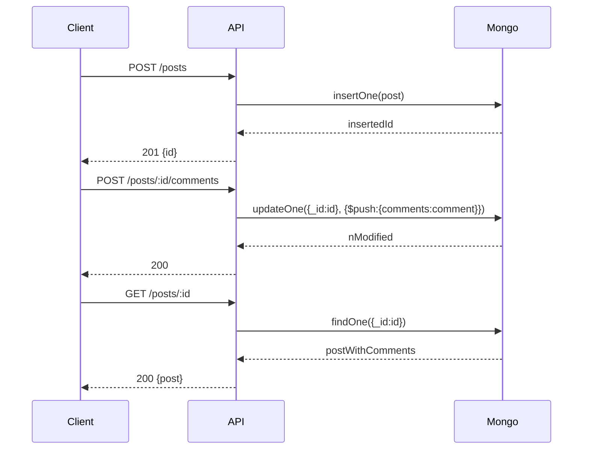

<!-- Generated by Groq via GitHub Actions -->
<!-- Topic ID: T043 -->
<!-- Category: Databases -->
<!-- Generated at UTC: 2026-10-02T18:35:59.091232+00:00 -->

# Document Modeling

## 1. What problem does this solve?

**Motivation**  
When building a backend, you must decide *how* to store the data that represents your domain.  
Document modeling is the discipline of designing the shape of JSON‑like documents that live in a document store (MongoDB, Couchbase, DynamoDB, etc.). It directly influences:

- **Query performance** – how fast you can read the data you need.
- **Write performance** – how many writes you can sustain.
- **Consistency & integrity** – how you enforce relationships.
- **Scalability** – how the data grows across shards or partitions.

**What problem exists?**  
Without a clear model, you end up with:

- **Large, unwieldy documents** that hit size limits or slow down reads.
- **Fragmented data** spread across many collections that require expensive joins or multiple round‑trips.
- **Inconsistent state** when related data is duplicated or not updated atomically.
- **Poor scalability** because the data layout doesn’t match the access patterns.

**Why the problem matters**  
Backends that serve millions of requests per day must keep latency low and throughput high. A bad document model can become the single bottleneck, forcing costly infrastructure changes or leading to data corruption.

**What happens if this concept is not used?**  
- **Performance regressions**: queries become slower as data grows.
- **Data anomalies**: stale or duplicated data.
- **Operational headaches**: difficult migrations, hard‑to‑debug bugs.
- **Cost overruns**: over‑provisioned storage or compute to compensate for inefficiencies.

**Where this concept appears in real backend systems**  
- **E‑commerce**: product catalogs with embedded reviews vs. referenced reviews.
- **Social media**: user profiles with embedded posts or separate collections.
- **IoT**: sensor readings stored as embedded arrays or separate time‑series documents.
- **Microservices**: each service owns its own document schema but must coordinate with others via references.

---

## 2. Mental model

### Analogy: The Library vs. The Filing Cabinet

| Library | Filing Cabinet |
|---------|----------------|
| **Books** are *documents* that contain all the information you need to read a story. | **Folders** are *documents* that contain a subset of information; you need to look up other folders to get the full picture. |
| **Shelves** are *collections* that group related books. | **Drawers** are *collections* that group related folders. |
| **Catalog** is an *index* that lets you find books quickly. | **Index cards** are *indexes* that let you find folders quickly. |

**Key takeaways from the analogy**

- **Embedding (Library)**: All related data lives together. You open one book and see everything. Fast reads, but if the book gets too big, it’s hard to handle.
- **Referencing (Filing Cabinet)**: Data is split into folders. You may need to look up multiple folders, but each stays small and manageable.

---

## 3. Deep explanation

### Internals

- **BSON**: MongoDB stores documents in BSON (Binary JSON). It supports nested objects, arrays, and binary data.
- **Collections**: Logical groupings of documents. Each document has a unique `_id`.
- **Indexes**: B‑tree structures that accelerate queries on specified fields. Compound indexes can cover multiple fields.

### Important terminology

| Term | Definition |
|------|------------|
| **Document** | A single JSON/BSON object. |
| **Collection** | A set of documents. |
| **Embedding** | Storing related data directly inside a parent document. |
| **Referencing** | Storing a reference (usually an `_id`) to another document. |
| **Denormalization** | Storing redundant data to avoid joins. |
| **Normalization** | Storing data in separate documents to avoid duplication. |
| **Atomicity** | Operations on a single document are atomic. |
| **Eventual Consistency** | In sharded clusters, replicas may lag behind writes. |
| **Document Size Limit** | 16 MB in MongoDB (current limit). |

### Trade‑offs

| Strategy | Pros | Cons |
|----------|------|------|
| **Embedding** | • Single read for all data<br>• Atomic updates<br>• No network hops | • Document size grows<br>• Write amplification (update entire doc)<br>• Harder to query sub‑documents |
| **Referencing** | • Small documents<br>• Easier to update parts independently<br>• Flexible relationships | • Requires multiple round‑trips or `$lookup` aggregation<br>• No atomicity across docs<br>• More complex queries |

### Failure modes

- **Over‑embedding**: A document exceeds the size limit or becomes a hotspot for writes.
- **Under‑embedding**: Too many round‑trips lead to latency spikes.
- **Missing indexes**: Queries become full‑collection scans.
- **Stale references**: Deleted referenced documents cause orphaned data.

### Limitations

- **16 MB doc size** (MongoDB) forces you to split data.
- **No multi‑document transactions** (pre‑4.0) – you must design for eventual consistency.
- **Sharding**: Documents must fit into a shard key range; large embedded arrays can cause “hot” shards.

### Where it fits in a backend architecture

- **Data layer**: Document modeling is the schema design that sits between the application code and the database.
- **API layer**: The shape of request/response payloads often mirrors the document shape.
- **Caching layer**: Frequently accessed documents can be cached; embedding can reduce cache misses.
- **Search layer**: If you use ElasticSearch or similar, you may denormalize data into a search document.

### Interaction with related concepts

| Concept | Interaction |
|---------|-------------|
| **Indexes** | Must be designed to support the chosen embedding strategy. |
| **Sharding** | Embedding can cause hot shards; referencing can spread load. |
| **Transactions** | Embedding simplifies atomicity; referencing requires multi‑document transactions or application‑level consistency. |
| **Caching** | Embedded data reduces cache misses; referenced data may need multiple cache lookups. |
| **API contracts** | The document shape often defines the API payloads. |

---

## 4. How it works

### Step‑by‑step flow for a **post** with **comments**

1. **Create a post**  
   - Client sends `POST /posts` with title, body.  
   - Server inserts a document into `posts` collection.  
   - Response returns the new `_id`.

2. **Add a comment (embedding)**  
   - Client sends `POST /posts/:id/comments`.  
   - Server performs `updateOne` with `$push` to add comment to `comments` array inside the post document.  
   - Entire post document is rewritten (atomic).

3. **Add a comment (referencing)**  
   - Server creates a new document in `comments` collection with `postId`.  
   - Server updates the post document to push the comment’s `_id` into `commentIds` array.

4. **Read a post with comments (embedding)**  
   - `findOne` on `posts` returns the post and its comments array in one round‑trip.

5. **Read a post with comments (referencing)**  
   - `findOne` on `posts` returns post and array of comment IDs.  
   - Server performs `$lookup` aggregation or two separate queries to fetch comments.

#### Mermaid diagram (CRUD flow)



---

## 5. Practical implementation

Below is a minimal Node.js example using **Mongoose** (TypeScript).  
It demonstrates both embedding and referencing for a simple blog.

```ts
// src/models/post.ts
import { Schema, model, Types } from 'mongoose';

export interface Comment {
  _id?: Types.ObjectId;
  author: string;
  text: string;
  createdAt: Date;
}

// ---------- Embedding ----------
const CommentSchema = new Schema<Comment>({
  author: { type: String, required: true },
  text:   { type: String, required: true },
  createdAt: { type: Date, default: Date.now }
});

const PostSchema = new Schema({
  title:   { type: String, required: true },
  body:    { type: String, required: true },
  comments: [CommentSchema]          // embedded array
});

export const Post = model('Post', PostSchema);

// ---------- Referencing ----------
const RefPostSchema = new Schema({
  title:   { type: String, required: true },
  body:    { type: String, required: true },
  commentIds: [{ type: Schema.Types.ObjectId, ref: 'Comment' }]
});

export const RefPost = model('RefPost', RefPostSchema);

export const CommentModel = model('Comment', CommentSchema);
```

### CRUD examples

```ts
// src/controllers/postController.ts
import { Request, Response } from 'express';
import { Post, RefPost, CommentModel } from '../models/post';
import { Types } from 'mongoose';

// ----- Create a post (embedded) -----
export const createPost = async (req: Request, res: Response) => {
  const { title, body } = req.body;
  const post = await Post.create({ title, body, comments: [] });
  res.status(201).json(post);
};

// ----- Add comment (embedded) -----
export const addCommentEmbedded = async (req: Request, res: Response) => {
  const { id } = req.params;
  const { author, text } = req.body;
  await Post.updateOne(
    { _id: id },
    { $push: { comments: { author, text } } }
  );
  res.sendStatus(200);
};

// ----- Add comment (referenced) -----
export const addCommentReferenced = async (req: Request, res: Response) => {
  const { id } = req.params;
  const { author, text } = req.body;
  const comment = await CommentModel.create({ author, text });
  await RefPost.updateOne(
    { _id: id },
    { $push: { commentIds: comment._id } }
  );
  res.sendStatus(200);
};

// ----- Get post with comments (referenced) -----
export const getPostWithComments = async (req: Request, res: Response) => {
  const { id } = req.params;
  const post = await RefPost.findById(id).populate('commentIds').lean();
  res.json(post);
};
```

> **Tip**: Use `lean()` for read‑only queries to avoid Mongoose document overhead.

---

## 6. Production considerations

| Concern | What to watch for | Mitigation |
|---------|-------------------|------------|
| **Scalability** | Hot shards when many writes target the same document. | Use a sharding key that distributes writes; consider referencing for high‑write collections. |
| **Reliability** | Single document size limit (16 MB). | Split large arrays into separate documents; use pagination. |
| **Security** | Unintended data exposure via embedded documents. | Enforce field-level access controls; use Mongoose schemas with `select: false`. |
| **Observability** | Hard to trace multi‑document updates. | Log operation IDs; use transaction sessions for referenced writes. |
| **Performance** | Full collection scans due to missing indexes. | Create compound indexes on frequently queried fields; monitor `explain()` output. |
| **Error handling** | Partial failures in referenced writes. | Wrap writes in transactions (MongoDB 4.0+); retry on transient errors. |
| **Resource usage** | Large documents increase I/O and memory. | Keep documents below 1 MB when possible; compress binary data. |
| **Operational concerns** | Schema evolution. | Use versioned schemas; keep backward compatibility. |
| **Failure recovery** | Orphaned references after a crash. | Periodic consistency checks; use TTL indexes to clean stale data. |
| **Deployment** | Versioned migrations. | Use migration tools (e.g., `migrate-mongo`) and CI pipelines. |

---

## 7. Common mistakes

| Mistake | Why it’s problematic |
|---------|----------------------|
| **Embedding everything** | Documents grow beyond size limits; writes become expensive. |
| **Referencing everything** | Requires many round‑trips; queries become slow. |
| **Ignoring indexes** | Reads degrade to full scans; latency spikes. |
| **Not considering write patterns** | Hot spots cause shard imbalance. |
| **Using `$lookup` for every read** | Aggregation pipeline can be slow; better to embed for read‑heavy paths. |
| **Assuming atomicity across references** | Without transactions, updates can leave data inconsistent. |
| **Hard‑coding field names** | Schema drift leads to bugs when fields change. |
| **Over‑normalizing** | Too many collections make maintenance hard. |

---

## 8. Senior engineer perspective

### What changes at scale?

- **Sharding strategy**: Choose a shard key that balances reads and writes. For example, use a user ID for user‑centric data.
- **Batching & bulk writes**: Use `bulkWrite` to reduce round‑trips.
- **Multi‑document transactions**: Leverage MongoDB 4.0+ transactions for critical consistency.
- **Monitoring**: Track `documentSize`, `writeConcern`, `indexBuilds`, and `shardKeyDistribution`.
- **Cost/performance**: Embedding reduces network traffic but can increase storage cost due to duplication; referencing reduces storage but increases read cost.
- **Bottlenecks**: Document size limit, write amplification, and index maintenance.
- **Failure scenarios**: Hot shards, replica lag, and network partitions.
- **When NOT to use**: If you need strong ACID guarantees across many documents, consider a relational DB or a hybrid approach.

---

## 9. Interview questions

1. **Beginner**: *What is the difference between embedding and referencing in MongoDB?*  
   *Answer*: Embedding stores related data inside a parent document; referencing stores a separate document and keeps a reference (usually an `_id`). Embedding gives atomic writes and fast reads but can lead to large documents; referencing keeps documents small but requires extra queries or `$lookup`.

2. **Beginner**: *Why does MongoDB have a 16 MB document size limit?*  
   *Answer*: To keep the storage engine efficient and to avoid huge documents that would be expensive to read/write and to shard. It encourages normalization and sharding-friendly design.

3. **Senior**: *How would you design a schema for a social media platform where users can post, comment, and like posts, considering millions of writes per second?*  
   *Answer*: Use referencing for comments and likes to avoid large post documents. Store a `post` collection with minimal fields; a `comment` collection with `postId`; a `like` collection with `postId` and `userId`. Use sharding on `postId` or `userId` depending on access patterns. Use bulk writes and transactions for atomic updates when needed. Add indexes on `postId`, `userId`, and compound indexes for query patterns.

4. **Senior**: *Explain how you would handle eventual consistency when using referencing for comments in a sharded cluster.*  
   *Answer*: Use MongoDB transactions to ensure that comment creation and post update happen atomically. If transactions are not feasible, implement a retry mechanism on the application side and use a background job to reconcile orphaned comments. Monitor replica lag and design the system to tolerate stale reads.

5. **Scenario/Debugging**: *You notice that reads for a post with many comments are slow, but writes are fast. What could be causing this, and how would you fix it?*  
   *Answer*: Likely the comments are embedded, causing the post document to grow large, leading to slow reads due to large payloads and index scans. Fix by switching to referencing: store comments in a separate collection, keep an array of comment IDs in the post, and use `$lookup` or a separate query to fetch comments. Add indexes on `postId` in the comments collection to speed up lookups.

---

## 10. Hands‑on task

**Build a simple blog API** that supports:

1. Creating a post (`POST /posts`).
2. Adding a comment to a post (`POST /posts/:id/comments`).
3. Retrieving a post with its comments (`GET /posts/:id`).

**Requirements**

- Use **embedding** for comments in the `posts` collection.
- Add a second endpoint that uses **referencing** (`POST /posts/:id/comments-ref` and `GET /posts/:id/ref`).
- Measure the size of a post document after 100 comments.
- Add an index on the `title` field and explain its effect on a `find({ title: 'foo' })` query.

**Deliverables**

- A GitHub repo with the Node.js project.
- A README explaining how to run the API and the benchmark script.
- A short report (max 200 words) on the trade‑offs observed.

---

## 11. Quick revision

- **Embedding**: All related data in one document → atomic writes, fast reads, risk of large docs.
- **Referencing**: Separate documents linked by `_id` → smaller docs, need extra queries, no atomicity.
- **Document size limit**: 16 MB (MongoDB) → split large arrays or use referencing.
- **Indexes**: Essential for query performance; compound indexes for multi‑field queries.
- **Sharding**: Choose a shard key that distributes writes; avoid hot keys.
- **Transactions**: Available from MongoDB 4.0; use for multi‑document atomicity.
- **Bulk writes**: `bulkWrite` reduces round‑trips and improves throughput.
- **Monitoring**: Track `documentSize`, `writeConcern`, `indexBuilds`, `shardKeyDistribution`.
- **Common pitfalls**: Over‑embedding, missing indexes, ignoring size limits, assuming atomicity across references.

---

## 12. References

- [MongoDB Manual – Document Modeling](https://docs.mongodb.com/manual/core/data-modeling/)
- [Mongoose Docs – Schemas](https://mongoosejs.com/docs/guide.html)
- [MongoDB Manual – Sharding](https://docs.mongodb.com/manual/sharding/)
- [MongoDB Manual – Transactions](https://docs.mongodb.com/manual/core/transactions/)
- [MongoDB Manual – Indexes](https://docs.mongodb.com/manual/core/indexes/)
- [MongoDB Manual – Bulk Write Operations](https://docs.mongodb.com/manual/reference/method/db.collection.bulkWrite/)
- [MongoDB Manual – Document Size Limit](https://docs.mongodb.com/manual/reference/limits/#documents)
