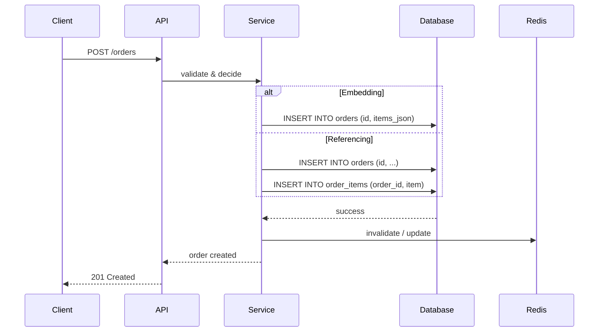

<!-- Generated by Groq via GitHub Actions -->
<!-- Topic ID: T044 -->
<!-- Category: Databases -->
<!-- Generated at UTC: 2026-10-02T18:35:59.091232+00:00 -->

# Embedding vs Referencing

## 1. What problem does this solve?

When designing a data model for a backend, you often need to decide **how to represent relationships between entities**.  
Two common patterns are:

- **Embedding** – store related data directly inside a parent document or row.  
- **Referencing** – store a foreign key or pointer that links to another table or collection.

### What problem exists?

- **Data duplication vs. consistency**: Do we keep copies of related data or a single source of truth?  
- **Query performance**: How many round‑trips or joins are needed to fetch a complete view?  
- **Write patterns**: Do we need to update related data atomically or can we tolerate eventual consistency?  
- **Schema evolution**: How hard is it to add or remove fields from related data?  

### Why the problem matters

- **Latency**: A poorly chosen pattern can add extra network hops or expensive joins.  
- **Storage**: Embedding duplicates data, increasing disk usage.  
- **Data integrity**: Referencing enforces referential integrity but can lead to stale reads if not handled correctly.  
- **Scalability**: Large embedded documents can hit size limits or degrade performance; deep referencing can create many micro‑services calls.  

### What happens if this concept is not used

- **Over‑denormalization**: You might end up with ad‑hoc copies that are hard to keep in sync.  
- **Under‑normalization**: Excessive joins or lookups can make APIs sluggish.  
- **Maintenance pain**: Without a clear strategy, future developers struggle to understand the data flow.  

### Where this concept appears in real backend systems

- **E‑commerce**: Order documents embed line items vs. referencing a separate `OrderItems` table.  
- **Social media**: User profiles embed recent posts for quick reads vs. referencing a `Posts` collection.  
- **Analytics pipelines**: Event streams may embed user context vs. referencing a user profile table.  
- **Micro‑service architectures**: Service A may embed a snapshot of data from Service B or call B’s API to fetch it.

---

## 2. Mental model

### Simple analogy

> **Embedding** is like putting a photo inside a photo album: you can see the picture immediately, but if the photo changes you have to replace every copy.  
> **Referencing** is like keeping a bookmark in the album that points to a separate photo file: you only need to update the file once, but you have to follow the bookmark to see it.

### Precise engineering model

| Aspect | Embedding | Referencing |
|--------|-----------|-------------|
| **Data location** | Inside the parent record (document or row) | Separate record; parent holds a key |
| **Read path** | Single read, no joins | One or more lookups/joins |
| **Write path** | Single write (atomic in document DB) | Two writes (parent + child) or a join |
| **Consistency** | Strongly consistent if single document | Requires transaction or eventual consistency |
| **Duplication** | Yes | No |
| **Schema evolution** | Harder (must update all parents) | Easier (change child schema only) |

---

## 3. Deep explanation

### Internals

- **Document databases (MongoDB, Couchbase)**: Embedding is natural because a document can contain nested objects up to a size limit (16 MiB in MongoDB).  
- **Relational databases (PostgreSQL, MySQL)**: Referencing is the default; embedding would mean storing JSON blobs or arrays, which lose relational features.  
- **Key‑value stores (Redis)**: Embedding is common (hashes, JSON). Referencing can be simulated with separate keys and pointers.

### Important terminology

- **Denormalization** – intentionally duplicating data to improve read performance.  
- **Normalization** – structuring data to minimize duplication.  
- **Atomicity** – a write that updates all related parts in one transaction.  
- **Eventual consistency** – updates propagate asynchronously; reads may see stale data.  
- **Foreign key** – a reference enforced by the database.  
- **Document size limit** – maximum size of a single document (e.g., 16 MiB in MongoDB).

### Trade‑offs

| Factor | Embedding | Referencing |
|--------|-----------|-------------|
| **Read speed** | Fast, single fetch | Slower, requires join/lookups |
| **Write complexity** | Simple, atomic | More complex, potential race conditions |
| **Storage cost** | Higher due to duplication | Lower |
| **Schema flexibility** | Lower (must update all parents) | Higher |
| **Consistency guarantees** | Strong if single document | Depends on transaction support |
| **Scalability** | Limited by document size | Scales with sharding of tables/collections |

### Failure modes

- **Embedding**:  
  - *Document size overflow*: Exceeding DB limits.  
  - *Stale data*: Updating child data requires updating every parent.  
- **Referencing**:  
  - *Orphaned references*: Child deleted without cleaning parent.  
  - *Join bottlenecks*: Large joins can cause slow queries.  
  - *Transaction failure*: Partial updates lead to inconsistency.

### Limitations

- **Embedding** is unsuitable for relationships that grow unbounded (e.g., a user with thousands of posts).  
- **Referencing** can be overkill for one‑to‑few relationships where the child rarely changes.

### Where this concept fits in a backend architecture

- **API layer**: Decides whether to return embedded data or IDs.  
- **Service layer**: Handles transactions, caching, and consistency.  
- **Data layer**: Implements the chosen pattern in the database.  
- **Cache layer**: Often stores embedded snapshots for fast reads.

### Interaction with related concepts

- **Caching**: Embedded snapshots are ideal for cache keys; referencing may require cache invalidation across services.  
- **CQRS**: Read models often embed data for fast queries; write models maintain normalized data.  
- **Event sourcing**: Events may contain embedded snapshots of state changes.  
- **Micro‑services**: Service boundaries often dictate whether to embed or reference.

---

## 4. How it works

### Step‑by‑step flow for an order system

1. **Client** sends `POST /orders` with order items.  
2. **API** validates input.  
3. **Service** decides:  
   - *Embedding*: Build a single `Order` document with an array of items.  
   - *Referencing*: Insert into `orders` table, then insert each item into `order_items` table.  
4. **Database** executes write(s).  
5. **Cache** invalidates or updates relevant keys.  
6. **Client** receives response.



---

## 5. Practical implementation

### TypeScript/Node.js example – Order service

```ts
// src/orderService.ts
import { MongoClient, ObjectId } from 'mongodb';
import { RedisClient } from 'redis';

const mongo = new MongoClient(process.env.MONGO_URI!);
const redis = new RedisClient({ url: process.env.REDIS_URI! });

await mongo.connect();
const ordersCol = mongo.db('shop').collection('orders');

/**
 * Create an order.
 * @param userId - ID of the user placing the order
 * @param items - array of { productId, quantity, price }
 */
export async function createOrder(userId: string, items: Array<{
  productId: string; quantity: number; price: number;
}>) {
  // 1️⃣ Decide strategy: embed items
  const orderDoc = {
    _id: new ObjectId(),
    userId,
    items,               // embedded array
    total: items.reduce((s, i) => s + i.price * i.quantity, 0),
    createdAt: new Date(),
  };

  // 2️⃣ Write atomically
  await ordersCol.insertOne(orderDoc);

  // 3️⃣ Cache the order for fast reads
  await redis.set(`order:${orderDoc._id}`, JSON.stringify(orderDoc), {
    EX: 60 * 5, // 5 minutes
  });

  return orderDoc;
}
```

#### Key points

- **Atomic insert**: `insertOne` writes the whole document in one operation.  
- **Cache key**: `order:<id>` stores the embedded snapshot.  
- **Size check**: In production, guard against `items` array growing beyond ~10 k elements.

### Referencing example (PostgreSQL)

```ts
// src/orderServicePostgres.ts
import { Pool } from 'pg';
import { RedisClient } from 'redis';

const pool = new Pool({ connectionString: process.env.PG_URI! });
const redis = new RedisClient({ url: process.env.REDIS_URI! });

export async function createOrder(userId: string, items: Array<{
  productId: string; quantity: number; price: number;
}>) {
  const client = await pool.connect();
  try {
    await client.query('BEGIN');

    const res = await client.query(
      `INSERT INTO orders (user_id, total, created_at)
       VALUES ($1, $2, NOW())
       RETURNING id`,
      [userId, items.reduce((s, i) => s + i.price * i.quantity, 0)]
    );
    const orderId = res.rows[0].id;

    const stmt = `
      INSERT INTO order_items (order_id, product_id, quantity, price)
      VALUES ($1, $2, $3, $4)
    `;
    for (const item of items) {
      await client.query(stmt, [orderId, item.productId, item.quantity, item.price]);
    }

    await client.query('COMMIT');

    // Cache only the order metadata; items fetched on demand
    await redis.set(`order:${orderId}`, JSON.stringify({ orderId, userId }), {
      EX: 60 * 5,
    });

    return { orderId };
  } catch (e) {
    await client.query('ROLLBACK');
    throw e;
  } finally {
    client.release();
  }
}
```

---

## 6. Production considerations

| Concern | Embedding | Referencing |
|---------|-----------|-------------|
| **Scalability** | Limited by document size; sharding may split parent records. | Tables can be sharded independently; better horizontal scaling. |
| **Reliability** | Single write failure aborts entire operation. | Two writes may fail separately; need transactions or compensating actions. |
| **Security** | All data in one place; easier to apply row‑level security. | Need to secure multiple tables/collections; more complex ACLs. |
| **Observability** | Logs show entire payload; easier to trace. | Need to correlate logs across services/tables. |
| **Performance** | Fast reads; writes can be heavier if many parents need updating. | Reads slower due to joins; writes lighter per record. |
| **Error handling** | Single failure path; easier to roll back. | Multi‑step failure; need idempotent operations. |
| **Resource usage** | More storage due to duplication. | Less storage but more network traffic for joins. |
| **Deployment** | One schema change propagates to many documents. | Schema changes local to one table. |
| **Failure recovery** | Re‑indexing may be needed if embedded data corrupts. | Rebuild foreign key constraints; orphan cleanup. |

---

## 7. Common mistakes

1. **Embedding unbounded collections**  
   *Problem*: A user with thousands of posts ends up with a huge document → slow reads, sharding issues.  
2. **Ignoring document size limits**  
   *Problem*: Exceeding MongoDB’s 16 MiB limit causes write errors.  
3. **Updating embedded data without cascading**  
   *Problem*: Changing a product price requires updating every order that contains it → stale data.  
4. **Referencing without proper indexing**  
   *Problem*: Joins become slow because foreign key columns aren’t indexed.  
5. **Mixing patterns without clear boundaries**  
   *Problem*: Some services embed, others reference → inconsistent API contracts.  
6. **Assuming atomicity in multi‑document writes**  
   *Problem*: Without transactions, partial writes lead to orphaned records.  
7. **Caching embedded snapshots without invalidation**  
   *Problem*: Stale cache after updates to child data.  

---

## 8. Senior engineer perspective

### Architecture decisions

- **Data ownership**: Decide which service owns the child data.  
- **Consistency model**: Choose between strong consistency (transactions) or eventual consistency (eventual sync).  
- **Cache strategy**: Use embedded snapshots for hot data; reference-based cache for cold data.  
- **Schema evolution**: Prefer referencing when child schema changes frequently.  

### Trade‑offs at scale

- **Bottlenecks**:  
  - *Embedding*: Write amplification when many parents need updating.  
  - *Referencing*: Join amplification on read‑heavy workloads.  
- **Failure scenarios**:  
  - *Embedding*: Document corruption propagates to many reads.  
  - *Referencing*: Orphaned references after partial failures.  
- **Monitoring**:  
  - Track document size distribution.  
  - Monitor join latency and cache hit ratios.  
- **Cost/performance**:  
  - Embedding can reduce read cost but increase storage cost.  
  - Referencing can reduce storage but increase compute cost.  

### When NOT to use the approach

- **Embedding**:  
  - When child data is large or highly dynamic.  
  - When you need to query children independently.  
- **Referencing**:  
  - When read patterns require a single round‑trip.  
  - When you need to enforce strong referential integrity.  

---

## 9. Interview questions

| Level | Question | Answer points |
|-------|----------|---------------|
| Beginner | What is the difference between embedding and referencing in a database? | Embedding stores related data inside the parent; referencing stores a pointer/foreign key to another record. |
| Beginner | When would you choose to embed a child document in MongoDB? | When the child is small, rarely changes, and you need fast reads of the parent. |
| Senior | How would you handle a scenario where a referenced child record is updated frequently but you still want to keep an embedded snapshot for performance? | Use an event‑driven update pipeline; publish events on child updates, consume them to refresh the embedded snapshot in a background job or cache. |
| Senior | What are the implications of using embedded documents in a sharded MongoDB cluster? | Sharding key must be part of the embedded document; large documents can cause shard imbalance; consider using a separate collection for large embedded data. |
| Scenario | You have an e‑commerce system where orders embed line items. After a product price change, some orders still show the old price. How would you detect and fix this? | Detect via audit logs or a scheduled job comparing order totals to current product prices; fix by recalculating totals or updating embedded prices, possibly using a background worker. |

---

## 10. Hands‑on task

**Task**: Implement a “wishlist” feature for a Next.js + Node.js API.

1. **Schema**:  
   - `users` table/collection.  
   - `products` table/collection.  
   - `wishlists` – decide to embed product IDs or reference them.  
2. **Endpoints**:  
   - `POST /users/:id/wishlist` – add a product.  
   - `GET /users/:id/wishlist` – retrieve the wishlist.  
3. **Requirements**:  
   - Use TypeScript.  
   - Store the wishlist as an embedded array of product IDs in the user document (MongoDB).  
   - Add a Redis cache for the wishlist.  
4. **Bonus**:  
   - Add a background job that periodically cleans up wishlist items that no longer exist in the `products` collection.  

---

## 11. Quick revision

- Embedding = store related data inside the parent record.  
- Referencing = store a pointer/foreign key to another record.  
- Embedding gives fast reads, single write, but duplicates data.  
- Referencing keeps a single source of truth, scales better for large or changing data.  
- Document size limits (MongoDB 16 MiB) constrain embedding.  
- Use transactions or compensating actions for multi‑document writes.  
- Cache embedded snapshots for hot data; invalidate on updates.  
- Index foreign keys to keep joins fast.  
- Monitor document size distribution and join latency.  
- Prefer embedding for one‑to‑few, static relationships; reference for one‑to‑many or frequently changing data.  
- Avoid mixing patterns without clear API contracts.  

---

## 12. References

- [MongoDB: Document Size Limits](https://www.mongodb.com/docs/manual/reference/limits/#max-document-size)  
- [PostgreSQL: Transactions](https://www.postgresql.org/docs/current/transaction-iso.html)  
- [Redis: Caching Patterns](https://redis.io/docs/management/cache/)  
- [Next.js API Routes](https://nextjs.org/docs/api-routes/introduction)  
- [TypeScript Handbook](https://www.typescriptlang.org/docs/)  
- [Node.js: MongoDB Driver](https://nodejs.mongodb.org/)  
- [Node.js: pg (PostgreSQL)](https://node-postgres.com/)  
- [Redis Client for Node.js](https://github.com/redis/node-redis)  

---
