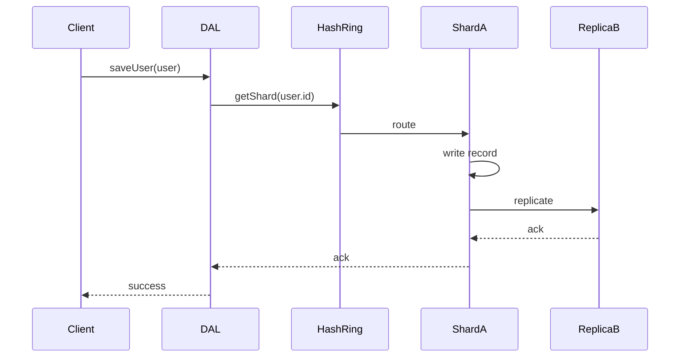

<!-- Generated by Groq via GitHub Actions -->
<!-- Topic ID: T045 -->
<!-- Category: Databases -->
<!-- Generated at UTC: 2026-10-03T06:42:45.517494+00:00 -->

# Partition keys

## 1. What problem does this solve?

When a backend system grows, a single database instance can no longer hold all data or handle all traffic.  
Partition keys let us **split** the data across many machines (shards) while still being able to locate any record quickly.

* **What problem exists?**  
  - A single node becomes a bottleneck for storage or throughput.  
  - Hotspots: a few keys receive most traffic, overloading one node.  
  - Scaling writes/reads becomes difficult because the data set is too large for one machine.

* **Why the problem matters?**  
  - Users experience latency or timeouts.  
  - Operational costs rise as you need more powerful hardware.  
  - Data loss risk increases if a single point of failure exists.

* **What happens if this concept is not used?**  
  - You’ll hit the limits of your database (max connections, max size, max throughput).  
  - You’ll need to redesign the whole system or add expensive vertical scaling.  
  - You’ll lose the ability to keep data close to the code that uses it.

* **Where this concept appears in real backend systems**  
  - **Relational DB sharding** (PostgreSQL, MySQL) – split tables by customer ID.  
  - **NoSQL** – MongoDB sharding, Cassandra partition key, DynamoDB partition key.  
  - **Cache** – Redis Cluster uses a hash slot derived from the key.  
  - **Message queues** – Kafka partitions data by key to preserve order.  
  - **Distributed file systems** – HDFS splits files into blocks, each block has a block ID.

---

## 2. Mental model

### Analogy: Library shelves

Imagine a huge library. If every book is stored on a single shelf, finding a book takes forever.  
Instead, the library is divided into sections (fiction, science, history). Each section is a **partition**.  
A book’s title (or ISBN) determines which section it belongs to.  
When you want a book, you first look at the section (partition key) and then at the shelf inside that section (row key).

### Engineering model

* **Partition key** – a value (or set of values) that determines **which node** holds the data.  
* **Row key / document key** – the unique identifier within that partition.  
* **Shard** – a physical or logical unit that stores a contiguous range of partition keys.  
* **Consistent hashing** – a technique to map keys to shards while minimizing data movement when nodes change.  

---

## 3. Deep explanation

### Internals

1. **Hashing** – Most systems hash the partition key to a numeric value.  
2. **Slot / range assignment** – The hash space is divided into slots or ranges, each mapped to a node.  
3. **Routing** – The client or proxy calculates the hash, looks up the node, and forwards the request.  
4. **Replication** – Each shard is usually replicated to other nodes for fault tolerance.  

### Important terminology

| Term | Meaning |
|------|---------|
| **Partition key** | Value that determines the shard. |
| **Hash key** | Same as partition key in many systems. |
| **Range key** | Secondary key used for sorting within a partition (e.g., DynamoDB). |
| **Shard** | Physical storage unit holding a subset of the keyspace. |
| **Consistent hashing** | Hash ring that allows adding/removing nodes with minimal remapping. |
| **Hotspot** | A shard that receives disproportionate traffic. |
| **Rebalancing** | Moving data when the cluster topology changes. |

### Trade‑offs

| Aspect | Hash‑based | Range‑based |
|--------|------------|-------------|
| **Uniform distribution** | Excellent (if hash is good). | Depends on key distribution. |
| **Range queries** | Hard (need to scan multiple shards). | Easy (single shard). |
| **Write amplification** | Low (single node). | Low (single node). |
| **Rebalancing cost** | Low (only affected shards). | High (many shards may need moving). |

### Failure modes

* **Hotspot** – A popular key causes one shard to become a bottleneck.  
* **Uneven distribution** – Poor hash function or low cardinality keys.  
* **Rebalancing lag** – During node addition/removal, data may be temporarily unavailable.  
* **Network partitions** – Clients may route to a node that is down, leading to timeouts.

### Limitations

* **Immutable partition key** – Changing the key requires a full data migration.  
* **Cross‑partition queries** – Expensive; often need a secondary index or a global query engine.  
* **Cardinality constraints** – Low‑cardinality keys (e.g., “US”) are poor partition keys.

### Where it fits in a backend architecture

```
┌───────────────────────┐
│  Application Layer    │
│  (Node.js / FastAPI)  │
└───────┬───────────────┘
        │
        ▼
┌───────────────────────┐
│  Data Access Layer    │
│  (ORM / Driver)       │
└───────┬───────────────┘
        │
        ▼
┌───────────────────────┐
│  Distributed DB / Cache│
│  (MongoDB, Redis, etc.)│
└───────────────────────┘
```

The partition key is chosen in the **Data Access Layer** and drives routing to the correct node in the distributed store.

### Interaction with related concepts

* **Caching** – Cache keys often mirror partition keys to keep hot data local.  
* **Transactions** – In distributed DBs, a transaction that spans multiple partitions is expensive.  
* **Indexing** – Secondary indexes may need to be partitioned as well.  
* **Monitoring** – Metrics per shard (latency, QPS) reveal hotspots.

---

## 4. How it works

### Step‑by‑step flow for a write

1. **Client** calls `saveUser(user)` with `user.id`.  
2. **Data Access Layer** extracts `user.id` as the partition key.  
3. **Hash function** (`md5`, `fnv1a`, etc.) computes a hash value.  
4. **Hash ring lookup** maps hash → shard node.  
5. **Request** is forwarded to that node.  
6. **Node** writes the record to its local storage.  
7. **Replication** copies the record to replica nodes.  
8. **Acknowledgement** is sent back to the client.



---

## 5. Practical implementation

Below is a minimal Node.js example using **MongoDB sharding**.  
Assume a local MongoDB replica set with sharding enabled.

```ts
// src/shard-demo.ts
import { MongoClient, Db } from 'mongodb';

const MONGO_URI = 'mongodb://localhost:27017';
const DB_NAME = 'demo';
const COLLECTION = 'users';

// Connect once and reuse the client
const client = new MongoClient(MONGO_URI);
await client.connect();
const db: Db = client.db(DB_NAME);
const coll = db.collection(COLLECTION);

/**
 * Insert a user. The `_id` field is the partition key.
 * MongoDB will hash the `_id` and route the write to the correct shard.
 */
async function insertUser(user: { _id: string; name: string }) {
  // In a sharded cluster, the driver automatically routes the write.
  await coll.insertOne(user);
}

/**
 * Find a user by id. The query is routed to the shard that owns the key.
 */
async function findUser(id: string) {
  return await coll.findOne({ _id: id });
}

// Demo usage
await insertUser({ _id: 'user-123', name: 'Alice' });
const user = await findUser('user-123');
console.log('Found user:', user);
```

**Key points**

* The `_id` field is the partition key by default.  
* The driver uses the MongoDB **shard key** to route the operation.  
* No extra code is needed to specify the shard; the cluster handles it.

---

## 6. Production considerations

| Concern | What to watch for | Mitigation |
|---------|-------------------|------------|
| **Scalability** | Hotspots, uneven shard size | Use high‑cardinality keys, monitor shard sizes |
| **Reliability** | Node failures, network partitions | Replication, automatic failover, consistent hashing |
| **Security** | Sensitive data across shards | Encrypt data at rest, use TLS, restrict network access |
| **Observability** | Latency per shard, QPS | Export metrics per shard, alert on hotspots |
| **Performance** | Write amplification, cross‑partition queries | Keep queries local, avoid joins across shards |
| **Error handling** | Retry logic, idempotency | Use idempotent writes, exponential backoff |
| **Resource usage** | Disk I/O, memory | Balance read/write load, use SSDs |
| **Operational concerns** | Rebalancing, upgrades | Plan maintenance windows, use rolling upgrades |
| **Failure recovery** | Data loss, corruption | Regular backups, point‑in‑time recovery |
| **Deployment** | Cluster size, network topology | Use dedicated nodes, low‑latency network |

---

## 7. Common mistakes

| Mistake | Why it’s problematic |
|---------|----------------------|
| Using a low‑cardinality key (e.g., `country`) | Causes a single shard to receive most traffic → hotspot |
| Changing the partition key after data is written | Requires full data migration, downtime |
| Ignoring query patterns | Range queries across many shards are slow |
| Not monitoring shard sizes | One shard may grow huge while others are empty |
| Using the same key for all writes | All writes go to one node, defeating horizontal scaling |
| Over‑replicating without need | Wastes storage and increases write latency |

---

## 8. Senior engineer perspective

### What changes at scale?

* **Architecture decisions** – Decide between hash‑based vs range‑based partitioning based on workload.  
* **Trade‑offs** – Accept higher write latency for better read locality, or vice versa.  
* **Bottlenecks** – Hotspots, replication lag, network congestion.  
* **Failure scenarios** – A shard node crash can affect many users; design for graceful degradation.  
* **Monitoring** – Per‑shard metrics, latency histograms, replica lag.  
* **Cost/performance** – More shards mean more nodes, but better throughput; balance against operational cost.  
* **When NOT to use** – If your data set fits comfortably on a single node, sharding adds unnecessary complexity.  
* **Data migration** – Plan for incremental rebalancing, use online tools (e.g., MongoDB’s `sh.moveChunk`).  

---

## 9. Interview questions

1. **Beginner** – *What is a partition key and why do we use it?*  
   *Answer:* A value that determines which shard holds a record; it enables horizontal scaling by distributing data across nodes.

2. **Beginner** – *How does consistent hashing help when adding a new node?*  
   *Answer:* Only a small portion of keys (those that map to the new node’s hash range) need to be moved, minimizing data movement.

3. **Senior** – *Explain the trade‑offs between hash‑based and range‑based partitioning in a distributed database.*  
   *Answer:* Hash gives uniform distribution but makes range queries expensive; range preserves locality for range queries but can lead to uneven distribution and costly rebalancing.

4. **Senior** – *Describe how you would detect and mitigate a hotspot in a sharded cluster.*  
   *Answer:* Monitor per‑shard metrics; if one shard’s QPS or latency spikes, consider re‑partitioning, adding more shards, or changing the partition key.

5. **Scenario/Debugging** – *A user reports that reads for a specific user ID are slow, but other users are fine. What could be the cause and how would you investigate?*  
   *Answer:* Likely a hotspot: the user’s ID hashes to a shard that is overloaded. Investigate shard metrics, check replica lag, and consider moving the user to a different shard or adding more nodes.  

---

## 10. Hands‑on task

**Goal:** Build a simple key‑value service that uses Redis Cluster to demonstrate partition key routing.

1. Spin up a local Redis Cluster (3 master + 3 replica) using Docker Compose.  
2. Write a Node.js script that:
   * Connects to the cluster using `ioredis`.  
   * Stores 10 000 keys with random IDs (`user:{id}`).  
   * Measures the time to set and get each key.  
   * Logs the slot distribution (how many keys per slot).  
3. Observe that keys are evenly distributed across slots.  
4. Modify the script to use a low‑cardinality key (`country:US`) for all writes and observe a hotspot.

```ts
// src/redis-demo.ts
import Redis from 'ioredis';
import { randomBytes } from 'crypto';

const cluster = new Redis.Cluster([
  { host: '127.0.0.1', port: 7000 },
  { host: '127.0.0.1', port: 7001 },
  { host: '127.0.0.1', port: 7002 },
]);

async function runDemo() {
  const start = Date.now();
  for (let i = 0; i < 10000; i++) {
    const id = randomBytes(8).toString('hex');
    await cluster.set(`user:${id}`, JSON.stringify({ id, name: 'Alice' }));
  }
  console.log(`Inserted 10k keys in ${Date.now() - start} ms`);

  // Slot distribution
  const slots = await cluster.cluster('slots');
  console.log(`Slots: ${slots.length}`);
}

runDemo().catch(console.error);
```

---

## 11. Quick revision

- Partition key → determines shard → enables horizontal scaling.  
- Hash‑based partitioning gives uniform distribution; range‑based preserves locality.  
- Consistent hashing minimizes data movement on topology changes.  
- Hotspots arise from low‑cardinality keys or uneven distribution.  
- Cross‑partition queries are expensive; design queries to stay within a shard.  
- Replication adds fault tolerance but increases write latency.  
- Monitor per‑shard metrics (latency, QPS, size).  
- Changing a partition key requires data migration.  
- Use high‑cardinality, evenly distributed keys.  
- In Redis, the key’s hash slot determines the node.  
- In MongoDB, the shard key is part of the document’s `_id` or a separate field.  

---

## 12. References

- [MongoDB Sharding Overview](https://docs.mongodb.com/manual/sharding/)  
- [Redis Cluster Specification](https://redis.io/docs/manual/scaling/)  
- [Cassandra Partitioning](https://cassandra.apache.org/doc/latest/cassandra/architecture/partitioning.html)  
- [DynamoDB Partition Key](https://docs.aws.amazon.com/amazondynamodb/latest/developerguide/HowItWorks.PartitionKey.html)  
- [Kafka Partitioning](https://kafka.apache.org/documentation/#partitioning)  

---
