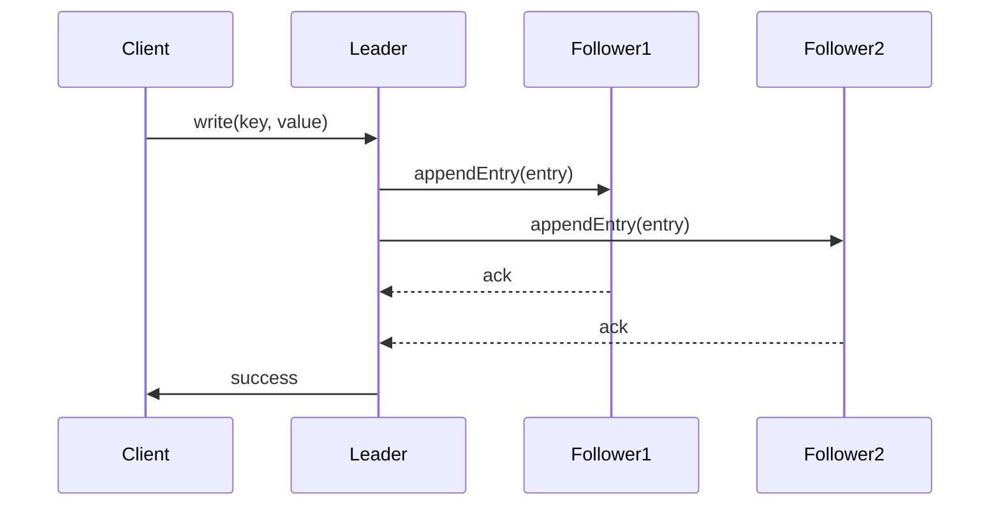
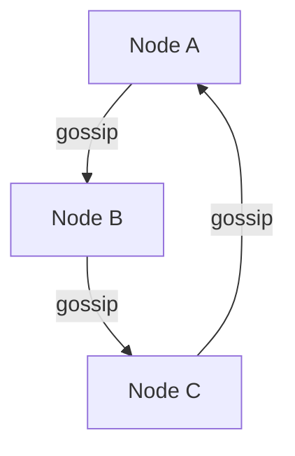

<!-- Generated by Groq via GitHub Actions -->
<!-- Topic ID: T046 -->
<!-- Category: Databases -->
<!-- Generated at UTC: 2026-10-03T06:42:45.517494+00:00 -->

# Consistency models

## 1. What problem does this solve?

When a backend system is distributed across multiple nodes (databases, caches, micro‑services), a write performed on one node may not be immediately visible on another. Consistency models define **how and when** replicas agree on data, and what guarantees clients receive when they read.

### What problem exists
- **Stale reads**: A client reads data that was updated elsewhere but not yet propagated.
- **Inconsistent state**: Two services see different values for the same key, leading to logic errors or data corruption.
- **Race conditions**: Concurrent updates may overwrite each other if replicas diverge.

### Why the problem matters
- **User experience**: A shopping cart that shows an old price or quantity.
- **Business logic**: Inventory systems that double‑sell items if counts are stale.
- **Security**: Access control decisions based on outdated permissions.

### What happens if this concept is not used
- **Data corruption**: Inconsistent writes can lead to lost updates.
- **Hard-to‑debug bugs**: Flaky tests that pass locally but fail in production.
- **Regulatory non‑compliance**: Financial systems may violate audit trails.

### Where this concept appears in real backend systems
- **Databases**: PostgreSQL (strong), Cassandra (eventual), MongoDB (read‑your‑writes).
- **Caches**: Redis (strong for single instance, eventual for cluster).
- **Message queues**: Kafka guarantees order but not strong consistency across partitions.
- **Distributed file systems**: S3 eventual consistency for new objects.

---

## 2. Mental model

### Analogy: A group of friends sharing a notebook
Imagine a group of friends each has a copy of a shared notebook. When one friend writes a new page, the others may not see it immediately.  
- **Strong consistency**: Every friend checks the notebook before writing and always reads the latest page.  
- **Eventual consistency**: Friends write independently; they sync later, so everyone eventually sees the same content.  
- **Causal consistency**: If A writes a note and B sees it, B’s subsequent writes are visible to C, preserving the order of cause and effect.

### Precise engineering model
- **Strong (linearizable) consistency**: All operations appear to occur in a single, globally ordered sequence.  
- **Sequential consistency**: Operations of each process appear in order, but the global order may differ.  
- **Causal consistency**: Operations that are causally related appear in the same order to all nodes.  
- **Eventual consistency**: Replicas converge to the same value eventually, with no ordering guarantees.  
- **Read‑your‑writes / Monotonic reads**: Guarantees that a client sees its own writes or never sees older data.

---

## 3. Deep explanation

### Internals
- **Replication protocols**: Raft, Paxos, or simple leader‑follower replication.  
- **Conflict resolution**: Last‑write‑wins (LWW), vector clocks, CRDTs.  
- **Version vectors**: Track causal history across replicas.  
- **Quorum reads/writes**: Read from *R* nodes, write to *W* nodes; *R + W > N* ensures consistency.

### Important terminology
| Term | Meaning |
|------|---------|
| **Replica** | A copy of data on a node. |
| **Quorum** | Minimum number of replicas that must agree. |
| **Vector clock** | Timestamp per replica to capture causality. |
| **CRDT** | Conflict‑free replicated data type that merges deterministically. |
| **Read‑your‑writes** | Client sees its own writes immediately. |
| **Monotonic reads** | Client never sees older data after a newer read. |

### Trade‑offs
| Consistency | Latency | Availability | Complexity |
|-------------|---------|--------------|------------|
| Strong | High (wait for quorum) | Low (fail‑over may block) | High (protocols like Raft) |
| Eventual | Low (no coordination) | High | Low |
| Causal | Medium | Medium | Medium |
| Read‑your‑writes | Low (local read) | High | Medium |

### Failure modes
- **Network partitions**: Strong consistency systems may block writes; eventual systems continue but risk divergence.  
- **Clock skew**: LWW based on system clocks can misorder writes.  
- **Write amplification**: Replicating to many nodes increases load.

### Limitations
- **Strong consistency** cannot scale to thousands of nodes without sacrificing latency.  
- **Eventual consistency** may violate business rules that require immediate visibility.  
- **Causal consistency** is harder to implement and may still allow stale reads if causality is not fully captured.

### Where this concept fits in a backend architecture
- **Data layer**: Database replication settings.  
- **Cache layer**: Redis cluster replication and eviction policies.  
- **API layer**: Idempotency keys, read‑your‑writes via session tokens.  
- **Event sourcing**: Event store guarantees order; consumers enforce causal consistency.

### Interaction with related concepts
- **CAP theorem**: Consistency vs. Availability vs. Partition tolerance.  
- **Idempotency**: Helps mitigate lost updates in eventual consistency.  
- **Versioning**: API versioning can hide consistency changes from clients.  
- **Monitoring**: Consistency lag metrics (e.g., replication lag).

---

## 4. How it works

### Strong consistency with Raft (simplified)



- **Write**: Client sends to leader.  
- **Replication**: Leader appends entry to log, forwards to followers.  
- **Commit**: Leader waits for majority acks.  
- **Read**: Client can read from leader or follower if quorum satisfied.

### Eventual consistency with gossip



- Each node periodically shares its state with peers.  
- Conflicts resolved by LWW or CRDT.  
- No coordination required for writes; reads may return stale data until gossip converges.

---

## 5. Practical implementation

### TypeScript/Node.js example: Read‑your‑writes with Redis

```ts
// redisClient.ts
import { createClient } from 'redis';

export const redis = createClient({
  url: process.env.REDIS_URL,
});
redis.on('error', err => console.error('Redis error', err));
await redis.connect();
```

```ts
// sessionStore.ts
import { redis } from './redisClient';
import { v4 as uuidv4 } from 'uuid';

export async function setSession(userId: string, data: any) {
  const sessionId = uuidv4();
  await redis.hSet(`session:${sessionId}`, {
    userId,
    data: JSON.stringify(data),
    createdAt: Date.now().toString(),
  });
  return sessionId;
}

export async function getSession(sessionId: string) {
  const res = await redis.hGetAll(`session:${sessionId}`);
  if (!res || !res.userId) return null;
  return {
    userId: res.userId,
    data: JSON.parse(res.data),
    createdAt: Number(res.createdAt),
  };
}
```

**How it gives read‑your‑writes**

1. The client writes session data to Redis.  
2. The same client immediately reads from the same Redis instance (or a local cache).  
3. Since Redis is single‑threaded per instance, the read sees the write instantly.

### PostgreSQL strong consistency example

```sql
-- Create a table with a primary key
CREATE TABLE inventory (
  sku TEXT PRIMARY KEY,
  quantity INT NOT NULL
);

-- Upsert with conflict resolution
INSERT INTO inventory (sku, quantity)
VALUES ('ABC123', 10)
ON CONFLICT (sku)
DO UPDATE SET quantity = inventory.quantity + EXCLUDED.quantity;
```

- PostgreSQL guarantees linearizable writes with MVCC and WAL replication.

### Kafka causal ordering

```ts
// producer.ts
import { Kafka } from 'kafkajs';

const kafka = new Kafka({ brokers: ['kafka:9092'] });
const producer = kafka.producer();

await producer.connect();
await producer.send({
  topic: 'orders',
  messages: [
    { key: 'order-1', value: JSON.stringify({ id: 1, status: 'created' }) },
  ],
});
```

- Consumers read from the same partition to preserve order; causal consistency is maintained per partition.

---

## 6. Production considerations

| Concern | Strong Consistency | Eventual Consistency | Causal Consistency |
|---------|--------------------|----------------------|--------------------|
| **Scalability** | Limited by quorum size; latency grows with node count. | Excellent; writes are local. | Medium; requires vector clocks. |
| **Reliability** | High; data is safe but may block. | High; system continues but may diverge temporarily. | Medium; depends on causal tracking. |
| **Security** | Strong guarantees; audit trails easier. | Harder to guarantee timely access control. | Good for permission propagation. |
| **Observability** | Replication lag metrics, quorum status. | Gossip health, conflict resolution logs. | Vector clock drift, causal chain length. |
| **Performance** | Write latency high; read latency can be low if read from leader. | Low write latency; read may be stale. | Medium latency; read may be slightly delayed. |
| **Error handling** | Retry on quorum failure; back‑off. | Detect divergence; reconcile. | Detect causal violations; resolve. |
| **Resource usage** | Extra network traffic for quorum. | Minimal; only local writes. | Extra metadata (vector clocks). |
| **Operational concerns** | Need to monitor leader elections, network partitions. | Monitor replication lag, conflict logs. | Monitor causal chain health. |
| **Failure recovery** | Re‑elect leader; catch‑up replication. | Re‑gossip; resolve conflicts. | Re‑apply vector clocks; rebuild state. |
| **Deployment** | Prefer single data center or low‑latency network. | Multi‑region deployments fine. | Requires consistent clock or vector clocks. |

---

## 7. Common mistakes

| Mistake | Why it’s problematic |
|---------|----------------------|
| **Assuming eventual consistency is “good enough” for all writes** | Business rules (e.g., inventory) may require immediate visibility. |
| **Using LWW with unsynchronized clocks** | Clock skew can cause older writes to overwrite newer ones. |
| **Ignoring read‑your‑writes in distributed caches** | Clients may see stale data after a write if they hit a different node. |
| **Over‑replicating for strong consistency** | Increases latency and resource usage without proportional benefit. |
| **Not handling partitioned writes** | Writes may be lost or duplicated if not idempotent. |
| **Treating causal consistency as strong consistency** | Causal guarantees still allow concurrent writes to diverge. |

---

## 8. Senior engineer perspective

### What changes at scale
- **Quorum sizing**: With 10 replicas, you might choose *W=7, R=4* to balance latency and safety.  
- **Network topology**: Use data‑center‑aware replication to keep quorum within a region.  
- **Monitoring**: Expose *replication lag*, *quorum health*, *vector‑clock drift* metrics.  
- **Cost**: Strong consistency often requires more nodes or higher‑end instances.  
- **Operational overhead**: Need for leader election, failover scripts, and backup strategies.

### Design decisions
- **Choose consistency level per service**: e.g., payments use strong consistency; analytics use eventual.  
- **Hybrid approach**: Use a primary database for strong writes, and a replicated cache for eventual reads.  
- **Idempotency keys**: Protect against duplicate writes in eventual systems.  
- **Conflict resolution strategy**: CRDTs for collaborative data; LWW for simple counters.  
- **Data partitioning**: Keep causally related data in the same partition to reduce vector‑clock overhead.

### Bottlenecks
- **Leader bottleneck**: All writes go through the leader; can become a single point of contention.  
- **Network partitions**: Strong consistency systems may stall; eventual systems may diverge.  
- **Vector‑clock explosion**: In systems with many replicas, vector clocks grow linearly.

### Monitoring
- **Replication lag**: Time difference between leader and followers.  
- **Quorum failure rate**: Frequency of writes that cannot reach quorum.  
- **Conflict resolution logs**: Number of LWW or CRDT merges per minute.  
- **Read‑your‑writes latency**: Time between write and subsequent read.

### When NOT to use
- **Stateless micro‑services** that only append logs: eventual consistency is fine.  
- **Real‑time gaming** where latency is critical: use local state with eventual sync.  
- **High‑throughput analytics**: eventual consistency reduces write amplification.

---

## 9. Interview questions

1. **Beginner**: *What is eventual consistency and how does it differ from strong consistency?*  
   *Answer*: Eventual consistency guarantees that all replicas will converge eventually, but reads may be stale. Strong consistency guarantees that every read sees the most recent write immediately.

2. **Beginner**: *Explain the CAP theorem in the context of consistency.*  
   *Answer*: CAP states that a distributed system can provide at most two of Consistency, Availability, and Partition tolerance. Strong consistency sacrifices availability during partitions.

3. **Senior**: *How would you design a distributed inventory system that needs both high availability and strong consistency for stock counts?*  
   *Answer*: Use a primary‑replica model with Raft or Paxos for stock updates, replicate to a secondary cluster for reads, and employ optimistic locking or version numbers to prevent lost updates.

4. **Senior**: *What are vector clocks and how do they help enforce causal consistency?*  
   *Answer*: Vector clocks attach a per‑node counter to each update. By comparing clocks, a system can determine if one update causally precedes another, ensuring that all nodes apply updates in a causally consistent order.

5. **Scenario/Debugging**: *You notice that after a network partition, some users see stale inventory counts for a few minutes. What could be the cause and how would you fix it?*  
   *Answer*: Likely the system is using eventual consistency with a long replication lag. Fix by tightening replication lag, adding a write‑through cache, or switching to a stronger consistency model for critical updates.

---

## 10. Hands‑on task

**Task**: Implement a simple “read‑your‑writes” guarantee for a user profile service using Redis and Express.

1. Create an Express endpoint `/profile` that accepts `PUT` to update a JSON profile.  
2. Store the profile in Redis with a unique session token.  
3. Immediately return the updated profile to the client.  
4. Add a `GET /profile` that reads from the same Redis instance.  
5. Verify that after a `PUT`, a subsequent `GET` returns the updated data without delay.  
6. (Optional) Add a second Redis node and demonstrate eventual consistency by reading from the follower after a delay.

---

## 11. Quick revision

- Consistency models describe how replicas agree on data.  
- **Strong**: Linearizable, waits for quorum, high latency.  
- **Eventual**: No coordination, low latency, may be stale.  
- **Causal**: Preserves cause‑effect order, uses vector clocks.  
- **Read‑your‑writes / Monotonic reads**: Client‑side guarantees.  
- **Quorum**: *R + W > N* ensures consistency.  
- **Conflict resolution**: LWW, CRDTs, vector clocks.  
- **CAP**: Trade‑off between Consistency, Availability, Partition tolerance.  
- **Operational**: Monitor replication lag, quorum health, conflict logs.  
- **Common pitfalls**: Misusing LWW, ignoring clock skew, assuming eventual is always fine.  
- **Senior focus**: Choose consistency per service, hybrid architectures, cost vs. safety trade‑offs.

---

## 12. References

- [PostgreSQL Replication](https://www.postgresql.org/docs/current/warm-standby.html)  
- [Redis Replication](https://redis.io/docs/manual/replication/)  
- [Raft Consensus Algorithm](https://raft.github.io/)  
- [Kafka Partition Ordering](https://kafka.apache.org/documentation/#partitioning)  
- [Vector Clocks](https://en.wikipedia.org/wiki/Vector_clock)  
- [CAP Theorem](https://en.wikipedia.org/wiki/CAP_theorem)  
- [CRDTs](https://crdt.tech/)  
- [Redis Labs: Eventual Consistency](https://redis.com/redis-enterprise/consistency/)  

---
