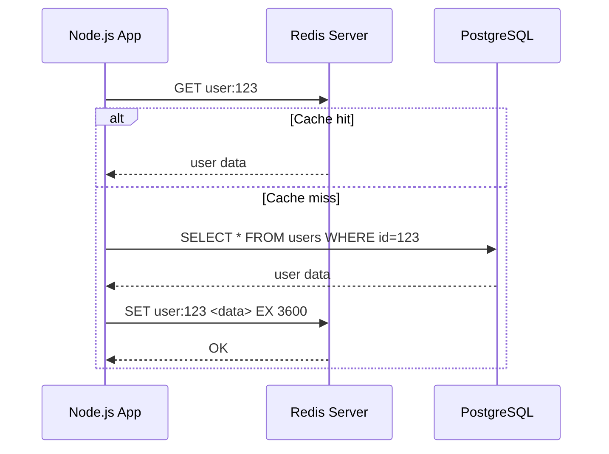
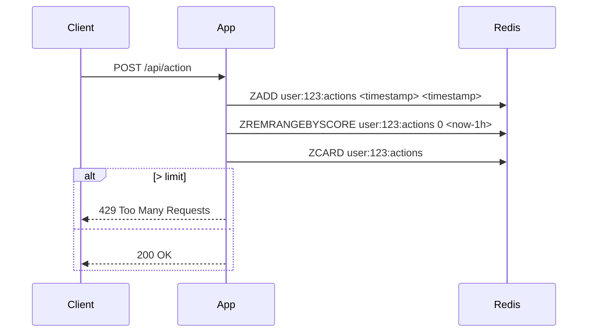

<!-- Generated by Groq via GitHub Actions -->
<!-- Topic ID: T048 -->
<!-- Category: Caching -->
<!-- Generated at UTC: 2026-10-03T17:30:24.188196+00:00 -->

# Redis

## 1. What problem does this solve?

| Problem | Why it matters | What happens if you ignore it | Real‑world use |
|---------|----------------|------------------------------|----------------|
| **Latency‑critical data access** | User‑facing services need sub‑millisecond responses. | Users see slow page loads, time‑outs, or degraded UX. | Caching database queries in a CDN or in‑app cache. |
| **Stateful session storage** | Stateless services (e.g., micro‑services) need to share session data. | Need to hit a DB for every request → higher latency, load. | Storing JWT‑less sessions, shopping carts, auth tokens. |
| **Pub/Sub messaging** | Decoupled services need lightweight event delivery. | Use heavy message brokers (Kafka, RabbitMQ) or poll. | Real‑time notifications, chat, leaderboard updates. |
| **Atomic counters & rate limiting** | Need to enforce per‑user limits without race conditions. | Race conditions → over‑use, abuse, or denial of service. | API rate limiting, login attempt throttling. |
| **In‑memory data structures** | Complex data structures (lists, sets, sorted sets) are needed. | Re‑implement in application memory → higher memory usage, bugs. | Leaderboards, job queues, real‑time analytics. |

If you skip Redis, you’ll either:

* Hit your primary database for every request → higher latency, higher cost.
* Build custom in‑process caches that don’t survive restarts or scale.
* Use a heavier message broker for simple key/value needs.

Redis is the go‑to solution for these patterns in modern backend stacks.

---

## 2. Mental model

### Analogy
Think of Redis as a **super‑fast pantry** in a kitchen.  
* The pantry is in the same room as the chef (your app), so the chef can grab ingredients instantly.  
* It holds only the most frequently used items (cache).  
* If the pantry runs out of space, the chef can decide to throw out the least used items (eviction).  
* The pantry can also keep a small inventory list (data structures) so the chef knows what’s inside without opening each shelf.

### Engineering model
* **In‑memory key/value store** – all data lives in RAM for sub‑millisecond access.  
* **Single‑threaded event loop** – commands are processed sequentially, eliminating locks.  
* **Persistence options** – optional snapshots (RDB) or append‑only logs (AOF) for durability.  
* **Replication & clustering** – for high availability and horizontal scaling.  
* **Rich data types** – strings, hashes, lists, sets, sorted sets, bitmaps, hyperloglogs, streams.

---

## 3. Deep explanation

### Internals
* **Memory layout** – Redis stores data in a compact, contiguous memory space.  
  * Strings: raw bytes.  
  * Hashes: ziplist or hashtable depending on size.  
  * Lists: linked list or ziplist.  
  * Sets: hashtable or intset.  
  * Sorted sets: skiplist + hashtable.  
* **Event loop** – single thread processes commands one at a time, using `select`/`epoll` for I/O.  
* **Persistence**  
  * **RDB** – point‑in‑time snapshot every N seconds.  
  * **AOF** – append‑only file, rewrites periodically.  
* **Replication** – master‑slave replication via asynchronous replication stream.  
* **Cluster** – 16‑slot hash space, each node owns a subset; supports automatic rebalancing.

### Important terminology
| Term | Meaning |
|------|---------|
| **Key** | Identifier for a value. |
| **TTL** | Time‑to‑live; key expiration. |
| **Eviction policy** | Strategy when memory is full (noeviction, allkeys‑lru, volatile‑ttl, etc.). |
| **Sentinel** | High‑availability monitor that watches masters/slaves and performs failover. |
| **Cluster** | Sharded Redis across multiple nodes. |
| **Pub/Sub** | Publish‑subscribe messaging pattern. |
| **Lua scripting** | Server‑side scripting for atomic operations. |

### Trade‑offs
| Aspect | Trade‑off |
|--------|-----------|
| **Memory vs Durability** | In‑memory gives speed; persistence adds overhead. |
| **Single‑threaded vs Concurrency** | No locks → simpler, but one command at a time; heavy CPU commands can block. |
| **Replication vs Latency** | Replication gives HA but adds replication lag. |
| **Cluster vs Sentinel** | Cluster gives sharding; Sentinel gives HA but no sharding. |
| **Eviction policy** | `noeviction` is safe but can cause OOM; `allkeys-lru` keeps hot data but may evict important keys. |

### Failure modes
* **Memory exhaustion** → OOM, eviction, or crash.  
* **Network partition** → stale replicas, split brain.  
* **Disk failure** (when using persistence) → data loss.  
* **Blocking commands** (`BLPOP`, `BRPOP`, `WAIT`) can stall the single thread.  

### Limitations
* Not a relational DB – no joins, ACID transactions.  
* Limited query language – only key‑based lookups or data‑type specific commands.  
* Data size limited by RAM; large datasets require sharding or external storage.  

### Where it fits
```
[Client] → [API Gateway] → [Microservice] → [Redis Cache] → [PostgreSQL]
```
* Cache layer between service and DB.  
* Session store for stateless services.  
* Pub/Sub for event delivery.  
* Rate limiter, job queue, leaderboard, etc.

### Interaction with related concepts
* **Load balancer** – can route traffic to Redis cluster nodes.  
* **CDN** – can cache Redis‑served data at edge.  
* **Database** – Redis often sits in front of a relational or document DB.  
* **Message broker** – Redis Pub/Sub is lighter weight than Kafka for simple events.  

---

## 4. How it works

### Cache hit/miss flow



### Rate limiter using sorted set



---

## 5. Practical implementation

### TypeScript example – caching a DB query

```ts
// src/cache.ts
import { createClient } from 'redis';
import { Pool } from 'pg';

const redis = createClient({
  url: process.env.REDIS_URL,
});
redis.on('error', err => console.error('Redis error', err));
await redis.connect();

const pgPool = new Pool({
  connectionString: process.env.DATABASE_URL,
});

/**
 * Fetch user by id, cache result for 5 minutes.
 */
export async function getUser(id: string) {
  const cacheKey = `user:${id}`;

  // 1️⃣ Try cache first
  const cached = await redis.get(cacheKey);
  if (cached) {
    console.log('Cache hit');
    return JSON.parse(cached);
  }

  // 2️⃣ Cache miss – query DB
  const res = await pgPool.query('SELECT * FROM users WHERE id = $1', [id]);
  const user = res.rows[0];
  if (!user) throw new Error('Not found');

  // 3️⃣ Store in Redis with TTL
  await redis.set(cacheKey, JSON.stringify(user), {
    EX: 300, // 5 minutes
  });

  console.log('Cache miss, stored');
  return user;
}
```

### Using Redis data structures – leaderboard

```ts
// src/leaderboard.ts
import { createClient } from 'redis';

const redis = createClient({ url: process.env.REDIS_URL });
await redis.connect();

/**
 * Add score to user in leaderboard.
 */
export async function addScore(userId: string, score: number) {
  await redis.zAdd('leaderboard', { score, value: userId });
}

/**
 * Get top N users.
 */
export async function top(n: number) {
  return await redis.zRangeWithScores('leaderboard', 0, n - 1, { REV: true });
}
```

---

## 6. Production considerations

| Concern | What to watch | Mitigation |
|---------|---------------|------------|
| **Scalability** | Memory limits, cluster size | Use Redis Cluster or sharding; monitor memory usage; auto‑scale nodes. |
| **Reliability** | Replication lag, node failure | Enable replication (Sentinel/Cluster), use persistence (AOF), backup snapshots. |
| **Security** | Unencrypted traffic, weak auth | Use TLS, require password or ACLs, restrict IPs, run in private subnet. |
| **Observability** | Latency spikes, memory pressure | Export metrics (Prometheus), enable slowlog, use Redis‑monitor. |
| **Performance** | Blocking commands, CPU usage | Avoid blocking ops, use Lua for atomic multi‑step ops, keep commands lightweight. |
| **Error handling** | Connection drops, timeouts | Implement retry with backoff, fallback to DB, circuit breaker. |
| **Resource usage** | RAM, CPU | Set `maxmemory` and eviction policy; monitor `used_memory`. |
| **Operational concerns** | Upgrades, patching | Use rolling updates, keep data on disk, test AOF rewrites. |
| **Failure recovery** | Data loss, OOM | Enable persistence, use `noeviction` with alerts, set `maxmemory-policy` appropriately. |
| **Deployment** | Docker, Kubernetes | Use sidecar pattern, health probes, secrets for credentials. |

---

## 7. Common mistakes

| Mistake | Why it hurts |
|---------|--------------|
| Using Redis for complex queries | Redis has no join/aggregate; leads to duplicated logic. |
| Ignoring persistence | Data loss on crash; not suitable for critical data. |
| Using blocking commands in hot paths | Blocks single thread → latency spikes. |
| Storing huge objects | Exceeds RAM, causes OOM, defeats caching purpose. |
| Forgetting TTL | Stale data, memory bloat. |
| Using default `noeviction` | OOM errors when memory limit reached. |
| Not pooling connections | Creates many connections, exhausting sockets. |
| Using Redis as primary DB | Lacks ACID, migrations, complex queries. |

---

## 8. Senior engineer perspective

### Design decisions at scale
| Decision | Considerations |
|----------|----------------|
| **Cluster vs Sentinel** | Cluster gives sharding; Sentinel gives HA but no sharding. |
| **Persistence strategy** | AOF for durability, RDB for fast restores; consider `appendfsync always` vs `everysec`. |
| **Eviction policy** | `allkeys-lru` keeps hot data; `volatile-lru` respects TTL. |
| **Memory format** | Use `ziplist` for small hashes/lists; `hashtable` for large. |
| **Key naming** | Prefixes for namespace, avoid collisions. |
| **Sharding strategy** | Hash slots, consistent hashing, or application‑level partitioning. |
| **Monitoring** | `INFO`, `MONITOR`, `SLOWLOG`, Prometheus exporters. |
| **Cost** | RAM is expensive; choose right instance size, use managed service. |

### Bottlenecks
* **Memory pressure** – OOM or eviction.  
* **Single‑threaded command processing** – heavy Lua or blocking ops.  
* **Network latency** – cross‑region traffic.  

### Failure scenarios
* **Network partition** – stale replicas, split brain.  
* **Master crash** – failover delay, data loss if `noeviction`.  
* **Disk failure** – AOF corruption.  

### When NOT to use
* Need ACID transactions or complex joins.  
* Persistently large datasets (> RAM).  
* Long‑term archival storage.  
* Strict durability without persistence.  

---

## 9. Interview questions

1. **Beginner** – *What is a Redis eviction policy and why is it important?*  
   *Answer:* Eviction policy decides which keys to remove when memory is full (e.g., `noeviction`, `allkeys-lru`, `volatile-ttl`). It prevents OOM and keeps hot data in memory.

2. **Beginner** – *How does Redis persistence work?*  
   *Answer:* Two mechanisms: RDB snapshots (point‑in‑time) and AOF (append‑only log). RDB is fast but may lose recent changes; AOF is more durable but slower.

3. **Senior** – *Explain how Redis Cluster achieves horizontal scaling and what happens during rebalancing.*  
   *Answer:* Cluster splits keyspace into 16,384 slots; each node owns a subset. Rebalancing moves slots between nodes, migrating keys. Clients use a hash slot algorithm to route commands. Rebalancing is online but can cause temporary latency.

4. **Senior** – *What are the trade‑offs between using Redis Sentinel and Redis Cluster for high availability?*  
   *Answer:* Sentinel provides HA with master‑slave replication but no sharding; Cluster offers sharding and HA but requires more complex client logic and can’t fail over a single node without re‑assigning slots.

5. **Scenario/Debugging** – *Your application suddenly starts returning `ERR maxmemory policy noeviction set and memory limit reached` errors. What steps would you take to diagnose and fix the issue?*  
   *Answer:*  
   1. Check `INFO memory` to see used memory and `maxmemory`.  
   2. Inspect keyspace: `KEYS *` or `SCAN`.  
   3. Identify large keys (`MEMORY USAGE key`).  
   4. Decide on eviction policy or increase `maxmemory`.  
   5. Add TTLs or purge stale data.  
   6. Consider sharding or moving to a larger instance.

---

## 10. Hands‑on task

**Implement a per‑user rate limiter using Redis sorted sets in a Node.js project.**

1. Create an endpoint `/api/action` that accepts a user ID.  
2. Store each request timestamp in a sorted set `rate:user:<id>`.  
3. Keep only the last 60 seconds of timestamps.  
4. If the count exceeds 10 requests, return `429`.  
5. Use `node-redis` and TypeScript.  
6. Write unit tests that simulate rapid requests and verify the limiter.

---

## 11. Quick revision

- Redis is an in‑memory key/value store with rich data types.  
- Single‑threaded event loop → no locks, but blocking ops stall all commands.  
- Persistence: RDB snapshots + AOF logs.  
- Replication: master‑slave (Sentinel) or sharding (Cluster).  
- Eviction policies control memory usage (`noeviction`, `allkeys-lru`, etc.).  
- Common use cases: cache, session store, pub/sub, rate limiting, leaderboards.  
- Watch for memory exhaustion, blocking commands, and missing TTLs.  
- Use connection pooling and retry logic.  
- Monitor memory, latency, replication lag, and slowlog.  
- Avoid using Redis as a primary relational DB.  
- For scale: choose cluster vs sentinel, set proper eviction, enable persistence, and secure connections.

---

## 12. References

- https://redis.io/docs/
- https://redis.io/docs/manual/persistence/
- https://redis.io/docs/manual/cluster/
- https://redis.io/docs/manual/sentinel/
- https://github.com/redis/node-redis
- https://github.com/luin/ioredis
- https://redis.io/docs/reference/commands/
- https://redis.io/docs/management/monitoring/
- https://redis.io/docs/management/security/
- https://redis.io/docs/management/backup/
