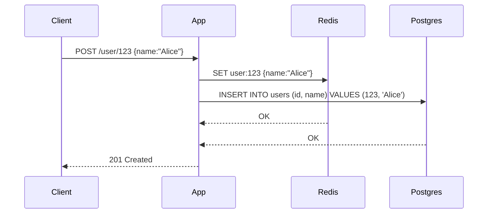

<!-- Generated by Groq via GitHub Actions -->
<!-- Topic ID: T050 -->
<!-- Category: Caching -->
<!-- Generated at UTC: 2026-10-04T07:05:46.146469+00:00 -->

# Write‑through cache

## 1. What problem does this solve?

**Motivation**  
In a typical backend you have a *primary* data store (e.g., PostgreSQL) and a *secondary* fast store (e.g., Redis). Reads are cheap from Redis, writes are cheap to PostgreSQL. The challenge is keeping the two in sync. If you write only to PostgreSQL and read from Redis, the cache can become stale. If you write only to Redis, the data never reaches the durable store.

**Problem exists**  
- **Stale data**: A client reads from cache after a write that only updated the primary store, getting old values.  
- **Data loss**: If the cache is in-memory and a crash occurs, writes that never hit the primary store are lost.  
- **Complexity**: Manual cache invalidation or refresh logic is error‑prone.

**Why it matters**  
- Users see incorrect data → bad UX.  
- Business logic may rely on the latest state (e.g., inventory counts).  
- Regulatory compliance may require durable persistence.

**What happens if not used**  
- You either accept stale reads (cache‑aside) or duplicate writes (write‑back).  
- You need complex invalidation logic or risk data loss.

**Real‑world appearance**  
- E‑commerce sites keep product inventory in Redis for fast reads but must persist to PostgreSQL.  
- Social media feeds cache user timelines in Redis but must write back to a write‑through layer.  
- Payment systems write transaction logs to both Kafka (for event sourcing) and a cache for quick status checks.

---

## 2. Mental model

**Analogy**  
Imagine a *copy‑and‑paste* workflow: every time you edit a document, you copy the new version to a shared folder **and** to your local clipboard. The clipboard is fast (you can paste instantly), but the shared folder is the permanent archive. The *write‑through* policy guarantees that every edit goes to both places at the same time.

**Engineering model**  
- **Primary store**: durable, slower (PostgreSQL).  
- **Cache**: fast, volatile (Redis).  
- **Write‑through**: every write operation updates *both* stores atomically (or at least in a coordinated way).  
- **Read**: usually from cache; if cache miss, read from primary and populate cache.

---

## 3. Deep explanation

### Internals
1. **Write path**  
   - Application receives a write request.  
   - It writes to the cache first (or concurrently).  
   - Then writes to the primary store.  
   - If the cache write fails, the operation may abort or retry.  
   - If the primary write fails, the cache entry is rolled back or marked stale.

2. **Read path**  
   - Check cache.  
   - On hit → return.  
   - On miss → read from primary, populate cache, return.

### Important terminology
- **Cache coherence**: ensuring cache reflects the latest primary state.  
- **Atomicity**: the write to cache and primary should be treated as a single unit.  
- **Consistency model**: *strong consistency* (write‑through guarantees) vs *eventual consistency* (cache‑aside).  
- **Eviction policy**: how cache entries are removed (LRU, TTL).

### Trade‑offs
| Aspect | Write‑through | Cache‑aside |
|--------|---------------|-------------|
| **Staleness** | None (strong consistency) | Possible |
| **Write latency** | Higher (must hit two stores) | Lower |
| **Complexity** | Higher (error handling, rollback) | Lower |
| **Durability** | Guaranteed | Risk of loss if cache only |
| **Scalability** | Limited by primary store throughput | Can scale reads independently |

### Failure modes
- **Cache write failure**: If Redis is down, writes may be rejected; you must decide whether to block or fallback.  
- **Primary write failure**: Cache may contain stale data; you need to invalidate or rollback.  
- **Network partition**: One store reachable, the other not → consistency violations.  
- **Cache eviction**: Data may be evicted before the primary is updated, leading to stale reads.

### Limitations
- **Write bottleneck**: Primary store becomes the limiting factor.  
- **Memory cost**: Cache must hold all frequently written data.  
- **Complex rollback**: If primary write fails after cache write, you must delete the cache entry.

### Where it fits
- **Microservice**: Service owns its own cache + DB.  
- **Shared cache**: Multiple services write to the same cache key; coordination needed.  
- **Event‑driven**: Use Kafka to propagate writes to cache asynchronously (write‑back pattern).

### Interaction with related concepts
- **Cache‑aside**: simpler but weaker consistency.  
- **Write‑back**: writes only to cache, flushes later; risk of loss.  
- **CQRS**: Separate read/write models; write‑through can be part of the write side.  
- **Idempotency keys**: Important for retrying writes without duplication.

---

## 4. How it works



**Step‑by‑step flow**

1. Client sends a write request.  
2. App writes to Redis (`SET`).  
3. App writes to PostgreSQL (`INSERT/UPDATE`).  
4. If both succeed → respond success.  
5. If Redis fails → abort or retry.  
6. If Postgres fails → delete Redis entry or mark stale.  
7. Subsequent reads hit Redis; on miss, read from Postgres and repopulate.

---

## 5. Practical implementation

### TypeScript/Node.js example (Express + Redis + PostgreSQL)

```ts
// src/cache.ts
import { createClient } from 'redis';
export const redis = createClient({ url: process.env.REDIS_URL! });

redis.on('error', err => console.error('Redis error', err));
await redis.connect();
```

```ts
// src/db.ts
import { Pool } from 'pg';
export const pool = new Pool({
  connectionString: process.env.DATABASE_URL,
});
```

```ts
// src/userService.ts
import { redis } from './cache';
import { pool } from './db';

export async function upsertUser(id: number, name: string) {
  const key = `user:${id}`;

  // 1️⃣ Write to cache first
  await redis.set(key, JSON.stringify({ id, name }));

  // 2️⃣ Write to DB
  const query = `
    INSERT INTO users (id, name)
    VALUES ($1, $2)
    ON CONFLICT (id) DO UPDATE SET name = EXCLUDED.name
  `;
  await pool.query(query, [id, name]);

  // 3️⃣ If DB write fails, rollback cache
  // (simplified error handling)
}
```

```ts
// src/app.ts
import express from 'express';
import { upsertUser } from './userService';

const app = express();
app.use(express.json());

app.post('/user/:id', async (req, res) => {
  const id = Number(req.params.id);
  const { name } = req.body;
  try {
    await upsertUser(id, name);
    res.status(201).send({ id, name });
  } catch (err) {
    console.error(err);
    res.status(500).send({ error: 'Internal error' });
  }
});

app.get('/user/:id', async (req, res) => {
  const id = Number(req.params.id);
  const key = `user:${id}`;
  const cached = await redis.get(key);
  if (cached) {
    return res.send(JSON.parse(cached));
  }
  const { rows } = await pool.query('SELECT * FROM users WHERE id = $1', [id]);
  if (!rows.length) return res.status(404).send();
  const user = rows[0];
  await redis.set(key, JSON.stringify(user));
  res.send(user);
});

app.listen(3000, () => console.log('Server running'));
```

**Key lines explained**

- `redis.set(key, ...)` writes to cache *before* DB to keep cache fresh.  
- `ON CONFLICT` ensures idempotent upserts.  
- Cache is populated on read miss to keep it warm.

---

## 6. Production considerations

| Concern | How to address |
|---------|----------------|
| **Scalability** | Use Redis cluster or sharding; keep cache writes idempotent. |
| **Reliability** | Wrap writes in transactions or use two‑phase commit patterns. |
| **Security** | Encrypt Redis traffic (TLS), use ACLs; secure DB credentials. |
| **Observability** | Log cache hit/miss ratios; expose metrics (`redis:keys`, `db:queries`). |
| **Performance** | Tune Redis eviction policy; use TTLs for stale data. |
| **Error handling** | Retry with exponential backoff; fallback to DB-only writes if cache down. |
| **Resource usage** | Monitor memory usage; purge unused keys. |
| **Operational concerns** | Backup Redis snapshots; monitor replication lag. |
| **Failure recovery** | On DB failure, mark cache entries as stale and trigger refresh. |
| **Deployment** | Use Docker Compose or Kubernetes; separate cache and DB pods. |

---

## 7. Common mistakes

| Mistake | Why it’s problematic |
|---------|----------------------|
| Writing to cache *after* DB without rollback | Cache may contain stale data if DB fails. |
| Ignoring cache eviction | Memory exhaustion, stale data persists. |
| Using a single Redis instance in production | Single point of failure; no horizontal scaling. |
| Not handling partial failures | Inconsistent state between cache and DB. |
| Over‑caching infrequently accessed data | Wastes memory; increases write load. |
| Forgetting to set TTL on cache entries | Stale data can persist indefinitely. |
| Using `SET` without `NX/XX` for idempotency | Duplicate writes may corrupt cache. |
| Not monitoring cache hit ratio | Misses indicate cache misconfiguration. |

---

## 8. Senior engineer perspective

### What changes at scale?

- **Architecture decisions**  
  - Use a *distributed* Redis cluster with read replicas.  
  - Separate cache namespaces per service to avoid key collisions.  
  - Consider a *write‑through* micro‑service that batches writes to reduce load.

- **Trade‑offs**  
  - Strong consistency vs. latency: sometimes a *write‑back* or *cache‑aside* approach is preferable for high write throughput.  
  - Cost of running a dedicated Redis cluster vs. using managed services.

- **Bottlenecks**  
  - Primary DB throughput becomes the limiting factor.  
  - Network latency between app, Redis, and DB can add to write latency.

- **Failure scenarios**  
  - Network partition: use *quorum* writes or *optimistic* updates.  
  - Cache crash: ensure graceful degradation (fallback to DB).  

- **Monitoring**  
  - Cache hit/miss ratio, eviction count, replication lag.  
  - DB query latency, connection pool usage.  

- **Cost/performance**  
  - Redis memory cost grows with hot data set size.  
  - DB write amplification can increase storage costs.  

- **When NOT to use**  
  - Extremely high write rates where DB is the bottleneck.  
  - When eventual consistency is acceptable (use cache‑aside).  
  - When data is rarely read (no cache benefit).

---

## 9. Interview questions

1. **Beginner**: *What is a write‑through cache and how does it differ from a cache‑aside strategy?*  
   *Answer*: Write‑through writes to both cache and primary store immediately, guaranteeing consistency. Cache‑aside writes only to primary; reads go to cache, leading to possible staleness.

2. **Beginner**: *Why might you choose a write‑through cache over a write‑back cache?*  
   *Answer*: Write‑through ensures durability and immediate consistency; write‑back risks data loss if the cache crashes before flushing.

3. **Senior**: *Describe how you would handle a scenario where the cache write succeeds but the database write fails in a write‑through system.*  
   *Answer*: Roll back the cache entry (delete or mark stale), possibly retry the DB write, and expose an error to the client. Use transactions or compensating actions.

4. **Senior**: *Explain the trade‑offs between using a single Redis instance versus a Redis cluster for a write‑through cache in a high‑traffic service.*  
   *Answer*: Single instance is simpler but a single point of failure and limited throughput. Cluster offers horizontal scaling, high availability, but adds complexity (sharding, replication lag).

5. **Scenario/Debugging**: *You notice that after a recent deployment, read latency has doubled and cache hit ratio dropped from 95% to 70%. What could be causing this and how would you investigate?*  
   *Answer*: Possible causes: new code writes to a different cache key, increased TTL leading to evictions, Redis cluster misconfiguration, or DB writes causing cache invalidation. Investigate by checking key patterns, monitoring eviction stats, reviewing recent code changes, and inspecting Redis cluster health.

---

## 10. Hands‑on task

**Task**: Extend the existing Express service to support *cache invalidation on delete*.

1. Add a `DELETE /user/:id` endpoint.  
2. When a user is deleted, remove the corresponding Redis key *before* deleting from PostgreSQL.  
3. Ensure that if the DB delete fails, the cache entry is restored.  
4. Write a Jest test that verifies the cache is cleared after deletion.

*Deliverable*: A pull request with the new endpoint, rollback logic, and tests.

---

## 11. Quick revision

- Write‑through writes to cache **and** primary store atomically.  
- Guarantees strong consistency at the cost of higher write latency.  
- Cache hit → fast; miss → read from DB, populate cache.  
- Failure handling: rollback cache on DB failure; abort on cache failure.  
- Common pitfalls: stale cache, eviction, single‑point failure.  
- Use TTLs and eviction policies to manage memory.  
- Monitor hit/miss ratio, eviction count, replication lag.  
- Scale Redis with clustering; DB remains bottleneck.  
- Prefer write‑through when durability and consistency are critical.  
- Consider write‑back or cache‑aside for high‑write workloads.

---

## 12. References

- [Redis Documentation – Write‑through Cache Patterns](https://redis.io/docs/stack/cache/strategies/)  
- [PostgreSQL Documentation – UPSERT (ON CONFLICT)](https://www.postgresql.org/docs/current/sql-insert.html)  
- [Node.js Redis Client (ioredis) – API](https://github.com/luin/ioredis)  
- [Express.js Guide – Routing](https://expressjs.com/en/guide/routing.html)  
- [OpenTelemetry – Observability for Distributed Systems](https://opentelemetry.io/docs/)  

---
