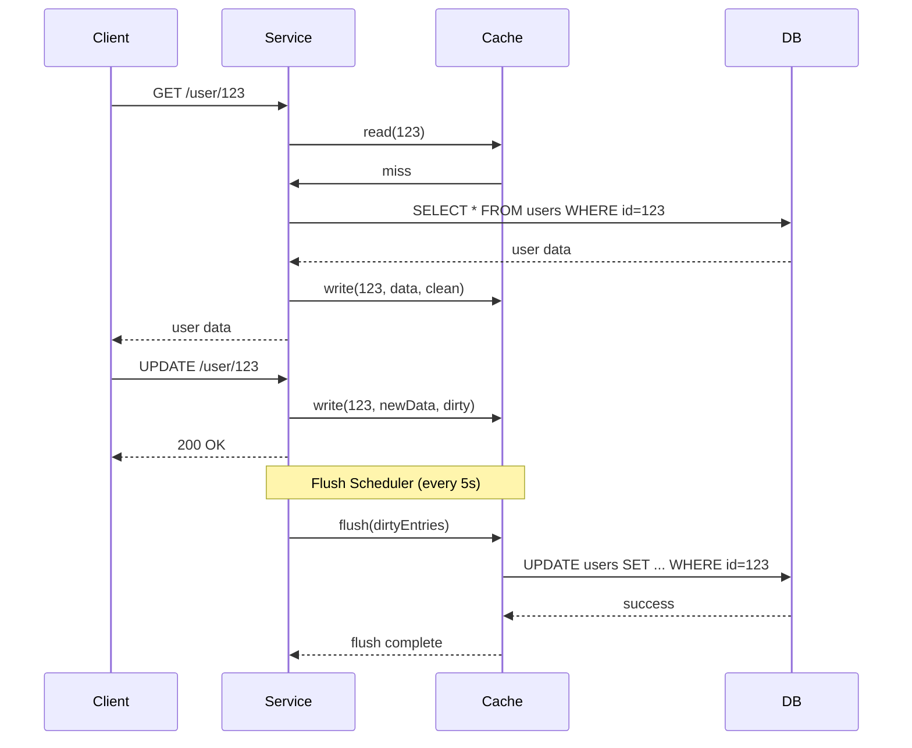

<!-- Generated by Groq via GitHub Actions -->
<!-- Topic ID: T051 -->
<!-- Category: Caching -->
<!-- Generated at UTC: 2026-10-04T17:45:11.792169+00:00 -->

# Write‑back cache

## 1. What problem does this solve?

### Motivation

When a backend service reads data from a slow storage (e.g., a relational database or a distributed file system), it often keeps a copy in a fast in‑memory store (cache). The cache can drastically reduce read latency and offload traffic from the primary store.

However, when the service updates data, two questions arise:

1. **Do we write the change immediately to the backing store?**  
2. **How do we keep the cache and the backing store in sync?**

A *write‑through* cache writes every update to the backing store right away, guaranteeing consistency but incurring the latency of the slower store on every write. A *write‑back* cache defers the write to the backing store, batching updates and writing them later. This reduces write latency and can improve throughput, but introduces complexity around consistency, durability, and failure recovery.

### Why it matters

- **Latency**: In high‑traffic services, a write‑through cache can become a bottleneck because each write waits for the database round‑trip.
- **Throughput**: Write‑back allows the service to accept many writes quickly, then flush them in bulk, which is more efficient for databases that perform better with batch writes.
- **Consistency**: Some applications can tolerate eventual consistency for writes, making write‑back a viable strategy.

### Consequences of not using write‑back

- **Higher write latency**: Every write stalls until the database acknowledges.
- **Database overload**: A surge of writes can overwhelm the database, leading to timeouts or throttling.
- **Simpler code**: Write‑through is easier to reason about but may not meet performance goals.

### Real‑world usage

- **Session stores**: Many web apps keep session data in Redis with write‑back to a persistent store for audit.
- **Analytics pipelines**: Write‑back caches buffer event counts before flushing to a data warehouse.
- **E‑commerce inventory**: Inventory counts are updated in a cache and flushed to the database during low‑traffic periods.

---

## 2. Mental model

### Analogy: The “Notebook & Ledger” system

- **Notebook**: A quick‑access notebook where you jot down changes as you go. It’s fast but not the official record.
- **Ledger**: The official ledger that must be updated eventually. It’s slower to write to because it’s a shared, durable file.

You write in the notebook during the day (write‑back). At the end of the day, you reconcile the notebook with the ledger (flush). If you forget to reconcile, the ledger is out of date.

### Engineering model

- **Cache layer**: Holds the most recent data in memory, marked as *dirty* when modified.
- **Dirty flag / write buffer**: Tracks which entries need to be persisted.
- **Flush mechanism**: Periodically or on eviction, writes dirty entries to the backing store.
- **Consistency window**: The period between a write and its persistence is the *staleness* window.

---

## 3. Deep explanation

### Internals

| Component | Role |
|-----------|------|
| **Cache store** (e.g., Redis, in‑process Map) | Fast read/write access |
| **Dirty flag** | Indicates that an entry has been modified but not yet persisted |
| **Write buffer** | Queue or batch of dirty entries awaiting flush |
| **Flush scheduler** | Triggers flushes based on time, size, or eviction |
| **Persistence layer** | Primary store (PostgreSQL, MongoDB, etc.) |
| **Failure handler** | Persists buffer to disk or retries on crash |

### Important terminology

- **Dirty entry**: A cache entry that has been modified but not yet written to the backing store.
- **Write‑back policy**: Rules that determine when a dirty entry is flushed (time‑based, size‑based, or event‑based).
- **Consistency model**: The guarantees the system offers (e.g., eventual consistency, read‑your‑writes).
- **Write‑ahead log**: Optional log that records changes before they are applied to the cache, enabling crash recovery.

### Trade‑offs

| Aspect | Write‑through | Write‑back |
|--------|---------------|------------|
| **Latency** | High (write waits for DB) | Low (write is local) |
| **Throughput** | Limited by DB | Higher, thanks to batching |
| **Consistency** | Strong (immediate) | Eventual (depends on flush) |
| **Complexity** | Simple | Complex (flush logic, crash recovery) |
| **Durability** | Immediate | Risk of data loss if crash before flush |

### Failure modes

1. **Crash before flush**: Dirty data lost → data inconsistency.
2. **Flush failure**: Partial writes → need idempotent writes or retry logic.
3. **Network partition**: Cache may continue to accept writes while the backing store is unreachable.
4. **Eviction of dirty entries**: If eviction policy removes dirty data without flushing, data loss occurs.

### Limitations

- **Not suitable for strongly consistent workloads** where every write must be immediately visible.
- **Requires careful eviction policy**: Evicting dirty entries without flushing is dangerous.
- **Complexity in distributed systems**: Coordinating flushes across nodes can be hard.

### Where it fits in a backend architecture

```
┌───────────────────────┐
│  Client / API Gateway │
└────────────┬──────────┘
             │
┌────────────▼──────────┐
│  Service Layer (Node) │
│  ├─ Cache (write‑back) │
│  └─ Persistence (DB)   │
└───────────────────────┘
```

The cache sits between the service layer and the persistence layer. It can be in‑process or a separate Redis instance. The service layer writes to the cache; the cache flushes to the DB asynchronously.

### Interaction with related concepts

- **Cache invalidation**: Write‑back changes the invalidation strategy; you may need to propagate invalidation events after flush.
- **Event sourcing**: Write‑back can be seen as a form of event buffering before persisting events.
- **CQRS**: The write side can use write‑back to buffer updates before updating the read model.

---

## 4. How it works

### Step‑by‑step flow

1. **Read request**  
   - Service checks cache.  
   - If hit, returns value.  
   - If miss, fetches from DB, stores in cache (clean), returns.

2. **Write request**  
   - Service updates cache entry.  
   - Marks entry as *dirty* and pushes to write buffer.  
   - Returns immediately (no DB round‑trip).

3. **Flush trigger** (time‑based, size‑based, or on eviction)  
   - Scheduler picks dirty entries from buffer.  
   - Performs bulk write to DB.  
   - On success, clears dirty flag.  
   - On failure, retries or logs for manual intervention.

4. **Crash recovery**  
   - On startup, read any persisted write‑ahead log or buffer from disk.  
   - Replay to DB before serving requests.

### Mermaid diagram



---

## 5. Practical implementation

Below is a minimal, runnable TypeScript example that implements a write‑back cache for a user profile service. It uses an in‑process `Map` for the cache and PostgreSQL for persistence. The flush logic runs every 5 seconds.

```ts
// src/writeBackCache.ts
import { Pool } from 'pg';
import { setInterval } from 'timers/promises';

interface UserProfile {
  id: string;
  name: string;
  email: string;
  // ... other fields
}

type CacheEntry = {
  value: UserProfile;
  dirty: boolean;
};

export class WriteBackCache {
  private cache = new Map<string, CacheEntry>();
  private flushIntervalMs = 5000;
  private pool: Pool;
  private flushing = false;

  constructor(pgPool: Pool) {
    this.pool = pgPool;
    this.startFlushLoop();
  }

  /** Read from cache, fallback to DB */
  async get(id: string): Promise<UserProfile | null> {
    const entry = this.cache.get(id);
    if (entry) return entry.value;

    const res = await this.pool.query<UserProfile>(
      'SELECT id, name, email FROM users WHERE id = $1',
      [id]
    );
    if (res.rows.length === 0) return null;

    const user = res.rows[0];
    this.cache.set(id, { value: user, dirty: false });
    return user;
  }

  /** Write to cache and mark dirty */
  async set(id: string, user: UserProfile): Promise<void> {
    this.cache.set(id, { value: user, dirty: true });
  }

  /** Flush dirty entries to DB */
  private async flush(): Promise<void> {
    if (this.flushing) return; // avoid concurrent flushes
    this.flushing = true;

    const dirtyEntries: CacheEntry[] = [];
    for (const [id, entry] of this.cache.entries()) {
      if (entry.dirty) dirtyEntries.push(entry);
    }

    if (dirtyEntries.length === 0) {
      this.flushing = false;
      return;
    }

    const client = await this.pool.connect();
    try {
      await client.query('BEGIN');
      for (const entry of dirtyEntries) {
        const { id, name, email } = entry.value;
        await client.query(
          `INSERT INTO users (id, name, email)
           VALUES ($1, $2, $3)
           ON CONFLICT (id) DO UPDATE
           SET name = EXCLUDED.name,
               email = EXCLUDED.email`,
          [id, name, email]
        );
        // Mark as clean
        const cached = this.cache.get(id);
        if (cached) cached.dirty = false;
      }
      await client.query('COMMIT');
    } catch (err) {
      await client.query('ROLLBACK');
      console.error('Flush failed', err);
      // In production, persist dirtyEntries to a write‑ahead log
    } finally {
      client.release();
    }

    this.flushing = false;
  }

  /** Periodically flush */
  private async startFlushLoop() {
    while (true) {
      await setInterval(this.flushIntervalMs);
      await this.flush();
    }
  }
}
```

### Usage

```ts
// src/index.ts
import { Pool } from 'pg';
import { WriteBackCache } from './writeBackCache';

const pool = new Pool({
  connectionString: process.env.DATABASE_URL,
});

const cache = new WriteBackCache(pool);

// Example API route (Express)
import express from 'express';
const app = express();
app.use(express.json());

app.get('/user/:id', async (req, res) => {
  const user = await cache.get(req.params.id);
  if (!user) return res.status(404).send('Not found');
  res.json(user);
});

app.put('/user/:id', async (req, res) => {
  const user: UserProfile = { id: req.params.id, ...req.body };
  await cache.set(user.id, user);
  res.sendStatus(200);
});

app.listen(3000, () => console.log('Server listening on 3000'));
```

> **Note**: In a real deployment you would:
> - Use a dedicated Redis instance instead of an in‑process map.
> - Persist dirty entries to a write‑ahead log on disk to survive crashes.
> - Add metrics (e.g., number of dirty entries, flush latency).
> - Handle eviction policies (LRU) that respect dirty flags.

---

## 6. Production considerations

| Concern | How to address it |
|---------|-------------------|
| **Scalability** | Use a distributed cache (Redis Cluster) and shard the write buffer per node. |
| **Reliability** | Persist dirty entries to a durable log; retry flushes on failure. |
| **Security** | Encrypt cache data at rest if using Redis; secure DB credentials. |
| **Observability** | Expose metrics: `dirty_entries`, `flush_latency`, `flush_failures`. |
| **Performance** | Tune flush interval and batch size; use prepared statements. |
| **Error handling** | On flush failure, mark entries as *stale* and alert. |
| **Resource usage** | Monitor memory consumption of the cache; set eviction policies. |
| **Operational concerns** | Provide a manual flush endpoint for maintenance windows. |
| **Failure recovery** | On startup, replay write‑ahead log before accepting traffic. |
| **Deployment** | Use container orchestration (K8s) with sidecar for Redis; enable graceful shutdown to trigger final flush. |

---

## 7. Common mistakes

| Mistake | Why it’s problematic |
|---------|----------------------|
| **Evicting dirty entries without flushing** | Data loss; cache becomes source of truth. |
| **Using a very long flush interval** | Increases staleness window; risk of data loss on crash. |
| **Ignoring idempotency** | Duplicate flushes can corrupt data if not handled. |
| **Not handling partial failures** | A single failed write can leave the cache and DB out of sync. |
| **Assuming in‑process cache is sufficient** | In a multi‑instance deployment, each instance has its own cache → inconsistency. |
| **Not monitoring flush metrics** | Hidden backlogs can grow unnoticed, leading to memory exhaustion. |

---

## 8. Senior engineer perspective

### Architecture decisions

- **Cache placement**: In‑process vs external (Redis). External gives consistency across instances but adds network latency.
- **Eviction policy**: Must respect dirty flags; consider *write‑back LRU* that flushes before eviction.
- **Flush strategy**: Time‑based vs size‑based vs event‑driven. Hybrid approaches often work best.
- **Write‑ahead logging**: Decide whether to use a separate log (e.g., Kafka topic) or a local file.

### Trade‑offs

- **Latency vs durability**: Short flush intervals reduce staleness but increase DB load.
- **Complexity vs performance**: Adding a write‑ahead log increases reliability but adds code complexity.
- **Cost**: More frequent DB writes increase operational costs; batching reduces it.

### Bottlenecks

- **DB write throughput**: If flushes overwhelm the DB, you’ll see backpressure.
- **Network latency**: External cache adds round‑trip time; in‑process is faster but not shared.
- **Memory pressure**: Large dirty buffers can exhaust memory.

### Failure scenarios

- **Crash during flush**: Use transaction rollback and retry logic.
- **Network partition**: Cache continues to accept writes; flush will retry once connectivity is restored.
- **Data corruption**: Ensure idempotent writes and use checksums.

### Monitoring

- **Prometheus metrics**: `dirty_entries_total`, `flush_latency_seconds`, `flush_errors_total`.
- **Alerting**: Trigger when `dirty_entries_total` exceeds threshold or `flush_errors_total` spikes.
- **Tracing**: Correlate cache writes with DB writes to detect delays.

### Cost/performance considerations

- **DB cost**: Batching reduces per‑write cost but may increase transaction size.
- **Cache cost**: Redis Cluster nodes cost per memory; in‑process cache is free but limited by VM size.
- **Operational overhead**: Write‑ahead log requires storage and backup.

### When NOT to use write‑back

- **Strong consistency required**: e.g., banking transactions.
- **Low write volume**: Write‑through may be simpler and sufficient.
- **Stateless services**: If you can afford to read from DB on every write.

---

## 9. Interview questions

1. **Beginner**: *What is the difference between write‑through and write‑back caching?*  
   **Answer**: Write‑through writes every update to the backing store immediately; write‑back buffers updates in the cache and writes them later.

2. **Beginner**: *Why might a write‑back cache lead to data loss?*  
   **Answer**: If the application crashes before the dirty entries are flushed, the changes are lost because they never reached the durable store.

3. **Senior**: *Describe how you would design a write‑back cache for a distributed microservice architecture with multiple instances. What challenges arise?*  
   **Answer**: Use a shared external cache (Redis Cluster) and a write‑ahead log (Kafka). Challenges include coordinating flushes, avoiding duplicate writes, handling network partitions, and ensuring that eviction policies respect dirty flags across instances.

4. **Senior**: *Explain how you would monitor the health of a write‑back cache system and what metrics would be most critical.*  
   **Answer**: Key metrics: number of dirty entries, flush latency, flush failures, cache hit/miss ratio, memory usage. Alerts on high dirty count or repeated flush failures.

5. **Scenario/Debugging**: *Your service uses a write‑back cache. After a recent deployment, users report that updates are not visible for up to 30 seconds. What could be causing this, and how would you investigate?*  
   **Answer**: Likely the flush interval was increased or the flush process is failing. Investigate logs for flush errors, check the flush scheduler, verify that the write‑ahead log is being processed, and confirm that the cache eviction policy isn’t discarding dirty entries. Use metrics to see if dirty entries accumulate.

---

## 10. Hands‑on task

**Task**: Extend the provided `WriteBackCache` to support *eviction with write‑back*.

1. Add an LRU eviction policy that evicts the least recently used entries when the cache size exceeds a threshold (e.g., 10,000 entries).  
2. Ensure that if an evicted entry is dirty, it is flushed to the database before removal.  
3. Add a `/flush` HTTP endpoint that forces an immediate flush of all dirty entries.  
4. Write a test script that performs 20,000 writes, triggers eviction, and verifies that all data is persisted in PostgreSQL.

---

## 11. Quick revision

- Write‑back caches defer persistence to improve write latency and throughput.
- Dirty entries are marked and flushed in batches.
- Eviction must respect dirty flags to avoid data loss.
- Flush interval and batch size balance staleness vs DB load.
- Crash recovery requires a write‑ahead log or replay mechanism.
- Monitoring dirty count and flush latency is essential.
- Write‑back is unsuitable for strong consistency workloads.
- In distributed systems, use a shared cache (Redis) and a durable log (Kafka).
- Idempotent writes prevent corruption on retries.
- Proper eviction policy and graceful shutdown are critical for reliability.

---

## 12. References

- [Node.js `timers/promises` API](https://nodejs.org/api/timers.html#timers_promises)
- [PostgreSQL `ON CONFLICT` syntax](https://www.postgresql.org/docs/current/sql-insert.html)
- [Redis LRU eviction policy](https://redis.io/docs/manual/eviction/)
- [Prometheus metrics guide](https://prometheus.io/docs/introduction/overview/)
- [Kafka as a write‑ahead log](https://kafka.apache.org/documentation/#producerconfigs)
- [Write‑through vs write‑back caching](https://www.geeksforgeeks.org/write-through-write-back-caching/)

---
