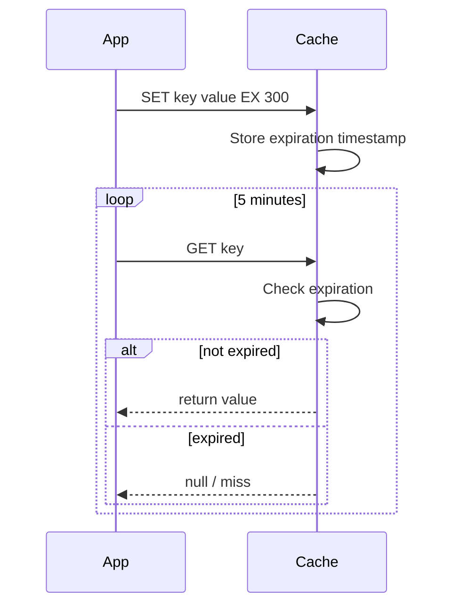

<!-- Generated by Groq via GitHub Actions -->
<!-- Topic ID: T053 -->
<!-- Category: Caching -->
<!-- Generated at UTC: 2026-10-05T07:18:27.009699+00:00 -->

# TTL

## 1. What problem does this solve?

**Motivation**  
Backends often serve data that changes over time: user profiles, product prices, session tokens, or computed analytics. Keeping every piece of data in memory forever is impossible—memory is finite, and stale data can mislead users or cause security issues.

**Problem**  
- **Stale data**: If a cached value never expires, clients may read outdated information.  
- **Resource waste**: Unbounded cache growth consumes RAM and can lead to evictions of useful data.  
- **Security**: Session tokens or temporary tokens that remain valid indefinitely can be abused.

**Why it matters**  
- **User experience**: Fresh data keeps the UI accurate.  
- **Cost**: Memory is expensive; over‑provisioning leads to higher infrastructure bills.  
- **Compliance**: Certain data must be purged after a period (GDPR, PCI‑DSS).

**Consequences of not using TTL**  
- Cache bloat → frequent evictions → cache misses → increased latency.  
- Stale data → incorrect business logic, potential fraud.  
- Uncontrolled growth of temporary data (e.g., session tables) → database bloat.

**Real‑world appearance**  
- Redis cache keys for product listings (`product:123`).  
- MongoDB TTL indexes for session collections (`expiresAt`).  
- PostgreSQL `pg_cron` jobs that delete rows older than a threshold.  
- Kafka message retention policies (`retention.ms`).  
- HTTP headers like `Cache-Control: max-age=3600`.

---

## 2. Mental model

**Analogy**  
Think of a grocery store shelf. Fresh produce is placed on the front and has a “sell‑by” date. Once that date passes, the produce is removed to avoid spoilage. TTL is that “sell‑by” date for data: it tells the system when the item should be considered expired and removed.

**Engineering model**  
- **Key** → **Value** stored in a data store (cache, DB, message broker).  
- **Expiration timestamp** attached to the key/value pair.  
- **Eviction logic**: when the current time ≥ expiration, the key/value is removed automatically or lazily on access.  
- **TTL value** is the duration from write time until expiration.

---

## 3. Deep explanation

### Internals
- **Redis**: `SET key value EX 300` stores a key with a 5‑minute TTL. Redis keeps a *sorted set* of expiry times for fast lookup.  
- **MongoDB**: Create a TTL index on a date field (`expiresAt`). The background thread scans the index and deletes documents whose timestamp ≤ now.  
- **PostgreSQL**: No native TTL; usually implemented via a scheduled job (`DELETE FROM sessions WHERE expires_at < NOW();`).  
- **Kafka**: `retention.ms` or `retention.bytes` determine how long a topic keeps messages.

### Important terminology
- **TTL (Time‑to‑Live)**: Duration a key/value remains valid.  
- **Eviction**: Removal of expired data.  
- **Lazy expiration**: Expiry checked on access; key may stay in memory until read.  
- **Active expiration**: Background process scans and deletes expired keys.  
- **Clock skew**: Difference between server clocks; can cause premature or delayed expiration.  

### Trade‑offs
| Aspect | Short TTL | Long TTL |
|--------|-----------|----------|
| Freshness | High | Low |
| Memory usage | Low | High |
| Eviction overhead | Low | High |
| Consistency | Better | Worse |
| Complexity | Simple | Requires background jobs |

### Failure modes
- **Clock drift**: If a server’s clock is ahead, data may expire early.  
- **Network partition**: In a distributed cache, some nodes may not receive expiry messages, leading to stale reads.  
- **Missing TTL**: Forgetting to set TTL on a key can cause memory leaks.  
- **Over‑aggressive TTL**: Data may be evicted before a consumer reads it, causing cache misses.

### Limitations
- **Not a substitute for proper invalidation**: TTL only guarantees eventual removal; it does not actively propagate updates.  
- **No transactional guarantees**: In a distributed system, TTL may not be atomic with the write.  
- **No guarantee of exact eviction time**: Expiry is approximate; some systems evict a bit later.

### Where it fits in architecture
- **Cache‑aside pattern**: Application reads from cache; if miss, fetches from DB and writes to cache with TTL.  
- **Session store**: Redis or DB table with TTL for session tokens.  
- **Rate limiting**: Store counters with TTL to reset counts.  
- **Message queue retention**: Keep messages only for a limited time.

### Interaction with related concepts
- **Cache invalidation**: TTL is a passive invalidation strategy; explicit invalidation (e.g., `DEL key`) is complementary.  
- **Eventual consistency**: TTL can help reconcile stale reads by ensuring data eventually disappears.  
- **Eviction policies**: When memory is full, Redis may evict keys based on TTL or LRU.  
- **Security**: Expiring tokens reduces attack surface.

---

## 4. How it works

1. **Write**: Application writes `key → value` to the store with a TTL.  
2. **Store metadata**: The store records the *expiration timestamp* (`write_time + TTL`).  
3. **Access**: On read, the store checks if `now ≥ expiration`.  
   - If expired → return miss / delete key.  
   - If not expired → return value.  
4. **Eviction**:  
   - *Lazy*: Expiration checked on access.  
   - *Active*: Background thread/process scans expiry times and removes keys.  
5. **Cleanup**: Expired keys are removed from memory/disk, freeing resources.



---

## 5. Practical implementation

### Node.js + Redis (ioredis)

```ts
// cache.ts
import Redis from 'ioredis';

const redis = new Redis(); // defaults to localhost:6379

/**
 * Cache a value with a TTL of `seconds`.
 * @param key Cache key
 * @param value Value to store (JSON serializable)
 * @param ttlSeconds Time‑to‑Live in seconds
 */
export async function setWithTTL<T>(key: string, value: T, ttlSeconds: number) {
  // Store as JSON string
  await redis.set(key, JSON.stringify(value), 'EX', ttlSeconds);
}

/**
 * Retrieve a cached value. Returns null if missing or expired.
 */
export async function getWithTTL<T>(key: string): Promise<T | null> {
  const raw = await redis.get(key);
  if (!raw) return null;
  return JSON.parse(raw) as T;
}
```

**Usage**

```ts
import { setWithTTL, getWithTTL } from './cache';

interface UserProfile {
  id: string;
  name: string;
  lastLogin: string;
}

// Cache user profile for 10 minutes
await setWithTTL(`user:${id}`, profile, 600);

// Later
const cached = await getWithTTL<UserProfile>(`user:${id}`);
```

### MongoDB TTL index

```js
// In a MongoDB collection `sessions`
db.sessions.createIndex(
  { expiresAt: 1 },
  { expireAfterSeconds: 0 } // delete when expiresAt <= now
);
```

Insert a session:

```js
db.sessions.insertOne({
  userId: 'abc123',
  token: 'xyz',
  expiresAt: new Date(Date.now() + 30 * 60 * 1000) // 30 minutes
});
```

### PostgreSQL scheduled cleanup

```sql
-- Create table
CREATE TABLE sessions (
  id SERIAL PRIMARY KEY,
  user_id TEXT NOT NULL,
  token TEXT NOT NULL,
  expires_at TIMESTAMP WITH TIME ZONE NOT NULL
);

-- Cron job (pg_cron)
SELECT cron.schedule(
  '*/5 * * * *', -- every 5 minutes
  $$DELETE FROM sessions WHERE expires_at < NOW();$$
);
```

---

## 6. Production considerations

| Concern | Tips |
|---------|------|
| **Scalability** | Use a distributed cache (Redis Cluster, Memcached) with consistent hashing. |
| **Reliability** | Enable persistence (RDB/AOF) for Redis; use replication. |
| **Security** | Restrict access via ACLs; encrypt data at rest; use TLS. |
| **Observability** | Export metrics: `redis_ttl_hits`, `redis_ttl_misses`, `redis_evicted_keys`. |
| **Performance** | Tune `maxmemory-policy` (e.g., `volatile-ttl` to evict keys with TTL first). |
| **Error handling** | Retry on transient errors; fallback to DB on cache miss. |
| **Resource usage** | Monitor memory consumption; adjust TTL to keep cache size bounded. |
| **Operational** | Automate TTL index creation; monitor background cleanup jobs. |
| **Failure recovery** | In case of node failure, ensure TTL data is replicated. |
| **Deployment** | Use containerized Redis with persistent volumes; configure `maxmemory` per node. |

---

## 7. Common mistakes

1. **Forgetting to set TTL** – leads to cache bloat.  
2. **Using too short TTL** – causes frequent cache misses, negating benefits.  
3. **Applying TTL to mutable data without invalidation** – stale reads.  
4. **Assuming TTL is exact** – many systems evict slightly later; don’t rely on precise timing.  
5. **Ignoring clock skew** – distributed nodes with different clocks can mis‑expire data.  
6. **Using TTL on keys that are never read** – wasted resources.  
7. **Over‑relying on TTL for security** – tokens should also be cryptographically signed and checked.  

---

## 8. Senior engineer perspective

### What changes at scale?

- **Architecture decisions**:  
  - Choose a cache that supports *key‑space notifications* for real‑time eviction awareness.  
  - Decide between *in‑memory* vs *persistent* TTL (e.g., Redis with AOF).  
  - Consider *multi‑region* cache to reduce latency.  

- **Trade‑offs**:  
  - Short TTL + high write volume → high eviction churn → CPU overhead.  
  - Long TTL + large dataset → memory pressure → need sharding.  

- **Bottlenecks**:  
  - Expiration scan threads can become CPU bottlenecks in Redis if many keys expire simultaneously.  
  - MongoDB TTL background thread can lock indexes.  

- **Failure scenarios**:  
  - Network partition: some nodes may not receive expiry events → stale reads.  
  - Clock drift: a node’s clock ahead → premature eviction.  

- **Monitoring**:  
  - Track `expired_keys` and `evicted_keys` counters.  
  - Alert on sudden spikes in evictions (possible TTL misconfiguration).  

- **Cost/performance**:  
  - Longer TTL → fewer cache misses → lower DB load → cheaper overall.  
  - Short TTL → higher cache churn → more CPU and network usage.  

- **When NOT to use TTL**:  
  - For data that must never expire (e.g., user IDs).  
  - When you need *strong consistency* and cannot tolerate stale reads.  
  - When the data size is too large to fit in memory even with TTL.

---

## 9. Interview questions

1. **Beginner** – *What is TTL and why do we use it in caching?*  
   *Answer*: TTL is the time‑to‑live, a duration after which a cached key/value is considered expired and removed. It prevents stale data, controls memory usage, and ensures security for temporary data.

2. **Beginner** – *How does Redis implement TTL?*  
   *Answer*: Redis stores an expiration timestamp per key. It uses a sorted set for active expiration and checks timestamps lazily on access. It also has an active expiration thread that scans for expired keys.

3. **Senior** – *Explain the trade‑offs between using a short TTL versus a long TTL in a distributed cache.*  
   *Answer*: Short TTL keeps data fresh but increases eviction churn, leading to higher CPU and network overhead. Long TTL reduces churn but risks serving stale data and consumes more memory, potentially causing evictions of useful keys.

4. **Senior** – *How would you design a session store that automatically expires sessions after 30 minutes of inactivity, ensuring consistency across a cluster of stateless application servers?*  
   *Answer*: Use Redis with `SETEX` or `EXPIRE` on session keys, optionally combined with a background job that resets TTL on activity. Employ Redis Cluster for scalability, enable persistence, and use key‑space notifications to propagate expirations. Ensure all app servers use the same Redis cluster to avoid stale sessions.

5. **Scenario/Debugging** – *A production service using Redis for caching user profiles reports that users see stale data for up to 15 minutes after a profile update. What could be causing this, and how would you investigate and fix it?*  
   *Answer*: Possible causes:  
   - TTL set too long (e.g., 900 s).  
   - Cache invalidation not triggered on update.  
   - Clock skew causing delayed expiration.  
   Investigation steps:  
   - Check `SET` commands for TTL values.  
   - Verify that profile updates delete or update the cache key.  
   - Inspect Redis logs for eviction timing.  
   Fix: Reduce TTL, add explicit `DEL` on update, or use Redis keyspace notifications to invalidate related keys.

---

## 10. Hands‑on task

**Task**: Build a simple Express API that serves user profiles.  
- Cache profiles in Redis with a 5‑minute TTL.  
- On a profile update, invalidate the cache key.  
- Add a `/stats` endpoint that returns the current number of cached keys and the average TTL remaining.

**Steps**  
1. Set up an Express server (`npm init`, `npm i express ioredis`).  
2. Implement `GET /users/:id` that first checks Redis, falls back to a mock DB (in‑memory map), and caches the result.  
3. Implement `PUT /users/:id` that updates the mock DB and deletes the Redis key.  
4. Implement `/stats` that uses `redis.dbsize` and `redis.ttl` to compute metrics.  
5. Run the server, test with `curl` or Postman, and observe TTL behavior.

---

## 11. Quick revision

- TTL = Time‑to‑Live, the lifespan of a cached key/value.  
- Prevents stale data, controls memory, and enhances security.  
- Redis: `SET key value EX seconds`; uses lazy + active expiration.  
- MongoDB: TTL index on a date field; background thread deletes expired docs.  
- PostgreSQL: No native TTL; use scheduled jobs (`DELETE WHERE expires_at < NOW()`).  
- Short TTL → high churn, stale data risk; long TTL → memory pressure, stale reads.  
- Common pitfalls: forgetting TTL, too short TTL, ignoring clock skew.  
- Production: monitor `expired_keys`, `evicted_keys`; tune `maxmemory-policy`; use persistence.  
- Senior considerations: cluster design, eviction policies, cost vs freshness trade‑off.  

---

## 12. References

- Redis documentation – [SET command](https://redis.io/commands/set)  
- Redis documentation – [Key Expiration](https://redis.io/docs/manual/keyspace-notifications/)  
- MongoDB documentation – [TTL Indexes](https://docs.mongodb.com/manual/core/index-ttl/)  
- PostgreSQL documentation – [pg_cron](https://github.com/citusdata/pg_cron)  
- ioredis GitHub – [ioredis](https://github.com/luin/ioredis)  
- Express documentation – [Express API](https://expressjs.com/)  

---
