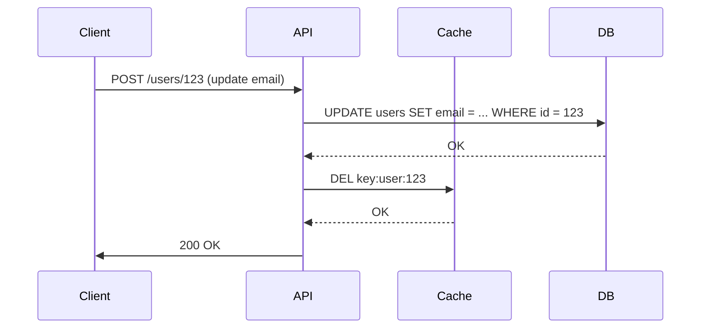
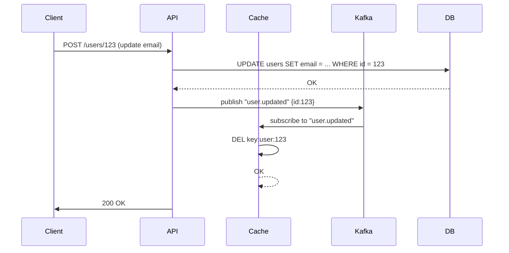

<!-- Generated by Groq via GitHub Actions -->
<!-- Topic ID: T054 -->
<!-- Category: Caching -->
<!-- Generated at UTC: 2026-10-05T07:18:27.009699+00:00 -->

# Cache invalidation

## 1. What problem does this solve?

When a backend serves data that changes over time, we often cache that data to reduce latency and load on the database.  
**Cache invalidation** is the mechanism that tells the cache to stop serving stale data and fetch fresh data from the source.

### What problem exists
- **Stale data**: A user reads a cached value that no longer reflects the current state in the database.
- **Inconsistent reads**: Some requests see old data while others see new data, breaking business logic.
- **Resource waste**: Stale cache entries may occupy memory or disk that could be used for fresh data.

### Why the problem matters
- **User experience**: Showing outdated prices, inventory, or user profiles can erode trust.
- **Business rules**: Decisions based on stale data (e.g., billing, compliance) can lead to legal or financial penalties.
- **Performance**: If the cache never invalidates, it may grow unbounded, causing eviction of useful entries and increased DB load.

### What happens if this concept is not used
- **Data drift**: The cache diverges from the source of truth.
- **Cache thrashing**: Frequent evictions due to size limits, leading to more DB hits.
- **Security**: Sensitive data may remain cached longer than intended.

### Where this concept appears in real backend systems
- E‑commerce sites caching product catalogs or inventory counts.
- Social networks caching user profiles or feed items.
- Financial services caching market data or account balances.
- AI backends caching model inference results or embeddings.

---

## 2. Mental model

### Simple analogy
Imagine a **library** that keeps a **copy** of a popular book in a **reading room** (the cache). When the book is updated in the **main archive** (the database), the library must **remove** or **replace** the copy in the reading room so patrons always read the latest edition. If the library forgets to do this, readers will keep seeing outdated information.

### Precise engineering model
- **Cache**: An in‑memory or distributed store (Redis, Memcached, etc.) that holds key‑value pairs.
- **Source of truth**: The primary database or external service.
- **Invalidation trigger**: An event that indicates the cached data is no longer valid (write, delete, TTL expiry, etc.).
- **Invalidation strategy**: The policy that determines *when* and *how* to remove or refresh cache entries (e.g., write‑through, write‑behind, explicit delete, TTL).

---

## 3. Deep explanation

### Internals
- **Cache entry**: `{ key, value, metadata }`. Metadata often includes a timestamp, version, or TTL.
- **Invalidation logic**: Executed on write paths or via background jobs. Can be:
  - **Explicit delete**: `DELETE FROM cache WHERE key = ?`.
  - **Write‑through**: Write to DB *and* cache simultaneously.
  - **Write‑behind**: Write to cache first, persist to DB later.
  - **Event‑driven**: Publish a message on a topic (Kafka, Redis Pub/Sub) when data changes; subscribers invalidate.
  - **TTL**: Let entries expire automatically after a fixed period.

### Important terminology
- **Cache miss**: Cache does not contain the key; fallback to source.
- **Cache hit**: Cache contains the key; return value directly.
- **Stale data**: Cached data that no longer matches the source.
- **Eviction policy**: LRU, LFU, FIFO, etc., deciding which entries to discard when capacity is reached.
- **Cache stampede**: Many concurrent requests hit a missing key, overwhelming the source.
- **Cache coherence**: Ensuring all replicas of a distributed cache see the same data.

### Trade‑offs
| Strategy | Pros | Cons |
|----------|------|------|
| **Explicit delete** | Precise control, no stale reads | Requires coordination on every write |
| **TTL only** | Simple, no coordination | Stale data until TTL expires |
| **Write‑through** | Cache always up‑to‑date | Latency increases (DB write + cache write) |
| **Write‑behind** | Faster writes, async persistence | Risk of losing data if cache crashes |
| **Event‑driven** | Decouples services, scalable | Requires reliable messaging, eventual consistency |

### Failure modes
- **Lost invalidation messages** → stale cache.
- **Race conditions**: A read occurs between write and invalidation → stale read.
- **Cache partitioning**: Different nodes have inconsistent views.
- **Cache overload**: Too many keys → eviction of useful data.

### Limitations
- **No perfect solution**: You must choose a strategy that balances consistency, latency, and complexity.
- **Distributed systems**: Network partitions can break invalidation guarantees.
- **Cache size**: Limited memory forces eviction; stale data may persist if not invalidated.

### Where this concept fits in a backend architecture
```
┌───────────────────────┐
│   Client (Browser)    │
└─────────────┬─────────┘
              │ HTTP
              ▼
┌───────────────────────┐
│   API Gateway / Load   │
│          Balancer      │
└─────────────┬─────────┘
              │
              ▼
┌───────────────────────┐
│   Application Layer   │
│   (Node.js / FastAPI) │
└───────┬───────┬───────┘
        │       │
        ▼       ▼
┌───────────────┐   ┌───────────────────────┐
│   Cache (Redis)│   │   Database (Postgres) │
└───────────────┘   └───────────────────────┘
```
The application layer is responsible for orchestrating cache reads/writes and invalidation.

### Interaction with related concepts
- **Cache warming**: Pre‑populate cache after invalidation to avoid stampedes.
- **Read‑through cache**: Cache automatically loads data on miss.
- **Event sourcing**: Use events to drive invalidation.
- **CQRS**: Separate read and write models; invalidation often part of write side.

---

## 4. How it works

### Step‑by‑step flow (write‑through + explicit delete)



### Alternative: Event‑driven invalidation



---

## 5. Practical implementation

### TypeScript/Node.js example – Express + Redis

```ts
// src/cache.ts
import { createClient } from 'redis';
import { promisify } from 'util';

const client = createClient(); // defaults to localhost:6379
client.on('error', console.error);

export const getAsync = promisify(client.get).bind(client);
export const setAsync = promisify(client.set).bind(client);
export const delAsync = promisify(client.del).bind(client);
```

```ts
// src/userController.ts
import { Request, Response } from 'express';
import { getAsync, setAsync, delAsync } from './cache';
import { db } from './db'; // a simple pg client

// Read user
export async function getUser(req: Request, res: Response) {
  const id = req.params.id;
  const cacheKey = `user:${id}`;

  // 1. Try cache
  const cached = await getAsync(cacheKey);
  if (cached) {
    return res.json(JSON.parse(cached));
  }

  // 2. Fallback to DB
  const { rows } = await db.query('SELECT * FROM users WHERE id = $1', [id]);
  if (!rows.length) return res.status(404).end();

  const user = rows[0];

  // 3. Cache the result for 5 minutes
  await setAsync(cacheKey, JSON.stringify(user), 'EX', 300);

  res.json(user);
}

// Update user
export async function updateUser(req: Request, res: Response) {
  const id = req.params.id;
  const { email } = req.body;

  // 1. Persist to DB
  await db.query('UPDATE users SET email = $1 WHERE id = $2', [email, id]);

  // 2. Invalidate cache
  await delAsync(`user:${id}`);

  res.status(204).end();
}
```

#### Notes
- `setAsync(..., 'EX', 300)` sets a TTL of 5 min as a safety net.
- The `delAsync` call guarantees the next read will hit the DB.
- In production, consider using a message broker (Kafka, Redis Pub/Sub) to decouple invalidation from the write path.

---

## 6. Production considerations

| Concern | Recommendation |
|---------|----------------|
| **Scalability** | Use a distributed cache (Redis Cluster). Partition keys by hash. |
| **Reliability** | Persist invalidation events to a durable queue. Retry on failure. |
| **Security** | Restrict cache access to internal network. Use TLS for Redis. |
| **Observability** | Log cache hits/misses, eviction rates. Expose metrics (`cache_hits`, `cache_misses`, `cache_evictions`). |
| **Performance** | Tune TTLs to balance freshness vs. load. Use read‑through to hide latency. |
| **Error handling** | On cache failure, fallback to DB. Do not crash the request. |
| **Resource usage** | Monitor memory usage; set maxmemory and eviction policy. |
| **Operational concerns** | Automate cache restarts, monitor replication lag. |
| **Failure recovery** | On cache loss, rebuild from DB or use a fallback cache. |
| **Deployment** | Deploy cache as a separate service; use blue‑green or canary for updates. |

---

## 7. Common mistakes

| Mistake | Why it’s problematic |
|---------|----------------------|
| **Relying solely on TTL** | Data can stay stale for the entire TTL; users see outdated info. |
| **Deleting cache but not updating DB** | Inconsistent state; cache becomes source of truth. |
| **Not handling race conditions** | A read may hit stale cache between write and delete. |
| **Using the same key for different data shapes** | Cache collisions lead to wrong data being served. |
| **Ignoring cache eviction policy** | Useful data may be evicted prematurely, causing stampedes. |
| **Not monitoring cache metrics** | Hard to detect cache thrashing or misconfiguration. |
| **Hard‑coding cache keys** | Makes refactoring difficult; risk of typos. |
| **Over‑caching** | Storing large objects (e.g., full user profiles) can waste memory. |

---

## 8. Senior engineer perspective

### Architecture decisions
- **Cache placement**: Edge cache (CDN) vs. internal Redis cluster.
- **Invalidation strategy**: Event‑driven vs. write‑through, depending on consistency requirements.
- **Key design**: Namespace, versioning, and sharding strategy.

### Trade‑offs
- **Consistency vs. latency**: Strict invalidation (immediate delete) ensures freshness but adds write latency.
- **Cost vs. performance**: Larger cache clusters reduce DB load but increase infrastructure cost.

### Bottlenecks
- **Single point of invalidation**: A slow invalidation service can become a bottleneck.
- **Message broker lag**: If events are delayed, cache stays stale longer.

### Failure scenarios
- **Cache crash**: Use a fallback to DB; rebuild cache gradually.
- **Message loss**: Duplicate invalidation messages are idempotent; missing ones cause stale data.

### Monitoring
- **Cache hit ratio**: Target > 90 % for hot data.
- **Eviction rate**: High rate indicates memory pressure.
- **Invalidation latency**: Time between DB write and cache delete.

### Cost/performance
- **Memory cost**: Estimate per key size × number of hot keys.
- **Network traffic**: Cache misses generate DB traffic; monitor to avoid spikes.

### When NOT to use
- **Low read/write ratio**: If reads are rare, caching may add unnecessary complexity.
- **Highly volatile data**: If data changes every millisecond, cache is ineffective.
- **Strict ACID requirements**: Some use cases demand real‑time consistency that caching cannot guarantee.

---

## 9. Interview questions

| Level | Question | Key answer points |
|-------|----------|-------------------|
| Beginner | What is cache invalidation? | Removing or updating stale entries so reads see fresh data. |
| Beginner | Why can a simple TTL be insufficient? | TTL may leave stale data until expiry; no guarantee of freshness. |
| Senior | How would you design a cache invalidation system for a distributed microservice architecture? | Use event‑driven invalidation via a message broker; include idempotent delete messages; consider partitioning keys; monitor metrics. |
| Senior | What are the trade‑offs between write‑through and write‑behind caching? | Write‑through guarantees consistency but increases write latency; write‑behind is faster but risks data loss if cache crashes. |
| Scenario | A user updates their profile, but some clients still see the old email for 30 s. What could be wrong and how would you debug? | Possible missed invalidation event, race condition, or cache replication lag. Check logs, message broker, cache cluster health, and key TTLs. |

---

## 10. Hands‑on task

**Task**: Add a *cache stampede protection* layer to the `getUser` endpoint.

1. Implement a **distributed lock** (e.g., Redis `SETNX` with expiration) that is acquired when a cache miss occurs.
2. While the lock is held, the first request fetches from the DB and populates the cache; other requests wait for the lock to release.
3. Release the lock after caching.
4. Verify that concurrent requests during a cache miss do not all hit the DB.

*Hint*: Use `ioredis` or `redis` client with `SET key value NX PX 5000`.

---

## 11. Quick revision

- Cache invalidation removes stale data so reads stay fresh.
- **Strategies**: explicit delete, TTL, write‑through, write‑behind, event‑driven.
- **Key concepts**: cache hit/miss, stampede, eviction policy, consistency.
- **Common pitfalls**: TTL-only, race conditions, hard‑coded keys, ignoring metrics.
- **Observability**: hit ratio, eviction rate, invalidation latency.
- **Scalable design**: distributed cache, message broker, idempotent events.
- **Trade‑offs**: consistency vs. latency, cost vs. performance.
- **Senior focus**: architecture decisions, monitoring, failure recovery, when to skip caching.

---

## 12. References

- Redis Documentation – [Cache Invalidation](https://redis.io/docs/manual/keyspace-events/)
- PostgreSQL – [Write‑Through vs. Write‑Behind](https://www.postgresql.org/docs/current/)
- Kafka – [Event‑Driven Architecture](https://kafka.apache.org/documentation/)
- Node.js – [Redis client](https://github.com/redis/node-redis)
- Express – [Routing & Middleware](https://expressjs.com/en/guide/routing.html)
- Prometheus – [Cache Metrics](https://prometheus.io/docs/introduction/overview/)
- AWS – [Caching Strategies](https://aws.amazon.com/elasticache/faqs/)
