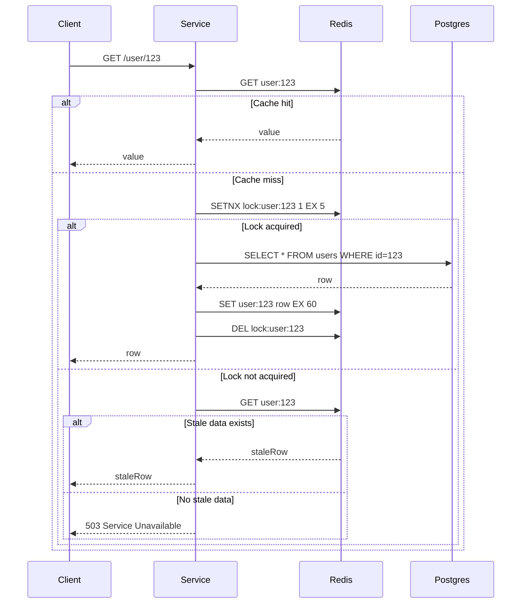

<!-- Generated by Groq via GitHub Actions -->
<!-- Topic ID: T055 -->
<!-- Category: Caching -->
<!-- Generated at UTC: 2026-10-05T21:17:49.842282+00:00 -->

# Cache stampede

## 1. What problem does this solve?

When a highly‑requested key is missing from the cache, many concurrent requests may all try to load the data from the backing store (DB, external API, etc.) at the same time.  
This burst of load can overwhelm the backing store, cause timeouts, and degrade the whole system.  
The **cache stampede** problem is the situation where a cache miss triggers a “stampede” of expensive fetches.

**Why it matters**

- **Back‑end overload**: A single key can generate thousands of DB queries in a short period.
- **Latency spikes**: Users experience high response times or timeouts.
- **Resource waste**: CPU, memory, and network bandwidth are consumed by redundant work.
- **Scalability limits**: The system can’t handle higher traffic if stampedes are common.

**What happens if it’s not handled**

- The database or API may throttle or reject requests.
- Service availability drops; error rates rise.
- The cache becomes a bottleneck rather than a performance aid.

**Real‑world examples**

- A popular product page that is cached in Redis. When the cache expires, all users hit the database simultaneously.
- A leaderboard that is refreshed every minute; a cache miss during the refresh window causes many DB reads.
- A microservice that fetches user profiles from PostgreSQL; a cache miss on a hot user triggers a stampede.

---

## 2. Mental model

**Analogy**  
Imagine a library with a single copy of a bestseller. When the book is out of stock (cache miss), every patron who wants it runs to the shelf at the same time, creating a stampede that slows everyone down. If the librarian (cache layer) had a system to queue the requests or provide a temporary copy, the stampede would be avoided.

**Engineering model**  
- **Cache**: Fast, in‑memory store (Redis, Memcached).
- **Back‑end**: Slow, authoritative source (PostgreSQL, external API).
- **Lock/Token**: A mechanism that lets only one request fetch the data; others wait or use stale data.
- **Stale‑while‑revalidate**: Serve old data while refreshing in the background.

---

## 3. Deep explanation

### Internals

| Term | Meaning |
|------|---------|
| **Cache miss** | Key not present or expired in cache. |
| **Stampede** | Multiple concurrent cache misses for the same key. |
| **Distributed lock** | A lock that works across multiple service instances (e.g., Redis `SETNX`). |
| **Token** | A lightweight flag indicating that a refresh is in progress. |
| **Stale‑while‑revalidate** | Serve stale data while a background refresh happens. |
| **Cache aside** | Application reads/writes cache explicitly around DB operations. |

### Trade‑offs

| Approach | Pros | Cons |
|----------|------|------|
| **No lock** | Simple, no extra latency. | Stampede, DB overload. |
| **Distributed lock** | Prevents stampede, single source of truth. | Lock contention, deadlock risk, added latency. |
| **Token + stale data** | Low latency, no lock contention. | Stale data served, complexity in token cleanup. |
| **Pre‑warming** | Avoids stampede entirely. | Requires extra resources, complexity. |

### Failure modes

- **Lock never released** → subsequent requests block forever.
- **Token expires too early** → multiple fetches still happen.
- **Stale data served for too long** → data inconsistency.
- **Cache eviction policy** removes key before lock is acquired → race condition.

### Limitations

- Works only for *read‑heavy* workloads; write‑heavy patterns need different strategies.
- Requires a shared lock store (Redis, etc.) that is highly available.
- Adds complexity to the codebase; maintenance overhead.

### Where it fits

- **Cache layer** (Redis, Memcached) sits between application and DB.
- **Service instances** coordinate via the lock store.
- **Monitoring** tracks lock acquisition rates, cache hit ratios, DB query counts.

### Interaction with related concepts

- **Cache invalidation**: Stampede prevention often ties into TTL and invalidation logic.
- **Circuit breaker**: If DB is down, a circuit breaker may serve stale data or a fallback.
- **Rate limiting**: Helps prevent stampedes by throttling incoming requests.

---

## 4. How it works

### Step‑by‑step flow

1. **Request arrives** → Service checks Redis for key `user:{id}`.
2. **Cache hit** → Return value immediately.
3. **Cache miss** → Attempt to acquire a distributed lock (`lock:user:{id}`).
4. **Lock acquired** →  
   4.1. Fetch data from PostgreSQL.  
   4.2. Store result in Redis with TTL.  
   4.3. Release lock.  
   4.4. Return data.
5. **Lock not acquired** →  
   5.1. Option A: Wait for lock release (poll or blocking).  
   5.2. Option B: Serve stale data if available (`stale-while-revalidate`).  
   5.3. Option C: Return a “loading” placeholder or error.

#### Mermaid diagram



---

## 5. Practical implementation

Below is a minimal, runnable TypeScript example using `ioredis` and `pg`.  
It demonstrates a **token + stale‑while‑revalidate** strategy.

```ts
// cacheStampede.ts
import Redis from 'ioredis';
import { Client as PgClient } from 'pg';

const redis = new Redis(); // defaults to localhost:6379
const pg = new PgClient(); // configure as needed
await pg.connect();

const CACHE_TTL = 60;          // seconds
const LOCK_TTL = 5;           // seconds
const STALE_TTL = 30;         // seconds

/**
 * Fetch user profile with cache stampede protection.
 * @param id User ID
 */
export async function getUserProfile(id: string) {
  const key = `user:${id}`;
  const lockKey = `lock:${key}`;

  // 1️⃣ Try cache first
  const cached = await redis.get(key);
  if (cached) {
    return JSON.parse(cached);
  }

  // 2️⃣ Try to acquire lock
  const lockAcquired = await redis.set(lockKey, '1', 'NX', 'EX', LOCK_TTL);
  if (lockAcquired) {
    try {
      // 3️⃣ Lock holder fetches from DB
      const res = await pg.query('SELECT * FROM users WHERE id = $1', [id]);
      const user = res.rows[0];
      if (!user) throw new Error('User not found');

      // 4️⃣ Store fresh value + stale flag
      await redis.set(key, JSON.stringify(user), 'EX', CACHE_TTL);
      await redis.set(`${key}:stale`, JSON.stringify(user), 'EX', STALE_TTL);

      return user;
    } finally {
      // 5️⃣ Release lock
      await redis.del(lockKey);
    }
  } else {
    // 6️⃣ Lock not acquired – serve stale if available
    const stale = await redis.get(`${key}:stale`);
    if (stale) {
      return JSON.parse(stale);
    }
    // 7️⃣ No stale data – fallback (could be 503 or placeholder)
    throw new Error('Data is loading, please retry later');
  }
}
```

**Key points**

- `SETNX` (`set(..., 'NX')`) ensures only one instance fetches the DB.
- `EX` sets a TTL to avoid deadlocks if the process crashes.
- Stale data is stored separately (`key:stale`) so that waiting requests can still serve something.
- The lock TTL is intentionally short; if the DB fetch takes longer, the lock will expire and another instance may try, but the stale data will still be available.

---

## 6. Production considerations

| Concern | Recommendation |
|---------|----------------|
| **Scalability** | Use a highly‑available Redis cluster; avoid single‑point lock store. |
| **Reliability** | Set reasonable lock TTL; implement exponential backoff for retries. |
| **Security** | Ensure Redis is not exposed publicly; use ACLs or TLS. |
| **Observability** | Log lock acquisition, lock failures, stale data usage, cache hit/miss ratios. |
| **Performance** | Keep lock TTL < expected DB fetch time; tune TTLs to balance freshness vs. load. |
| **Error handling** | Return graceful fallback (e.g., cached stale data) instead of 500. |
| **Resource usage** | Avoid storing huge objects in Redis; consider compression or pagination. |
| **Operational** | Monitor Redis memory usage; set eviction policy to `volatile-lru` for cache keys. |
| **Failure recovery** | If Redis is down, fallback to DB reads with rate limiting or circuit breaker. |
| **Deployment** | Use Docker with health checks; keep Redis and application in same VPC for low latency. |

---

## 7. Common mistakes

| Mistake | Why it’s problematic |
|---------|----------------------|
| **Using a very long lock TTL** | If the process crashes, the lock never releases → deadlock. |
| **Not releasing the lock in `finally`** | Same deadlock risk; also leaks resources. |
| **Serving stale data without TTL** | Clients may get forever stale data; violates consistency guarantees. |
| **Ignoring lock acquisition failures** | Leads to multiple DB hits; defeats the purpose. |
| **Using a local in‑memory lock** | Not distributed → stampede persists across instances. |
| **Over‑optimizing TTLs** | Too short TTL → frequent DB hits; too long → stale data. |
| **Not handling lock contention** | Requests may block indefinitely; need timeout or fallback. |
| **Storing large objects in Redis** | Exceeds memory, causes evictions, slows down all clients. |

---

## 8. Senior engineer perspective

### What changes at scale?

- **Distributed lock store**: A single Redis node is a bottleneck; use a Redis cluster or a dedicated lock service (e.g., etcd, Consul).
- **Lock contention patterns**: Analyze which keys are hot; consider sharding locks or using per‑shard locks.
- **Monitoring**: Track lock acquisition latency, lock contention rate, stale data hits, and DB query counts.
- **Cost**: Redis cluster costs grow with memory; balance TTLs to keep memory usage low.
- **Failure scenarios**: Design for Redis outage – fallback to DB reads with rate limiting, or use a secondary cache (e.g., Memcached).
- **Bottlenecks**: The DB can still be the bottleneck if many locks are held; consider read replicas or query caching.
- **When NOT to use**: If the data is rarely read or the DB can handle the load, a simple cache-aside without stampede protection may suffice.

### Design decisions

| Decision | Trade‑off |
|----------|-----------|
| **Lock granularity** (per key vs. per shard) | Fine‑grained locks reduce contention but increase complexity. |
| **Stale‑while‑revalidate vs. blocking** | Stale data improves latency but sacrifices freshness. |
| **Cache eviction policy** | `volatile-lru` protects hot keys but may evict stale data early. |
| **Lock TTL** | Short TTL reduces deadlock risk but may cause multiple fetches if DB is slow. |
| **Cache key design** | Include version or hash to avoid stale data after schema changes. |

---

## 9. Interview questions

1. **Beginner** – *What is a cache stampede and why does it happen?*  
   *Answer:* A cache stampede occurs when many concurrent requests miss the cache and all try to load the data from the backing store simultaneously, overwhelming it.

2. **Beginner** – *How can you prevent a cache stampede in a single‑instance Node.js app?*  
   *Answer:* Use a simple in‑memory lock (e.g., a boolean flag) so only one request fetches the data; others wait or serve stale data.

3. **Senior** – *Describe a distributed lock implementation for cache stampede protection using Redis. What pitfalls must you guard against?*  
   *Answer:* Use `SET key value NX EX ttl` to acquire a lock; release with `DEL`. Pitfalls: lock expiration before release (deadlock), race conditions on lock release, network partitions, and ensuring atomicity of lock release (use Lua script).

4. **Senior** – *When would you choose stale‑while‑revalidate over blocking for stampede protection?*  
   *Answer:* When low latency is critical and occasional stale reads are acceptable; or when the data changes infrequently and the cost of a stale read is low.

5. **Scenario/Debugging** – *You deployed a stampede‑protected cache but noticed that after a Redis outage, the service starts returning 503 errors for all requests. What could be the cause and how would you fix it?*  
   *Answer:* The lock acquisition fails because Redis is down, so the code falls back to “data is loading” error. Fix: add a fallback path that reads directly from the DB with rate limiting or a circuit breaker; or use a secondary cache that stays online.

---

## 10. Hands‑on task

**Task:**  
Add a cache stampede guard to the existing `getUserProfile` endpoint in the repository’s `api/users.ts`.  
- Use Redis `SETNX` to acquire a lock.  
- Serve stale data if available.  
- Log lock acquisition attempts and failures.  
- Write a test that spins up 50 concurrent requests to the endpoint and asserts that only one DB query is executed.

**Hints**

- Use `jest` or `mocha` for the test.  
- Mock the PostgreSQL client to count queries.  
- Use `ioredis-mock` for an in‑memory Redis during tests.

---

## 11. Quick revision

- Cache stampede = many concurrent cache misses → DB overload.  
- Use a distributed lock (`SETNX`) to serialize DB fetches.  
- Token + stale‑while‑revalidate serves stale data while refreshing.  
- Lock TTL must be shorter than expected DB fetch time.  
- Release lock in a `finally` block.  
- Monitor lock acquisition rate, cache hit ratio, DB query count.  
- Avoid single‑instance locks in a multi‑instance deployment.  
- Handle Redis outages with graceful fallbacks or circuit breakers.  
- Stale data TTL prevents infinite staleness.  
- Use `volatile-lru` eviction to protect hot keys.

---

## 12. References

- Redis documentation – [SET command](https://redis.io/commands/set)
- ioredis – [ioredis](https://github.com/luin/ioredis)
- PostgreSQL – [pg](https://node-postgres.com/)
- Redlock algorithm – [Redis Distributed Locking](https://redis.io/docs/reference/patterns/distributed-locks/)
- AWS ElastiCache – [Cache stampede protection](https://docs.aws.amazon.com/AmazonElastiCache/latest/red-ug/CacheStampede.html)
- Google Cloud Memorystore – [Cache stampede patterns](https://cloud.google.com/memorystore/docs/redis/cache-stampede)
